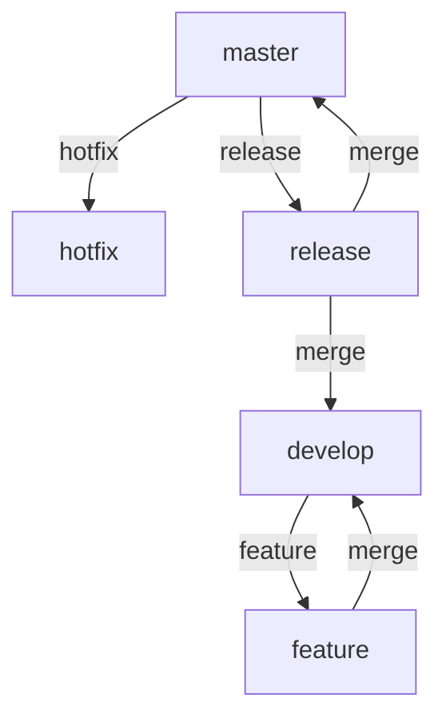
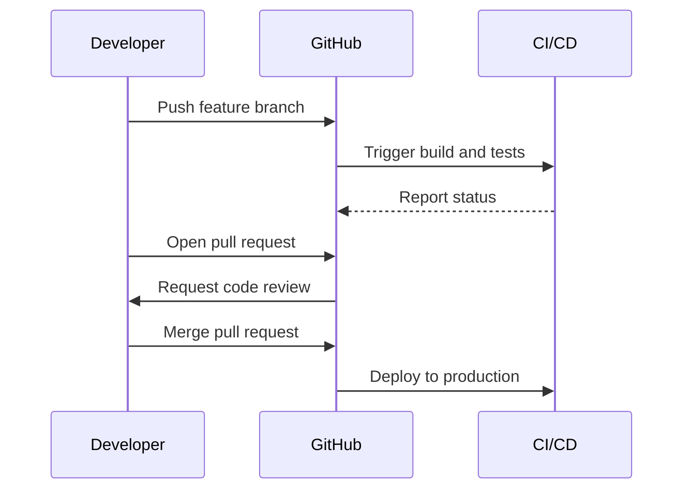

## 24.5 Version Control Strategies and Git Workflows

In the realm of software development, version control is a fundamental practice that ensures code integrity, facilitates collaboration, and supports the evolution of software projects. Git, a distributed version control system, has become the de facto standard for managing source code in modern development environments. In this section, we will explore various version control strategies and Git workflows that are particularly beneficial for Ruby developers aiming to build scalable and maintainable applications.

### Introduction to Git and Its Role in Source Code Management

Git is a powerful tool that allows developers to track changes in their codebase, collaborate with others, and manage different versions of their software. Unlike centralized version control systems, Git is distributed, meaning every developer has a complete copy of the repository, including its history. This architecture provides several advantages, such as offline work capabilities, faster operations, and robust branching and merging features.

#### Key Features of Git

- **Branching and Merging**: Git's branching model is lightweight and efficient, allowing developers to create, merge, and delete branches with ease.
- **Distributed Architecture**: Every clone of a Git repository is a full backup of all data, providing redundancy and resilience.
- **Staging Area**: Git introduces a staging area (or index) where changes can be reviewed and modified before committing.
- **Commit History**: Git maintains a detailed history of changes, enabling developers to revert to previous states or understand the evolution of the codebase.

### Common Git Workflows

Choosing the right workflow is crucial for the success of a project. The workflow dictates how developers collaborate, manage changes, and release software. Let's explore some popular Git workflows:

#### GitFlow

GitFlow is a branching model designed to support the release cycle of software projects. It defines a strict branching structure with the following key branches:

- **Master**: The main branch that always contains production-ready code.
- **Develop**: The integration branch where features are merged before a release.
- **Feature Branches**: Created from `develop` for new features and merged back once complete.
- **Release Branches**: Created from `develop` when preparing for a new release, allowing final bug fixes and preparations.
- **Hotfix Branches**: Created from `master` to quickly address critical issues in production.



**Advantages**:
- Clear separation of different types of work.
- Supports parallel development and stable releases.

**Disadvantages**:
- Can be complex for small teams or projects.
- Requires discipline to maintain branch hygiene.

#### GitHub Flow

GitHub Flow is a simpler workflow that emphasizes continuous delivery and integration. It uses a single `main` branch and short-lived feature branches:

- **Main**: The default branch that always contains deployable code.
- **Feature Branches**: Created from `main` for new features or bug fixes and merged back via pull requests.

**Advantages**:
- Simplicity and ease of use.
- Encourages frequent integration and deployment.

**Disadvantages**:
- Less structured than GitFlow, which might lead to instability if not managed properly.

#### Trunk-Based Development

Trunk-Based Development focuses on keeping a single branch (the trunk) where all developers integrate their changes frequently. Feature flags are often used to manage incomplete features.

**Advantages**:
- Encourages continuous integration and reduces merge conflicts.
- Simplifies the branching model.

**Disadvantages**:
- Requires robust testing and feature flagging to ensure stability.

### Guidelines for Committing Code and Writing Commit Messages

Effective commit practices are essential for maintaining a clean and understandable project history. Here are some guidelines:

- **Commit Often**: Make small, frequent commits to capture incremental changes.
- **Write Descriptive Messages**: Use clear and concise commit messages that explain the "what" and "why" of changes.
- **Follow a Convention**: Adopt a commit message convention, such as the Conventional Commits specification, to maintain consistency.

**Example of a Good Commit Message**:

```
feat: add user authentication

- Implement login and registration forms
- Add password hashing with bcrypt
- Create user sessions and authentication middleware
```

### Managing Branches

Branch management is a critical aspect of any Git workflow. Here are some best practices:

- **Keep Branches Short-Lived**: Regularly merge feature branches to avoid long-lived branches that can lead to complex merge conflicts.
- **Use Descriptive Names**: Name branches based on their purpose, such as `feature/login-page` or `bugfix/issue-123`.
- **Delete Merged Branches**: Clean up branches after they have been merged to keep the repository tidy.

### Pull Requests and Code Reviews

Pull requests (PRs) are a key component of collaborative workflows. They provide a platform for code review, discussion, and quality assurance before changes are merged into the main branch.

- **Create Detailed PR Descriptions**: Include a summary of changes, related issues, and any additional context needed for reviewers.
- **Engage in Code Reviews**: Use PRs as an opportunity to review code quality, adherence to standards, and potential improvements.
- **Automate Checks**: Integrate automated tests and linters to run on PRs, ensuring code quality before merging.

### Resolving Merge Conflicts and Maintaining a Clean History

Merge conflicts are inevitable in collaborative environments. Here are strategies to handle them effectively:

- **Communicate Early**: Inform team members of potential conflicts and coordinate merges.
- **Use Rebase Wisely**: Rebase feature branches onto the main branch to incorporate the latest changes and resolve conflicts incrementally.
- **Keep History Clean**: Use interactive rebase to squash commits and edit history for clarity.

### Automating Workflows with Git Hooks

Git hooks are scripts that run at specific points in the Git workflow, allowing automation of tasks such as code formatting, testing, or deployment.

- **Pre-Commit Hooks**: Run checks or format code before a commit is finalized.
- **Pre-Push Hooks**: Ensure tests pass before pushing changes to a remote repository.
- **Post-Receive Hooks**: Trigger deployment scripts after changes are pushed to a server.

**Example of a Pre-Commit Hook**:

```bash
#!/bin/sh
# Run tests before committing
npm test
if [ $? -ne 0 ]; then
  echo "Tests failed, commit aborted."
  exit 1
fi
```

### Best Practices for Version Control in Ruby Projects

- **Use `.gitignore`**: Exclude unnecessary files, such as logs or temporary files, from version control.
- **Document Workflow**: Clearly document the chosen workflow and branching strategy for the team.
- **Regularly Review Practices**: Periodically review and refine version control practices to adapt to project needs.

### Try It Yourself

Experiment with different Git workflows by setting up a sample Ruby project. Create branches, make commits, and practice merging changes. Try using Git hooks to automate tasks like running tests or formatting code.

### Visualizing Git Workflows



### Knowledge Check

- How does Git's distributed architecture benefit developers?
- What are the main differences between GitFlow and GitHub Flow?
- Why is it important to write descriptive commit messages?
- How can Git hooks improve your workflow?

### Summary

Version control is a cornerstone of modern software development, and mastering Git workflows is essential for Ruby developers. By understanding and implementing effective strategies, you can enhance collaboration, maintain code quality, and streamline the development process. Remember, this is just the beginning. As you progress, you'll refine your practices and discover new ways to leverage Git in your projects. Keep experimenting, stay curious, and enjoy the journey!

## Quiz: Version Control Strategies and Git Workflows



### What is a key advantage of Git's distributed architecture?

- [x] It allows offline work capabilities and faster operations.
- [ ] It requires a central server for all operations.
- [ ] It limits the number of branches that can be created.
- [ ] It does not support merging.

> **Explanation:** Git's distributed nature allows developers to work offline and perform operations quickly since each clone is a full repository.

### Which branch in GitFlow always contains production-ready code?

- [x] Master
- [ ] Develop
- [ ] Feature
- [ ] Hotfix

> **Explanation:** The master branch in GitFlow is intended to always contain production-ready code.

### What is a primary characteristic of GitHub Flow?

- [x] It uses a single main branch with short-lived feature branches.
- [ ] It requires multiple long-lived branches.
- [ ] It does not support continuous integration.
- [ ] It mandates the use of release branches.

> **Explanation:** GitHub Flow emphasizes simplicity with a single main branch and short-lived feature branches.

### What should a good commit message include?

- [x] A clear explanation of what and why changes were made.
- [ ] Only the files that were changed.
- [ ] The name of the developer who made the changes.
- [ ] The date and time of the commit.

> **Explanation:** A good commit message should clearly explain what changes were made and why, to provide context for future reference.

### How can Git hooks be used in a workflow?

- [x] To automate tasks like running tests or formatting code.
- [ ] To manually review code changes.
- [ ] To create new branches automatically.
- [ ] To delete old branches.

> **Explanation:** Git hooks can automate tasks at various points in the Git workflow, such as running tests before a commit.

### What is the purpose of a pull request?

- [x] To review and discuss code changes before merging.
- [ ] To automatically merge branches.
- [ ] To delete branches after merging.
- [ ] To create new repositories.

> **Explanation:** Pull requests are used to review and discuss code changes, ensuring quality before merging into the main branch.

### What is a benefit of using feature flags in trunk-based development?

- [x] They allow incomplete features to be integrated safely.
- [ ] They automatically resolve merge conflicts.
- [ ] They eliminate the need for code reviews.
- [ ] They create new branches for each feature.

> **Explanation:** Feature flags enable developers to integrate incomplete features into the main branch without affecting production code.

### Why is it important to delete merged branches?

- [x] To keep the repository tidy and manageable.
- [ ] To prevent other developers from accessing the code.
- [ ] To automatically create new branches.
- [ ] To ensure the code is deployed.

> **Explanation:** Deleting merged branches helps maintain a clean and manageable repository.

### What is a common practice when resolving merge conflicts?

- [x] Communicate early and coordinate merges with team members.
- [ ] Ignore the conflicts and proceed with the merge.
- [ ] Always choose the changes from the main branch.
- [ ] Delete the conflicting branches.

> **Explanation:** Early communication and coordination help resolve merge conflicts effectively.

### True or False: GitFlow is the simplest workflow for small teams.

- [ ] True
- [x] False

> **Explanation:** GitFlow can be complex for small teams due to its structured branching model, making simpler workflows like GitHub Flow more suitable.


