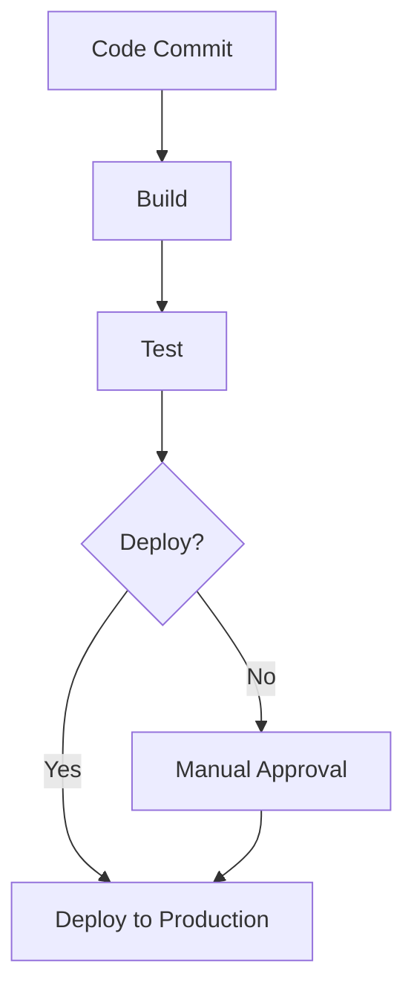

## 24.6 Continuous Integration and Continuous Delivery (CI/CD)

Continuous Integration and Continuous Delivery (CI/CD) are pivotal practices in modern software development, especially when building scalable and maintainable Ruby applications. By automating the processes of building, testing, and deploying code, CI/CD enhances deployment efficiency and reliability, allowing developers to focus on writing quality code. In this section, we will delve into the concepts of CI/CD, explore setting up pipelines with popular tools, and discuss best practices for automating tests, code quality checks, and deployments.

### Understanding CI/CD

**Continuous Integration (CI)** is the practice of merging all developers' working copies to a shared mainline several times a day. The key objective is to detect integration bugs as early as possible, ensuring that the software is always in a state that can be released.

**Continuous Delivery (CD)** extends CI by ensuring that the software can be released to production at any time. It involves automating the release process so that deployments can be done quickly and safely.

**Continuous Deployment** is a step further, where every change that passes all stages of the production pipeline is released to customers automatically.

#### Benefits of CI/CD

- **Reduced Integration Risk**: By integrating frequently, you reduce the risk of integration issues.
- **Faster Time to Market**: Automating the deployment process allows for faster and more frequent releases.
- **Improved Code Quality**: Automated testing and code quality checks ensure that only high-quality code is deployed.
- **Increased Developer Productivity**: Developers can focus on writing code rather than managing deployments.

### Setting Up CI/CD Pipelines

Let's explore how to set up CI/CD pipelines using popular tools like GitHub Actions, CircleCI, and Jenkins.

#### GitHub Actions

GitHub Actions is a powerful CI/CD tool integrated directly into GitHub. It allows you to automate workflows for building, testing, and deploying your code.

```yaml
# .github/workflows/ruby.yml
name: Ruby CI

on:
  push:
    branches: [ main ]
  pull_request:
    branches: [ main ]

jobs:
  build:
    runs-on: ubuntu-latest

    steps:
    - uses: actions/checkout@v2
    - name: Set up Ruby
      uses: ruby/setup-ruby@v1
      with:
        ruby-version: 3.0
    - name: Install dependencies
      run: bundle install
    - name: Run tests
      run: bundle exec rspec
```

In this example, we define a workflow that runs on every push or pull request to the `main` branch. It checks out the code, sets up Ruby, installs dependencies, and runs tests using RSpec.

#### CircleCI

CircleCI is another popular CI/CD tool that provides a robust platform for automating your build, test, and deployment processes.

```yaml
# .circleci/config.yml
version: 2.1

executors:
  ruby-executor:
    docker:
      - image: circleci/ruby:3.0

jobs:
  test:
    executor: ruby-executor
    steps:
      - checkout
      - run:
          name: Install dependencies
          command: bundle install
      - run:
          name: Run tests
          command: bundle exec rspec

workflows:
  version: 2
  test_and_deploy:
    jobs:
      - test
```

This configuration sets up a CircleCI pipeline that uses a Docker image with Ruby 3.0, installs dependencies, and runs tests.

#### Jenkins

Jenkins is a widely-used open-source automation server that supports building, deploying, and automating any project.

```groovy
pipeline {
    agent any

    stages {
        stage('Build') {
            steps {
                sh 'bundle install'
            }
        }
        stage('Test') {
            steps {
                sh 'bundle exec rspec'
            }
        }
        stage('Deploy') {
            steps {
                sh 'cap production deploy'
            }
        }
    }
}
```

This Jenkins pipeline script defines three stages: Build, Test, and Deploy. It uses shell commands to install dependencies, run tests, and deploy the application.

### Automating Tests and Code Quality Checks

Automating tests and code quality checks is crucial in a CI/CD pipeline to ensure that only high-quality code is deployed.

- **Unit Tests**: Use tools like RSpec or Minitest to write and run unit tests.
- **Integration Tests**: Ensure that different parts of your application work together as expected.
- **Code Quality Checks**: Use tools like RuboCop to enforce coding standards and detect code smells.

```yaml
# Example of adding RuboCop to GitHub Actions
- name: Run RuboCop
  run: bundle exec rubocop
```

### Deployment Strategies

Understanding deployment strategies is essential for implementing effective CI/CD pipelines.

#### Continuous Deployment vs. Continuous Delivery

- **Continuous Deployment**: Every change that passes all stages of the production pipeline is automatically deployed to production.
- **Continuous Delivery**: The deployment process is automated, but requires a manual trigger to deploy to production.

#### Environment Configuration and Secrets Management

Managing environment configurations and secrets securely is critical in CI/CD pipelines.

- **Environment Variables**: Use environment variables to configure your application for different environments.
- **Secrets Management**: Use tools like HashiCorp Vault or AWS Secrets Manager to store and manage sensitive information.

### Best Practices for CI/CD

- **Infrastructure as Code**: Use tools like Terraform or Ansible to manage your infrastructure as code.
- **Immutable Deployments**: Deploy applications in a way that ensures the environment is consistent and unchangeable.
- **Monitoring and Logging**: Implement monitoring and logging to track the performance and health of your applications.

### Try It Yourself

Experiment with the CI/CD pipelines by modifying the examples provided. Try adding additional steps, such as deploying to a staging environment or running additional tests.

### Visualizing CI/CD Pipelines



This diagram illustrates a typical CI/CD pipeline, showing the flow from code commit to deployment.

### References and Links

- [GitHub Actions Documentation](https://docs.github.com/en/actions)
- [CircleCI Documentation](https://circleci.com/docs/)
- [Jenkins Documentation](https://www.jenkins.io/doc/)

### Knowledge Check

- What are the benefits of using CI/CD in Ruby development?
- How can you automate tests and code quality checks in a CI/CD pipeline?
- What is the difference between continuous deployment and continuous delivery?

### Embrace the Journey

Remember, implementing CI/CD is a journey. Start small, experiment with different tools and configurations, and gradually build a robust pipeline that suits your needs. Keep learning, stay curious, and enjoy the process!

## Quiz: Continuous Integration and Continuous Delivery (CI/CD)



### What is the primary goal of Continuous Integration (CI)?

- [x] To detect integration bugs as early as possible
- [ ] To automate the deployment process
- [ ] To ensure code quality
- [ ] To manage environment configurations

> **Explanation:** Continuous Integration aims to detect integration bugs early by merging code frequently.

### Which tool is integrated directly into GitHub for CI/CD?

- [x] GitHub Actions
- [ ] CircleCI
- [ ] Jenkins
- [ ] Travis CI

> **Explanation:** GitHub Actions is integrated directly into GitHub for automating workflows.

### What is the difference between Continuous Delivery and Continuous Deployment?

- [x] Continuous Delivery requires a manual trigger for deployment, while Continuous Deployment does not.
- [ ] Continuous Deployment requires a manual trigger for deployment, while Continuous Delivery does not.
- [ ] Both require manual triggers for deployment.
- [ ] Both automatically deploy changes to production.

> **Explanation:** Continuous Delivery requires a manual trigger for deployment, whereas Continuous Deployment automatically deploys changes.

### Which tool can be used for secrets management in CI/CD pipelines?

- [x] HashiCorp Vault
- [ ] RuboCop
- [ ] RSpec
- [ ] GitHub Actions

> **Explanation:** HashiCorp Vault is used for managing secrets securely.

### What is the purpose of using RuboCop in a CI/CD pipeline?

- [x] To enforce coding standards and detect code smells
- [ ] To run unit tests
- [ ] To deploy applications
- [ ] To manage environment configurations

> **Explanation:** RuboCop is used to enforce coding standards and detect code smells.

### Which of the following is a best practice for CI/CD?

- [x] Infrastructure as Code
- [ ] Manual deployments
- [ ] Ignoring test failures
- [ ] Hardcoding secrets

> **Explanation:** Infrastructure as Code is a best practice for managing infrastructure in CI/CD.

### What is the benefit of using immutable deployments?

- [x] Ensures the environment is consistent and unchangeable
- [ ] Allows for manual configuration changes
- [ ] Reduces deployment time
- [ ] Increases code complexity

> **Explanation:** Immutable deployments ensure that the environment is consistent and unchangeable.

### Which stage is typically included in a CI/CD pipeline?

- [x] Build
- [ ] Debug
- [ ] Design
- [ ] Marketing

> **Explanation:** The Build stage is typically included in a CI/CD pipeline to compile and package the application.

### True or False: Continuous Deployment automatically deploys every change that passes all stages of the production pipeline.

- [x] True
- [ ] False

> **Explanation:** Continuous Deployment automatically deploys every change that passes all stages of the production pipeline.

### Which tool is commonly used for monitoring and logging in CI/CD?

- [x] Prometheus
- [ ] RuboCop
- [ ] RSpec
- [ ] GitHub Actions

> **Explanation:** Prometheus is commonly used for monitoring and logging in CI/CD.




