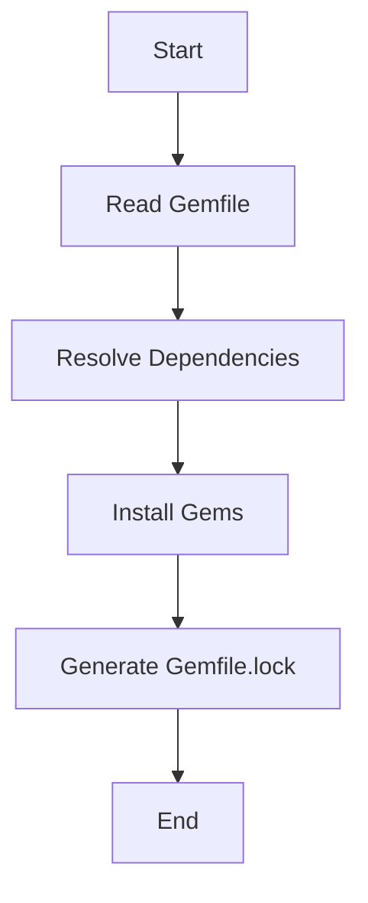

## 24.7 Dependency Management and Bundler Best Practices

In the world of Ruby development, managing dependencies efficiently is crucial for building scalable and maintainable applications. Bundler is the go-to tool for handling Ruby gems, ensuring that your application runs smoothly across different environments. In this section, we'll explore the role of Bundler, best practices for using the `Gemfile` and `Gemfile.lock`, techniques for handling gem versions, resolving dependency conflicts, and more.

### Understanding Bundler's Role in Ruby Development

Bundler is a dependency manager for Ruby applications. It ensures that the gems you need are installed in the correct versions, providing a consistent environment for your application. Here's why Bundler is indispensable:

- **Consistency**: Bundler locks down the versions of gems, ensuring that your application behaves the same way on every machine.
- **Reproducibility**: With Bundler, you can recreate the exact environment needed for your application, which is crucial for debugging and deployment.
- **Dependency Resolution**: Bundler automatically resolves dependencies, preventing conflicts and version mismatches.

### Best Practices for Using the `Gemfile` and `Gemfile.lock`

The `Gemfile` and `Gemfile.lock` are central to Bundler's operation. Let's dive into best practices for managing these files effectively.

#### Crafting an Effective `Gemfile`

The `Gemfile` is where you specify the gems your application depends on. Here are some tips for writing a clean and efficient `Gemfile`:

- **Specify Versions Carefully**: Use version constraints to ensure compatibility. For example, use `gem 'rails', '~> 6.1.0'` to allow updates within the 6.1.x series.
- **Group Gems by Environment**: Use groups to specify gems for different environments, such as development, test, and production.

```ruby
# Gemfile
source 'https://rubygems.org'

gem 'rails', '~> 6.1.0'
gem 'pg', '~> 1.2'

group :development, :test do
  gem 'rspec-rails', '~> 5.0'
  gem 'pry', '~> 0.14.1'
end

group :production do
  gem 'puma', '~> 5.0'
end
```

- **Use Comments**: Document the purpose of each gem to make the `Gemfile` easier to understand.

#### Managing the `Gemfile.lock`

The `Gemfile.lock` file records the exact versions of gems that were installed. Here are some best practices:

- **Commit `Gemfile.lock` to Version Control**: This ensures that everyone working on the project uses the same gem versions.
- **Avoid Manual Edits**: Never edit `Gemfile.lock` manually. Use `bundle install` or `bundle update` to modify it.
- **Regularly Update Dependencies**: Use `bundle update` to keep your dependencies up-to-date, but be cautious of breaking changes.

### Handling Gem Versions and Resolving Dependency Conflicts

Managing gem versions and resolving conflicts can be challenging. Here are strategies to handle these issues effectively:

#### Specifying Gem Versions

- **Use Pessimistic Version Constraint (`~>`)**: This allows for patch-level updates but prevents breaking changes.
- **Exact Version Locking**: Use `=` to lock a gem to a specific version if necessary, but be aware of potential compatibility issues.

#### Resolving Dependency Conflicts

- **Use `bundle update` with Care**: Update specific gems to avoid unnecessary changes. For example, `bundle update rails` updates only the Rails gem and its dependencies.
- **Check for Conflicts**: Use `bundle check` to identify and resolve conflicts before they become problematic.

### Using Groups and Platforms in the `Gemfile`

Bundler allows you to specify groups and platforms to tailor your dependencies to different environments and systems.

#### Grouping Gems

- **Environment-Specific Groups**: Use groups to load gems only in specific environments, reducing bloat and improving performance.

```ruby
group :development do
  gem 'rubocop', '~> 1.0'
end
```

#### Platform-Specific Gems

- **Platform Constraints**: Use platform constraints to include gems only on certain operating systems.

```ruby
gem 'nokogiri', platforms: :ruby
gem 'win32console', platforms: :mingw, :mswin
```

### Importance of Regular Updates and Monitoring for Vulnerabilities

Keeping your dependencies up-to-date is crucial for security and performance. Here's how to manage updates effectively:

- **Regularly Run `bundle update`**: Schedule regular updates to ensure you have the latest patches and features.
- **Monitor for Vulnerabilities**: Use tools like `bundler-audit` to scan for known vulnerabilities in your gems.

### Using Private Gem Servers or Mirrors

In some cases, you may need to use private gem servers or mirrors. Here's how to set them up:

- **Private Gem Servers**: Use a private server to host proprietary gems or to improve download speeds.
- **Mirrors**: Configure mirrors in your `Gemfile` to use alternative sources for gems.

```ruby
source 'https://rubygems.org' do
  gem 'rails'
end

source 'https://my-private-gem-server.com' do
  gem 'my-private-gem'
end
```

### Try It Yourself

To get hands-on experience, try modifying the `Gemfile` examples provided. Add a new gem, specify a version constraint, or create a new group for testing. Run `bundle install` and observe how Bundler manages these changes.

### Visualizing Dependency Management with Bundler

Let's visualize how Bundler manages dependencies using a flowchart:



This flowchart illustrates the process Bundler follows to manage dependencies, from reading the `Gemfile` to generating the `Gemfile.lock`.

### Knowledge Check

- **What is the purpose of the `Gemfile.lock`?**
- **How can you specify a gem to be used only in the development environment?**
- **Why is it important to regularly update your dependencies?**

### Summary

In this section, we've explored the essential role of Bundler in managing Ruby dependencies. By following best practices for using the `Gemfile` and `Gemfile.lock`, handling gem versions, and resolving conflicts, you can ensure a consistent and secure development environment. Remember, effective dependency management is key to building scalable and maintainable Ruby applications.

## Quiz: Dependency Management and Bundler Best Practices



### What is the primary role of Bundler in Ruby development?

- [x] To manage and install gem dependencies
- [ ] To compile Ruby code
- [ ] To deploy Ruby applications
- [ ] To test Ruby applications

> **Explanation:** Bundler is primarily used to manage and install gem dependencies for Ruby applications.

### Which file should you commit to version control to ensure consistent gem versions?

- [x] Gemfile.lock
- [ ] Gemfile
- [ ] .bundle/config
- [ ] Gemfile.local

> **Explanation:** The `Gemfile.lock` file records the exact versions of gems installed and should be committed to version control to ensure consistency.

### How can you specify a gem to be used only in the test environment?

- [x] Use the `group :test do` block in the Gemfile
- [ ] Use the `platforms: :test` option
- [ ] Use the `test: true` option
- [ ] Use the `only: :test` option

> **Explanation:** You can specify a gem to be used only in the test environment by placing it inside a `group :test do` block in the Gemfile.

### What is the benefit of using the pessimistic version constraint (`~>`)?

- [x] It allows for patch-level updates while preventing breaking changes
- [ ] It locks the gem to a specific version
- [ ] It allows for any version updates
- [ ] It prevents any updates

> **Explanation:** The pessimistic version constraint (`~>`) allows for patch-level updates but prevents breaking changes by restricting updates to a certain version range.

### How can you resolve dependency conflicts in Bundler?

- [x] Use `bundle update` to update specific gems
- [ ] Manually edit the Gemfile.lock
- [ ] Delete the Gemfile.lock and run `bundle install`
- [ ] Use `bundle install --force`

> **Explanation:** Using `bundle update` to update specific gems is a recommended way to resolve dependency conflicts without affecting other gems.

### Why is it important to regularly update your dependencies?

- [x] To ensure you have the latest security patches and features
- [ ] To increase the size of your application
- [ ] To make your application run slower
- [ ] To remove unused gems

> **Explanation:** Regularly updating dependencies ensures that you have the latest security patches and features, which is crucial for maintaining a secure and efficient application.

### What tool can you use to scan for known vulnerabilities in your gems?

- [x] bundler-audit
- [ ] gem-check
- [ ] security-scan
- [ ] gem-audit

> **Explanation:** `bundler-audit` is a tool that scans for known vulnerabilities in your gems, helping you maintain a secure application.

### How can you specify a gem to be used only on Windows platforms?

- [x] Use `platforms: :mingw, :mswin` in the Gemfile
- [ ] Use `platforms: :windows` in the Gemfile
- [ ] Use `os: :windows` in the Gemfile
- [ ] Use `only: :windows` in the Gemfile

> **Explanation:** You can specify a gem to be used only on Windows platforms by using `platforms: :mingw, :mswin` in the Gemfile.

### What is the purpose of using private gem servers?

- [x] To host proprietary gems or improve download speeds
- [ ] To replace the RubyGems.org source
- [ ] To prevent gem updates
- [ ] To make gems public

> **Explanation:** Private gem servers are used to host proprietary gems or improve download speeds, providing more control over gem distribution.

### True or False: You should manually edit the Gemfile.lock to resolve conflicts.

- [ ] True
- [x] False

> **Explanation:** You should never manually edit the `Gemfile.lock`. Use Bundler commands like `bundle install` or `bundle update` to resolve conflicts.



Remember, this is just the beginning. As you progress, you'll build more complex and interactive Ruby applications. Keep experimenting, stay curious, and enjoy the journey!
