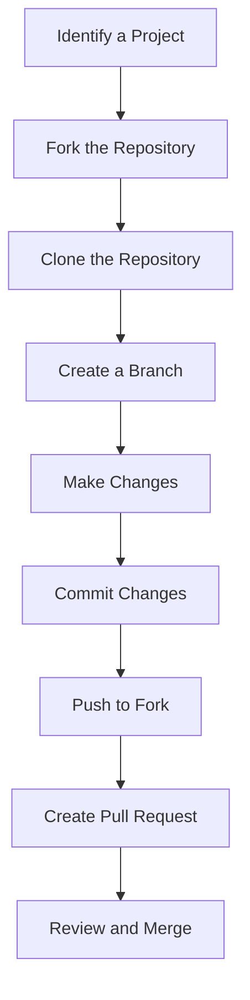

## 24.9 Community Involvement and Open Source Contributions

In the world of software development, community involvement and open-source contributions are not just beneficial—they are essential. For Ruby developers, engaging with the community can lead to professional growth, skill enhancement, and a deeper understanding of the language and its ecosystem. In this section, we will explore the myriad benefits of community involvement, provide actionable suggestions for contributing, and highlight the importance of respectful and collaborative interactions.

### The Benefits of Community Involvement

Community involvement offers numerous advantages for developers at all stages of their careers. Let's delve into some of the key benefits:

1. **Professional Growth**: Engaging with the Ruby community can open doors to new opportunities, whether through networking at events or collaborating on projects. It helps you stay updated with the latest trends and technologies.

2. **Skill Enhancement**: By contributing to open-source projects, you can work on real-world problems, learn from experienced developers, and improve your coding skills.

3. **Knowledge Sharing**: Participating in forums and discussions allows you to share your knowledge and learn from others. This exchange of ideas fosters innovation and creativity.

4. **Mentorship Opportunities**: Being part of a community provides opportunities to both mentor and be mentored. Guiding newcomers can reinforce your own understanding and help you develop leadership skills.

5. **Building Reputation**: Active community involvement can enhance your professional reputation. Contributions to well-known projects or insightful discussions can establish you as an expert in the field.

6. **Personal Satisfaction**: Contributing to the community and helping others can be personally rewarding. It provides a sense of belonging and purpose.

### Suggestions for Contributing to the Ruby Community

There are many ways to get involved in the Ruby community. Here are some suggestions:

#### Attend Meetups and Conferences

- **Ruby Meetups**: Local Ruby meetups are a great way to connect with other developers, share experiences, and learn about new developments in the Ruby world. Websites like [Meetup.com](https://www.meetup.com/) can help you find local events.

- **Conferences**: Attending conferences such as RubyConf or RailsConf provides opportunities to learn from industry leaders, participate in workshops, and network with peers. Consider volunteering at these events to gain a different perspective and meet more people.

#### Participate in Forums and Online Communities

- **Ruby Discourse**: Engage in discussions on platforms like [Ruby Discourse](https://discuss.rubyonrails.org/). These forums are excellent for asking questions, sharing knowledge, and staying informed about the latest Ruby news.

- **Stack Overflow**: Contribute by answering questions on [Stack Overflow](https://stackoverflow.com/questions/tagged/ruby). This not only helps others but also reinforces your own understanding of Ruby concepts.

#### Contribute to Documentation and Translations

- **Documentation**: Many open-source projects need help with documentation. Improving documentation is a valuable contribution that can make a project more accessible to new users.

- **Translations**: If you are multilingual, consider contributing translations for Ruby documentation or projects. This can significantly broaden the reach of a project.

#### Mentoring and Supporting Newcomers

- **Mentorship Programs**: Participate in mentorship programs, such as those offered by [Rails Girls](http://railsgirls.com/) or [CodeNewbie](https://www.codenewbie.org/). Mentoring newcomers can be a fulfilling experience and helps build a supportive community.

- **Pair Programming**: Engage in pair programming sessions with less experienced developers. This collaborative approach can be mutually beneficial, providing learning opportunities for both parties.

#### Encourage Respectful and Collaborative Interactions

- **Code of Conduct**: Adhere to the community's code of conduct. Respectful and inclusive behavior fosters a welcoming environment for all members.

- **Constructive Feedback**: When reviewing code or providing feedback, focus on constructive criticism. Highlight strengths and suggest improvements in a positive manner.

#### Opportunities for Speaking or Writing

- **Public Speaking**: Consider speaking at meetups or conferences. Sharing your experiences and insights can inspire others and establish you as a thought leader.

- **Writing**: Write articles or blog posts about your experiences with Ruby. Platforms like [Medium](https://medium.com/) or personal blogs can be great outlets for sharing your knowledge.

### Code Example: Contributing to an Open-Source Ruby Project

Let's walk through a simple example of contributing to an open-source Ruby project. We'll use a hypothetical project called `AwesomeGem`.

```ruby
# Step 1: Fork the repository on GitHub
# Visit the project's GitHub page and click the "Fork" button to create your own copy.

# Step 2: Clone the forked repository to your local machine
git clone https://github.com/yourusername/AwesomeGem.git

# Step 3: Create a new branch for your feature or bug fix
git checkout -b feature-improve-documentation

# Step 4: Make your changes
# Open the project in your favorite text editor and make the necessary changes.
# For example, let's improve the README file.

# Step 5: Commit your changes
git add README.md
git commit -m "Improve documentation for installation process"

# Step 6: Push your changes to your forked repository
git push origin feature-improve-documentation

# Step 7: Create a pull request
# Go to the original repository on GitHub and click "New Pull Request".
# Provide a clear description of your changes and submit the pull request.
```

### Visualizing the Contribution Process

Below is a simple flowchart illustrating the process of contributing to an open-source project:



**Figure 1**: Flowchart of the open-source contribution process.

### Knowledge Check

- What are some benefits of community involvement for Ruby developers?
- How can you contribute to the Ruby community without writing code?
- Why is it important to adhere to a code of conduct in community interactions?

### Embrace the Journey

Remember, community involvement is a journey, not a destination. As you engage with the Ruby community, you'll find countless opportunities to learn, grow, and make meaningful contributions. Stay curious, be open to new experiences, and enjoy the journey!

### Quiz: Community Involvement and Open Source Contributions



### What is a key benefit of community involvement for developers?

- [x] Professional growth
- [ ] Increased salary
- [ ] Guaranteed job offers
- [ ] Free software licenses

> **Explanation:** Community involvement can lead to professional growth by providing networking opportunities and exposure to new ideas and technologies.

### Which platform is recommended for engaging in Ruby discussions?

- [x] Ruby Discourse
- [ ] Facebook
- [ ] Instagram
- [ ] LinkedIn

> **Explanation:** Ruby Discourse is a dedicated platform for Ruby discussions, making it ideal for engaging with the community.

### How can you contribute to an open-source project without writing code?

- [x] Improving documentation
- [ ] Writing new features
- [ ] Fixing bugs
- [ ] Refactoring code

> **Explanation:** Improving documentation is a valuable way to contribute to open-source projects without writing code.

### What is a benefit of mentoring newcomers in the Ruby community?

- [x] Reinforcing your own understanding
- [ ] Gaining financial rewards
- [ ] Receiving awards
- [ ] Getting free conference tickets

> **Explanation:** Mentoring helps reinforce your own understanding of concepts and develops leadership skills.

### Which of the following is a respectful way to provide feedback?

- [x] Focus on constructive criticism
- [ ] Highlight only the negatives
- [ ] Ignore the positives
- [ ] Be overly critical

> **Explanation:** Constructive criticism focuses on both strengths and areas for improvement in a positive manner.

### What is the first step in contributing to an open-source project on GitHub?

- [x] Fork the repository
- [ ] Clone the repository
- [ ] Create a branch
- [ ] Make changes

> **Explanation:** Forking the repository is the first step to create your own copy of the project.

### Why is it important to adhere to a code of conduct in community interactions?

- [x] To foster a welcoming environment
- [ ] To enforce strict rules
- [ ] To limit participation
- [ ] To control discussions

> **Explanation:** Adhering to a code of conduct fosters a respectful and inclusive environment for all community members.

### What is a benefit of attending Ruby conferences?

- [x] Networking with industry leaders
- [ ] Receiving free software
- [ ] Guaranteed job offers
- [ ] Free travel

> **Explanation:** Conferences provide opportunities to network with industry leaders and learn from experts.

### How can writing articles benefit your involvement in the Ruby community?

- [x] Establishing you as a thought leader
- [ ] Increasing your salary
- [ ] Guaranteeing job offers
- [ ] Providing free software

> **Explanation:** Writing articles can establish you as a thought leader and share your knowledge with the community.

### True or False: Community involvement is only beneficial for beginners.

- [ ] True
- [x] False

> **Explanation:** Community involvement is beneficial for developers at all stages of their careers, offering opportunities for growth and learning.



By actively participating in the Ruby community and contributing to open-source projects, you can enhance your skills, build a strong professional network, and make a positive impact on the software development world. Keep exploring, stay engaged, and continue to grow as a Ruby developer.
