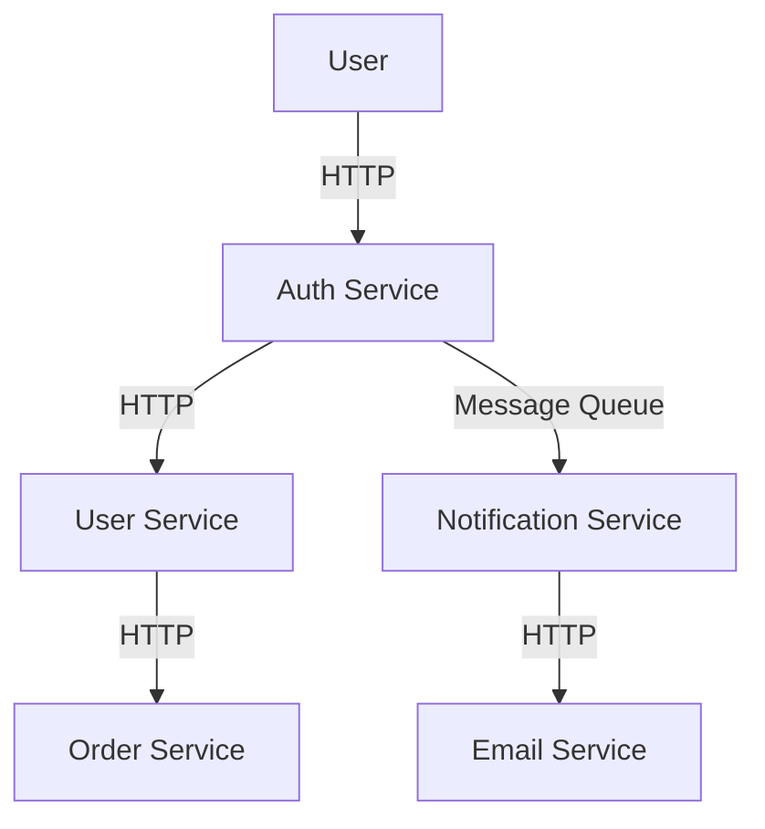

## 25.13 Implementing Microservices Architecture

Microservices architecture is a design pattern that structures an application as a collection of loosely coupled services. This approach allows for independent deployment, scaling, and development of services, making it ideal for building scalable and maintainable applications. In this section, we will explore the principles of microservices architecture and provide a comprehensive guide to implementing it using Ruby.

### Principles of Microservices Architecture

Before diving into the implementation, let's recap the core principles of microservices architecture:

1. **Single Responsibility**: Each service should focus on a specific business capability.
2. **Decentralized Data Management**: Each service manages its own database, promoting autonomy.
3. **Independent Deployment**: Services can be deployed independently without affecting others.
4. **Inter-Service Communication**: Services communicate over a network using lightweight protocols.
5. **Scalability**: Services can be scaled independently based on demand.
6. **Resilience**: Services are designed to handle failures gracefully.

### Step-by-Step Guide to Creating Ruby Microservices

#### 1. Setting Up the Environment

To begin, ensure you have Ruby installed on your system. You can use a version manager like RVM or rbenv to manage Ruby versions. Additionally, install Docker and Kubernetes for containerization and orchestration.

#### 2. Creating a Simple Ruby Microservice

Let's create a simple Ruby microservice that handles user authentication.

```ruby
# app.rb
require 'sinatra'
require 'json'

# In-memory user data
USERS = {
  'user1' => 'password1',
  'user2' => 'password2'
}

# Endpoint for user authentication
post '/authenticate' do
  content_type :json
  request_data = JSON.parse(request.body.read)
  username = request_data['username']
  password = request_data['password']

  if USERS[username] == password
    { status: 'success', message: 'Authenticated successfully' }.to_json
  else
    { status: 'failure', message: 'Invalid credentials' }.to_json
  end
end
```

#### 3. Dockerizing the Microservice

Docker allows us to package the application with all its dependencies into a container. Create a `Dockerfile` for the microservice:

```dockerfile
# Dockerfile
FROM ruby:3.1

WORKDIR /app

COPY . .

RUN bundle install

EXPOSE 4567

CMD ["ruby", "app.rb"]
```

Build and run the Docker container:

```bash
docker build -t auth-service .
docker run -p 4567:4567 auth-service
```

#### 4. Inter-Service Communication

Microservices communicate using protocols like HTTP/REST, gRPC, or message queues. For simplicity, we'll use REST APIs for communication between services.

#### 5. Setting Up a Message Broker

For asynchronous communication, we can use message brokers like RabbitMQ or Kafka. Let's set up RabbitMQ:

```bash
docker run -d --name rabbitmq -p 5672:5672 -p 15672:15672 rabbitmq:3-management
```

Connect to RabbitMQ from a Ruby service using the `bunny` gem:

```ruby
require 'bunny'

connection = Bunny.new
connection.start

channel = connection.create_channel
queue = channel.queue('auth_queue')

queue.subscribe(block: true) do |_delivery_info, _properties, body|
  puts "Received message: #{body}"
end
```

#### 6. Service Discovery and Load Balancing

Service discovery allows services to find each other dynamically. Tools like Consul or Eureka can be used for this purpose. Load balancing can be achieved using tools like NGINX or HAProxy.

#### 7. Deployment Strategies

Deploying microservices involves containerization and orchestration. Docker and Kubernetes are popular choices for this.

- **Docker**: Package each service into a Docker container.
- **Kubernetes**: Use Kubernetes to manage and orchestrate containers.

Create a Kubernetes deployment for the authentication service:

```yaml
# auth-service-deployment.yaml
apiVersion: apps/v1
kind: Deployment
metadata:
  name: auth-service
spec:
  replicas: 3
  selector:
    matchLabels:
      app: auth-service
  template:
    metadata:
      labels:
        app: auth-service
    spec:
      containers:
      - name: auth-service
        image: auth-service:latest
        ports:
        - containerPort: 4567
```

Deploy the service:

```bash
kubectl apply -f auth-service-deployment.yaml
```

#### 8. Monitoring and Logging

Monitoring and logging are crucial for maintaining microservices. Tools like Prometheus and Grafana can be used for monitoring, while ELK Stack (Elasticsearch, Logstash, Kibana) is popular for logging.

#### 9. Testing Strategies

Testing microservices involves unit testing, integration testing, and end-to-end testing. Use tools like RSpec for unit tests and Postman for API testing.

### Visualizing Microservices Architecture



**Diagram Description**: This diagram illustrates a simple microservices architecture where the Auth Service communicates with the User Service and sends messages to the Notification Service via a message queue. The User Service interacts with the Order Service, and the Notification Service communicates with the Email Service.

### Try It Yourself

Experiment with the microservices architecture by:

- Modifying the authentication service to include token-based authentication.
- Adding a new microservice for handling user profiles.
- Implementing a message queue using Kafka instead of RabbitMQ.
- Deploying the services on a cloud platform like AWS or Google Cloud.

### Key Takeaways

- Microservices architecture promotes scalability and maintainability.
- Ruby can be effectively used to build microservices with tools like Sinatra and Rails.
- Docker and Kubernetes are essential for containerization and orchestration.
- Monitoring and logging are critical for maintaining microservices.

## Quiz: Implementing Microservices Architecture



### What is a key principle of microservices architecture?

- [x] Single Responsibility
- [ ] Centralized Data Management
- [ ] Monolithic Deployment
- [ ] Tight Coupling

> **Explanation:** Microservices architecture emphasizes single responsibility, where each service focuses on a specific business capability.

### Which tool is commonly used for container orchestration in microservices?

- [x] Kubernetes
- [ ] Apache Kafka
- [ ] RabbitMQ
- [ ] Redis

> **Explanation:** Kubernetes is widely used for managing and orchestrating containers in a microservices architecture.

### What protocol is often used for inter-service communication in microservices?

- [x] REST
- [ ] FTP
- [ ] SMTP
- [ ] POP3

> **Explanation:** REST is a common protocol used for communication between microservices.

### Which tool can be used for monitoring microservices?

- [x] Prometheus
- [ ] MySQL
- [ ] Apache
- [ ] Nginx

> **Explanation:** Prometheus is a popular tool for monitoring microservices.

### What is the purpose of a message broker in microservices?

- [x] To facilitate asynchronous communication
- [ ] To store data persistently
- [ ] To serve static files
- [ ] To compile code

> **Explanation:** A message broker like RabbitMQ or Kafka is used to facilitate asynchronous communication between services.

### Which of the following is a benefit of using microservices?

- [x] Independent Deployment
- [ ] Increased Complexity
- [ ] Centralized Logging
- [ ] Monolithic Structure

> **Explanation:** Microservices allow for independent deployment of services, enhancing flexibility and scalability.

### What is a common tool for logging in microservices?

- [x] ELK Stack
- [ ] PostgreSQL
- [ ] Apache Tomcat
- [ ] Jenkins

> **Explanation:** The ELK Stack (Elasticsearch, Logstash, Kibana) is commonly used for logging in microservices.

### Which Ruby gem can be used for connecting to RabbitMQ?

- [x] Bunny
- [ ] Sinatra
- [ ] Rails
- [ ] Puma

> **Explanation:** The Bunny gem is used for connecting to RabbitMQ from Ruby applications.

### What is a common testing strategy for microservices?

- [x] Integration Testing
- [ ] Manual Testing
- [ ] Static Testing
- [ ] Regression Testing

> **Explanation:** Integration testing is crucial for ensuring that microservices work together as expected.

### True or False: Microservices architecture allows for scaling individual services independently.

- [x] True
- [ ] False

> **Explanation:** One of the main advantages of microservices architecture is the ability to scale individual services independently based on demand.



Remember, this is just the beginning. As you progress, you'll build more complex and interactive microservices. Keep experimenting, stay curious, and enjoy the journey!
