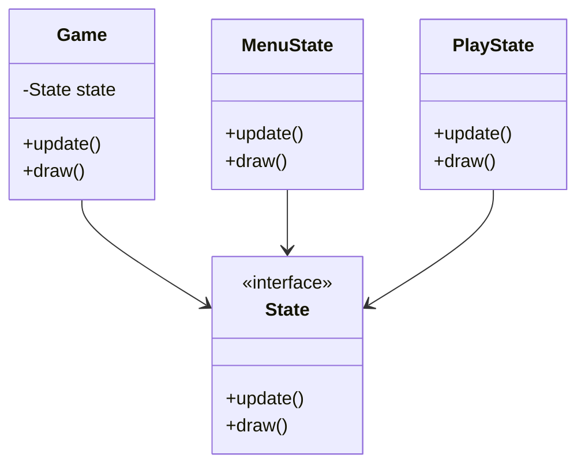

## 25.5 Game Development with Ruby2D and Gosu

Game development in Ruby is an exciting journey that allows developers to leverage the simplicity and elegance of Ruby to create engaging 2D games. Two popular libraries that facilitate this are **Ruby2D** and **Gosu**. In this section, we'll explore these libraries, provide installation and setup instructions, and guide you through creating a simple game. We'll also delve into key concepts such as game loops, rendering, and user input handling, and discuss how to organize game code using design patterns.

### Introduction to Ruby2D and Gosu

#### Ruby2D

Ruby2D is a simple and easy-to-use library for creating 2D games and multimedia applications. It provides a straightforward API for rendering graphics, playing sounds, and handling input. Ruby2D is ideal for beginners and those looking to quickly prototype game ideas.

- **Capabilities**: Ruby2D supports basic shapes, images, sounds, and text rendering. It is built on top of the SDL2 library, which ensures cross-platform compatibility.
- **Use Cases**: Ideal for simple games, educational purposes, and rapid prototyping.

#### Gosu

Gosu is a more mature and feature-rich library for game development in Ruby. It offers a comprehensive set of tools for creating 2D games, including support for graphics, audio, and input handling.

- **Capabilities**: Gosu provides more advanced features such as image manipulation, text rendering with custom fonts, and a robust audio system.
- **Use Cases**: Suitable for more complex games that require advanced graphics and sound capabilities.

### Installation and Setup

#### Installing Ruby2D

To get started with Ruby2D, you need to have Ruby installed on your system. You can then install Ruby2D using the following command:

```bash
gem install ruby2d
```

#### Installing Gosu

Similarly, to install Gosu, run the following command:

```bash
gem install gosu
```

Ensure that you have the necessary dependencies installed for your operating system. For detailed installation instructions, refer to the [Ruby2D](https://www.ruby2d.com/learn/get-started/) and [Gosu](https://www.libgosu.org/rdoc/Gosu/Window.html) documentation.

### Creating a Simple Game: Pong

Let's walk through creating a simple Pong game using Ruby2D and Gosu. We'll cover the basic structure, game loop, rendering, and input handling.

#### Game Structure

A typical game consists of the following components:

- **Game Loop**: The core loop that updates game state and renders graphics.
- **Rendering**: Drawing graphics on the screen.
- **Input Handling**: Capturing and responding to user input.

#### Implementing Pong with Ruby2D

```ruby
require 'ruby2d'

set title: "Pong Game", width: 640, height: 480

# Paddle class
class Paddle
  attr_accessor :x, :y

  def initialize(x, y)
    @x, @y = x, y
    @shape = Rectangle.new(x: @x, y: @y, width: 20, height: 100, color: 'white')
  end

  def move_up
    @y -= 5 if @y > 0
    @shape.y = @y
  end

  def move_down
    @y += 5 if @y < Window.height - 100
    @shape.y = @y
  end
end

# Ball class
class Ball
  attr_accessor :x, :y, :x_velocity, :y_velocity

  def initialize
    @x, @y = Window.width / 2, Window.height / 2
    @x_velocity, @y_velocity = 2, 2
    @shape = Circle.new(x: @x, y: @y, radius: 10, color: 'white')
  end

  def move
    @x += @x_velocity
    @y += @y_velocity
    @shape.x = @x
    @shape.y = @y
  end

  def bounce
    @y_velocity = -@y_velocity if @y <= 0 || @y >= Window.height
  end
end

# Initialize paddles and ball
left_paddle = Paddle.new(10, Window.height / 2 - 50)
right_paddle = Paddle.new(Window.width - 30, Window.height / 2 - 50)
ball = Ball.new

update do
  ball.move
  ball.bounce

  # Paddle collision logic
  if ball.x <= left_paddle.x + 20 && ball.y.between?(left_paddle.y, left_paddle.y + 100)
    ball.x_velocity = -ball.x_velocity
  elsif ball.x >= right_paddle.x - 10 && ball.y.between?(right_paddle.y, right_paddle.y + 100)
    ball.x_velocity = -ball.x_velocity
  end

  # Paddle movement
  left_paddle.move_up if Window.key_down?('w')
  left_paddle.move_down if Window.key_down?('s')
  right_paddle.move_up if Window.key_down?('up')
  right_paddle.move_down if Window.key_down?('down')
end

show
```

#### Implementing Pong with Gosu

```ruby
require 'gosu'

class Pong < Gosu::Window
  def initialize
    super 640, 480
    self.caption = "Pong Game"

    @left_paddle = Paddle.new(10, height / 2 - 50)
    @right_paddle = Paddle.new(width - 30, height / 2 - 50)
    @ball = Ball.new
  end

  def update
    @ball.move
    @ball.bounce(height)

    # Paddle collision logic
    if @ball.x <= @left_paddle.x + 20 && @ball.y.between?(@left_paddle.y, @left_paddle.y + 100)
      @ball.x_velocity = -@ball.x_velocity
    elsif @ball.x >= @right_paddle.x - 10 && @ball.y.between?(@right_paddle.y, @right_paddle.y + 100)
      @ball.x_velocity = -@ball.x_velocity
    end

    # Paddle movement
    @left_paddle.move_up if button_down?(Gosu::KB_W)
    @left_paddle.move_down if button_down?(Gosu::KB_S)
    @right_paddle.move_up if button_down?(Gosu::KB_UP)
    @right_paddle.move_down if button_down?(Gosu::KB_DOWN)
  end

  def draw
    @left_paddle.draw
    @right_paddle.draw
    @ball.draw
  end
end

class Paddle
  attr_reader :x, :y

  def initialize(x, y)
    @x, @y = x, y
  end

  def move_up
    @y -= 5 if @y > 0
  end

  def move_down
    @y += 5 if @y < 480 - 100
  end

  def draw
    Gosu.draw_rect(@x, @y, 20, 100, Gosu::Color::WHITE)
  end
end

class Ball
  attr_reader :x, :y
  attr_accessor :x_velocity, :y_velocity

  def initialize
    @x, @y = 320, 240
    @x_velocity, @y_velocity = 2, 2
  end

  def move
    @x += @x_velocity
    @y += @y_velocity
  end

  def bounce(height)
    @y_velocity = -@y_velocity if @y <= 0 || @y >= height
  end

  def draw
    Gosu.draw_circle(@x, @y, 10, 32, Gosu::Color::WHITE)
  end
end

Pong.new.show
```

### Key Concepts in Game Development

#### Game Loops

The game loop is the heart of any game. It continuously updates the game state and renders the graphics. In Ruby2D and Gosu, the game loop is managed by the library, allowing you to focus on implementing the game logic.

#### Rendering

Rendering involves drawing graphics on the screen. Both Ruby2D and Gosu provide methods to render shapes, images, and text. In Ruby2D, you use objects like `Rectangle` and `Circle`, while in Gosu, you use methods like `draw_rect` and `draw_circle`.

#### User Input Handling

Handling user input is crucial for interactive games. Ruby2D uses the `Window.key_down?` method to check for key presses, while Gosu provides the `button_down?` method.

### Organizing Game Code with Design Patterns

#### State Pattern

The State pattern is useful for managing different states in a game, such as menus, gameplay, and pause screens. It allows you to encapsulate state-specific behavior and switch between states easily.

```ruby
class Game
  attr_accessor :state

  def initialize
    @state = MenuState.new(self)
  end

  def update
    @state.update
  end

  def draw
    @state.draw
  end
end

class MenuState
  def initialize(game)
    @game = game
  end

  def update
    # Transition to PlayState on user input
    @game.state = PlayState.new(@game) if Window.key_down?('enter')
  end

  def draw
    # Draw menu
  end
end

class PlayState
  def initialize(game)
    @game = game
  end

  def update
    # Game logic
  end

  def draw
    # Draw game
  end
end
```

#### Observer Pattern

The Observer pattern is useful for managing events and notifications in a game. It allows you to decouple the game logic from the event handling code.

```ruby
class EventManager
  def initialize
    @listeners = []
  end

  def subscribe(listener)
    @listeners << listener
  end

  def notify(event)
    @listeners.each { |listener| listener.update(event) }
  end
end

class Player
  def update(event)
    # React to event
  end
end

event_manager = EventManager.new
player = Player.new

event_manager.subscribe(player)
event_manager.notify('player_scored')
```

### Best Practices for Performance Optimization

- **Optimize Rendering**: Minimize the number of draw calls and use spritesheets to reduce rendering overhead.
- **Efficient Collision Detection**: Use spatial partitioning techniques to reduce the number of collision checks.
- **Memory Management**: Reuse objects and avoid unnecessary allocations to reduce garbage collection overhead.

### Encouraging Experimentation

Game development is a creative process. Experiment with extending the game features by adding new mechanics, improving graphics, or incorporating sound effects. Try modifying the code examples to create your own unique game.

### Visualizing Game Architecture



**Diagram Description**: This class diagram illustrates the use of the State pattern in a game architecture. The `Game` class maintains a reference to the current `State`, which can be either `MenuState` or `PlayState`. Each state implements the `update` and `draw` methods, allowing the game to switch between states seamlessly.

### Knowledge Check

- **Question**: What is the primary purpose of a game loop?
- **Challenge**: Modify the Pong game to include a scoring system.

### Summary

In this section, we've explored game development using Ruby2D and Gosu, covering installation, setup, and the creation of a simple Pong game. We've discussed key concepts like game loops, rendering, and input handling, and demonstrated how to organize game code using design patterns. Remember, this is just the beginning. Keep experimenting, stay curious, and enjoy the journey of game development with Ruby!

## Quiz: Game Development with Ruby2D and Gosu



### What is the primary purpose of a game loop in game development?

- [x] To continuously update the game state and render graphics
- [ ] To handle user input
- [ ] To initialize game assets
- [ ] To manage game settings

> **Explanation:** The game loop is responsible for continuously updating the game state and rendering graphics, ensuring the game runs smoothly.

### Which method does Ruby2D use to check for key presses?

- [x] Window.key_down?
- [ ] button_down?
- [ ] key_pressed?
- [ ] input_check?

> **Explanation:** Ruby2D uses the `Window.key_down?` method to check for key presses.

### What is the State pattern used for in game development?

- [x] Managing different states in a game, such as menus and gameplay
- [ ] Handling user input
- [ ] Rendering graphics
- [ ] Optimizing performance

> **Explanation:** The State pattern is used to manage different states in a game, allowing for easy transitions between states like menus and gameplay.

### Which Ruby library is built on top of the SDL2 library?

- [x] Ruby2D
- [ ] Gosu
- [ ] RMagick
- [ ] Shoes

> **Explanation:** Ruby2D is built on top of the SDL2 library, providing cross-platform compatibility.

### What is a key benefit of using the Observer pattern in games?

- [x] Decoupling game logic from event handling code
- [ ] Improving rendering performance
- [ ] Simplifying user input handling
- [ ] Enhancing graphics quality

> **Explanation:** The Observer pattern helps decouple game logic from event handling code, making the codebase more modular and maintainable.

### Which method does Gosu provide for checking button presses?

- [x] button_down?
- [ ] Window.key_down?
- [ ] key_pressed?
- [ ] input_check?

> **Explanation:** Gosu provides the `button_down?` method for checking button presses.

### What is a common technique for optimizing rendering in games?

- [x] Using spritesheets to reduce rendering overhead
- [ ] Increasing the number of draw calls
- [ ] Adding more textures
- [ ] Using larger images

> **Explanation:** Using spritesheets helps reduce rendering overhead by minimizing the number of draw calls.

### What is the primary focus of Ruby2D?

- [x] Simplicity and ease of use for creating 2D games
- [ ] Advanced graphics and sound capabilities
- [ ] 3D game development
- [ ] Networking and multiplayer support

> **Explanation:** Ruby2D focuses on simplicity and ease of use, making it ideal for creating 2D games and rapid prototyping.

### Which design pattern is useful for managing events and notifications in a game?

- [x] Observer pattern
- [ ] State pattern
- [ ] Singleton pattern
- [ ] Factory pattern

> **Explanation:** The Observer pattern is useful for managing events and notifications, allowing for decoupled and modular code.

### True or False: Gosu is suitable for creating complex games with advanced graphics and sound capabilities.

- [x] True
- [ ] False

> **Explanation:** Gosu is a feature-rich library suitable for creating complex games with advanced graphics and sound capabilities.


