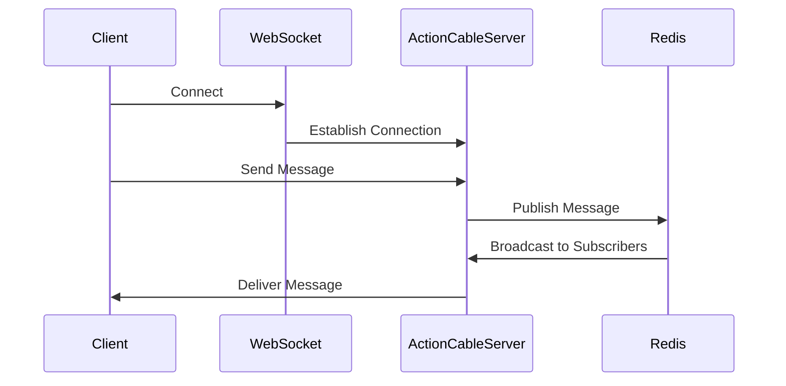

## 25.7 Real-Time Communication with Action Cable

In today's fast-paced digital world, real-time communication is a critical feature for modern web applications. Whether it's live chat, notifications, or collaborative tools, users expect instantaneous updates. Ruby on Rails, a popular web application framework, offers a powerful tool called Action Cable to facilitate real-time communication through WebSockets. In this section, we'll explore how to leverage Action Cable to build scalable and maintainable real-time features in your Rails applications.

### Introduction to Action Cable

Action Cable is a framework integrated into Ruby on Rails that allows you to handle WebSocket connections in a Rails-like manner. It seamlessly integrates the WebSocket protocol with the rest of your Rails application, enabling you to add real-time features without leaving the Rails ecosystem.

#### Key Features of Action Cable

- **Integrated with Rails**: Action Cable is built into Rails, allowing you to use the same conventions and patterns you're familiar with.
- **Scalable**: With support for Redis as a pub/sub layer, Action Cable can handle multiple connections efficiently.
- **Secure**: Provides mechanisms for authentication and authorization of WebSocket connections.
- **Easy to Use**: Follows Rails conventions, making it easy to set up and use.

### Understanding WebSockets

WebSockets provide a full-duplex communication channel over a single TCP connection, enabling real-time data exchange between the client and server. Unlike traditional HTTP requests, which follow a request-response pattern, WebSockets allow for persistent connections where data can be sent and received simultaneously.

#### Advantages of WebSockets

- **Low Latency**: Real-time updates without the overhead of HTTP requests.
- **Bidirectional Communication**: Both client and server can send messages independently.
- **Efficient**: Reduces the need for polling, saving bandwidth and server resources.

### Setting Up Action Cable in a Rails Application

Let's walk through the process of setting up Action Cable in a Rails application to implement a simple chat feature.

#### Step 1: Generate a New Rails Application

First, create a new Rails application if you don't have one already:

```bash
rails new chat_app --skip-active-record
cd chat_app
```

#### Step 2: Configure Action Cable

Action Cable is included by default in Rails applications. You need to configure it in `config/cable.yml`:

```yaml
development:
  adapter: async

production:
  adapter: redis
  url: redis://localhost:6379/1
  channel_prefix: chat_app_production
```

#### Step 3: Create a Channel

Generate a new channel for handling chat messages:

```bash
rails generate channel Chat
```

This command creates a `chat_channel.rb` file in `app/channels` and a corresponding CoffeeScript file in `app/assets/javascripts/channels`.

#### Step 4: Implement the Server-Side Logic

In `app/channels/chat_channel.rb`, define the behavior for when a client subscribes to the channel and how to handle incoming messages:

```ruby
class ChatChannel < ApplicationCable::Channel
  def subscribed
    stream_from "chat_#{params[:room]}"
  end

  def unsubscribed
    # Any cleanup needed when channel is unsubscribed
  end

  def speak(data)
    ActionCable.server.broadcast("chat_#{params[:room]}", message: data['message'])
  end
end
```

#### Step 5: Implement the Client-Side Logic

In `app/assets/javascripts/channels/chat.coffee`, set up the client-side subscription and message handling:

```coffee
App.chat = App.cable.subscriptions.create { channel: "ChatChannel", room: "1" },
  connected: ->
    # Called when the subscription is ready for use on the server

  disconnected: ->
    # Called when the subscription has been terminated by the server

  received: (data) ->
    $('#messages').append "<p>#{data.message}</p>"

  speak: (message) ->
    @perform 'speak', message: message
```

#### Step 6: Create the Frontend Interface

In your view file (e.g., `app/views/chat/index.html.erb`), add a simple form and a container for messages:

```html
<div id="messages"></div>
<form id="new_message">
  <input type="text" id="message_content" placeholder="Type your message here..." />
  <input type="submit" value="Send" />
</form>

<script>
  $(document).on('turbolinks:load', function() {
    $('#new_message').on('submit', function(event) {
      event.preventDefault();
      var message = $('#message_content').val();
      App.chat.speak(message);
      $('#message_content').val('');
    });
  });
</script>
```

### Scaling Action Cable with Redis

For production environments, it's crucial to scale Action Cable to handle numerous connections efficiently. Redis is commonly used as a pub/sub layer to distribute messages across multiple Action Cable servers.

#### Configuring Redis

Ensure Redis is running and update your `config/cable.yml` to use Redis in production:

```yaml
production:
  adapter: redis
  url: redis://localhost:6379/1
  channel_prefix: chat_app_production
```

### Security Considerations

When implementing real-time features, security is paramount. Here are some best practices:

- **Authentication**: Use Devise or another authentication library to ensure only authorized users can connect.
- **Authorization**: Implement checks in your channel to ensure users can only access data they are permitted to see.
- **SSL/TLS**: Always use secure connections (wss://) in production to protect data in transit.

### Debugging and Testing Real-Time Features

Debugging real-time applications can be challenging. Here are some tips:

- **Logging**: Use Rails' logging to track connection and message events.
- **Browser Tools**: Utilize browser developer tools to inspect WebSocket connections and messages.
- **Testing**: Write integration tests to simulate WebSocket connections and verify behavior.

### Try It Yourself

Experiment with the code by adding features like private messaging or typing indicators. Modify the `speak` method to include user information or add a typing status feature.

### Visualizing Action Cable Architecture

Here's a simple diagram to illustrate the flow of messages in an Action Cable setup:



### Summary

Action Cable provides a robust framework for adding real-time features to your Rails applications. By leveraging WebSockets, you can create interactive and engaging user experiences. Remember to consider scalability and security as you implement these features.

## Quiz: Real-Time Communication with Action Cable



### What is Action Cable primarily used for in Ruby on Rails?

- [x] Real-time communication
- [ ] Database management
- [ ] File uploads
- [ ] Authentication

> **Explanation:** Action Cable is used for real-time communication in Rails applications, enabling features like live chat and notifications.

### Which protocol does Action Cable use for real-time communication?

- [x] WebSockets
- [ ] HTTP
- [ ] FTP
- [ ] SMTP

> **Explanation:** Action Cable uses WebSockets to establish a persistent connection for real-time communication.

### What is the role of Redis in scaling Action Cable?

- [x] Pub/Sub layer for message distribution
- [ ] Database storage
- [ ] File caching
- [ ] Authentication

> **Explanation:** Redis acts as a pub/sub layer to distribute messages across multiple Action Cable servers, aiding in scalability.

### How does Action Cable authenticate WebSocket connections?

- [x] Through Rails authentication mechanisms like Devise
- [ ] By IP address
- [ ] Using cookies only
- [ ] No authentication is needed

> **Explanation:** Action Cable can use Rails authentication mechanisms to ensure only authorized users can establish WebSocket connections.

### What is a key advantage of WebSockets over traditional HTTP requests?

- [x] Bidirectional communication
- [ ] Higher latency
- [ ] Simpler setup
- [ ] Better for static content

> **Explanation:** WebSockets allow bidirectional communication, enabling real-time data exchange between client and server.

### Which file is used to configure Action Cable in a Rails application?

- [x] `config/cable.yml`
- [ ] `config/routes.rb`
- [ ] `config/database.yml`
- [ ] `config/secrets.yml`

> **Explanation:** The `config/cable.yml` file is used to configure Action Cable settings in a Rails application.

### What should you use to secure WebSocket connections in production?

- [x] SSL/TLS
- [ ] HTTP
- [ ] FTP
- [ ] SMTP

> **Explanation:** SSL/TLS should be used to secure WebSocket connections (wss://) in production environments.

### What is a common use case for Action Cable?

- [x] Live chat applications
- [ ] Static website hosting
- [ ] Image processing
- [ ] Batch data processing

> **Explanation:** Action Cable is commonly used for live chat applications and other real-time features.

### Which method is used to broadcast messages in Action Cable?

- [x] `ActionCable.server.broadcast`
- [ ] `ActionCable.server.send`
- [ ] `ActionCable.server.dispatch`
- [ ] `ActionCable.server.transmit`

> **Explanation:** The `ActionCable.server.broadcast` method is used to send messages to all subscribers of a channel.

### True or False: Action Cable can only be used with Redis.

- [ ] True
- [x] False

> **Explanation:** While Redis is commonly used for scaling Action Cable, it is not the only option. Other adapters can be used as well.



Remember, this is just the beginning. As you progress, you'll build more complex and interactive applications with real-time features. Keep experimenting, stay curious, and enjoy the journey!
