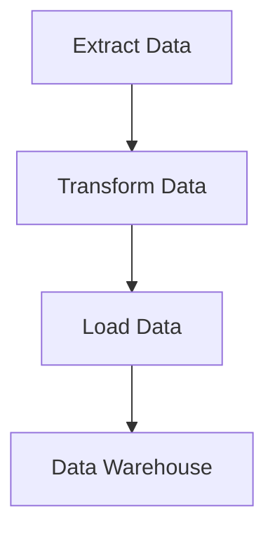

## 25.8 Data Processing Pipelines

In today's data-driven world, the ability to efficiently process and analyze large datasets is crucial for businesses and developers alike. Data processing pipelines, often referred to as ETL (Extract, Transform, Load) processes, play a vital role in data engineering by enabling the seamless flow of data from various sources to destinations where it can be analyzed and utilized. In this section, we'll explore how to build robust data processing pipelines using Ruby, leveraging its powerful libraries and tools.

### Understanding Data Processing Pipelines

Data processing pipelines are a series of data processing steps that automate the extraction, transformation, and loading of data. These pipelines are essential for:

- **Data Integration**: Combining data from multiple sources into a unified view.
- **Data Cleaning**: Removing inconsistencies and errors from data.
- **Data Transformation**: Converting data into a suitable format for analysis.
- **Data Loading**: Storing processed data into databases or data warehouses.

### Tools and Libraries for Data Processing in Ruby

Ruby offers several libraries and tools that facilitate the creation of data processing pipelines. Two notable ones are:

- **Kiba**: A lightweight ETL framework for Ruby that simplifies the process of building data pipelines. It is designed to be easy to use and flexible, allowing developers to define ETL jobs using plain Ruby code.
- **RubyXL**: A library for reading and writing Excel files, which is useful for handling data stored in spreadsheets.

#### Kiba Example

Kiba allows you to define ETL jobs using a simple DSL (Domain-Specific Language). Here's a basic example of a Kiba job that reads data from a CSV file, transforms it, and writes it to another CSV file:

```ruby
require 'kiba'
require 'csv'

module ETLJob
  extend Kiba::DSLExtensions::Config

  source Kiba::Common::Sources::CSV, filename: 'input.csv'
  destination Kiba::Common::Destinations::CSV, filename: 'output.csv'

  transform do |row|
    row[:name] = row[:name].upcase
    row
  end
end

Kiba.run(ETLJob)
```

In this example, we define a simple ETL job that reads data from `input.csv`, transforms the `name` field to uppercase, and writes the result to `output.csv`.

### Reading from Various Data Sources

Ruby provides several libraries to read data from different sources, such as CSV, JSON, and databases. Let's explore how to handle these formats:

#### Reading CSV Files

The `CSV` library in Ruby is a powerful tool for reading and writing CSV files. Here's how you can read data from a CSV file:

```ruby
require 'csv'

CSV.foreach('data.csv', headers: true) do |row|
  puts row['name']
end
```

#### Reading JSON Files

For JSON data, Ruby's `JSON` library is straightforward to use:

```ruby
require 'json'

file = File.read('data.json')
data = JSON.parse(file)
data.each do |item|
  puts item['name']
end
```

#### Connecting to Databases

Ruby's `ActiveRecord` or `Sequel` can be used to connect to databases and perform queries. Here's a simple example using `Sequel`:

```ruby
require 'sequel'

DB = Sequel.connect('sqlite://database.db')

DB[:users].each do |user|
  puts user[:name]
end
```

### Data Transformation Techniques

Data transformation is a critical step in data processing pipelines. It involves cleaning, aggregating, and modifying data to fit the desired format.

#### Data Cleaning

Data cleaning involves removing or correcting erroneous data. Here's an example of removing duplicates from an array:

```ruby
data = [1, 2, 2, 3, 4, 4, 5]
cleaned_data = data.uniq
puts cleaned_data
```

#### Data Aggregation

Aggregation involves summarizing data. For instance, calculating the total sales from a list of transactions:

```ruby
transactions = [100, 200, 300]
total_sales = transactions.reduce(:+)
puts total_sales
```

### Loading Processed Data

Once data is transformed, it needs to be loaded into a storage system. This could be a database, a data warehouse, or a file.

#### Loading into a Database

Using `Sequel`, you can insert data into a database table:

```ruby
DB[:sales].insert(name: 'Product A', amount: 100)
```

#### Writing to a File

You can also write data to a file, such as a CSV:

```ruby
CSV.open('output.csv', 'w') do |csv|
  csv << ['name', 'amount']
  csv << ['Product A', 100]
end
```

### Performance Considerations

Handling large datasets efficiently requires careful consideration of performance. Here are some strategies:

- **Batch Processing**: Process data in batches to reduce memory usage.
- **Parallel Processing**: Use Ruby's threading or forking capabilities to process data in parallel.
- **Efficient Data Structures**: Choose data structures that optimize for the operations you need to perform.

### Error Handling and Logging

Robust error handling and logging are essential for maintaining reliable data pipelines. Use Ruby's exception handling to manage errors gracefully:

```ruby
begin
  # Code that might raise an exception
rescue StandardError => e
  puts "An error occurred: #{e.message}"
end
```

Logging can be implemented using Ruby's `Logger` class:

```ruby
require 'logger'

logger = Logger.new('pipeline.log')
logger.info('Pipeline started')
logger.error('An error occurred')
```

### Scheduling and Automation

Automating data processing tasks ensures they run at regular intervals without manual intervention. Tools like `cron` or Ruby libraries like `rufus-scheduler` can be used for scheduling:

```ruby
require 'rufus-scheduler'

scheduler = Rufus::Scheduler.new

scheduler.every '1h' do
  puts 'Running data pipeline...'
end

scheduler.join
```

### Visualizing Data Processing Pipelines

To better understand the flow of data through a pipeline, visual representations can be helpful. Below is a simple flowchart illustrating a typical ETL process:



This diagram shows the sequential steps of extracting, transforming, and loading data into a data warehouse.

### Conclusion

Building data processing pipelines in Ruby is a powerful way to handle large datasets efficiently. By leveraging Ruby's libraries and tools, you can create scalable and maintainable ETL processes that integrate, clean, transform, and load data seamlessly. Remember to consider performance, error handling, and automation to ensure your pipelines run smoothly and reliably.

## Quiz: Data Processing Pipelines



### What is the primary purpose of a data processing pipeline?

- [x] To automate the extraction, transformation, and loading of data
- [ ] To manually process data
- [ ] To store data in a database
- [ ] To visualize data

> **Explanation:** Data processing pipelines automate the ETL process, which involves extracting, transforming, and loading data.

### Which Ruby library is commonly used for building ETL jobs?

- [x] Kiba
- [ ] Nokogiri
- [ ] Sinatra
- [ ] Rails

> **Explanation:** Kiba is a lightweight ETL framework for Ruby, designed to simplify the creation of data processing pipelines.

### What does the 'T' in ETL stand for?

- [ ] Transfer
- [x] Transform
- [ ] Transmit
- [ ] Translate

> **Explanation:** The 'T' in ETL stands for Transform, which refers to the process of converting data into a suitable format for analysis.

### Which Ruby library is used for reading and writing Excel files?

- [ ] Nokogiri
- [x] RubyXL
- [ ] Sequel
- [ ] ActiveRecord

> **Explanation:** RubyXL is a library for reading and writing Excel files in Ruby.

### What is a common strategy for handling large datasets in Ruby?

- [x] Batch Processing
- [ ] Single-threaded Processing
- [ ] Manual Processing
- [ ] Direct Processing

> **Explanation:** Batch processing is a common strategy for handling large datasets efficiently by reducing memory usage.

### How can you automate data processing tasks in Ruby?

- [x] Using Rufus-scheduler
- [ ] Using Rails
- [ ] Using Nokogiri
- [ ] Using Sinatra

> **Explanation:** Rufus-scheduler is a Ruby library that can be used to schedule and automate tasks.

### What is the role of the 'Logger' class in Ruby?

- [x] To implement logging
- [ ] To handle exceptions
- [ ] To connect to databases
- [ ] To read CSV files

> **Explanation:** The 'Logger' class in Ruby is used to implement logging, which is essential for tracking the execution of data pipelines.

### Which of the following is a data transformation technique?

- [x] Data Cleaning
- [ ] Data Extraction
- [ ] Data Loading
- [ ] Data Visualization

> **Explanation:** Data cleaning is a transformation technique that involves removing or correcting erroneous data.

### What is the purpose of the 'rescue' keyword in Ruby?

- [x] To handle exceptions
- [ ] To log errors
- [ ] To schedule tasks
- [ ] To transform data

> **Explanation:** The 'rescue' keyword in Ruby is used to handle exceptions and manage errors gracefully.

### True or False: Data processing pipelines are only used for small datasets.

- [ ] True
- [x] False

> **Explanation:** Data processing pipelines are designed to handle both small and large datasets efficiently.



Remember, building data pipelines is just the beginning of your journey in data engineering. As you progress, you'll encounter more complex scenarios and challenges. Keep experimenting, stay curious, and enjoy the journey!
