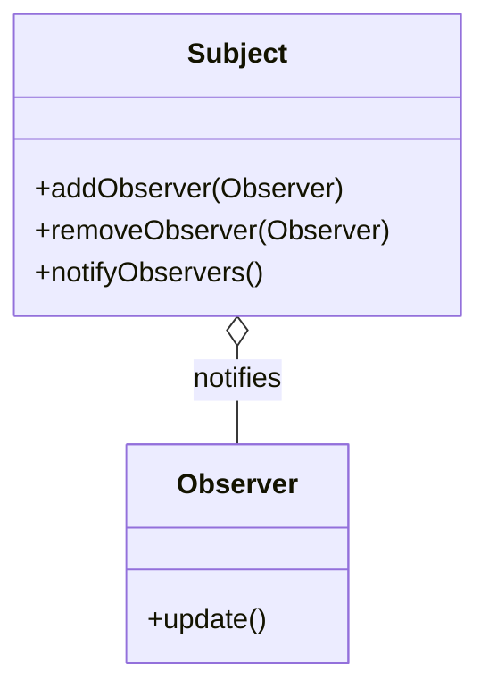

## 26.1 Recap of Key Concepts

As we reach the conclusion of "The Ultimate Guide to Ruby Design Patterns: Build Scalable and Maintainable Applications," it's time to reflect on the journey we've taken through the world of Ruby design patterns. This recap will consolidate the key concepts, patterns, and practices discussed throughout the guide, reinforcing your understanding and highlighting the most important takeaways. Let's dive into the essence of what makes Ruby design patterns a powerful tool for developers.

### Overview of Major Topics

Throughout this guide, we explored a wide array of topics, each contributing to the overarching goal of building scalable and maintainable Ruby applications. Here's a brief overview of the major areas we covered:

1. **Introduction to Design Patterns in Ruby**: We began by understanding what design patterns are, their history, and their significance in Ruby development. We emphasized the importance of using design patterns to solve common problems and improve code quality.

2. **Core Principles of Ruby Programming**: We delved into Ruby's unique features, such as dynamic typing, duck typing, and metaprogramming, which make it an ideal language for implementing design patterns. Concepts like blocks, procs, and lambdas were explored to highlight Ruby's functional programming capabilities.

3. **Creational, Structural, and Behavioral Patterns**: We examined various design patterns across these three categories, providing practical examples and use cases for each. From Singleton and Factory Method to Observer and Strategy patterns, we covered a comprehensive range of patterns that enhance software design.

4. **Functional Programming in Ruby**: We explored how Ruby can be used for functional programming, discussing concepts like higher-order functions, immutability, and monads. This section emphasized the integration of functional and object-oriented paradigms.

5. **Metaprogramming and Advanced Techniques**: We ventured into the realm of metaprogramming, showcasing how Ruby's dynamic nature allows for powerful abstractions and DSLs. Techniques like dynamic method definition and class macros were discussed.

6. **Concurrency, Error Handling, and Reactive Programming**: We addressed the challenges of concurrency and error handling in Ruby, introducing patterns and best practices for building robust applications. Reactive programming concepts were also explored to handle asynchronous data streams.

7. **Architectural Patterns and Enterprise Integration**: We examined architectural patterns like MVC, microservices, and event-driven architecture, highlighting their applicability in Ruby applications. Enterprise integration patterns were also discussed to facilitate communication between distributed systems.

8. **Testing, Refactoring, and Performance Optimization**: We emphasized the importance of testing and refactoring in maintaining code quality. Performance optimization techniques were discussed to ensure Ruby applications run efficiently.

9. **Security, Logging, and Monitoring**: We covered security design patterns, logging best practices, and monitoring strategies to ensure applications are secure and observable.

10. **Emerging Trends and Professional Development**: We concluded with a look at emerging trends in Ruby development and professional development tips to keep you at the forefront of the industry.

### Critical Design Patterns and Their Applications

Design patterns are the backbone of scalable and maintainable software architecture. Let's revisit some of the most critical design patterns we discussed and their applications in Ruby:

#### Singleton Pattern

- **Intent**: Ensure a class has only one instance and provide a global point of access to it.
- **Application**: Use the Singleton pattern in scenarios where a single instance is required, such as configuration settings or logging.
  
```ruby
class Logger
  @instance = new

  private_class_method :new

  def self.instance
    @instance
  end

  def log(message)
    puts message
  end
end

# Usage
logger = Logger.instance
logger.log("This is a log message.")
```

#### Factory Method Pattern

- **Intent**: Define an interface for creating an object, but let subclasses alter the type of objects that will be created.
- **Application**: Use the Factory Method pattern to delegate the instantiation logic to subclasses, promoting loose coupling.

```ruby
class Document
  def initialize
    @content = create_content
  end

  def create_content
    raise NotImplementedError, "Subclasses must implement create_content"
  end
end

class Report < Document
  def create_content
    "Report Content"
  end
end

class Invoice < Document
  def create_content
    "Invoice Content"
  end
end

# Usage
report = Report.new
puts report.create_content

invoice = Invoice.new
puts invoice.create_content
```

#### Observer Pattern

- **Intent**: Define a one-to-many dependency between objects so that when one object changes state, all its dependents are notified and updated automatically.
- **Application**: Use the Observer pattern for event-driven systems where changes in one object need to be propagated to others.

```ruby
class Subject
  def initialize
    @observers = []
  end

  def add_observer(observer)
    @observers << observer
  end

  def notify_observers
    @observers.each(&:update)
  end
end

class Observer
  def update
    puts "Observer has been notified!"
  end
end

# Usage
subject = Subject.new
observer = Observer.new
subject.add_observer(observer)
subject.notify_observers
```

### Importance of Principles: DRY, SOLID, and Clean Code

Throughout the guide, we emphasized the importance of adhering to fundamental software design principles:

- **DRY (Don't Repeat Yourself)**: Avoid code duplication by abstracting common functionality into reusable components. This principle reduces maintenance overhead and enhances code readability.

- **SOLID Principles**: These five principles (Single Responsibility, Open/Closed, Liskov Substitution, Interface Segregation, and Dependency Inversion) guide the creation of robust and flexible software architectures. They promote separation of concerns, modularity, and ease of maintenance.

- **Clean Code Practices**: Writing clean code involves using meaningful names, keeping functions small, and maintaining a consistent coding style. Clean code is easier to read, understand, and modify.

### Integration of Patterns for Enhanced Software Design

The integration of design patterns into your Ruby applications enhances software design by:

- **Promoting Reusability**: Patterns provide reusable solutions to common problems, reducing the need to reinvent the wheel.

- **Improving Maintainability**: Well-structured code with clear patterns is easier to maintain and extend.

- **Facilitating Communication**: Patterns serve as a common language among developers, improving collaboration and understanding.

- **Enhancing Flexibility**: Patterns enable flexible designs that can adapt to changing requirements.

### Encouragement to Apply Concepts

As you continue your journey as a Ruby developer, we encourage you to apply these concepts and patterns in your own projects. Experiment with different patterns, refactor existing code, and strive for clean, maintainable designs. Remember, the key to mastering design patterns is practice and continuous learning.

### Visualizing Key Concepts

To aid in understanding, let's visualize some of the key concepts discussed:

#### Diagram: Observer Pattern



*This diagram illustrates the relationship between the Subject and Observer classes, where the Subject notifies Observers of changes.*

### References and Further Reading

For further exploration of Ruby design patterns and best practices, consider the following resources:

- [Ruby Patterns](https://www.rubypatterns.com)
- [Design Patterns in Ruby](https://www.amazon.com/Design-Patterns-Ruby-Russ-Olsen/dp/0321490452)
- [Refactoring: Improving the Design of Existing Code](https://martinfowler.com/books/refactoring.html)

### Knowledge Check

To reinforce your understanding, consider the following questions:

- How does the Factory Method pattern promote loose coupling?
- What are the benefits of using the Observer pattern in event-driven systems?
- Why is adhering to the DRY principle important in software development?

### Embrace the Journey

Remember, this is just the beginning. As you progress, you'll build more complex and interactive Ruby applications. Keep experimenting, stay curious, and enjoy the journey!

---

## Quiz: Recap of Key Concepts



### What is the primary benefit of using design patterns in software development?

- [x] They provide reusable solutions to common problems.
- [ ] They increase the complexity of the code.
- [ ] They are only applicable to large-scale applications.
- [ ] They eliminate the need for testing.

> **Explanation:** Design patterns offer reusable solutions to common problems, improving code quality and maintainability.

### Which principle emphasizes avoiding code duplication?

- [x] DRY (Don't Repeat Yourself)
- [ ] SOLID
- [ ] KISS (Keep It Simple, Stupid)
- [ ] YAGNI (You Aren't Gonna Need It)

> **Explanation:** DRY stands for "Don't Repeat Yourself," which focuses on reducing code duplication.

### What is the intent of the Singleton pattern?

- [x] Ensure a class has only one instance and provide a global point of access to it.
- [ ] Define an interface for creating an object.
- [ ] Define a one-to-many dependency between objects.
- [ ] Separate the construction of a complex object from its representation.

> **Explanation:** The Singleton pattern ensures a class has only one instance and provides a global point of access.

### Which pattern is used to delegate instantiation logic to subclasses?

- [x] Factory Method Pattern
- [ ] Singleton Pattern
- [ ] Observer Pattern
- [ ] Strategy Pattern

> **Explanation:** The Factory Method pattern delegates instantiation logic to subclasses, promoting loose coupling.

### What is a key advantage of using the Observer pattern?

- [x] It allows for event-driven systems where changes in one object need to be propagated to others.
- [ ] It ensures a class has only one instance.
- [ ] It defines an interface for creating an object.
- [ ] It separates the construction of a complex object from its representation.

> **Explanation:** The Observer pattern is ideal for event-driven systems where changes in one object need to be propagated to others.

### Which SOLID principle promotes separation of concerns?

- [x] Single Responsibility Principle
- [ ] Open/Closed Principle
- [ ] Liskov Substitution Principle
- [ ] Interface Segregation Principle

> **Explanation:** The Single Responsibility Principle promotes separation of concerns by ensuring a class has only one reason to change.

### What is the purpose of clean code practices?

- [x] To make code easier to read, understand, and modify.
- [ ] To increase the complexity of the code.
- [ ] To eliminate the need for testing.
- [ ] To ensure a class has only one instance.

> **Explanation:** Clean code practices aim to make code easier to read, understand, and modify.

### How do design patterns facilitate communication among developers?

- [x] They serve as a common language, improving collaboration and understanding.
- [ ] They increase the complexity of the code.
- [ ] They are only applicable to large-scale applications.
- [ ] They eliminate the need for testing.

> **Explanation:** Design patterns serve as a common language among developers, improving collaboration and understanding.

### What is the primary focus of performance optimization techniques?

- [x] Ensuring Ruby applications run efficiently.
- [ ] Increasing the complexity of the code.
- [ ] Eliminating the need for testing.
- [ ] Ensuring a class has only one instance.

> **Explanation:** Performance optimization techniques focus on ensuring Ruby applications run efficiently.

### True or False: The integration of design patterns enhances software design by promoting reusability and flexibility.

- [x] True
- [ ] False

> **Explanation:** The integration of design patterns enhances software design by promoting reusability and flexibility.



---
