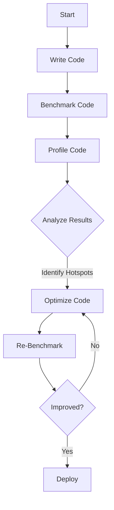

## 27.11 Benchmarking and Profiling Tools

In the world of software development, performance is a critical aspect that can make or break an application. As Ruby developers, we often encounter scenarios where our applications need to be optimized for speed and efficiency. This section delves into the essential tools and techniques for benchmarking and profiling Ruby code, enabling you to identify performance bottlenecks and optimize your applications effectively.

### Introduction to Benchmarking and Profiling

Before we dive into the tools, let's clarify the concepts of benchmarking and profiling:

- **Benchmarking** is the process of measuring the performance of a piece of code to determine how fast it runs. It helps in comparing different approaches to solve a problem and choosing the most efficient one.
  
- **Profiling** involves analyzing the code to identify which parts are consuming the most resources, such as CPU time or memory. Profiling helps pinpoint bottlenecks and areas that need optimization.

### Benchmarking Tools

#### The `Benchmark` Module

Ruby's standard library includes the `Benchmark` module, which provides methods to measure and report the time taken to execute Ruby code. It's a simple yet powerful tool for basic benchmarking tasks.

**Example: Using the `Benchmark` Module**

```ruby
require 'benchmark'

n = 50000
Benchmark.bm do |x|
  x.report("for loop:") { for i in 1..n; a = "1"; end }
  x.report("times loop:") { n.times do; a = "1"; end }
  x.report("upto loop:") { 1.upto(n) do; a = "1"; end }
end
```

In this example, we compare the execution time of three different loop constructs. The `Benchmark.bm` method provides a clean output format, making it easy to compare results.

#### `benchmark-ips`

For more detailed benchmarking, the `benchmark-ips` gem is a popular choice. It measures iterations per second, providing a more accurate representation of performance, especially for fast-executing code.

**Example: Using `benchmark-ips`**

```ruby
require 'benchmark/ips'

Benchmark.ips do |x|
  x.report("addition") { 1 + 2 }
  x.report("multiplication") { 1 * 2 }
  x.compare!
end
```

The `benchmark-ips` gem not only measures performance but also includes a `compare!` method to automatically compare the results of different code blocks.

### Profiling Tools

#### `ruby-prof`

`ruby-prof` is a fast code profiler for Ruby that provides a detailed report of where time is being spent in your Ruby application. It supports several output formats, including flat, graph, and call tree.

**Example: Using `ruby-prof`**

```ruby
require 'ruby-prof'

RubyProf.start

# Code to profile
result = 0
1000.times { result += 1 }

profile = RubyProf.stop

# Print a flat profile to text
printer = RubyProf::FlatPrinter.new(profile)
printer.print(STDOUT)
```

This example demonstrates how to use `ruby-prof` to profile a simple loop and print the results in a flat format.

#### `stackprof`

`stackprof` is a sampling call-stack profiler for Ruby, which is particularly useful for profiling CPU-bound code. It provides a low-overhead way to gather profiling data.

**Example: Using `stackprof`**

```ruby
require 'stackprof'

StackProf.run(mode: :cpu, out: 'tmp/stackprof.dump') do
  # Code to profile
  1000.times { |i| i * i }
end

# To view the results, use the stackprof command-line tool:
# $ stackprof tmp/stackprof.dump --text
```

`stackprof` outputs a dump file that can be analyzed using its command-line tool, providing insights into the call stack and execution time.

### Interpreting Results and Taking Action

Once you've gathered benchmarking and profiling data, the next step is to interpret the results and take action to optimize your code. Here are some general guidelines:

1. **Identify Hotspots**: Look for methods or code blocks that consume the most time or resources. These are your primary targets for optimization.

2. **Optimize Algorithms**: Consider more efficient algorithms or data structures. Sometimes, a simple change can lead to significant performance gains.

3. **Reduce Complexity**: Simplify complex code paths. This can often lead to better performance and easier maintenance.

4. **Leverage C Extensions**: For performance-critical sections, consider using C extensions or native libraries to speed up execution.

5. **Cache Results**: If a method or calculation is called frequently with the same inputs, caching the results can save time.

### Best Practices for Performance Testing

- **Test in a Realistic Environment**: Ensure that your benchmarks and profiles are run in an environment that closely resembles production. This includes using similar data sets and configurations.

- **Isolate Tests**: Run benchmarks and profiles in isolation to avoid interference from other processes or system load.

- **Repeat Tests**: Perform multiple runs to account for variability and ensure consistent results.

- **Use Version Control**: Track changes to your code and benchmarks to understand the impact of modifications over time.

### Graphical Tools and IDE Integrations

While command-line tools are powerful, graphical tools and IDE integrations can provide additional insights and ease of use:

- **RubyMine**: This popular Ruby IDE includes built-in profiling tools that integrate with `ruby-prof`, providing a graphical interface for analyzing results.

- **VisualVM**: Although primarily a Java tool, VisualVM can be used with JRuby to profile Ruby applications, offering a rich set of features for performance analysis.

### Try It Yourself

To truly grasp the power of these tools, try modifying the code examples provided. Experiment with different code blocks, data sizes, and configurations. Observe how changes impact performance and use this knowledge to optimize your own applications.

### Visualizing Performance Data

To better understand the flow of your application and the impact of optimizations, consider visualizing performance data. Below is a simple Mermaid.js diagram illustrating the process of benchmarking and profiling:



This diagram outlines the iterative process of benchmarking, profiling, and optimizing your Ruby code.

### References and Further Reading

- [Ruby Benchmark Module Documentation](https://ruby-doc.org/stdlib-2.7.0/libdoc/benchmark/rdoc/Benchmark.html)
- [benchmark-ips GitHub Repository](https://github.com/evanphx/benchmark-ips)
- [ruby-prof GitHub Repository](https://github.com/ruby-prof/ruby-prof)
- [stackprof GitHub Repository](https://github.com/tmm1/stackprof)

### Knowledge Check

- What is the primary difference between benchmarking and profiling?
- How can `benchmark-ips` provide more accurate performance measurements than the `Benchmark` module?
- What are some common actions to take after identifying performance bottlenecks?

### Embrace the Journey

Remember, optimizing code is an ongoing journey. As you gain experience with these tools, you'll develop an intuition for identifying and resolving performance issues. Keep experimenting, stay curious, and enjoy the process of making your Ruby applications faster and more efficient!

## Quiz: Benchmarking and Profiling Tools



### What is the primary purpose of benchmarking in Ruby?

- [x] To measure the performance of code
- [ ] To identify memory leaks
- [ ] To debug code
- [ ] To refactor code

> **Explanation:** Benchmarking is used to measure the performance of code, helping developers compare different implementations.

### Which Ruby gem is used for measuring iterations per second?

- [ ] ruby-prof
- [x] benchmark-ips
- [ ] stackprof
- [ ] minitest

> **Explanation:** The `benchmark-ips` gem measures iterations per second, providing a more accurate performance metric for fast-executing code.

### What does profiling help you identify in your Ruby code?

- [ ] Syntax errors
- [x] Performance bottlenecks
- [ ] Code readability issues
- [ ] Security vulnerabilities

> **Explanation:** Profiling helps identify performance bottlenecks by analyzing which parts of the code consume the most resources.

### Which tool is a sampling call-stack profiler for Ruby?

- [ ] ruby-prof
- [x] stackprof
- [ ] benchmark-ips
- [ ] rspec

> **Explanation:** `stackprof` is a sampling call-stack profiler that provides insights into CPU-bound code.

### What is a common action to take after identifying a performance hotspot?

- [x] Optimize the code
- [ ] Ignore it
- [ ] Add more comments
- [ ] Increase server resources

> **Explanation:** After identifying a performance hotspot, the common action is to optimize the code to improve performance.

### Which IDE includes built-in profiling tools for Ruby?

- [x] RubyMine
- [ ] Visual Studio Code
- [ ] Sublime Text
- [ ] Atom

> **Explanation:** RubyMine includes built-in profiling tools that integrate with `ruby-prof`, providing a graphical interface for analysis.

### What is a benefit of using C extensions in Ruby?

- [x] Improved performance for critical sections
- [ ] Easier code readability
- [ ] Better error handling
- [ ] Enhanced security

> **Explanation:** C extensions can improve performance for critical sections of Ruby code by leveraging native execution speed.

### What should you do if your benchmarks show inconsistent results?

- [x] Repeat the tests multiple times
- [ ] Change the code without testing
- [ ] Ignore the results
- [ ] Reduce the data set size

> **Explanation:** Repeating tests multiple times helps account for variability and ensures consistent benchmarking results.

### Which tool provides a graphical interface for profiling Ruby applications?

- [x] RubyMine
- [ ] stackprof
- [ ] benchmark-ips
- [ ] irb

> **Explanation:** RubyMine provides a graphical interface for profiling Ruby applications, integrating with tools like `ruby-prof`.

### True or False: Profiling is only useful for CPU-bound code.

- [ ] True
- [x] False

> **Explanation:** Profiling is useful for identifying performance issues in both CPU-bound and memory-bound code, as well as other resource-intensive operations.


