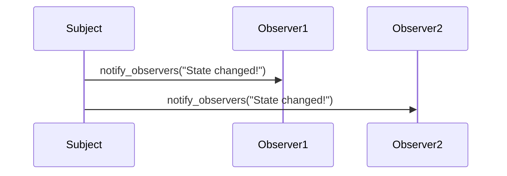

## 27.4 Common Interview Questions

Preparing for a technical interview can be a daunting task, especially when it comes to mastering Ruby design patterns and programming concepts. This section provides a comprehensive collection of common interview questions, ranging from basic to advanced difficulty, to help you prepare effectively. Each question is accompanied by sample answers or key points to cover, encouraging you to think critically and apply your knowledge.

### Basic Ruby Language Features

#### Question 1: What is Duck Typing in Ruby?

**Sample Answer:**

Duck Typing is a concept in Ruby where the type or class of an object is determined by its behavior (methods and properties) rather than its explicit class. This means that if an object responds to the methods you call on it, it can be used in place of another object with the same methods, regardless of their class hierarchy.

**Key Points:**

- Emphasize Ruby's dynamic nature.
- Explain that Duck Typing allows for more flexible and reusable code.
- Mention the phrase: "If it looks like a duck and quacks like a duck, it must be a duck."

#### Question 2: Explain the difference between a block, a proc, and a lambda in Ruby.

**Sample Answer:**

Blocks, procs, and lambdas are all ways to handle chunks of code in Ruby, but they have subtle differences:

- **Block:** A block is a piece of code that can be passed to a method. It is not an object and cannot be stored in a variable. Blocks are often used for iteration.
- **Proc:** A proc is an object that encapsulates a block of code, which can be stored in a variable and passed around. Procs are created using `Proc.new` or `proc`.
- **Lambda:** A lambda is similar to a proc but with stricter argument checking and different behavior for the `return` keyword. Lambdas are created using `lambda` or the `->` syntax.

**Key Points:**

- Blocks are not objects, while procs and lambdas are.
- Lambdas check the number of arguments, unlike procs.
- The `return` keyword behaves differently in lambdas and procs.

### Intermediate Ruby Concepts

#### Question 3: How does Ruby handle method overloading?

**Sample Answer:**

Ruby does not support method overloading in the traditional sense, as seen in languages like Java or C++. Instead, Ruby uses default arguments, variable-length arguments, and keyword arguments to achieve similar functionality.

**Key Points:**

- Explain the use of default arguments: `def method_name(arg1, arg2 = 'default')`.
- Discuss variable-length arguments using the splat operator: `def method_name(*args)`.
- Mention keyword arguments: `def method_name(arg1:, arg2:)`.

#### Question 4: What are modules in Ruby, and how do they differ from classes?

**Sample Answer:**

Modules in Ruby are collections of methods and constants that can be included in classes to share functionality. Unlike classes, modules cannot be instantiated or subclassed. They are used for namespacing and mixins.

**Key Points:**

- Modules provide a way to group related methods.
- They are used to add functionality to classes via mixins.
- Modules help avoid name clashes through namespacing.

### Advanced Ruby Design Patterns

#### Question 5: Describe the Singleton Pattern and its implementation in Ruby.

**Sample Answer:**

The Singleton Pattern ensures that a class has only one instance and provides a global point of access to it. In Ruby, this can be implemented using the `Singleton` module or by defining a class method that returns the same instance.

**Key Points:**

- Mention the `Singleton` module: `require 'singleton'`.
- Explain how to manually implement a singleton using a class variable.
- Discuss the use of `private` constructors to prevent instantiation.

**Code Example:**

```ruby
require 'singleton'

class SingletonExample
  include Singleton

  def greet
    "Hello, Singleton!"
  end
end

# Usage
instance = SingletonExample.instance
puts instance.greet
```

#### Question 6: How would you implement the Observer Pattern in Ruby?

**Sample Answer:**

The Observer Pattern involves an object, known as the subject, maintaining a list of dependents, called observers, and notifying them of any state changes. In Ruby, this can be implemented using the `Observable` module.

**Key Points:**

- Explain the roles of subject and observers.
- Mention the `Observable` module: `require 'observer'`.
- Discuss how observers register with the subject and receive updates.

**Code Example:**

```ruby
require 'observer'

class Subject
  include Observable

  def change_state
    changed
    notify_observers("State changed!")
  end
end

class Observer
  def update(message)
    puts "Received update: #{message}"
  end
end

# Usage
subject = Subject.new
observer = Observer.new

subject.add_observer(observer)
subject.change_state
```

### Ruby Best Practices

#### Question 7: What are some best practices for writing idiomatic Ruby code?

**Sample Answer:**

Writing idiomatic Ruby code involves following conventions and practices that make the code more readable and maintainable. Some best practices include:

- Use meaningful variable and method names.
- Prefer `each` over `for` loops.
- Use symbols instead of strings for hash keys.
- Follow the Ruby style guide for consistent formatting.
- Write tests to ensure code quality and reliability.

**Key Points:**

- Emphasize readability and maintainability.
- Mention the importance of following community conventions.
- Highlight the role of testing in maintaining code quality.

#### Question 8: How can you ensure thread safety in Ruby applications?

**Sample Answer:**

Ensuring thread safety in Ruby applications involves using synchronization mechanisms to prevent race conditions and data corruption. Some techniques include:

- Using `Mutex` to lock critical sections of code.
- Employing thread-safe data structures.
- Avoiding shared mutable state when possible.
- Using higher-level abstractions like `Queue` for thread-safe communication.

**Key Points:**

- Explain the concept of race conditions.
- Discuss the use of `Mutex` for synchronization.
- Highlight the importance of minimizing shared state.

### Ruby Performance Optimization

#### Question 9: What strategies can be used to optimize Ruby application performance?

**Sample Answer:**

Optimizing Ruby application performance involves identifying bottlenecks and applying various strategies to improve efficiency. Some strategies include:

- Profiling the application to identify slow parts.
- Using caching to reduce redundant computations.
- Optimizing database queries and using indexes.
- Leveraging concurrency with threads or processes.
- Writing efficient algorithms and data structures.

**Key Points:**

- Emphasize the importance of profiling.
- Discuss the role of caching in performance optimization.
- Highlight the benefits of efficient database interactions.

#### Question 10: How does Ruby's garbage collector work, and how can you optimize memory usage?

**Sample Answer:**

Ruby's garbage collector (GC) is responsible for automatically freeing up memory by reclaiming objects that are no longer in use. It uses a mark-and-sweep algorithm and, in recent versions, an incremental and generational approach.

**Key Points:**

- Explain the mark-and-sweep algorithm.
- Discuss the benefits of generational garbage collection.
- Mention techniques to reduce memory usage, such as avoiding memory leaks and using symbols.

### Try It Yourself

To deepen your understanding, try modifying the provided code examples. For instance, in the Observer Pattern example, add multiple observers and experiment with different messages. Observe how the pattern handles multiple notifications and consider how you might extend it to handle more complex scenarios.

### Visualizing Ruby Concepts

To better understand the flow of the Observer Pattern, consider the following sequence diagram:



This diagram illustrates how the subject notifies each observer of a state change, highlighting the communication flow in the pattern.

### Knowledge Check

- Explain how Ruby's dynamic typing affects the implementation of design patterns.
- Discuss the trade-offs of using the Singleton Pattern in a multi-threaded environment.
- Describe how you would refactor a large Ruby class to improve maintainability.

### Embrace the Journey

Remember, mastering Ruby design patterns and programming concepts is a journey. As you progress, you'll build more complex and efficient applications. Keep experimenting, stay curious, and enjoy the process!

## Quiz: Common Interview Questions



### What is Duck Typing in Ruby?

- [x] A concept where the type of an object is determined by its behavior.
- [ ] A method of type checking at compile time.
- [ ] A way to define multiple methods with the same name.
- [ ] A technique for optimizing code execution.

> **Explanation:** Duck Typing in Ruby allows objects to be used interchangeably if they respond to the same methods, focusing on behavior rather than class hierarchy.

### How does Ruby handle method overloading?

- [x] By using default, variable-length, and keyword arguments.
- [ ] By allowing multiple methods with the same name but different parameters.
- [ ] By using method aliases.
- [ ] By defining methods in modules.

> **Explanation:** Ruby does not support traditional method overloading but achieves similar functionality through flexible argument handling.

### What is the purpose of the Singleton Pattern?

- [x] To ensure a class has only one instance and provides a global point of access.
- [ ] To allow multiple instances of a class to share the same state.
- [ ] To encapsulate a group of related algorithms.
- [ ] To define a family of algorithms and make them interchangeable.

> **Explanation:** The Singleton Pattern restricts a class to a single instance, providing a global access point.

### What is the difference between a proc and a lambda in Ruby?

- [x] Lambdas check the number of arguments, while procs do not.
- [ ] Procs are objects, while lambdas are not.
- [ ] Lambdas can be stored in variables, but procs cannot.
- [ ] Procs have stricter argument checking than lambdas.

> **Explanation:** Lambdas enforce argument checking and have different behavior for the `return` keyword compared to procs.

### How can you ensure thread safety in Ruby applications?

- [x] By using `Mutex` to lock critical sections.
- [x] By avoiding shared mutable state.
- [ ] By using global variables for shared data.
- [ ] By using `eval` to dynamically execute code.

> **Explanation:** Thread safety is achieved by synchronizing access to shared resources and minimizing shared state.

### What are modules used for in Ruby?

- [x] To group related methods and constants.
- [x] To provide mixins for classes.
- [ ] To create instances of objects.
- [ ] To define private methods.

> **Explanation:** Modules are used for grouping methods and providing mixins, but they cannot be instantiated.

### How does Ruby's garbage collector work?

- [x] It uses a mark-and-sweep algorithm.
- [ ] It requires manual memory management.
- [ ] It uses reference counting.
- [ ] It does not support automatic memory management.

> **Explanation:** Ruby's garbage collector automatically reclaims memory using a mark-and-sweep algorithm.

### What is the Observer Pattern used for?

- [x] To allow objects to be notified of changes in another object.
- [ ] To encapsulate a group of related algorithms.
- [ ] To define a family of algorithms and make them interchangeable.
- [ ] To ensure a class has only one instance.

> **Explanation:** The Observer Pattern allows objects to subscribe to and receive updates from a subject.

### What is the purpose of using `require 'singleton'` in Ruby?

- [x] To include the Singleton module for implementing the Singleton Pattern.
- [ ] To load external libraries for network communication.
- [ ] To define private methods in a class.
- [ ] To create instances of objects dynamically.

> **Explanation:** The `require 'singleton'` statement includes the Singleton module, which provides a simple way to implement the Singleton Pattern in Ruby.

### True or False: Ruby supports traditional method overloading.

- [ ] True
- [x] False

> **Explanation:** Ruby does not support traditional method overloading; instead, it uses flexible argument handling to achieve similar functionality.



By exploring these questions and answers, you'll be better prepared for technical interviews and have a deeper understanding of Ruby's design patterns and programming concepts. Keep practicing and refining your skills to excel in your career as a Ruby developer.
