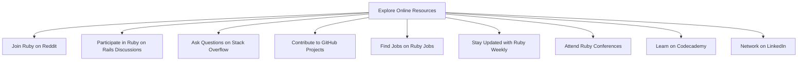

## 27.5 Online Resources and Communities

In the ever-evolving world of software development, staying connected with the community and accessing the right resources is crucial for growth and success. This section provides a comprehensive guide to the best online resources and communities for Ruby developers. Whether you're looking to enhance your skills, network with other professionals, or stay updated with the latest trends, these platforms offer invaluable support and opportunities.

### 1. **Engage with Ruby Communities**

#### 1.1 Ruby on Reddit

- **Link**: [Ruby on Reddit](https://www.reddit.com/r/ruby/)
- **Description**: Reddit's Ruby community is a vibrant space where developers share news, tutorials, and discussions about Ruby programming. It's a great place to ask questions, share your projects, and learn from others.

#### 1.2 Ruby on Rails Discussions

- **Link**: [Ruby on Rails Discussions](https://discuss.rubyonrails.org/)
- **Description**: This forum is dedicated to discussions around Ruby on Rails. Whether you're a beginner or an experienced developer, you can find threads on a wide range of topics, from troubleshooting to best practices.

#### 1.3 Stack Overflow Ruby Tag

- **Link**: [Stack Overflow Ruby Tag](https://stackoverflow.com/questions/tagged/ruby)
- **Description**: Stack Overflow is a go-to platform for developers seeking answers to technical questions. The Ruby tag aggregates a wealth of knowledge, with solutions to common problems and expert advice.

### 2. **Contribute to Open-Source Projects**

#### 2.1 GitHub

- **Link**: [GitHub](https://github.com/)
- **Description**: GitHub is the largest platform for hosting open-source projects. By contributing to Ruby projects, you can improve your coding skills, collaborate with other developers, and enhance your portfolio.

#### 2.2 RubyGems

- **Link**: [RubyGems](https://rubygems.org/)
- **Description**: RubyGems is the package manager for Ruby. It hosts thousands of gems (libraries) that you can contribute to. Engaging with RubyGems helps you understand the ecosystem and contribute to its growth.

### 3. **Job Hunting and Networking**

#### 3.1 LinkedIn

- **Link**: [LinkedIn](https://www.linkedin.com/)
- **Description**: LinkedIn is a professional networking platform where you can connect with other Ruby developers, follow companies, and find job opportunities. Joining Ruby-related groups can also provide insights and networking opportunities.

#### 3.2 Ruby Jobs

- **Link**: [Ruby Jobs](https://jobs.rubynow.com/)
- **Description**: Ruby Jobs is a dedicated job board for Ruby developers. It lists opportunities from around the world, making it easier to find roles that match your skills and interests.

### 4. **Stay Updated with Ruby News**

#### 4.1 Ruby Weekly

- **Link**: [Ruby Weekly](https://rubyweekly.com/)
- **Description**: Ruby Weekly is a newsletter that curates the latest news, articles, and tutorials about Ruby. Subscribing to it ensures you stay informed about the latest developments in the Ruby community.

#### 4.2 RubyFlow

- **Link**: [RubyFlow](http://www.rubyflow.com/)
- **Description**: RubyFlow is a community-driven blog where developers share news, tips, and resources. It's a great way to discover new tools and techniques.

### 5. **Participate in Ruby Conferences and Meetups**

#### 5.1 RubyConf

- **Link**: [RubyConf](https://rubyconf.org/)
- **Description**: RubyConf is one of the largest Ruby conferences, offering talks, workshops, and networking opportunities. Attending such events can provide insights into the latest trends and connect you with industry leaders.

#### 5.2 Local Ruby Meetups

- **Link**: [Meetup](https://www.meetup.com/)
- **Description**: Meetup.com hosts numerous local Ruby meetups where developers gather to share knowledge and network. Joining a local group can help you build connections and learn from peers.

### 6. **Online Learning Platforms**

#### 6.1 Codecademy

- **Link**: [Codecademy Ruby Course](https://www.codecademy.com/learn/learn-ruby)
- **Description**: Codecademy offers interactive Ruby courses that cater to beginners and experienced developers alike. It's a great way to learn Ruby at your own pace.

#### 6.2 Coursera

- **Link**: [Coursera Ruby Courses](https://www.coursera.org/courses?query=ruby)
- **Description**: Coursera provides a range of Ruby courses from top universities and institutions. These courses cover various aspects of Ruby programming, from basics to advanced topics.

### 7. **Benefits of Participating in Communities**

- **Networking**: Engaging with communities helps you build a network of like-minded professionals, which can lead to job opportunities and collaborations.
- **Learning**: Communities are a great source of knowledge, offering tutorials, code reviews, and discussions that can enhance your skills.
- **Support**: When you encounter challenges, community members can provide support and guidance, helping you overcome obstacles.
- **Contribution**: By contributing to discussions and projects, you can give back to the community and establish yourself as a knowledgeable developer.

### 8. **Visualizing Ruby Community Engagement**

### 9. **Try It Yourself: Engage with the Community**

- **Join a Discussion**: Visit [Ruby on Reddit](https://www.reddit.com/r/ruby/) and participate in a discussion. Share your thoughts or ask a question.
- **Contribute to a Project**: Find a Ruby project on [GitHub](https://github.com/) and contribute by fixing a bug or adding a feature.
- **Attend a Meetup**: Search for a local Ruby meetup on [Meetup](https://www.meetup.com/) and attend to network with other developers.

### 10. **Knowledge Check**

- **Question**: What are the benefits of contributing to open-source projects on GitHub?
- **Exercise**: Create a LinkedIn profile and join a Ruby-related group. Share an article or start a discussion.

### 11. **Embrace the Journey**

Remember, engaging with the Ruby community is just the beginning. As you participate, you'll gain insights, build relationships, and enhance your skills. Keep exploring, stay curious, and enjoy the journey!

## Quiz: Online Resources and Communities



### Which platform is best for asking technical questions about Ruby?

- [ ] LinkedIn
- [x] Stack Overflow
- [ ] Ruby Weekly
- [ ] GitHub

> **Explanation:** Stack Overflow is a popular platform for asking and answering technical questions, including those related to Ruby.

### What is the primary benefit of contributing to open-source projects on GitHub?

- [x] Improving coding skills
- [ ] Earning money
- [ ] Gaining followers
- [ ] Accessing private repositories

> **Explanation:** Contributing to open-source projects helps improve coding skills through collaboration and exposure to different coding practices.

### Which resource is a newsletter that curates the latest Ruby news?

- [ ] RubyFlow
- [x] Ruby Weekly
- [ ] Ruby on Reddit
- [ ] Ruby Jobs

> **Explanation:** Ruby Weekly is a newsletter that provides curated news, articles, and tutorials about Ruby.

### Where can you find job opportunities specifically for Ruby developers?

- [ ] Codecademy
- [ ] RubyFlow
- [x] Ruby Jobs
- [ ] RubyConf

> **Explanation:** Ruby Jobs is a dedicated job board for Ruby developers, listing opportunities from around the world.

### Which platform is known for professional networking and job hunting?

- [x] LinkedIn
- [ ] Reddit
- [ ] GitHub
- [ ] Stack Overflow

> **Explanation:** LinkedIn is a professional networking platform where you can connect with other professionals and find job opportunities.

### What is the main focus of Ruby on Rails Discussions?

- [ ] Job listings
- [x] Discussions around Ruby on Rails
- [ ] Online courses
- [ ] News articles

> **Explanation:** Ruby on Rails Discussions is a forum dedicated to discussions around Ruby on Rails, covering a wide range of topics.

### Which platform hosts local meetups for Ruby developers?

- [ ] Ruby Weekly
- [ ] GitHub
- [x] Meetup
- [ ] Stack Overflow

> **Explanation:** Meetup.com hosts numerous local Ruby meetups where developers can gather to share knowledge and network.

### What is the primary purpose of RubyGems?

- [ ] Job hunting
- [ ] Networking
- [x] Hosting Ruby libraries
- [ ] News curation

> **Explanation:** RubyGems is the package manager for Ruby, hosting thousands of gems (libraries) that developers can use and contribute to.

### Which platform offers interactive Ruby courses?

- [x] Codecademy
- [ ] RubyFlow
- [ ] LinkedIn
- [ ] RubyConf

> **Explanation:** Codecademy offers interactive Ruby courses that cater to both beginners and experienced developers.

### True or False: Participating in Ruby communities can lead to job opportunities.

- [x] True
- [ ] False

> **Explanation:** Engaging with Ruby communities helps build a network of professionals, which can lead to job opportunities and collaborations.


