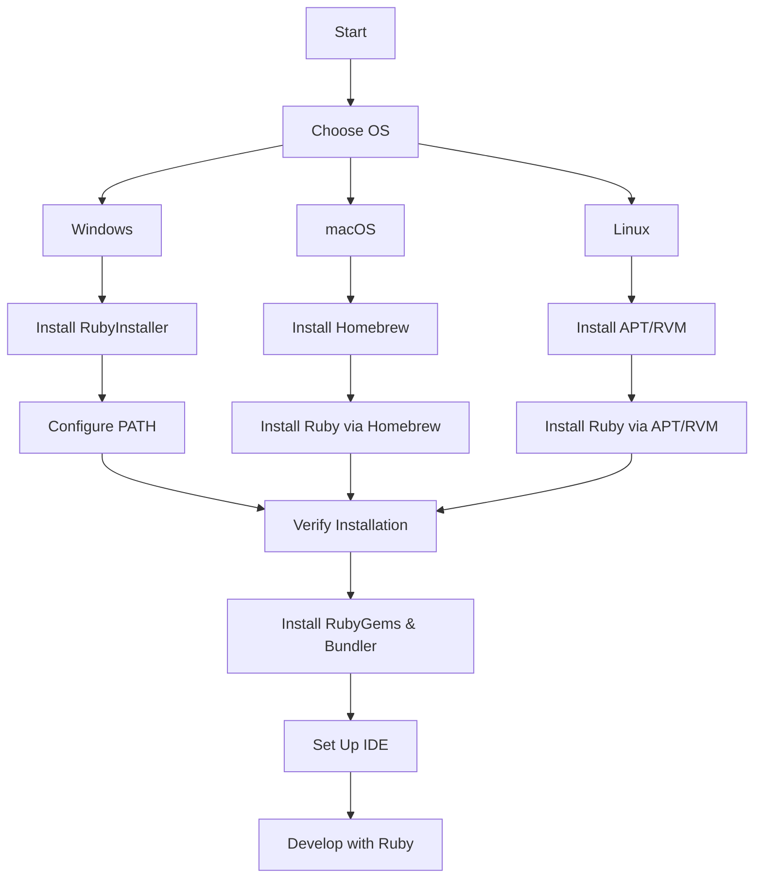

## 27.7 Installing and Configuring Ruby Environments

In this section, we will explore the process of installing and configuring Ruby environments across different operating systems. Whether you're using Windows, macOS, or Linux, this guide will provide you with the necessary steps to get Ruby up and running. Additionally, we will delve into the use of version managers like RVM and rbenv, and guide you through setting up development environments in popular IDEs and text editors. Let's embark on this journey to create a robust Ruby development setup!

### Installing Ruby on Windows

Installing Ruby on Windows can be straightforward with the right tools. The most common method is using the RubyInstaller, which provides a simple installation process.

#### Step-by-Step Installation with RubyInstaller

1. **Download RubyInstaller**: Visit the [RubyInstaller website](https://rubyinstaller.org/) and download the latest version of RubyInstaller for Windows.

2. **Run the Installer**: Double-click the downloaded installer file to start the installation process. Follow the on-screen instructions.

3. **Select Components**: During installation, ensure that you select the option to add Ruby to your PATH. This will allow you to run Ruby from the command line.

4. **Install MSYS2**: RubyInstaller will prompt you to install MSYS2, a development environment that provides essential tools for building native C/C++ extensions. Follow the instructions to complete the installation.

5. **Verify Installation**: Open a command prompt and type `ruby -v` to verify that Ruby is installed correctly. You should see the version number displayed.

#### Troubleshooting Tips for Windows

- **PATH Issues**: If you encounter issues with Ruby not being recognized, ensure that the PATH environment variable includes the Ruby bin directory.
- **MSYS2 Installation**: If MSYS2 installation fails, try running the installer again with administrative privileges.

### Installing Ruby on macOS

macOS users have several options for installing Ruby, including using the system Ruby, Homebrew, or version managers like rbenv.

#### Using Homebrew

1. **Install Homebrew**: If you haven't already, install Homebrew by running the following command in your terminal:

   ```bash
   /bin/bash -c "$(curl -fsSL https://raw.githubusercontent.com/Homebrew/install/HEAD/install.sh)"
   ```

2. **Install Ruby**: Use Homebrew to install Ruby with the following command:

   ```bash
   brew install ruby
   ```

3. **Verify Installation**: Check the installed version by running:

   ```bash
   ruby -v
   ```

#### Using rbenv

1. **Install rbenv**: First, install rbenv using Homebrew:

   ```bash
   brew install rbenv
   ```

2. **Initialize rbenv**: Add rbenv to your shell to enable shims and autocompletion:

   ```bash
   echo 'eval "$(rbenv init -)"' >> ~/.zshrc
   source ~/.zshrc
   ```

3. **Install Ruby**: Use rbenv to install a specific version of Ruby:

   ```bash
   rbenv install 3.1.0
   rbenv global 3.1.0
   ```

4. **Verify Installation**: Confirm the installation with:

   ```bash
   ruby -v
   ```

#### Troubleshooting Tips for macOS

- **Shell Configuration**: Ensure that your shell configuration file (e.g., `.zshrc` or `.bash_profile`) is correctly set up to initialize rbenv.
- **Homebrew Issues**: If Homebrew commands fail, ensure that your Xcode Command Line Tools are up to date.

### Installing Ruby on Linux

Linux users can install Ruby using package managers or version managers like RVM and rbenv.

#### Using APT (Debian/Ubuntu)

1. **Update Package List**: Update your package list to ensure you have the latest information:

   ```bash
   sudo apt update
   ```

2. **Install Ruby**: Install Ruby using the following command:

   ```bash
   sudo apt install ruby-full
   ```

3. **Verify Installation**: Check the installed version:

   ```bash
   ruby -v
   ```

#### Using RVM

1. **Install GPG Keys**: Import the RVM GPG keys:

   ```bash
   gpg --keyserver hkp://pool.sks-keyservers.net --recv-keys 409B6B1796C275462A1703113804BB82D39DC0E3
   ```

2. **Install RVM**: Use the following command to install RVM:

   ```bash
   \curl -sSL https://get.rvm.io | bash -s stable
   ```

3. **Load RVM**: Source RVM scripts to load it into your shell:

   ```bash
   source ~/.rvm/scripts/rvm
   ```

4. **Install Ruby**: Use RVM to install Ruby:

   ```bash
   rvm install 3.1.0
   rvm use 3.1.0 --default
   ```

5. **Verify Installation**: Confirm the installation:

   ```bash
   ruby -v
   ```

#### Troubleshooting Tips for Linux

- **Permissions**: If you encounter permission issues, ensure you have the necessary privileges or use `sudo` where appropriate.
- **Dependencies**: RVM may require additional dependencies. Follow any prompts to install them.

### Using Version Managers: RVM and rbenv

Version managers like RVM and rbenv are invaluable tools for managing multiple Ruby versions on a single machine. They allow you to switch between different Ruby versions seamlessly.

#### RVM (Ruby Version Manager)

- **Installation**: As described in the Linux section, RVM can be installed via a simple script. It provides a comprehensive environment for managing Ruby versions and gemsets.
- **Gemsets**: RVM allows you to create isolated gem environments, known as gemsets, which can be useful for managing dependencies across different projects.

#### rbenv

- **Lightweight**: rbenv is a lightweight version manager that focuses on simplicity. It doesn't include gemsets, but it integrates well with Bundler for dependency management.
- **Plugins**: rbenv supports plugins, such as `ruby-build`, which simplifies the installation of new Ruby versions.

### Installing RubyGems and Bundler

RubyGems is the package manager for Ruby, and Bundler is a tool for managing gem dependencies in your projects.

#### Installing RubyGems

RubyGems is typically included with Ruby installations. To verify, run:

```bash
gem -v
```

#### Installing Bundler

1. **Install Bundler**: Use RubyGems to install Bundler:

   ```bash
   gem install bundler
   ```

2. **Verify Installation**: Check the installed version:

   ```bash
   bundler -v
   ```

### Setting Up Development Environments

Choosing the right IDE or text editor can significantly enhance your Ruby development experience. Let's explore some popular options.

#### Visual Studio Code

1. **Install Visual Studio Code**: Download and install [Visual Studio Code](https://code.visualstudio.com/).

2. **Install Ruby Extensions**: Open the Extensions view (`Ctrl+Shift+X`) and search for Ruby extensions. Install the "Ruby" extension by Peng Lv for syntax highlighting and code navigation.

3. **Configure Debugging**: Install the "Ruby" extension by Koichi Sakata for debugging support.

#### RubyMine

1. **Install RubyMine**: Download and install [RubyMine](https://www.jetbrains.com/ruby/), a powerful IDE specifically designed for Ruby and Rails development.

2. **Configure Ruby SDK**: Open RubyMine and configure the Ruby SDK by navigating to `File > Project Structure > SDKs`.

3. **Install Gems**: Use RubyMine's integrated terminal to install necessary gems for your project.

#### Sublime Text

1. **Install Sublime Text**: Download and install [Sublime Text](https://www.sublimetext.com/).

2. **Install Package Control**: Use Package Control to install Ruby-related packages for syntax highlighting and linting.

3. **Configure Build System**: Set up a custom build system for running Ruby scripts directly from Sublime Text.

### Troubleshooting Common Installation Issues

- **Version Conflicts**: Ensure that the correct Ruby version is being used by checking with `ruby -v`.
- **PATH Issues**: Verify that the Ruby bin directory is included in your PATH environment variable.
- **Dependency Errors**: Install any missing dependencies as prompted during installation.

### Try It Yourself

Experiment with different Ruby versions and environments. Try installing a new version of Ruby using rbenv or RVM, and switch between versions to see how it affects your projects. Modify the PATH variable to understand its impact on Ruby execution.

### Visualizing Ruby Environment Setup



*Figure 1: Flowchart of Ruby Environment Setup Process*

### Summary

In this section, we covered the installation and configuration of Ruby environments across Windows, macOS, and Linux. We explored the use of version managers like RVM and rbenv, and discussed setting up development environments in popular IDEs. Remember, setting up your Ruby environment is the first step towards building scalable and maintainable applications. Keep experimenting and refining your setup to suit your development needs.

## Quiz: Installing and Configuring Ruby Environments



### Which tool is commonly used to install Ruby on Windows?

- [x] RubyInstaller
- [ ] Homebrew
- [ ] APT
- [ ] rbenv

> **Explanation:** RubyInstaller is the recommended tool for installing Ruby on Windows.

### What is the purpose of adding Ruby to the PATH during installation?

- [x] To allow running Ruby from the command line
- [ ] To enable GUI applications
- [ ] To install additional software
- [ ] To configure network settings

> **Explanation:** Adding Ruby to the PATH allows you to execute Ruby commands from the command line.

### Which command is used to install Ruby using Homebrew on macOS?

- [x] brew install ruby
- [ ] apt install ruby
- [ ] gem install ruby
- [ ] rvm install ruby

> **Explanation:** Homebrew uses the command `brew install ruby` to install Ruby on macOS.

### What is the primary function of rbenv?

- [x] To manage multiple Ruby versions
- [ ] To compile Ruby source code
- [ ] To provide a GUI for Ruby development
- [ ] To install Ruby on Windows

> **Explanation:** rbenv is a version manager that allows you to manage multiple Ruby versions on your system.

### Which file should be modified to initialize rbenv in your shell?

- [x] .zshrc
- [ ] .bash_history
- [ ] .profile
- [ ] .gitconfig

> **Explanation:** The `.zshrc` file is commonly used to initialize rbenv in your shell.

### How do you verify the installation of RubyGems?

- [x] gem -v
- [ ] ruby -v
- [ ] bundler -v
- [ ] rbenv -v

> **Explanation:** The command `gem -v` checks the installed version of RubyGems.

### Which IDE is specifically designed for Ruby development?

- [x] RubyMine
- [ ] Visual Studio Code
- [ ] Sublime Text
- [ ] Atom

> **Explanation:** RubyMine is an IDE specifically designed for Ruby and Rails development.

### What is the command to install Bundler using RubyGems?

- [x] gem install bundler
- [ ] brew install bundler
- [ ] apt install bundler
- [ ] rvm install bundler

> **Explanation:** Bundler is installed using the command `gem install bundler`.

### Which version manager supports gemsets?

- [x] RVM
- [ ] rbenv
- [ ] Homebrew
- [ ] APT

> **Explanation:** RVM supports the creation of gemsets for managing dependencies.

### True or False: RubyGems is included with most Ruby installations.

- [x] True
- [ ] False

> **Explanation:** RubyGems is typically included with Ruby installations, allowing for easy management of Ruby packages.



Remember, this is just the beginning. As you progress, you'll build more complex and interactive Ruby applications. Keep experimenting, stay curious, and enjoy the journey!
