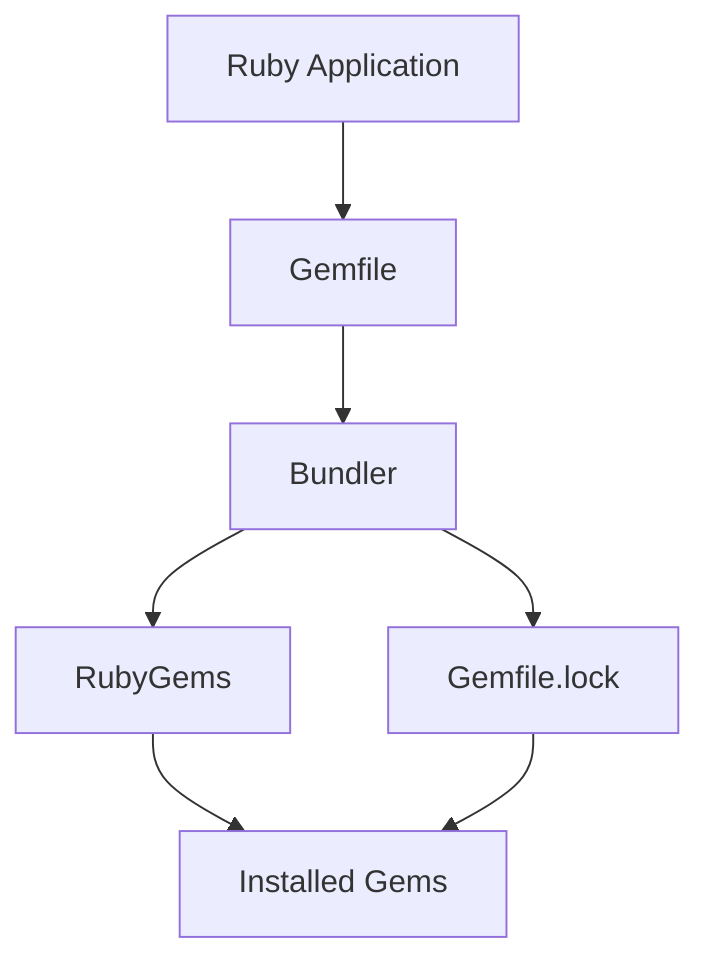

## 27.8 RubyGems and Bundler Commands Reference

In the world of Ruby development, managing dependencies efficiently is crucial for building scalable and maintainable applications. RubyGems and Bundler are the primary tools for this task, providing a robust ecosystem for managing libraries and dependencies. This section serves as a comprehensive reference guide to the essential commands and concepts you need to master RubyGems and Bundler.

### Understanding RubyGems

RubyGems is the package manager for Ruby, allowing developers to distribute and install Ruby programs and libraries. It provides a standard format for distributing Ruby programs and libraries, a tool for managing the installation of gem packages, and a server for distributing them.

#### Key RubyGems Commands

Let's explore some of the most commonly used RubyGems commands:

- **`gem install`**: Install a gem from the RubyGems repository.
  ```bash
  gem install <gem_name>
  ```
  This command downloads and installs the specified gem and its dependencies.

- **`gem list`**: List all installed gems.
  ```bash
  gem list
  ```
  Use this command to view all gems currently installed on your system.

- **`gem update`**: Update installed gems to the latest version.
  ```bash
  gem update <gem_name>
  ```
  This command updates the specified gem to its latest version.

- **`gem uninstall`**: Uninstall a gem.
  ```bash
  gem uninstall <gem_name>
  ```
  Use this command to remove a gem from your system.

- **`gem search`**: Search for a gem in the RubyGems repository.
  ```bash
  gem search <gem_name>
  ```
  This command searches for gems matching the specified name.

- **`gem environment`**: Display information about the RubyGems environment.
  ```bash
  gem environment
  ```
  Use this command to view details about your RubyGems setup, including paths and configuration.

- **`gem dependency`**: Show dependencies of an installed gem.
  ```bash
  gem dependency <gem_name>
  ```
  This command lists the dependencies of the specified gem.

### Introduction to Bundler

Bundler is a tool that manages gem dependencies for Ruby applications. It ensures that the right versions of gems are used in your application by maintaining a consistent environment across machines.

#### Key Bundler Commands

Here are some essential Bundler commands you should know:

- **`bundle install`**: Install the gems specified in the `Gemfile`.
  ```bash
  bundle install
  ```
  This command reads the `Gemfile` and installs the necessary gems.

- **`bundle update`**: Update gems to the latest versions as specified in the `Gemfile`.
  ```bash
  bundle update <gem_name>
  ```
  Use this command to update specific gems or all gems in your project.

- **`bundle exec`**: Execute a command in the context of the bundle.
  ```bash
  bundle exec <command>
  ```
  This command runs the specified command using the gems specified in the `Gemfile`.

- **`bundle add`**: Add a gem to the `Gemfile`.
  ```bash
  bundle add <gem_name>
  ```
  This command adds the specified gem to your `Gemfile` and installs it.

- **`bundle remove`**: Remove a gem from the `Gemfile`.
  ```bash
  bundle remove <gem_name>
  ```
  Use this command to remove a gem from your `Gemfile`.

- **`bundle show`**: Show the location of a gem in the bundle.
  ```bash
  bundle show <gem_name>
  ```
  This command displays the path to the specified gem.

- **`bundle outdated`**: List gems that have newer versions available.
  ```bash
  bundle outdated
  ```
  Use this command to see which gems can be updated.

### The Role of Gemfile and Gemfile.lock

The `Gemfile` and `Gemfile.lock` are crucial components in managing dependencies with Bundler.

#### Gemfile

The `Gemfile` is a manifest for your project's gem dependencies. It specifies which gems your project needs and can include version constraints to ensure compatibility.

Example `Gemfile`:
```ruby
source 'https://rubygems.org'

gem 'rails', '~> 6.1.0'
gem 'pg', '~> 1.2'
gem 'puma', '~> 5.0'
```

#### Gemfile.lock

The `Gemfile.lock` file is automatically generated by Bundler. It records the exact versions of gems installed, ensuring that the same versions are used across different environments.

### Solving Dependency Conflicts

Dependency conflicts can arise when different gems require incompatible versions of the same dependency. Here are some tips to resolve these conflicts:

- **Use Version Constraints**: Specify version constraints in your `Gemfile` to avoid incompatible gem versions.
- **Run `bundle update` Carefully**: Update only specific gems to prevent unnecessary updates that might introduce conflicts.
- **Check `Gemfile.lock`**: Review the `Gemfile.lock` to understand the current state of your dependencies.
- **Use `bundle exec`**: Always use `bundle exec` to run commands within the context of your bundle, ensuring the correct versions are used.

### Logical Arrangement of Commands

For ease of reference, let's categorize the commands by task:

#### Installation and Management

- `gem install <gem_name>`
- `gem uninstall <gem_name>`
- `bundle install`
- `bundle add <gem_name>`
- `bundle remove <gem_name>`

#### Updating and Maintenance

- `gem update <gem_name>`
- `bundle update <gem_name>`
- `bundle outdated`

#### Information and Environment

- `gem list`
- `gem search <gem_name>`
- `gem environment`
- `gem dependency <gem_name>`
- `bundle show <gem_name>`

#### Execution and Context

- `bundle exec <command>`

### Try It Yourself

Experiment with these commands by creating a simple Ruby project. Start by initializing a `Gemfile`, adding some gems, and using Bundler to manage them. Try updating and removing gems to see how the `Gemfile.lock` changes.

### Visualizing Dependency Management

Below is a simple diagram illustrating how RubyGems and Bundler interact with your Ruby application:



**Diagram Description**: This flowchart shows the relationship between a Ruby application, its `Gemfile`, Bundler, `Gemfile.lock`, RubyGems, and the installed gems.

### References and Links

For more information on RubyGems and Bundler, consider visiting the following resources:

- [RubyGems Guides](https://guides.rubygems.org/)
- [Bundler Documentation](https://bundler.io/docs.html)

### Knowledge Check

- What is the purpose of the `Gemfile.lock`?
- How does `bundle exec` ensure the correct environment for running commands?
- What command would you use to see all installed gems on your system?

### Embrace the Journey

Remember, mastering RubyGems and Bundler is a journey. As you progress, you'll find managing dependencies becomes second nature. Keep experimenting, stay curious, and enjoy the process!

## Quiz: RubyGems and Bundler Commands Reference



### What command is used to install a gem from the RubyGems repository?

- [x] gem install
- [ ] gem add
- [ ] gem fetch
- [ ] gem get

> **Explanation:** The `gem install` command is used to install a gem from the RubyGems repository.

### Which file records the exact versions of gems installed in a project?

- [ ] Gemfile
- [x] Gemfile.lock
- [ ] Gemfile.json
- [ ] Gemfile.txt

> **Explanation:** The `Gemfile.lock` file records the exact versions of gems installed, ensuring consistency across environments.

### What command would you use to execute a command in the context of the bundle?

- [ ] bundle run
- [x] bundle exec
- [ ] bundle start
- [ ] bundle execute

> **Explanation:** The `bundle exec` command is used to execute a command in the context of the bundle, ensuring the correct gem versions are used.

### How can you add a gem to your Gemfile using Bundler?

- [x] bundle add
- [ ] bundle install
- [ ] bundle include
- [ ] bundle insert

> **Explanation:** The `bundle add` command is used to add a gem to your `Gemfile` and install it.

### Which command lists all installed gems on your system?

- [x] gem list
- [ ] gem show
- [ ] gem display
- [ ] gem view

> **Explanation:** The `gem list` command lists all installed gems on your system.

### What is the purpose of the `bundle update` command?

- [x] To update gems to the latest versions as specified in the Gemfile
- [ ] To remove outdated gems
- [ ] To install new gems
- [ ] To execute commands in the bundle context

> **Explanation:** The `bundle update` command updates gems to the latest versions as specified in the `Gemfile`.

### How do you remove a gem from your Gemfile using Bundler?

- [x] bundle remove
- [ ] bundle delete
- [ ] bundle uninstall
- [ ] bundle erase

> **Explanation:** The `bundle remove` command is used to remove a gem from your `Gemfile`.

### What command would you use to search for a gem in the RubyGems repository?

- [x] gem search
- [ ] gem find
- [ ] gem lookup
- [ ] gem query

> **Explanation:** The `gem search` command is used to search for a gem in the RubyGems repository.

### True or False: The `Gemfile` specifies which gems your project needs.

- [x] True
- [ ] False

> **Explanation:** True. The `Gemfile` specifies which gems your project needs and can include version constraints.

### What command shows the location of a gem in the bundle?

- [x] bundle show
- [ ] bundle locate
- [ ] bundle path
- [ ] bundle find

> **Explanation:** The `bundle show` command shows the location of a gem in the bundle.



By mastering these commands and understanding the role of the `Gemfile` and `Gemfile.lock`, you'll be well-equipped to manage your Ruby project's dependencies efficiently. Keep this reference handy as you continue your journey in Ruby development!
