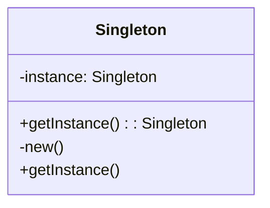

## 27.9 Code Snippets and Examples Repository

Welcome to the Code Snippets and Examples Repository section of **The Ultimate Guide to Ruby Design Patterns: Build Scalable and Maintainable Applications**. This repository is a treasure trove of practical code examples that accompany the concepts discussed throughout the guide. By engaging with these examples, you can deepen your understanding of Ruby design patterns and enhance your ability to build robust applications.

### Accessing the Repository

The code snippets and examples are hosted on GitHub, a widely-used platform for version control and collaboration. You can access the repository by following this link: [Ruby Design Patterns Repository](https://github.com/SoftwarePatternsLexicon/RubyDesignPatterns).

### Repository Organization

The repository is meticulously organized to facilitate easy navigation and exploration. Each chapter and section of the guide corresponds to a dedicated folder within the repository. This structure allows you to quickly locate the code examples relevant to specific topics covered in the guide.

#### Folder Structure

- **Chapter 1: Introduction to Design Patterns in Ruby**
  - `1.1_What_Are_Design_Patterns`
  - `1.2_History_and_Evolution`
  - ...

- **Chapter 2: Core Principles of Ruby Programming**
  - `2.1_Everything_Is_an_Object`
  - `2.2_Dynamic_Typing_and_Duck_Typing`
  - ...

- **Chapter 3: Ruby Language Features and Best Practices**
  - `3.1_Ruby_Syntax_and_Semantics`
  - `3.2_Working_with_Collections`
  - ...

- **Chapter 4: Creational Design Patterns in Ruby**
  - `4.1_Singleton_Pattern`
  - `4.2_Factory_Method_Pattern`
  - ...

Each folder contains Ruby files (`.rb`) with code examples that demonstrate the concepts discussed in the corresponding section of the guide. The files are named descriptively to reflect the specific pattern or concept they illustrate.

### Cloning or Downloading the Repository

To experiment with the code examples, you can clone or download the repository to your local machine. Follow these steps to get started:

#### Cloning the Repository

1. **Install Git**: Ensure that Git is installed on your system. You can download it from [git-scm.com](https://git-scm.com/).

2. **Clone the Repository**: Open your terminal or command prompt and run the following command:

   ```bash
   git clone https://github.com/SoftwarePatternsLexicon/RubyDesignPatterns.git
   ```

3. **Navigate to the Repository**: Change into the directory of the cloned repository:

   ```bash
   cd RubyDesignPatterns
   ```

#### Downloading the Repository

1. **Visit the Repository Page**: Go to the [Ruby Design Patterns Repository](https://github.com/SoftwarePatternsLexicon/RubyDesignPatterns).

2. **Download as ZIP**: Click on the "Code" button and select "Download ZIP".

3. **Extract the ZIP File**: Once downloaded, extract the contents to a directory of your choice.

### Requirements for Running the Code

To run the code examples, ensure that you have the following requirements set up on your system:

- **Ruby Version**: The examples are compatible with Ruby 2.7 and above. You can check your Ruby version by running `ruby -v` in your terminal. If you need to install or update Ruby, visit [ruby-lang.org](https://www.ruby-lang.org/en/downloads/).

- **Gems**: Some examples may require additional Ruby gems. Each folder contains a `Gemfile` listing the necessary gems. You can install them using Bundler:

  ```bash
  bundle install
  ```

### Contributing and Reporting Issues

We encourage you to contribute to the repository by submitting your own examples, improvements, or fixes. Contributions help enhance the learning experience for everyone. To contribute:

1. **Fork the Repository**: Click on the "Fork" button on the repository page to create your own copy.

2. **Make Changes**: Clone your forked repository, make your changes, and commit them.

3. **Submit a Pull Request**: Go to the original repository and submit a pull request with a description of your changes.

If you encounter any issues or have suggestions for improvement, please report them by opening an issue on the repository. Your feedback is invaluable in maintaining the quality and relevance of the examples.

### Documentation and Maintenance

The code in the repository is well-documented to ensure clarity and ease of understanding. Each example includes comments explaining the purpose and functionality of the code. We are committed to maintaining the repository, regularly updating it with new examples and improvements.

### Try It Yourself

We encourage you to experiment with the code examples. Here are some suggestions to get you started:

- **Modify Existing Code**: Change variable values, alter logic, or add new features to see how the code behaves.

- **Create New Examples**: Use the patterns and concepts you've learned to build your own examples.

- **Explore Different Patterns**: Compare and contrast different design patterns by implementing the same functionality using various patterns.

### Visualizing Code Examples

To aid your understanding, we have included diagrams created with Mermaid.js to visually represent complex concepts. These diagrams are embedded within the code comments and documentation to provide a clear picture of the code's structure and flow.

#### Example Diagram: Singleton Pattern



**Description**: This diagram illustrates the Singleton pattern, where a class has a single instance that is accessed through a static method.

### Knowledge Check

To reinforce your learning, we have included exercises and practice problems at the end of each section in the repository. These challenges are designed to test your understanding and encourage you to apply what you've learned.

### Embrace the Journey

Remember, this repository is a starting point for your exploration of Ruby design patterns. As you delve into the examples, keep experimenting, stay curious, and enjoy the journey of learning and mastering Ruby design patterns.

## Quiz: Code Snippets and Examples Repository



### What is the primary purpose of the Code Snippets and Examples Repository?

- [x] To provide practical code examples for learning Ruby design patterns
- [ ] To store all Ruby gems
- [ ] To host Ruby documentation
- [ ] To manage Ruby version control

> **Explanation:** The repository is designed to offer practical code examples that complement the guide, helping readers learn Ruby design patterns.

### How is the repository organized?

- [x] By chapters and sections corresponding to the guide
- [ ] Alphabetically by file name
- [ ] By date of creation
- [ ] By file size

> **Explanation:** The repository is organized into folders that correspond to the chapters and sections of the guide, making it easy to find relevant examples.

### What command is used to clone the repository?

- [x] `git clone https://github.com/SoftwarePatternsLexicon/RubyDesignPatterns.git`
- [ ] `git download https://github.com/SoftwarePatternsLexicon/RubyDesignPatterns.git`
- [ ] `git fetch https://github.com/SoftwarePatternsLexicon/RubyDesignPatterns.git`
- [ ] `git pull https://github.com/SoftwarePatternsLexicon/RubyDesignPatterns.git`

> **Explanation:** The `git clone` command is used to copy the repository to your local machine.

### What Ruby version is required to run the examples?

- [x] Ruby 2.7 and above
- [ ] Ruby 1.9
- [ ] Ruby 2.0
- [ ] Ruby 3.5

> **Explanation:** The examples are compatible with Ruby 2.7 and above.

### How can you contribute to the repository?

- [x] By forking the repository and submitting a pull request
- [ ] By emailing the repository owner
- [ ] By downloading and modifying the repository
- [ ] By creating a new repository

> **Explanation:** To contribute, you fork the repository, make changes, and submit a pull request.

### What tool is used to install necessary gems?

- [x] Bundler
- [ ] Rake
- [ ] Gemfile
- [ ] RubyGems

> **Explanation:** Bundler is used to install the necessary gems listed in the `Gemfile`.

### What is the purpose of the `Gemfile` in each folder?

- [x] To list the necessary gems for running the examples
- [ ] To store Ruby version information
- [ ] To document code examples
- [ ] To manage Git configurations

> **Explanation:** The `Gemfile` lists the necessary gems required to run the code examples.

### What is encouraged to enhance the learning experience?

- [x] Experimenting with the code examples
- [ ] Memorizing the code examples
- [ ] Ignoring the code examples
- [ ] Deleting the code examples

> **Explanation:** Experimenting with the code examples helps deepen understanding and enhance learning.

### True or False: The repository includes diagrams to aid understanding.

- [x] True
- [ ] False

> **Explanation:** The repository includes diagrams created with Mermaid.js to visually represent complex concepts.

### What should you do if you encounter an issue with the repository?

- [x] Open an issue on the repository
- [ ] Delete the repository
- [ ] Ignore the issue
- [ ] Email the repository owner

> **Explanation:** Opening an issue on the repository helps maintain its quality and relevance.



By engaging with the Code Snippets and Examples Repository, you are taking a significant step towards mastering Ruby design patterns. Keep exploring, experimenting, and expanding your skills. Happy coding!
