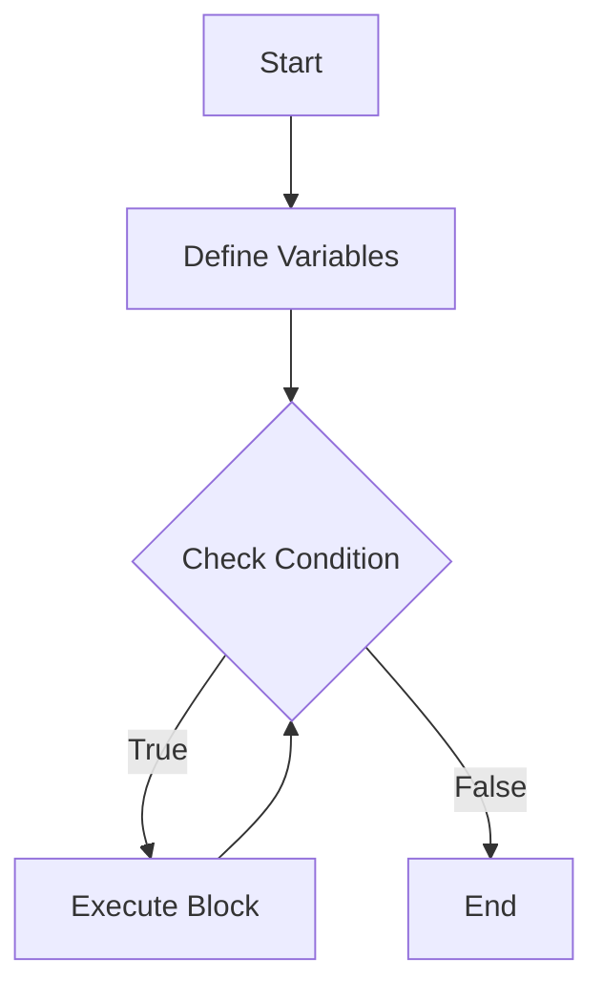

## 3.1 Ruby Syntax and Semantics

Ruby is a dynamic, open-source programming language with a focus on simplicity and productivity. Its elegant syntax is natural to read and easy to write. In this section, we will explore the fundamental syntax and semantics of Ruby, highlighting its unique features and conventions. Our goal is to provide you with a solid foundation in Ruby's syntax, enabling you to write clean, efficient, and maintainable code.

### Understanding Ruby's Basic Syntax

Ruby's syntax is designed to be intuitive and expressive. Let's start by examining some of the basic elements of Ruby syntax, including variables, control structures, methods, and classes.

#### Variables

In Ruby, variables are used to store data that can be referenced and manipulated. Ruby is dynamically typed, meaning you don't need to declare a variable's type explicitly. Here's a simple example:

```ruby
# Variable assignment
name = "Alice"
age = 30
is_student = true

# Outputting variables
puts "Name: #{name}, Age: #{age}, Student: #{is_student}"
```

**Key Points:**
- Variables in Ruby are case-sensitive and typically use snake_case naming convention.
- Ruby supports several data types, including integers, floats, strings, arrays, hashes, and booleans.

#### Control Structures

Control structures in Ruby allow you to dictate the flow of your program. Common control structures include `if`, `unless`, `while`, `until`, and `for` loops.

```ruby
# If statement
if age > 18
  puts "You are an adult."
else
  puts "You are a minor."
end

# While loop
counter = 0
while counter < 5
  puts "Counter: #{counter}"
  counter += 1
end
```

**Key Points:**
- Ruby uses `end` to close blocks of code, such as those in `if` statements and loops.
- The `unless` keyword is a negated `if`, providing a more readable alternative in some cases.

#### Methods

Methods in Ruby are defined using the `def` keyword and are used to encapsulate reusable code.

```ruby
# Method definition
def greet(name)
  "Hello, #{name}!"
end

# Method invocation
puts greet("Alice")
```

**Key Points:**
- Methods return the last evaluated expression by default, eliminating the need for an explicit `return` statement.
- Method names typically use snake_case.

#### Classes

Ruby is an object-oriented language, and classes are the blueprint for creating objects.

```ruby
# Class definition
class Person
  attr_accessor :name, :age

  def initialize(name, age)
    @name = name
    @age = age
  end

  def introduce
    "Hi, I'm #{@name} and I'm #{@age} years old."
  end
end

# Creating an instance
person = Person.new("Alice", 30)
puts person.introduce
```

**Key Points:**
- Instance variables are prefixed with `@`.
- `attr_accessor` is a convenient way to create getter and setter methods.

### Ruby's Conventions and Code Formatting

Ruby has a set of conventions that promote readability and maintainability. Let's explore some of these conventions.

#### Naming Conventions

- **Variables and Methods**: Use snake_case.
- **Classes and Modules**: Use CamelCase.
- **Constants**: Use ALL_CAPS.

#### Code Formatting

- Indent using two spaces, not tabs.
- Keep lines under 80 characters when possible.
- Use blank lines to separate logical sections of code.

### Unique Features of Ruby

Ruby has several features that distinguish it from other programming languages. Let's highlight some of these features.

#### Implicit Returns

Ruby methods return the last evaluated expression by default, which can make code more concise.

```ruby
def add(a, b)
  a + b
end

puts add(2, 3) # Outputs 5
```

#### Blocks and Iterators

Blocks are a powerful feature in Ruby, allowing you to pass chunks of code to methods.

```ruby
# Using a block with an iterator
[1, 2, 3].each do |number|
  puts number * 2
end
```

**Key Points:**
- Blocks can be defined using `do...end` or curly braces `{...}`.
- Methods like `each`, `map`, and `select` are commonly used with blocks.

#### Symbols

Symbols are immutable, reusable constants represented by a colon (`:`) followed by a name. They are often used as keys in hashes.

```ruby
# Using symbols as hash keys
person = { name: "Alice", age: 30 }
puts person[:name]
```

### Code Examples and Exercises

Let's solidify our understanding with some exercises. Try modifying the following code examples to see how Ruby's syntax and semantics work in practice.

#### Exercise 1: Modify the Control Structure

```ruby
# Modify the loop to count down from 5 to 1
counter = 5
while counter > 0
  puts "Counter: #{counter}"
  counter -= 1
end
```

#### Exercise 2: Create a New Class

```ruby
# Create a class called Car with attributes make and model
class Car
  attr_accessor :make, :model

  def initialize(make, model)
    @make = make
    @model = model
  end

  def details
    "Car make: #{@make}, model: #{@model}"
  end
end

# Instantiate a Car object and print its details
car = Car.new("Toyota", "Corolla")
puts car.details
```

### Visualizing Ruby's Syntax

To better understand Ruby's syntax, let's use a diagram to visualize the flow of a simple Ruby program.



**Diagram Description:** This flowchart represents a simple loop structure in Ruby, where a condition is checked, and a block of code is executed if the condition is true.

### References and Further Reading

For more information on Ruby's syntax and semantics, consider exploring the following resources:

- [Ruby Official Documentation](https://www.ruby-lang.org/en/documentation/)
- [Ruby Style Guide](https://rubystyle.guide/)
- [Learn Ruby the Hard Way](https://learnrubythehardway.org/book/)

### Knowledge Check

Before we wrap up, let's test your understanding of Ruby's syntax and semantics with a few questions.

## Quiz: Ruby Syntax and Semantics



### What is the default return value of a Ruby method?

- [x] The last evaluated expression
- [ ] nil
- [ ] The first evaluated expression
- [ ] An explicit return statement

> **Explanation:** Ruby methods return the last evaluated expression by default.

### How are instance variables denoted in Ruby?

- [x] With an `@` prefix
- [ ] With a `$` prefix
- [ ] With a `#` prefix
- [ ] With a `&` prefix

> **Explanation:** Instance variables in Ruby are prefixed with `@`.

### Which keyword is used to define a method in Ruby?

- [x] def
- [ ] function
- [ ] method
- [ ] define

> **Explanation:** The `def` keyword is used to define methods in Ruby.

### What is the naming convention for Ruby classes?

- [x] CamelCase
- [ ] snake_case
- [ ] ALL_CAPS
- [ ] kebab-case

> **Explanation:** Ruby classes use CamelCase naming convention.

### How do you denote a symbol in Ruby?

- [x] With a colon `:`
- [ ] With a hash `#`
- [ ] With a dollar sign `$`
- [ ] With an ampersand `&`

> **Explanation:** Symbols in Ruby are denoted with a colon `:`.

### What is the purpose of the `attr_accessor` method in Ruby?

- [x] To create getter and setter methods
- [ ] To define a class
- [ ] To initialize an object
- [ ] To iterate over a collection

> **Explanation:** `attr_accessor` creates getter and setter methods for instance variables.

### Which of the following is a control structure in Ruby?

- [x] if
- [ ] switch
- [ ] case
- [ ] loop

> **Explanation:** `if` is a control structure used for conditional execution in Ruby.

### What is the typical indentation style in Ruby?

- [x] Two spaces
- [ ] Four spaces
- [ ] A tab
- [ ] No indentation

> **Explanation:** Ruby conventionally uses two spaces for indentation.

### How are blocks defined in Ruby?

- [x] Using `do...end` or `{...}`
- [ ] Using `begin...end`
- [ ] Using `start...finish`
- [ ] Using `open...close`

> **Explanation:** Blocks in Ruby are defined using `do...end` or `{...}`.

### True or False: Ruby requires explicit type declarations for variables.

- [ ] True
- [x] False

> **Explanation:** Ruby is dynamically typed, so explicit type declarations are not required.



Remember, mastering Ruby's syntax and semantics is just the beginning of your journey. As you continue to explore Ruby, you'll discover more advanced features and patterns that will help you build scalable and maintainable applications. Keep experimenting, stay curious, and enjoy the journey!
