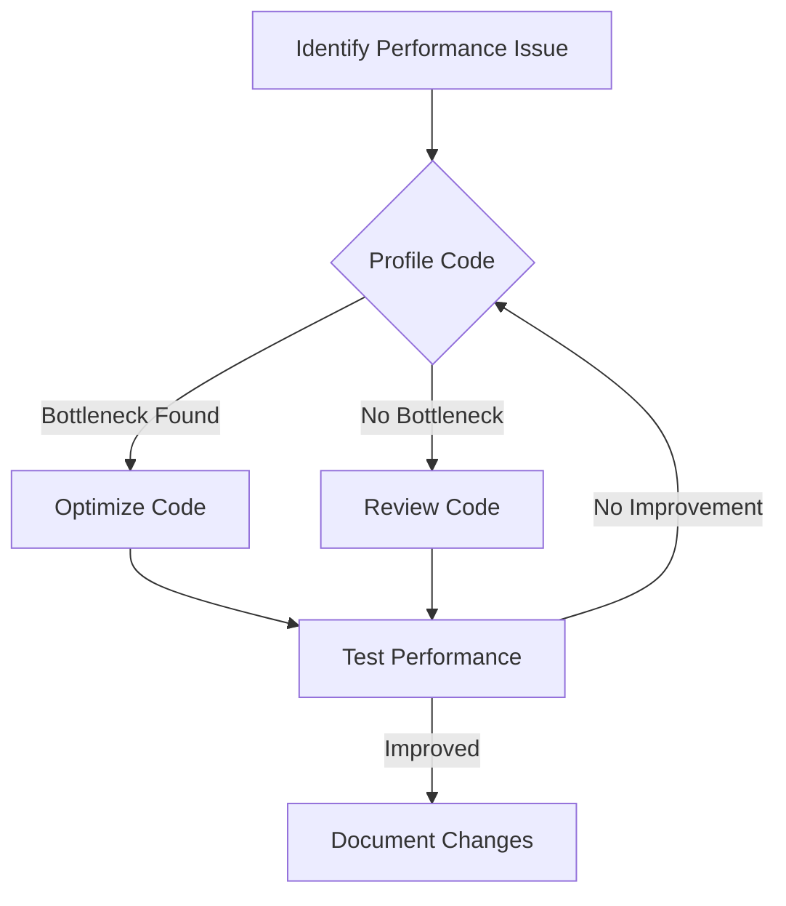

## 3.10 Performance Considerations

In the world of software development, performance is a critical factor that can make or break an application. As Ruby developers, we must be vigilant in writing code that is not only functional but also efficient. This section will guide you through the common performance pitfalls in Ruby, strategies for optimization, and tools to measure and enhance performance.

### Understanding Performance Issues in Ruby

Ruby, known for its elegance and simplicity, can sometimes lead to performance challenges if not used judiciously. Let's explore some typical performance issues:

#### Slow Loops

Loops are a fundamental part of programming, but they can become performance bottlenecks if not optimized. Consider the following example:

```ruby
# Inefficient loop
sum = 0
(1..1000000).each do |i|
  sum += i
end
```

This loop iterates over a range and accumulates a sum. While this is straightforward, it can be optimized using Ruby's built-in methods:

```ruby
# Optimized loop
sum = (1..1000000).sum
```

By using the `sum` method, we leverage Ruby's internal optimizations, reducing the overhead of iteration.

#### Excessive Memory Usage

Memory management is crucial for performance. Ruby's garbage collector (GC) handles memory allocation and deallocation, but excessive memory usage can still slow down applications. Consider the following example:

```ruby
# Inefficient memory usage
array = []
1000000.times do
  array << "string"
end
```

This code creates a large array of strings, consuming significant memory. Instead, consider using more memory-efficient data structures or algorithms:

```ruby
# More efficient memory usage
array = Array.new(1000000, "string")
```

By initializing the array with a default value, we reduce the overhead of repeatedly appending to the array.

### Strategies for Optimizing Ruby Code

Optimization should be approached with care, focusing on areas that truly impact performance. Here are some strategies:

#### Use Efficient Algorithms and Data Structures

Choosing the right algorithm or data structure can drastically improve performance. For example, using a hash for lookups instead of an array can reduce time complexity from O(n) to O(1).

```ruby
# Using a hash for efficient lookups
lookup = { "key1" => "value1", "key2" => "value2" }
value = lookup["key1"]
```

#### Avoid Premature Optimization

While optimization is important, it should not come at the cost of code readability and maintainability. Focus on writing clear code first, then optimize based on actual performance needs.

#### Leverage Ruby's Built-in Methods

Ruby provides a rich set of built-in methods that are often more efficient than custom implementations. For example, use `map` instead of manually iterating and transforming an array.

```ruby
# Using map for transformation
numbers = [1, 2, 3, 4, 5]
squared_numbers = numbers.map { |n| n**2 }
```

### Profiling Tools for Measuring Performance

Profiling is essential for identifying performance bottlenecks. Ruby offers several tools for this purpose:

#### Benchmark Module

The `benchmark` module provides methods to measure and compare the execution time of code blocks.

```ruby
require 'benchmark'

Benchmark.bm do |x|
  x.report("loop:") { (1..1000000).each { |i| i } }
  x.report("sum:") { (1..1000000).sum }
end
```

This code compares the execution time of a loop versus using the `sum` method.

#### Ruby Profiler

The `ruby-prof` gem is a powerful tool for profiling Ruby applications, providing detailed reports on method calls and execution times.

```ruby
require 'ruby-prof'

RubyProf.start
# Code to profile
result = RubyProf.stop

# Print a flat profile to text
printer = RubyProf::FlatPrinter.new(result)
printer.print(STDOUT)
```

#### StackProf

`StackProf` is a sampling call-stack profiler for Ruby, useful for identifying hotspots in your code.

```ruby
require 'stackprof'

StackProf.run(mode: :cpu, out: 'tmp/stackprof.dump') do
  # Code to profile
end
```

### Trade-offs Between Readability and Performance

While optimizing code, it's important to balance performance with readability. Highly optimized code can become complex and difficult to maintain. Here are some tips:

- **Comment Complex Optimizations**: If optimization requires complex logic, add comments to explain the rationale.
- **Use Descriptive Variable Names**: Even in optimized code, use clear and descriptive variable names to enhance readability.
- **Refactor for Clarity**: Break down complex optimizations into smaller, understandable methods.

### Emphasizing Actual Performance Needs

Optimization should be driven by actual performance requirements. Premature optimization can lead to wasted effort and reduced code quality. Follow these guidelines:

- **Profile Before Optimizing**: Use profiling tools to identify real bottlenecks before making changes.
- **Set Performance Goals**: Define clear performance goals to guide optimization efforts.
- **Test After Optimizing**: After making optimizations, test to ensure performance has improved without introducing bugs.

### Try It Yourself

Experiment with the following code to see the impact of different optimizations:

```ruby
require 'benchmark'

# Original code
def slow_method
  sum = 0
  (1..1000000).each do |i|
    sum += i
  end
  sum
end

# Optimized code
def fast_method
  (1..1000000).sum
end

Benchmark.bm do |x|
  x.report("slow:") { slow_method }
  x.report("fast:") { fast_method }
end
```

Try modifying the range or adding additional operations to see how it affects performance.

### Visualizing Performance Optimization

Below is a flowchart illustrating the process of identifying and optimizing performance bottlenecks in Ruby applications:



This diagram outlines a systematic approach to performance optimization, emphasizing the importance of profiling and testing.

### Key Takeaways

- **Focus on Real Bottlenecks**: Use profiling tools to identify actual performance issues.
- **Balance Readability and Performance**: Optimize only where necessary, and maintain code clarity.
- **Leverage Ruby's Features**: Use built-in methods and efficient data structures to enhance performance.

### Further Reading

For more information on Ruby performance optimization, consider exploring the following resources:

- [Ruby Performance Optimization](https://www.ruby-lang.org/en/documentation/performance/)
- [Profiling Ruby Applications](https://ruby-prof.github.io/)
- [Benchmarking Ruby Code](https://ruby-doc.org/stdlib-2.7.0/libdoc/benchmark/rdoc/Benchmark.html)

## Quiz: Performance Considerations



### What is a common performance issue in Ruby?

- [x] Slow loops
- [ ] Fast loops
- [ ] Excessive comments
- [ ] Short variable names

> **Explanation:** Slow loops can become performance bottlenecks if not optimized properly.

### Which Ruby method can optimize summing a range of numbers?

- [x] sum
- [ ] each
- [ ] map
- [ ] collect

> **Explanation:** The `sum` method is optimized for summing elements in a range or array.

### What is the purpose of the `benchmark` module?

- [x] To measure and compare execution time of code blocks
- [ ] To debug code
- [ ] To compile Ruby code
- [ ] To manage dependencies

> **Explanation:** The `benchmark` module is used to measure and compare the execution time of code blocks.

### What is a trade-off when optimizing code?

- [x] Readability vs. Performance
- [ ] Speed vs. Memory
- [ ] Complexity vs. Simplicity
- [ ] Comments vs. Code

> **Explanation:** Optimizing code can lead to reduced readability, so it's important to balance both.

### Which tool provides detailed reports on method calls and execution times?

- [x] ruby-prof
- [ ] benchmark
- [ ] irb
- [ ] gem

> **Explanation:** `ruby-prof` provides detailed profiling reports on method calls and execution times.

### What should drive optimization efforts?

- [x] Actual performance needs
- [ ] Code aesthetics
- [ ] Developer preferences
- [ ] Random guesses

> **Explanation:** Optimization should be driven by actual performance needs identified through profiling.

### What is the benefit of using Ruby's built-in methods?

- [x] They are often more efficient than custom implementations
- [ ] They are always faster
- [ ] They are easier to write
- [ ] They require less memory

> **Explanation:** Ruby's built-in methods are optimized and often more efficient than custom implementations.

### What should you do before optimizing code?

- [x] Profile the code
- [ ] Rewrite the code
- [ ] Add comments
- [ ] Remove comments

> **Explanation:** Profiling helps identify real bottlenecks before making optimizations.

### What is the role of the garbage collector in Ruby?

- [x] Manages memory allocation and deallocation
- [ ] Compiles Ruby code
- [ ] Manages dependencies
- [ ] Optimizes loops

> **Explanation:** The garbage collector manages memory allocation and deallocation in Ruby.

### True or False: Premature optimization is beneficial.

- [ ] True
- [x] False

> **Explanation:** Premature optimization can lead to wasted effort and reduced code quality.



Remember, performance optimization is a journey. As you continue to develop your Ruby skills, keep experimenting, stay curious, and enjoy the process of making your applications faster and more efficient!
