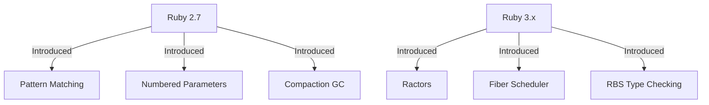

## 3.11 New Features in Ruby 2.7 and 3.x

Ruby has always been a language that emphasizes simplicity and productivity. With the release of Ruby 2.7 and the subsequent 3.x versions, the language has introduced several new features and enhancements that further empower developers to write clean, efficient, and scalable code. In this section, we'll explore these new features, provide practical examples, and discuss how they can be integrated into your Ruby projects.

### Key Features in Ruby 2.7

Ruby 2.7 introduced several noteworthy features that enhance the language's expressiveness and performance. Let's delve into some of these key features:

#### Pattern Matching

Pattern matching is a powerful feature that allows you to destructure and match data structures in a concise and readable manner. It is particularly useful for handling complex data types and control flow.

```ruby
# Example of pattern matching in Ruby 2.7
def process_data(data)
  case data
  in {name: "Alice", age: age}
    puts "Alice is #{age} years old."
  in {name: "Bob", age: age}
    puts "Bob is #{age} years old."
  else
    puts "Unknown person."
  end
end

process_data({name: "Alice", age: 30})
# Output: Alice is 30 years old.
```

In this example, pattern matching is used to destructure a hash and match specific patterns, making the code more readable and maintainable.

#### Numbered Parameters

Ruby 2.7 introduced numbered parameters, which simplify the use of blocks by providing a shorthand for block parameters. This feature is particularly useful for short blocks where naming parameters might be unnecessary.

```ruby
# Using numbered parameters in Ruby 2.7
[1, 2, 3, 4].map { _1 * 2 }
# Output: [2, 4, 6, 8]
```

Here, `_1` is used as a placeholder for the first block parameter, making the code concise and easy to read.

#### Compaction GC

Ruby 2.7 introduced the Compaction Garbage Collector (GC), which helps reduce memory fragmentation and improve performance. This is particularly beneficial for long-running applications.

```ruby
# Enabling compaction GC
GC.compact
```

By calling `GC.compact`, you can trigger the compaction process, which rearranges objects in memory to reduce fragmentation.

#### Other Enhancements

- **REPL Improvements**: The IRB (Interactive Ruby) now supports multi-line editing and syntax highlighting, making it more user-friendly.
- **Separation of Positional and Keyword Arguments**: Ruby 2.7 introduced warnings for mixing positional and keyword arguments, preparing developers for stricter rules in Ruby 3.0.

### Key Features in Ruby 3.x

Ruby 3.x builds upon the foundation laid by Ruby 2.7, introducing several groundbreaking features aimed at improving performance, concurrency, and developer productivity.

#### Ractors

Ractors are a new concurrency abstraction introduced in Ruby 3.0, designed to enable parallel execution without the need for a Global Interpreter Lock (GIL). This makes it easier to write thread-safe concurrent programs.

```ruby
# Example of using Ractors in Ruby 3.x
ractor = Ractor.new do
  sum = 0
  5.times do |i|
    sum += i
  end
  sum
end

puts ractor.take
# Output: 10
```

In this example, a Ractor is used to perform a computation in parallel, demonstrating how Ractors can be used to achieve concurrency in Ruby.

#### Fiber Scheduler

Ruby 3.0 introduced a Fiber Scheduler, which allows for non-blocking I/O operations. This feature is particularly useful for building high-performance, asynchronous applications.

```ruby
# Example of using Fiber Scheduler in Ruby 3.x
require 'socket'

Fiber.set_scheduler(Fiber::Scheduler.new)

server = TCPServer.new(3000)

loop do
  client = server.accept
  Fiber.schedule do
    client.puts "Hello from Ruby 3.0!"
    client.close
  end
end
```

This example demonstrates how the Fiber Scheduler can be used to handle multiple client connections asynchronously, improving the performance of network applications.

#### Type Checking with RBS

Ruby 3.0 introduced RBS, a type signature language that allows developers to define types for Ruby programs. This feature enhances code reliability and maintainability.

```ruby
# Example of RBS type definition
# person.rbs
class Person
  attr_reader name: String
  attr_reader age: Integer
end
```

By defining types using RBS, you can catch type-related errors early in the development process, improving code quality.

#### Other Enhancements

- **JIT Compiler Improvements**: Ruby 3.0 includes enhancements to the Just-In-Time (JIT) compiler, improving performance for compute-intensive applications.
- **Improved Error Messages**: Ruby 3.0 provides more informative error messages, making it easier to debug and fix issues.

### Compatibility Considerations

When upgrading to Ruby 2.7 or 3.x, it's important to be aware of potential compatibility issues. Here are some considerations:

- **Keyword Argument Changes**: Ruby 3.0 enforces stricter rules for keyword arguments, which may require refactoring existing code.
- **Deprecations**: Some features, such as the `URI.escape` method, have been deprecated and should be replaced with alternatives.
- **Performance Testing**: Before upgrading, conduct performance testing to ensure that your application benefits from the new features and optimizations.

### Encouraging Exploration and Adoption

We encourage you to explore these new features and consider adopting them in your projects. By leveraging the enhancements in Ruby 2.7 and 3.x, you can write more efficient, maintainable, and scalable applications.

### Deprecations and Breaking Changes

Be mindful of deprecations and breaking changes when upgrading. Review the [Ruby 2.7 Release Notes](https://www.ruby-lang.org/en/news/2019/12/25/ruby-2-7-0-released/) and [Ruby 3.0 Release Notes](https://www.ruby-lang.org/en/news/2020/12/25/ruby-3-0-0-released/) for detailed information on changes that may impact your codebase.

### Try It Yourself

Experiment with the new features by modifying the provided code examples. Try using pattern matching with different data structures, or implement a simple concurrent program using Ractors. This hands-on approach will deepen your understanding and help you integrate these features into your projects.

### Visualizing Ruby's New Features

To better understand how these new features fit into the Ruby ecosystem, let's visualize some of the key concepts using Mermaid.js diagrams.



**Diagram Description**: This diagram illustrates the key features introduced in Ruby 2.7 and 3.x, highlighting the progression and enhancements in the language.

### Conclusion

The new features in Ruby 2.7 and 3.x represent significant advancements in the language, offering developers powerful tools for building modern applications. By understanding and adopting these features, you can enhance your Ruby development skills and create more robust and efficient software.

Remember, this is just the beginning. As you progress, you'll discover even more ways to leverage Ruby's capabilities. Keep experimenting, stay curious, and enjoy the journey!

## Quiz: New Features in Ruby 2.7 and 3.x



### Which feature in Ruby 2.7 allows for destructuring and matching data structures?

- [x] Pattern Matching
- [ ] Numbered Parameters
- [ ] Ractors
- [ ] Fiber Scheduler

> **Explanation:** Pattern matching in Ruby 2.7 allows for destructuring and matching data structures in a concise manner.

### What is the purpose of numbered parameters in Ruby 2.7?

- [x] To simplify block parameter usage
- [ ] To improve garbage collection
- [ ] To enable parallel execution
- [ ] To define types for Ruby programs

> **Explanation:** Numbered parameters simplify the use of block parameters by providing a shorthand notation.

### Which feature in Ruby 3.x allows for parallel execution without a Global Interpreter Lock?

- [x] Ractors
- [ ] Fiber Scheduler
- [ ] Pattern Matching
- [ ] Numbered Parameters

> **Explanation:** Ractors in Ruby 3.x enable parallel execution without the need for a Global Interpreter Lock.

### What does the Fiber Scheduler in Ruby 3.0 enable?

- [x] Non-blocking I/O operations
- [ ] Type checking
- [ ] Pattern matching
- [ ] Memory compaction

> **Explanation:** The Fiber Scheduler allows for non-blocking I/O operations, improving performance for asynchronous applications.

### What is RBS used for in Ruby 3.0?

- [x] Defining types for Ruby programs
- [ ] Improving garbage collection
- [ ] Enabling parallel execution
- [ ] Simplifying block parameters

> **Explanation:** RBS is a type signature language used to define types for Ruby programs, enhancing code reliability.

### Which feature in Ruby 2.7 helps reduce memory fragmentation?

- [x] Compaction GC
- [ ] Pattern Matching
- [ ] Numbered Parameters
- [ ] Fiber Scheduler

> **Explanation:** The Compaction Garbage Collector (GC) in Ruby 2.7 helps reduce memory fragmentation.

### What is a key benefit of the JIT compiler improvements in Ruby 3.0?

- [x] Improved performance for compute-intensive applications
- [ ] Simplified block parameter usage
- [ ] Non-blocking I/O operations
- [ ] Type checking

> **Explanation:** The JIT compiler improvements in Ruby 3.0 enhance performance for compute-intensive applications.

### Which version of Ruby introduced warnings for mixing positional and keyword arguments?

- [x] Ruby 2.7
- [ ] Ruby 3.0
- [ ] Ruby 2.6
- [ ] Ruby 3.1

> **Explanation:** Ruby 2.7 introduced warnings for mixing positional and keyword arguments, preparing for stricter rules in Ruby 3.0.

### What should developers be mindful of when upgrading to Ruby 3.0?

- [x] Keyword argument changes
- [ ] Numbered parameters
- [ ] Compaction GC
- [ ] Fiber Scheduler

> **Explanation:** Developers should be aware of keyword argument changes when upgrading to Ruby 3.0, as they may require code refactoring.

### True or False: Ractors in Ruby 3.x require a Global Interpreter Lock.

- [ ] True
- [x] False

> **Explanation:** Ractors do not require a Global Interpreter Lock, allowing for parallel execution in Ruby 3.x.




