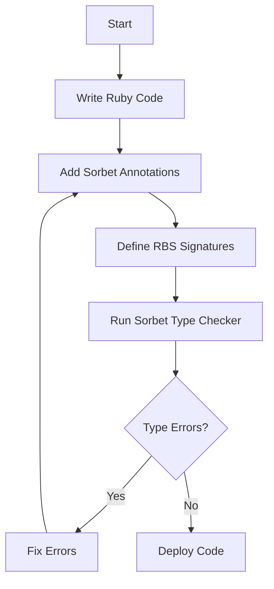

## 3.12 Advanced Type Checking with Sorbet and RBS

In the world of Ruby, a language celebrated for its dynamic nature and flexibility, the introduction of static type checking tools like Sorbet and RBS marks a significant evolution. These tools aim to bring the best of both worlds: the dynamism of Ruby and the reliability of statically typed languages. In this section, we'll delve into the purpose and implementation of advanced type checking in Ruby, focusing on Sorbet and RBS, and explore how they can enhance the scalability and maintainability of your applications.

### Understanding Static Type Checking in a Dynamic Language

Ruby is inherently a dynamically typed language, which means that type checking occurs at runtime. This flexibility allows for rapid development and prototyping but can lead to runtime errors that are only caught during execution. Static type checking, on the other hand, involves verifying the types of variables and expressions at compile time, which can catch errors early in the development process.

**Purpose of Static Type Checking:**
- **Error Detection:** Catch type-related errors before runtime, reducing bugs and improving code reliability.
- **Documentation:** Serve as a form of documentation, making code easier to understand and maintain.
- **Refactoring:** Facilitate safer refactoring by ensuring type consistency across the codebase.
- **Performance:** Potentially improve performance by allowing certain optimizations based on type information.

### Introducing Sorbet

Sorbet is a powerful static type checker designed specifically for Ruby. It integrates seamlessly into Ruby projects, providing a robust framework for adding type annotations and performing static analysis.

#### Key Features of Sorbet

- **Type Annotations:** Sorbet allows developers to add type annotations directly in Ruby code, enhancing readability and maintainability.
- **Gradual Typing:** You can incrementally introduce types into your codebase, allowing for a smooth transition from dynamic to static typing.
- **Error Detection:** Sorbet detects type errors at compile time, helping to prevent runtime exceptions.
- **IDE Integration:** Provides support for popular IDEs, offering features like autocomplete and inline type error highlighting.

#### Integrating Sorbet into Ruby Projects

To start using Sorbet, you'll need to install it and set up your project to recognize type annotations. Here's a step-by-step guide:

1. **Installation:**
   ```bash
   gem install sorbet
   ```

2. **Initialize Sorbet:**
   Run the following command to initialize Sorbet in your project:
   ```bash
   srb init
   ```

3. **Add Type Annotations:**
   Sorbet uses a special syntax for type annotations. Here's an example of how to annotate a method:
   ```ruby
   # typed: true

   class Calculator
     extend T::Sig

     sig { params(x: Integer, y: Integer).returns(Integer) }
     def add(x, y)
       x + y
     end
   end
   ```

4. **Run Sorbet:**
   To check your code for type errors, use the following command:
   ```bash
   srb tc
   ```

### Writing Type Annotations with Sorbet

Sorbet's type system is expressive and allows for detailed type annotations. Here are some common types and how to use them:

- **Basic Types:** `Integer`, `String`, `Boolean`, etc.
- **Nilable Types:** Use `T.nilable(Type)` to indicate a type that can be `nil`.
- **Union Types:** Use `T.any(Type1, Type2)` for variables that can be one of several types.
- **Custom Types:** Define your own types using classes and modules.

#### Example: Using Nilable and Union Types

```ruby
# typed: true

class User
  extend T::Sig

  sig { params(name: T.nilable(String), age: T.any(Integer, String)).returns(String) }
  def display_info(name, age)
    "Name: #{name || 'Unknown'}, Age: #{age}"
  end
end
```

### Introducing RBS

RBS (Ruby Signature) is a language for describing the types of Ruby programs. It is part of the Ruby 3.0 release and provides a way to define type signatures separately from the code, allowing for more flexibility and compatibility with existing Ruby codebases.

#### Key Features of RBS

- **Separate Type Definitions:** Define types in `.rbs` files, keeping your Ruby code clean and focused.
- **Compatibility:** Works with existing Ruby code without requiring changes to the codebase.
- **Tooling Support:** Integrates with tools like Sorbet and IDEs for enhanced development experience.

#### Writing RBS Signatures

RBS files describe the types of classes, modules, and methods. Here's an example of an RBS file for a simple class:

```rbs
class Calculator
  def add: (Integer x, Integer y) -> Integer
end
```

### Benefits of Advanced Type Checking for Large Codebases

For large Ruby codebases, the benefits of using Sorbet and RBS are significant:

- **Early Error Detection:** Catching errors early in the development process can save time and reduce bugs.
- **Improved Documentation:** Type annotations and signatures serve as documentation, making it easier for new developers to understand the code.
- **Safer Refactoring:** With type information, refactoring becomes safer and more predictable.
- **Enhanced Collaboration:** Clear type definitions improve communication among team members, reducing misunderstandings.

### Challenges and Considerations

While the benefits are clear, there are some challenges to consider when adopting Sorbet and RBS:

- **Learning Curve:** Developers need to learn the syntax and concepts of type annotations and signatures.
- **Overhead:** Adding type annotations can increase the initial development time, though this is often offset by reduced debugging time.
- **Integration:** Ensuring compatibility with existing code and libraries can require additional effort.

### Try It Yourself: Experiment with Sorbet and RBS

To get hands-on experience, try modifying the code examples provided. Add new methods, change types, and observe how Sorbet and RBS handle these changes. Experiment with different types and see how they affect the type checking process.

### Visualizing Type Checking with Sorbet and RBS

To better understand how Sorbet and RBS work together, let's visualize the process using a Mermaid.js diagram:



**Diagram Description:** This flowchart illustrates the process of integrating Sorbet and RBS into a Ruby project. It starts with writing Ruby code, adding Sorbet annotations, defining RBS signatures, running the Sorbet type checker, and either fixing errors or deploying the code.

### External Resources

For more information and in-depth guides, consider visiting the following resources:

- [Sorbet Official Website](https://sorbet.org/)
- [Ruby's RBS GitHub Repository](https://github.com/ruby/rbs)

### Knowledge Check

Before we wrap up, let's reinforce what we've learned with a few questions:

- What are the main benefits of using static type checking in Ruby?
- How does Sorbet integrate with Ruby projects?
- What is the purpose of RBS, and how does it differ from Sorbet?

### Summary

In this section, we've explored the integration of advanced type checking in Ruby using Sorbet and RBS. These tools provide a powerful way to enhance the reliability and maintainability of Ruby applications by catching errors early, improving documentation, and facilitating safer refactoring. While there are challenges to consider, the benefits for large codebases are substantial. As you continue your journey in Ruby development, consider experimenting with these tools to see how they can improve your projects.

Remember, this is just the beginning. As you progress, you'll build more complex and interactive applications. Keep experimenting, stay curious, and enjoy the journey!

## Quiz: Advanced Type Checking with Sorbet and RBS



### What is the primary purpose of static type checking in Ruby?

- [x] To catch type-related errors before runtime
- [ ] To make Ruby code run faster
- [ ] To replace dynamic typing entirely
- [ ] To simplify Ruby syntax

> **Explanation:** Static type checking helps catch type-related errors before runtime, improving code reliability.

### Which tool is specifically designed for static type checking in Ruby?

- [x] Sorbet
- [ ] RSpec
- [ ] Bundler
- [ ] Rails

> **Explanation:** Sorbet is a static type checker specifically designed for Ruby.

### How does Sorbet allow for gradual typing?

- [x] By allowing incremental introduction of types into the codebase
- [ ] By automatically converting all code to static types
- [ ] By removing dynamic typing features
- [ ] By using only RBS files

> **Explanation:** Sorbet supports gradual typing, allowing developers to introduce types incrementally.

### What is the role of RBS in Ruby?

- [x] To define type signatures separately from the code
- [ ] To replace Ruby's dynamic typing
- [ ] To enhance Ruby's performance
- [ ] To simplify Ruby syntax

> **Explanation:** RBS defines type signatures separately from the code, providing flexibility and compatibility.

### What is a key benefit of using Sorbet in large codebases?

- [x] Early error detection
- [ ] Faster code execution
- [ ] Simplified syntax
- [ ] Automatic code generation

> **Explanation:** Sorbet helps catch errors early, which is particularly beneficial in large codebases.

### What is a potential challenge when adopting Sorbet and RBS?

- [x] Learning curve
- [ ] Lack of documentation
- [ ] Incompatibility with Ruby
- [ ] Limited IDE support

> **Explanation:** The learning curve is a potential challenge when adopting Sorbet and RBS.

### How can Sorbet annotations improve collaboration among team members?

- [x] By providing clear type definitions
- [ ] By simplifying Ruby syntax
- [ ] By automating code reviews
- [ ] By eliminating dynamic typing

> **Explanation:** Clear type definitions improve communication and understanding among team members.

### What command is used to run the Sorbet type checker?

- [x] `srb tc`
- [ ] `srb check`
- [ ] `srb run`
- [ ] `srb analyze`

> **Explanation:** The `srb tc` command is used to run the Sorbet type checker.

### True or False: RBS files are required to use Sorbet.

- [ ] True
- [x] False

> **Explanation:** RBS files are not required to use Sorbet; they are an additional tool for defining type signatures.

### What is the main advantage of using RBS over inline type annotations?

- [x] Keeping Ruby code clean and focused
- [ ] Faster code execution
- [ ] Automatic type inference
- [ ] Simplified syntax

> **Explanation:** RBS allows for type definitions to be kept separate, maintaining clean and focused Ruby code.


