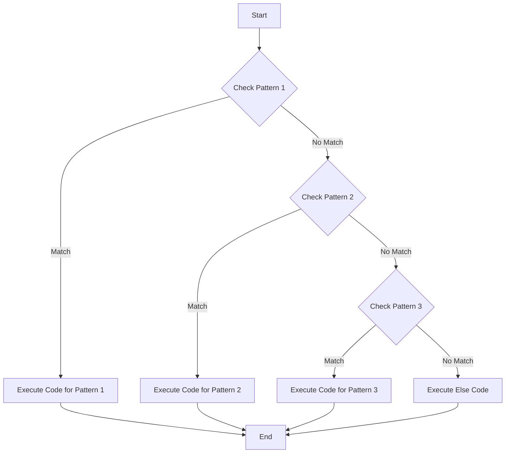

## 3.13 Pattern Matching in Ruby 2.7 and Beyond

Pattern matching is a powerful feature introduced in Ruby 2.7 that allows developers to simplify complex conditional logic. By enabling more expressive and concise code, pattern matching can significantly enhance readability and maintainability. In this section, we will explore the syntax and capabilities of pattern matching in Ruby, provide practical examples, and discuss its benefits and limitations.

### Understanding Pattern Matching

Pattern matching is a mechanism that allows you to check a value against a pattern. It is a way to destructure data structures, such as arrays and hashes, and extract values based on a specified pattern. This feature is particularly useful for simplifying code that involves complex conditionals and nested data structures.

#### Syntax of Pattern Matching in Ruby

In Ruby, pattern matching is implemented using the `case` statement. The basic syntax is as follows:

```ruby
case object
in pattern
  # code to execute if pattern matches
else
  # code to execute if no pattern matches
end
```

The `in` keyword is used to specify the pattern that the object is matched against. If the pattern matches, the corresponding block of code is executed.

### Pattern Matching with `case` Statements

Pattern matching can be used with `case` statements to simplify conditional logic. Let's look at a basic example:

```ruby
def match_example(value)
  case value
  in 0
    "Value is zero"
  in 1..10
    "Value is between 1 and 10"
  in Integer
    "Value is an integer"
  else
    "Value is something else"
  end
end

puts match_example(5)   # Output: Value is between 1 and 10
puts match_example(42)  # Output: Value is an integer
puts match_example("a") # Output: Value is something else
```

In this example, the `case` statement uses pattern matching to check if the `value` matches specific patterns, such as being zero, within a range, or an integer.

### Deconstructing Arrays with Pattern Matching

Pattern matching can be used to deconstruct arrays, making it easy to extract values from them. Here's how it works:

```ruby
def deconstruct_array(array)
  case array
  in [first, second, *rest]
    "First: #{first}, Second: #{second}, Rest: #{rest}"
  else
    "Not a match"
  end
end

puts deconstruct_array([1, 2, 3, 4, 5]) # Output: First: 1, Second: 2, Rest: [3, 4, 5]
puts deconstruct_array([1])            # Output: Not a match
```

In this example, the pattern `[first, second, *rest]` is used to match arrays with at least two elements. The `*rest` captures any remaining elements in the array.

### Deconstructing Hashes with Pattern Matching

Pattern matching can also be applied to hashes, allowing you to extract values based on keys:

```ruby
def deconstruct_hash(hash)
  case hash
  in {name: name, age: age}
    "Name: #{name}, Age: #{age}"
  else
    "Not a match"
  end
end

puts deconstruct_hash({name: "Alice", age: 30}) # Output: Name: Alice, Age: 30
puts deconstruct_hash({name: "Bob"})            # Output: Not a match
```

In this example, the pattern `{name: name, age: age}` is used to match hashes with specific keys. If the hash contains both `name` and `age` keys, the corresponding values are extracted.

### Enhancing Code Readability with Pattern Matching

Pattern matching can greatly enhance code readability by reducing the need for complex conditional logic. Consider the following example, which uses traditional conditionals:

```ruby
def process_data(data)
  if data.is_a?(Array) && data.size == 2
    "Array with two elements: #{data}"
  elsif data.is_a?(Hash) && data.key?(:name)
    "Hash with name: #{data[:name]}"
  else
    "Unknown data type"
  end
end
```

With pattern matching, the same logic can be expressed more concisely:

```ruby
def process_data(data)
  case data
  in [a, b]
    "Array with two elements: #{a}, #{b}"
  in {name: name}
    "Hash with name: #{name}"
  else
    "Unknown data type"
  end
end
```

This approach not only reduces the amount of code but also makes it easier to understand the intent of the logic.

### Limitations and Considerations

While pattern matching is a powerful tool, there are some limitations and considerations to keep in mind:

- **Performance**: Pattern matching can be less performant than traditional conditionals in some cases, especially with large data structures.
- **Complex Patterns**: Overly complex patterns can reduce readability and make the code harder to maintain.
- **Version Compatibility**: Pattern matching is available starting from Ruby 2.7, so it may not be suitable for projects that need to support older Ruby versions.

### Try It Yourself

To get a better understanding of pattern matching, try modifying the examples above. Experiment with different patterns and data structures to see how pattern matching can simplify your code.

### Visualizing Pattern Matching

To better understand how pattern matching works, let's visualize the process using a flowchart. This diagram illustrates the decision-making process when matching a value against multiple patterns.



This flowchart shows how the `case` statement evaluates each pattern in sequence and executes the corresponding code block when a match is found.

### References and Further Reading

- [Ruby Pattern Matching Documentation](https://ruby-doc.org/core-2.7.0/doc/syntax/pattern_matching_rdoc.html)
- [Pattern Matching in Ruby 2.7](https://www.ruby-lang.org/en/news/2019/12/25/ruby-2-7-0-released/)
- [Understanding Pattern Matching in Ruby](https://medium.com/@rubyinside/understanding-pattern-matching-in-ruby-2-7-2f0b6e4a7b7)

### Knowledge Check

- What is pattern matching, and how does it differ from traditional conditionals?
- How can pattern matching be used to deconstruct arrays and hashes?
- What are some use cases where pattern matching can enhance code readability?
- What are the limitations of using pattern matching in Ruby?

### Embrace the Journey

Remember, pattern matching is just one of many tools available to Ruby developers. As you continue to explore Ruby's features, you'll discover new ways to write clean, efficient, and maintainable code. Keep experimenting, stay curious, and enjoy the journey!

## Quiz: Pattern Matching in Ruby 2.7 and Beyond



### What is the primary purpose of pattern matching in Ruby?

- [x] To simplify complex conditional logic
- [ ] To improve performance of loops
- [ ] To replace all `if` statements
- [ ] To enhance string manipulation

> **Explanation:** Pattern matching is primarily used to simplify complex conditional logic by allowing more expressive and concise code.

### Which keyword is used in Ruby to specify a pattern in a `case` statement?

- [ ] match
- [x] in
- [ ] with
- [ ] pattern

> **Explanation:** The `in` keyword is used to specify the pattern that the object is matched against in a `case` statement.

### How can pattern matching be used with arrays in Ruby?

- [x] By deconstructing arrays to extract values
- [ ] By sorting arrays automatically
- [ ] By converting arrays to hashes
- [ ] By reversing arrays

> **Explanation:** Pattern matching can be used to deconstruct arrays, allowing you to extract values based on a specified pattern.

### What is a potential limitation of using pattern matching in Ruby?

- [x] It may be less performant with large data structures
- [ ] It cannot be used with strings
- [ ] It is not supported in Ruby 2.7
- [ ] It requires external libraries

> **Explanation:** Pattern matching can be less performant than traditional conditionals in some cases, especially with large data structures.

### In which version of Ruby was pattern matching introduced?

- [ ] Ruby 2.5
- [ ] Ruby 2.6
- [x] Ruby 2.7
- [ ] Ruby 3.0

> **Explanation:** Pattern matching was introduced in Ruby 2.7.

### What does the `*rest` syntax do in pattern matching with arrays?

- [x] Captures any remaining elements in the array
- [ ] Reverses the array
- [ ] Sorts the array
- [ ] Converts the array to a hash

> **Explanation:** The `*rest` syntax captures any remaining elements in the array when deconstructing it with pattern matching.

### Can pattern matching be used with hashes in Ruby?

- [x] Yes, it can extract values based on keys
- [ ] No, it only works with arrays
- [ ] No, it only works with strings
- [ ] Yes, but only with numerical keys

> **Explanation:** Pattern matching can be used with hashes to extract values based on specified keys.

### What is a benefit of using pattern matching in Ruby?

- [x] It enhances code readability
- [ ] It automatically optimizes code
- [ ] It replaces all loops
- [ ] It simplifies string concatenation

> **Explanation:** Pattern matching enhances code readability by reducing the need for complex conditional logic.

### Which of the following is a correct pattern matching syntax for a hash?

- [x] `{name: name, age: age}`
- [ ] `[name, age]`
- [ ] `(name, age)`
- [ ] `name: name, age: age`

> **Explanation:** The correct pattern matching syntax for a hash is `{name: name, age: age}`.

### Pattern matching can be used to simplify which type of logic?

- [x] Complex conditional logic
- [ ] Looping logic
- [ ] Arithmetic logic
- [ ] String manipulation logic

> **Explanation:** Pattern matching is used to simplify complex conditional logic by allowing more expressive and concise code.


