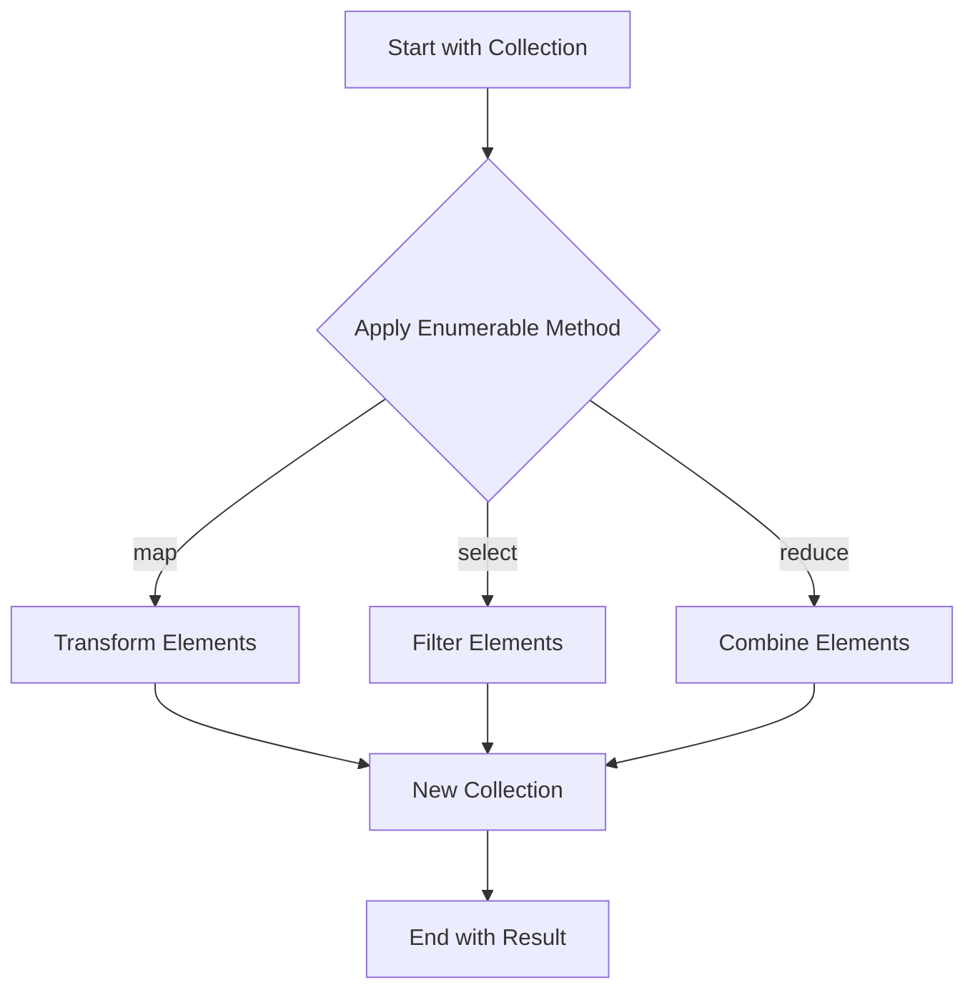

## 3.2 Working with Collections and Enumerables

In Ruby, collections are fundamental structures that allow us to store and manipulate groups of data. The language provides several built-in collection classes, such as arrays, hashes, ranges, and sets, each with its unique characteristics and use cases. Coupled with the powerful Enumerable module, Ruby collections become versatile tools for data manipulation and iteration. In this section, we will delve into these collections, explore the Enumerable module, and demonstrate how these tools enable functional programming techniques in Ruby.

### Introduction to Ruby Collections

Ruby collections are objects that hold multiple items. They are essential for handling data in a structured way. Let's explore the primary collection types in Ruby:

#### Arrays

Arrays are ordered, integer-indexed collections of objects. They can hold objects of any type, including other arrays.

```ruby
# Creating an array
fruits = ["apple", "banana", "cherry"]

# Accessing elements
puts fruits[0]  # Output: apple

# Adding elements
fruits << "date"
puts fruits.inspect  # Output: ["apple", "banana", "cherry", "date"]

# Removing elements
fruits.delete("banana")
puts fruits.inspect  # Output: ["apple", "cherry", "date"]
```

#### Hashes

Hashes are collections of key-value pairs. They are similar to dictionaries in other programming languages.

```ruby
# Creating a hash
person = { name: "Alice", age: 30, city: "New York" }

# Accessing values
puts person[:name]  # Output: Alice

# Adding key-value pairs
person[:occupation] = "Engineer"
puts person.inspect  # Output: {:name=>"Alice", :age=>30, :city=>"New York", :occupation=>"Engineer"}

# Removing key-value pairs
person.delete(:age)
puts person.inspect  # Output: {:name=>"Alice", :city=>"New York", :occupation=>"Engineer"}
```

#### Ranges

Ranges represent a sequence of values, typically numbers or characters. They are defined by a start and an end value.

```ruby
# Creating a range
range = (1..5)

# Iterating over a range
range.each do |number|
  puts number
end
# Output: 1 2 3 4 5

# Checking if a value is within a range
puts range.include?(3)  # Output: true
```

#### Sets

Sets are unordered collections of unique items. They are part of the `Set` class, which requires the `set` library.

```ruby
require 'set'

# Creating a set
numbers = Set.new([1, 2, 3, 4])

# Adding elements
numbers.add(5)
puts numbers.inspect  # Output: #<Set: {1, 2, 3, 4, 5}>

# Removing elements
numbers.delete(2)
puts numbers.inspect  # Output: #<Set: {1, 3, 4, 5}>
```

### The Enumerable Module

The Enumerable module is a powerful mixin that provides a collection of methods for traversing, searching, sorting, and manipulating collections. It is included in classes like Array, Hash, and Range, allowing these classes to use its methods.

#### Key Enumerable Methods

Let's explore some of the most commonly used methods provided by the Enumerable module:

##### `each`

The `each` method iterates over each element in a collection, executing a block of code for each element.

```ruby
# Using each with an array
fruits.each do |fruit|
  puts fruit
end
# Output: apple banana cherry date
```

##### `map`

The `map` method transforms each element in a collection according to the block's logic and returns a new array with the transformed elements.

```ruby
# Using map to transform an array
uppercase_fruits = fruits.map { |fruit| fruit.upcase }
puts uppercase_fruits.inspect  # Output: ["APPLE", "BANANA", "CHERRY", "DATE"]
```

##### `select`

The `select` method filters elements based on the block's condition and returns a new array containing only the elements for which the block returns true.

```ruby
# Using select to filter an array
long_fruits = fruits.select { |fruit| fruit.length > 5 }
puts long_fruits.inspect  # Output: ["banana", "cherry"]
```

##### `reduce`

The `reduce` method (also known as `inject`) combines all elements of a collection by applying a binary operation, specified by a block or symbol.

```ruby
# Using reduce to sum numbers
sum = numbers.reduce(0) { |total, number| total + number }
puts sum  # Output: 13
```

##### `find`

The `find` method returns the first element for which the block returns true.

```ruby
# Using find to locate an element
found_fruit = fruits.find { |fruit| fruit.start_with?('c') }
puts found_fruit  # Output: cherry
```

##### `all?`, `any?`, `none?`, `one?`

These methods check if all, any, none, or exactly one element in a collection meets a specified condition.

```ruby
# Using all? to check a condition
all_long = fruits.all? { |fruit| fruit.length > 3 }
puts all_long  # Output: true

# Using any? to check a condition
any_short = fruits.any? { |fruit| fruit.length < 5 }
puts any_short  # Output: true
```

### Functional Programming with Enumerables

Ruby's Enumerable module enables functional programming techniques by allowing you to manipulate collections in a declarative manner. This approach emphasizes the use of functions and immutable data structures, leading to more predictable and maintainable code.

#### Immutability and Transformation

By using methods like `map` and `select`, you can transform collections without modifying the original data, promoting immutability.

```ruby
# Original array
original_numbers = [1, 2, 3, 4, 5]

# Transforming with map
squared_numbers = original_numbers.map { |number| number**2 }
puts squared_numbers.inspect  # Output: [1, 4, 9, 16, 25]

# Original array remains unchanged
puts original_numbers.inspect  # Output: [1, 2, 3, 4, 5]
```

#### Chaining Methods

Ruby allows you to chain Enumerable methods to perform complex operations in a concise and readable way.

```ruby
# Chaining methods to filter and transform
result = fruits.select { |fruit| fruit.length > 5 }.map { |fruit| fruit.upcase }
puts result.inspect  # Output: ["BANANA", "CHERRY"]
```

### Practice Problems

To solidify your understanding of collections and enumerables, try solving these practice problems:

1. **Problem 1**: Given an array of numbers, return a new array containing only the even numbers, each multiplied by 2.

2. **Problem 2**: Create a hash that counts the frequency of each word in a given sentence.

3. **Problem 3**: Given a range of numbers, find the sum of all numbers divisible by 3.

4. **Problem 4**: Implement a method that takes an array of strings and returns a hash with the strings as keys and their lengths as values.

5. **Problem 5**: Use a set to find the unique elements in an array of numbers.

### Visualizing Enumerables

To better understand how Enumerable methods work, let's visualize the process of transforming and filtering collections using a flowchart.



**Diagram Description**: This flowchart illustrates the process of applying Enumerable methods to a collection. Depending on the method used (`map`, `select`, `reduce`), the collection is transformed, filtered, or combined, resulting in a new collection.

### References and Further Reading

For more information on Ruby collections and the Enumerable module, consider exploring the following resources:

- [Ruby Documentation on Arrays](https://ruby-doc.org/core-3.0.0/Array.html)
- [Ruby Documentation on Hashes](https://ruby-doc.org/core-3.0.0/Hash.html)
- [Ruby Documentation on Ranges](https://ruby-doc.org/core-3.0.0/Range.html)
- [Ruby Documentation on Sets](https://ruby-doc.org/stdlib-3.0.0/libdoc/set/rdoc/Set.html)
- [Ruby Documentation on Enumerable](https://ruby-doc.org/core-3.0.0/Enumerable.html)

### Knowledge Check

Before moving on, let's test your understanding of Ruby collections and enumerables with a few questions:

- What is the difference between an array and a hash in Ruby?
- How does the `map` method differ from the `each` method?
- What is the purpose of the `reduce` method?
- How can you ensure immutability when working with collections?
- What are some benefits of using functional programming techniques with enumerables?

### Embrace the Journey

Remember, mastering Ruby collections and enumerables is a journey. As you practice and experiment with these tools, you'll become more proficient in writing clean, efficient, and scalable Ruby code. Keep exploring, stay curious, and enjoy the process!

## Quiz: Working with Collections and Enumerables



### What is the primary difference between an array and a hash in Ruby?

- [x] Arrays are ordered collections, while hashes are key-value pairs.
- [ ] Arrays are unordered collections, while hashes are ordered.
- [ ] Arrays can only hold numbers, while hashes can hold any data type.
- [ ] Arrays are immutable, while hashes are mutable.

> **Explanation:** Arrays are ordered collections indexed by integers, while hashes are collections of key-value pairs.

### Which method would you use to transform each element in a collection?

- [ ] each
- [x] map
- [ ] select
- [ ] reduce

> **Explanation:** The `map` method is used to transform each element in a collection and return a new array with the transformed elements.

### What does the `select` method do?

- [ ] Transforms each element in a collection.
- [x] Filters elements based on a condition.
- [ ] Combines all elements into a single value.
- [ ] Finds the first element that meets a condition.

> **Explanation:** The `select` method filters elements based on a condition specified in a block and returns a new array with the filtered elements.

### How can you ensure immutability when working with collections?

- [x] By using methods that return new collections instead of modifying the original.
- [ ] By modifying the original collection directly.
- [ ] By using only arrays and hashes.
- [ ] By avoiding the use of blocks.

> **Explanation:** Immutability is ensured by using methods like `map` and `select` that return new collections, leaving the original collection unchanged.

### What is the purpose of the `reduce` method?

- [ ] To transform each element in a collection.
- [ ] To filter elements based on a condition.
- [x] To combine all elements into a single value.
- [ ] To find the first element that meets a condition.

> **Explanation:** The `reduce` method combines all elements of a collection by applying a binary operation, resulting in a single value.

### Which method would you use to find the first element that meets a condition?

- [ ] map
- [ ] select
- [x] find
- [ ] reduce

> **Explanation:** The `find` method returns the first element for which the block returns true.

### What is the result of chaining Enumerable methods?

- [x] A concise and readable way to perform complex operations.
- [ ] A slower execution time.
- [ ] A modification of the original collection.
- [ ] An error in the code.

> **Explanation:** Chaining Enumerable methods allows for concise and readable code that performs complex operations without modifying the original collection.

### How does the `all?` method work?

- [x] It checks if all elements meet a specified condition.
- [ ] It checks if any element meets a specified condition.
- [ ] It checks if none of the elements meet a specified condition.
- [ ] It checks if exactly one element meets a specified condition.

> **Explanation:** The `all?` method checks if all elements in a collection meet a specified condition.

### What is a key benefit of using functional programming techniques with enumerables?

- [x] More predictable and maintainable code.
- [ ] Faster execution time.
- [ ] Less memory usage.
- [ ] Easier debugging.

> **Explanation:** Functional programming techniques, such as using immutable data structures and declarative code, lead to more predictable and maintainable code.

### True or False: The Enumerable module is only available for arrays in Ruby.

- [ ] True
- [x] False

> **Explanation:** False. The Enumerable module is available for various collection classes in Ruby, including arrays, hashes, and ranges.


