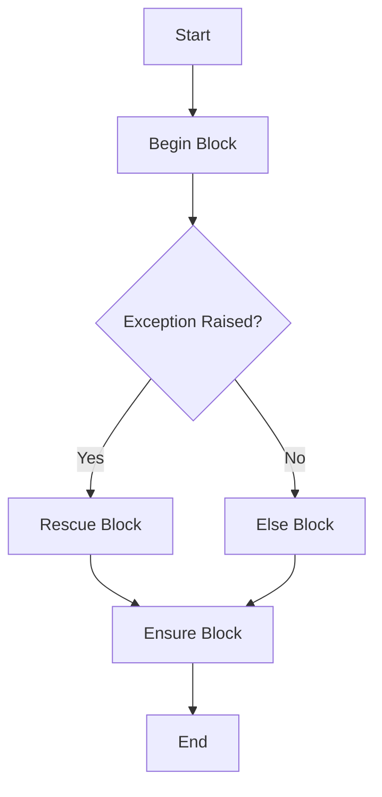

## 3.3 Exception Handling and Raising

In the world of software development, handling errors gracefully is crucial for building robust applications. Ruby, being a dynamic and expressive language, offers a powerful mechanism for managing exceptions. In this section, we'll explore Ruby's exception handling constructs, learn how to raise exceptions, and create custom exception classes. We'll also delve into best practices to ensure your Ruby applications are both resilient and maintainable.

### Understanding Ruby's Exception Handling Constructs

Ruby provides a structured way to handle exceptions using the `begin`, `rescue`, `ensure`, and `else` keywords. These constructs allow developers to manage errors effectively, ensuring that the application can recover from unexpected situations without crashing.

#### The `begin` and `rescue` Blocks

The `begin` block is where you place the code that might raise an exception. If an exception occurs, Ruby will look for a matching `rescue` block to handle it.

```ruby
begin
  # Code that might raise an exception
  result = 10 / 0
rescue ZeroDivisionError => e
  puts "Error: #{e.message}"
end
```

In this example, dividing by zero raises a `ZeroDivisionError`, which is then caught by the `rescue` block. The error message is printed, allowing the program to continue running.

#### Using `ensure` for Cleanup

The `ensure` block is executed regardless of whether an exception was raised or not. It's typically used for cleanup tasks, such as closing files or releasing resources.

```ruby
file = File.open("example.txt", "w")
begin
  # Perform file operations
  file.puts("Hello, World!")
rescue IOError => e
  puts "IOError: #{e.message}"
ensure
  file.close
end
```

Here, the `ensure` block ensures that the file is closed, even if an `IOError` occurs during the file operations.

#### The `else` Block

The `else` block is executed if no exceptions are raised in the `begin` block. It's useful for code that should only run if everything goes smoothly.

```ruby
begin
  # Code that might raise an exception
  result = 10 / 2
rescue ZeroDivisionError => e
  puts "Error: #{e.message}"
else
  puts "Result is #{result}"
end
```

In this case, since no exception is raised, the `else` block executes, printing the result.

### Raising Exceptions with `raise`

The `raise` keyword is used to explicitly raise an exception. This can be useful for signaling errors in your code or enforcing certain conditions.

```ruby
def divide(a, b)
  raise ArgumentError, "Divider cannot be zero" if b.zero?
  a / b
end

begin
  divide(10, 0)
rescue ArgumentError => e
  puts "Caught an exception: #{e.message}"
end
```

In this example, `raise` is used to throw an `ArgumentError` if the divider is zero, which is then caught and handled in the `rescue` block.

### Creating Custom Exception Classes

Ruby allows you to define custom exception classes by subclassing `StandardError`. This is useful for creating domain-specific exceptions that can be handled separately from standard exceptions.

```ruby
class CustomError < StandardError; end

def risky_operation
  raise CustomError, "Something went wrong!"
end

begin
  risky_operation
rescue CustomError => e
  puts "Caught a custom exception: #{e.message}"
end
```

By creating a `CustomError` class, you can raise and rescue this specific exception, providing more granular control over error handling.

### Handling Specific vs. General Exceptions

When rescuing exceptions, it's generally better to handle specific exceptions rather than rescuing all exceptions. This approach prevents catching unexpected errors that might indicate bugs in your code.

```ruby
begin
  # Code that might raise an exception
  result = 10 / 0
rescue ZeroDivisionError => e
  puts "Caught a ZeroDivisionError: #{e.message}"
rescue StandardError => e
  puts "Caught a StandardError: #{e.message}"
end
```

In this example, the `ZeroDivisionError` is handled separately from other `StandardError` exceptions, allowing for more precise error management.

### Best Practices for Exception Handling

1. **Avoid Rescuing `Exception`**: Rescuing the base `Exception` class can catch system-level exceptions like `Interrupt` and `SystemExit`, which should generally be avoided. Instead, rescue from `StandardError` or specific subclasses.

2. **Use `ensure` for Cleanup**: Always use `ensure` to release resources or perform cleanup tasks, ensuring that your application remains stable even when exceptions occur.

3. **Raise Exceptions with Meaningful Messages**: When raising exceptions, provide clear and informative messages to help diagnose issues.

4. **Log Exceptions**: Consider logging exceptions to a file or monitoring system to track and analyze errors in production environments.

5. **Test Exception Handling**: Write tests to ensure that your exception handling logic works as expected, covering both normal and exceptional scenarios.

### Try It Yourself

Experiment with the following code by modifying the exception types and messages. Try adding additional `rescue` blocks or changing the conditions under which exceptions are raised.

```ruby
def calculate(a, b)
  raise ArgumentError, "Invalid input" if a.nil? || b.nil?
  a / b
end

begin
  calculate(nil, 5)
rescue ArgumentError => e
  puts "Caught an ArgumentError: #{e.message}"
rescue ZeroDivisionError => e
  puts "Caught a ZeroDivisionError: #{e.message}"
ensure
  puts "Calculation attempt completed."
end
```

### Visualizing Exception Handling Flow

To better understand the flow of exception handling in Ruby, let's visualize it using a flowchart.



This flowchart illustrates the sequence of execution when an exception is raised and how the `rescue`, `else`, and `ensure` blocks fit into the process.

### References and Further Reading

- [Ruby Exception Handling Documentation](https://ruby-doc.org/core-3.1.0/Exception.html)
- [Effective Exception Handling in Ruby](https://www.rubyguides.com/2019/06/ruby-exceptions/)
- [Best Practices for Exception Handling](https://www.rubyguides.com/2019/06/ruby-exceptions/)

### Knowledge Check

- What is the purpose of the `ensure` block in Ruby exception handling?
- How can you create a custom exception class in Ruby?
- Why is it important to avoid rescuing the base `Exception` class?

### Embrace the Journey

Remember, mastering exception handling is a crucial step in becoming a proficient Ruby developer. As you continue to explore Ruby's features, keep experimenting with different error handling strategies. Stay curious and enjoy the journey!

## Quiz: Exception Handling and Raising



### What is the purpose of the `ensure` block in Ruby exception handling?

- [x] To execute code regardless of whether an exception was raised
- [ ] To handle specific exceptions
- [ ] To raise exceptions
- [ ] To define custom exceptions

> **Explanation:** The `ensure` block is used to execute code regardless of whether an exception was raised, typically for cleanup tasks.

### How can you create a custom exception class in Ruby?

- [x] By subclassing `StandardError`
- [ ] By subclassing `Exception`
- [ ] By using the `raise` keyword
- [ ] By defining a method

> **Explanation:** Custom exception classes are created by subclassing `StandardError`, which allows for domain-specific error handling.

### Why is it important to avoid rescuing the base `Exception` class?

- [x] It can catch system-level exceptions that should not be rescued
- [ ] It makes the code more readable
- [ ] It improves performance
- [ ] It is not supported in Ruby

> **Explanation:** Rescuing the base `Exception` class can catch system-level exceptions like `Interrupt` and `SystemExit`, which should generally be avoided.

### Which keyword is used to explicitly raise an exception in Ruby?

- [x] `raise`
- [ ] `rescue`
- [ ] `ensure`
- [ ] `begin`

> **Explanation:** The `raise` keyword is used to explicitly raise an exception in Ruby.

### What is the role of the `else` block in Ruby exception handling?

- [x] To execute code if no exceptions are raised
- [ ] To handle exceptions
- [ ] To raise exceptions
- [ ] To define custom exceptions

> **Explanation:** The `else` block is executed if no exceptions are raised in the `begin` block.

### What should you include when raising exceptions to help diagnose issues?

- [x] Meaningful messages
- [ ] Random numbers
- [ ] Empty strings
- [ ] System calls

> **Explanation:** Providing meaningful messages when raising exceptions helps diagnose issues more effectively.

### What is the best practice for logging exceptions?

- [x] Log exceptions to a file or monitoring system
- [ ] Ignore exceptions
- [ ] Print exceptions to the console
- [ ] Use random logging methods

> **Explanation:** Logging exceptions to a file or monitoring system helps track and analyze errors in production environments.

### What is the benefit of handling specific exceptions rather than general ones?

- [x] More precise error management
- [ ] Faster code execution
- [ ] Less code to write
- [ ] Easier to read

> **Explanation:** Handling specific exceptions allows for more precise error management and prevents catching unexpected errors.

### What is the result of the following code snippet?

```ruby
begin
  result = 10 / 0
rescue ZeroDivisionError => e
  puts "Caught a ZeroDivisionError: #{e.message}"
end
```

- [x] "Caught a ZeroDivisionError: divided by 0"
- [ ] "Caught a StandardError: divided by 0"
- [ ] "Caught an ArgumentError: divided by 0"
- [ ] No output

> **Explanation:** The code raises a `ZeroDivisionError`, which is caught by the `rescue` block, printing the error message.

### True or False: The `ensure` block is optional in Ruby exception handling.

- [x] True
- [ ] False

> **Explanation:** The `ensure` block is optional in Ruby exception handling, but it is useful for cleanup tasks.




