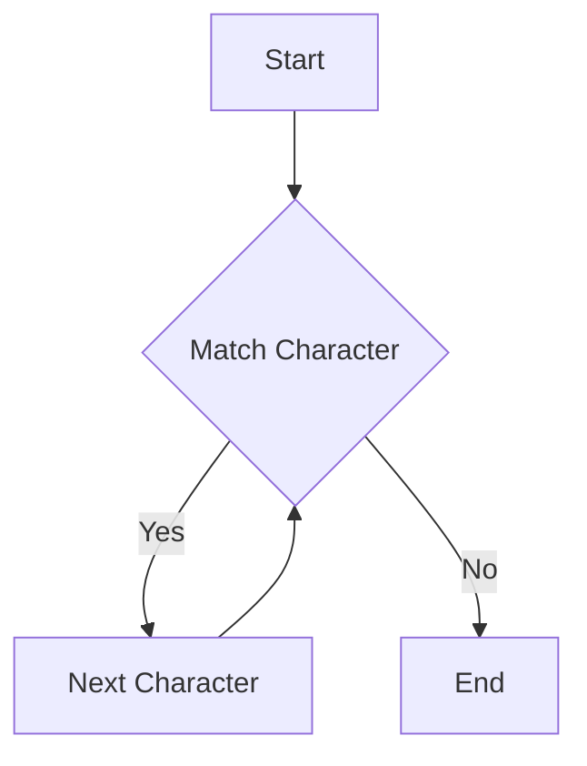

## 3.4 Regular Expressions and String Manipulation

In the world of Ruby programming, regular expressions (regex) and string manipulation are indispensable tools. They allow developers to efficiently search, parse, and transform text data, which is a common requirement in many applications. In this section, we will delve into Ruby's robust support for regular expressions and explore various string manipulation techniques. We'll cover the syntax, common patterns, and methods like `match`, `gsub`, `scan`, and `split`. Additionally, we'll discuss performance considerations and best practices for working with large texts.

### Understanding Regular Expressions in Ruby

Regular expressions are sequences of characters that define a search pattern. They are used for pattern matching within strings. Ruby's regex capabilities are built into the language, making it easy to integrate them into your code.

#### Basic Regex Syntax

Let's start by understanding the basic syntax of regular expressions in Ruby:

- **Literal Characters**: Match themselves. For example, `/abc/` matches the string "abc".
- **Metacharacters**: Special characters with specific meanings, such as `.` (any character), `*` (zero or more), `+` (one or more), `?` (zero or one), `^` (beginning of line), and `$` (end of line).
- **Character Classes**: Defined using square brackets, e.g., `[abc]` matches any of the characters 'a', 'b', or 'c'.
- **Predefined Character Classes**: Include `\d` (digits), `\w` (word characters), `\s` (whitespace), and their uppercase counterparts for negation.
- **Quantifiers**: Specify the number of occurrences, e.g., `{n}`, `{n,}`, `{n,m}`.
- **Groups and Captures**: Parentheses `()` are used to group patterns and capture matches.
- **Alternation**: The pipe `|` is used for logical OR operations.

#### Example: Basic Regex

```ruby
pattern = /hello/
puts "hello world".match?(pattern) # Output: true
```

### Common Regex Patterns

Understanding common regex patterns can greatly enhance your ability to manipulate strings. Here are some frequently used patterns:

- **Email Validation**: `/\A[\w+\-.]+@[a-z\d\-.]+\.[a-z]+\z/i`
- **Phone Number**: `/\\(?\d{3}\\)?[-.\s]?\d{3}[-.\s]?\d{4}/`
- **URL Matching**: `/\b((http|https):\/\/)?[a-z0-9-]+(\.[a-z0-9-]+)+([/?].*)?\b/i`

### Ruby Methods for Regex and String Manipulation

Ruby provides several methods for working with regular expressions and strings. Let's explore some of the most commonly used ones.

#### The `match` Method

The `match` method checks if a string matches a regex pattern and returns a `MatchData` object if a match is found.

```ruby
pattern = /world/
match_data = "hello world".match(pattern)
puts match_data[0] # Output: "world"
```

#### The `gsub` Method

The `gsub` method is used to replace all occurrences of a pattern with a specified replacement.

```ruby
text = "hello world"
new_text = text.gsub(/world/, "Ruby")
puts new_text # Output: "hello Ruby"
```

#### The `scan` Method

The `scan` method returns an array of all matches for a pattern.

```ruby
text = "one two three"
matches = text.scan(/\w+/)
puts matches.inspect # Output: ["one", "two", "three"]
```

#### The `split` Method

The `split` method divides a string into an array based on a pattern.

```ruby
text = "one, two, three"
parts = text.split(/,\s*/)
puts parts.inspect # Output: ["one", "two", "three"]
```

### Parsing and Validating Strings

Regular expressions are powerful for parsing and validating strings. Let's look at some examples.

#### Parsing CSV Data

```ruby
csv_data = "name,age,city\nJohn,30,New York\nJane,25,Los Angeles"
rows = csv_data.split("\n")
rows.each do |row|
  columns = row.split(",")
  puts columns.inspect
end
```

#### Validating Email Addresses

```ruby
def valid_email?(email)
  pattern = /\A[\w+\-.]+@[a-z\d\-.]+\.[a-z]+\z/i
  email.match?(pattern)
end

puts valid_email?("test@example.com") # Output: true
puts valid_email?("invalid-email")    # Output: false
```

### Performance Considerations

When working with large texts, performance becomes crucial. Here are some tips:

- **Optimize Patterns**: Avoid overly complex patterns that can slow down matching.
- **Use Non-Capturing Groups**: Use `(?:...)` for groups that don't need capturing to improve performance.
- **Benchmarking**: Use Ruby's `Benchmark` module to measure and optimize regex performance.

### Testing Regular Expressions

Thoroughly testing your regular expressions is essential to ensure they work as expected. Consider using tools like [Rubular](https://rubular.com/) for testing and visualizing regex patterns.

### Try It Yourself

Experiment with the following code examples to deepen your understanding:

1. Modify the `gsub` example to replace multiple words.
2. Create a regex pattern to extract domain names from URLs.
3. Write a method to validate phone numbers using regex.

### Visualizing Regex Patterns

To better understand how regex patterns work, let's visualize a simple regex pattern using a flowchart.



### References and Links

For further reading on regular expressions and string manipulation in Ruby, consider the following resources:

- [Ruby Regular Expressions - Ruby Docs](https://ruby-doc.org/core-3.0.0/Regexp.html)
- [Regular Expressions - MDN Web Docs](https://developer.mozilla.org/en-US/docs/Web/JavaScript/Guide/Regular_Expressions)
- [Rubular - Ruby Regex Tester](https://rubular.com/)

### Knowledge Check

- What is the purpose of the `gsub` method in Ruby?
- How can you validate an email address using regex?
- What are some performance considerations when working with regex?

### Embrace the Journey

Remember, mastering regular expressions and string manipulation is a journey. As you progress, you'll find new ways to leverage these powerful tools in your applications. Keep experimenting, stay curious, and enjoy the process!

## Quiz: Regular Expressions and String Manipulation



### What does the `match` method return when a pattern is found?

- [x] A `MatchData` object
- [ ] A boolean value
- [ ] An array of matches
- [ ] A string

> **Explanation:** The `match` method returns a `MatchData` object when a pattern is found.

### Which method is used to replace all occurrences of a pattern in a string?

- [ ] `match`
- [x] `gsub`
- [ ] `scan`
- [ ] `split`

> **Explanation:** The `gsub` method is used to replace all occurrences of a pattern in a string.

### How do you define a non-capturing group in a regex pattern?

- [ ] `()`
- [x] `(?:)`
- [ ] `[]`
- [ ] `{}`

> **Explanation:** Non-capturing groups are defined using `(?:...)`.

### What is the purpose of the `scan` method?

- [ ] To replace patterns
- [ ] To split strings
- [x] To find all matches
- [ ] To validate strings

> **Explanation:** The `scan` method is used to find all matches of a pattern in a string.

### Which character class matches any digit?

- [ ] `\w`
- [x] `\d`
- [ ] `\s`
- [ ] `\D`

> **Explanation:** The `\d` character class matches any digit.

### What is the output of `"hello world".match(/world/)[0]`?

- [ ] `hello`
- [x] `world`
- [ ] `nil`
- [ ] `true`

> **Explanation:** The `match` method returns a `MatchData` object, and `[0]` accesses the matched string "world".

### Which method divides a string into an array based on a pattern?

- [ ] `gsub`
- [ ] `match`
- [ ] `scan`
- [x] `split`

> **Explanation:** The `split` method divides a string into an array based on a pattern.

### What does the `\s` character class match?

- [ ] Any digit
- [ ] Any word character
- [x] Any whitespace
- [ ] Any non-whitespace

> **Explanation:** The `\s` character class matches any whitespace character.

### How can you optimize regex performance?

- [x] Use non-capturing groups
- [ ] Use complex patterns
- [ ] Avoid benchmarking
- [ ] Use capturing groups

> **Explanation:** Using non-capturing groups can improve regex performance by reducing unnecessary captures.

### True or False: Regular expressions can only be used for string validation.

- [ ] True
- [x] False

> **Explanation:** Regular expressions can be used for various tasks, including searching, parsing, and transforming strings.




