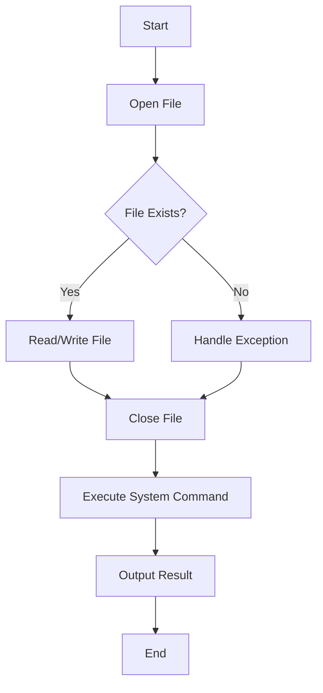

## 3.5 File I/O and System Interaction

In this section, we delve into the essential aspects of file input/output (I/O) operations and system interaction in Ruby. Understanding these concepts is crucial for building robust applications that can efficiently handle data and interact with the operating system. We'll explore reading from and writing to files, executing system commands, and ensuring secure and efficient resource management.

### Introduction to File I/O in Ruby

File I/O operations are fundamental to many applications, enabling them to read from and write to files, which are essential for data persistence and manipulation. Ruby provides a rich set of classes and methods to handle file operations efficiently.

#### The `File` and `IO` Classes

Ruby's `File` and `IO` classes are the primary interfaces for file operations. The `File` class is a subclass of `IO`, providing additional methods specific to file handling.

- **File**: Represents a file and provides methods for reading, writing, and manipulating files.
- **IO**: Represents an input/output stream, providing methods for reading from and writing to streams.

### Reading from Files

Reading data from files is a common requirement in many applications. Ruby provides several methods to read files, each suited for different use cases.

#### Reading Entire File Content

To read the entire content of a file, you can use the `File.read` method. This method reads the entire file into a string.

```ruby
# Read the entire content of a file
file_content = File.read('example.txt')
puts file_content
```

#### Reading File Line by Line

For large files, reading the entire content at once may not be efficient. Instead, you can read the file line by line using `File.foreach`.

```ruby
# Read file line by line
File.foreach('example.txt') do |line|
  puts line
end
```

#### Using `IO.readlines`

The `IO.readlines` method reads all lines of a file into an array, where each element is a line from the file.

```ruby
# Read all lines into an array
lines = IO.readlines('example.txt')
lines.each { |line| puts line }
```

### Writing to Files

Writing data to files is equally important. Ruby provides several methods to write data to files, allowing you to choose the most suitable approach for your needs.

#### Writing with `File.write`

The `File.write` method writes data to a file, creating the file if it doesn't exist or overwriting it if it does.

```ruby
# Write data to a file
File.write('output.txt', "Hello, Ruby!\n")
```

#### Using `File.open` for Writing

For more control over file writing, you can use `File.open` with a block. This method ensures the file is properly closed after writing.

```ruby
# Open a file for writing
File.open('output.txt', 'w') do |file|
  file.puts "Hello, Ruby!"
end
```

### File Modes and Path Handling

Understanding file modes and path handling is crucial for effective file operations.

#### File Modes

File modes determine how a file is opened and manipulated. Common modes include:

- `'r'`: Read-only
- `'w'`: Write-only (truncates existing file)
- `'a'`: Append (write-only, starts at end of file)
- `'r+'`: Read and write
- `'w+'`: Read and write (truncates existing file)
- `'a+'`: Read and append

```ruby
# Open a file in append mode
File.open('output.txt', 'a') do |file|
  file.puts "Appending a new line."
end
```

#### Handling File Paths

Ruby provides methods to handle file paths, ensuring compatibility across different operating systems.

- **`File.join`**: Joins multiple strings into a single path.
- **`File.expand_path`**: Converts a relative path to an absolute path.

```ruby
# Join paths
path = File.join('directory', 'subdirectory', 'file.txt')
puts path

# Expand relative path to absolute
absolute_path = File.expand_path('~/file.txt')
puts absolute_path
```

### File Manipulation Methods

Ruby offers various methods to manipulate files, such as renaming, deleting, and checking existence.

#### Renaming and Deleting Files

- **`File.rename`**: Renames a file.
- **`File.delete`**: Deletes a file.

```ruby
# Rename a file
File.rename('old_name.txt', 'new_name.txt')

# Delete a file
File.delete('unnecessary_file.txt')
```

#### Checking File Existence

- **`File.exist?`**: Checks if a file exists.
- **`File.directory?`**: Checks if a path is a directory.

```ruby
# Check if a file exists
puts File.exist?('example.txt') ? 'File exists' : 'File does not exist'

# Check if a path is a directory
puts File.directory?('directory') ? 'Is a directory' : 'Not a directory'
```

### Executing System Commands

Ruby allows you to execute system commands directly from your code, providing powerful capabilities for interacting with the operating system.

#### Using Backticks and `%x{}`

You can execute system commands using backticks or the `%x{}` syntax. Both return the standard output of the command as a string.

```ruby
# Execute a system command using backticks
output = `ls`
puts output

# Execute a system command using %x{}
output = %x{ls}
puts output
```

### Handling Exceptions and Resource Management

When performing file I/O and system interactions, it's crucial to handle exceptions and ensure resources are properly managed.

#### Exception Handling

Use `begin...rescue...end` blocks to handle exceptions and ensure your application can gracefully recover from errors.

```ruby
begin
  File.open('non_existent_file.txt', 'r') do |file|
    puts file.read
  end
rescue Errno::ENOENT => e
  puts "File not found: #{e.message}"
end
```

#### Ensuring Resource Closure

Use blocks with `File.open` to ensure files are automatically closed after operations, preventing resource leaks.

```ruby
# Automatically close file after reading
File.open('example.txt', 'r') do |file|
  puts file.read
end
```

### Best Practices for Security

When interacting with the file system and executing system commands, it's essential to follow best practices for security.

#### Avoiding Command Injection

Always validate and sanitize user inputs to prevent command injection attacks.

```ruby
# Unsafe: Directly using user input in system command
user_input = "some_input"
output = `ls #{user_input}`

# Safe: Validate and sanitize user input
sanitized_input = Shellwords.escape(user_input)
output = `ls #{sanitized_input}`
```

#### Using Secure File Permissions

Set appropriate file permissions to restrict access and prevent unauthorized modifications.

```ruby
# Set file permissions to read-only for owner
File.chmod(0400, 'sensitive_file.txt')
```

### Try It Yourself

Now that we've covered the basics, try experimenting with the code examples. Modify the file paths, change file modes, or execute different system commands to see how Ruby handles these operations. Remember, practice is key to mastering file I/O and system interaction in Ruby.

### Visualizing File I/O and System Interaction

To better understand the flow of file I/O operations and system interaction, let's visualize the process using a flowchart.



This flowchart illustrates the typical process of opening a file, performing read/write operations, handling exceptions, and executing system commands.

### Summary

In this section, we've explored the fundamental concepts of file I/O and system interaction in Ruby. We've learned how to read from and write to files, execute system commands, and ensure secure and efficient resource management. By following best practices and experimenting with the examples provided, you can build robust applications that effectively interact with the file system and operating system.

## Quiz: File I/O and System Interaction



### What class in Ruby is primarily used for file operations?

- [x] File
- [ ] String
- [ ] Array
- [ ] Hash

> **Explanation:** The `File` class in Ruby is specifically designed for file operations, providing methods for reading, writing, and manipulating files.

### Which method reads the entire content of a file into a string?

- [x] File.read
- [ ] File.write
- [ ] File.open
- [ ] File.foreach

> **Explanation:** `File.read` reads the entire content of a file into a string, making it suitable for smaller files.

### What file mode should you use to append data to an existing file?

- [ ] 'r'
- [ ] 'w'
- [x] 'a'
- [ ] 'r+'

> **Explanation:** The 'a' mode opens a file for appending, allowing you to add data to the end of the file without truncating it.

### How can you execute a system command in Ruby?

- [x] Using backticks
- [ ] Using File.open
- [ ] Using File.read
- [ ] Using File.write

> **Explanation:** You can execute system commands in Ruby using backticks or the `%x{}` syntax, which returns the command's output.

### What should you do to prevent command injection attacks?

- [ ] Use File.write
- [x] Validate and sanitize user inputs
- [ ] Use File.read
- [ ] Use File.open

> **Explanation:** Validating and sanitizing user inputs is crucial to prevent command injection attacks when executing system commands.

### Which method ensures a file is automatically closed after operations?

- [ ] File.read
- [ ] File.write
- [x] File.open with a block
- [ ] File.foreach

> **Explanation:** Using `File.open` with a block ensures that the file is automatically closed after the block is executed, preventing resource leaks.

### How can you check if a file exists in Ruby?

- [x] File.exist?
- [ ] File.write
- [ ] File.read
- [ ] File.open

> **Explanation:** `File.exist?` checks if a file exists at the specified path, returning true if it does and false otherwise.

### What is the purpose of `File.join`?

- [x] To join multiple strings into a single path
- [ ] To read a file
- [ ] To write to a file
- [ ] To execute a system command

> **Explanation:** `File.join` is used to join multiple strings into a single path, ensuring compatibility across different operating systems.

### Which method reads all lines of a file into an array?

- [ ] File.read
- [x] IO.readlines
- [ ] File.write
- [ ] File.open

> **Explanation:** `IO.readlines` reads all lines of a file into an array, with each element representing a line from the file.

### True or False: `File.chmod` is used to change file permissions.

- [x] True
- [ ] False

> **Explanation:** `File.chmod` is used to change the permissions of a file, allowing you to set read, write, and execute permissions.



Remember, mastering file I/O and system interaction in Ruby is a journey. Keep experimenting, stay curious, and enjoy the process of learning and building robust applications!
