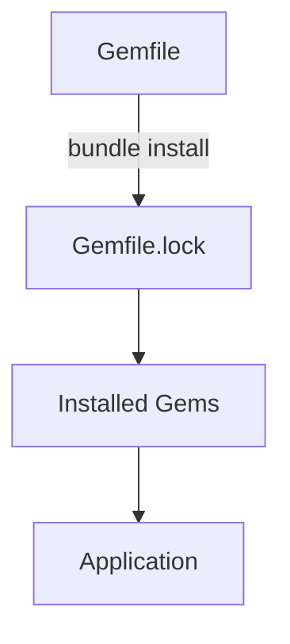

## 3.6 Gems and Dependency Management with Bundler

In the world of Ruby development, managing external libraries and dependencies is crucial for building scalable and maintainable applications. This section will guide you through the essentials of using RubyGems and Bundler, two powerful tools that streamline the process of managing Ruby libraries and their dependencies.

### Understanding RubyGems

RubyGems is the standard package manager for Ruby, allowing developers to distribute and install libraries, known as "gems." Gems are self-contained packages that include Ruby code, documentation, and a gemspec file that describes the gem's dependencies and metadata.

#### What Are Gems?

Gems extend Ruby's functionality by providing reusable code libraries. They can range from simple utility libraries to complex frameworks like Rails. Each gem is versioned, allowing developers to specify which version they want to use in their projects.

**Example of a Gem:**

```ruby
# A simple gemspec file for a hypothetical gem
Gem::Specification.new do |spec|
  spec.name        = "example_gem"
  spec.version     = "0.1.0"
  spec.summary     = "An example gem for demonstration purposes"
  spec.files       = Dir["lib/**/*.rb"]
  spec.require_paths = ["lib"]
end
```

#### Installing Gems

To install a gem, you can use the `gem install` command followed by the gem's name. For example, to install the `nokogiri` gem, you would run:

```bash
gem install nokogiri
```

This command downloads the gem and its dependencies, making them available for use in your Ruby environment.

### Introducing Bundler

Bundler is a tool that manages gem dependencies for Ruby applications. It ensures that the right versions of gems are installed and loaded, providing a consistent environment across different machines and deployments.

#### Why Use Bundler?

- **Consistency**: Bundler ensures that all developers and environments use the same gem versions.
- **Dependency Resolution**: It automatically resolves gem dependencies, preventing conflicts.
- **Environment Isolation**: Bundler can create isolated environments, preventing gem version clashes.

### Setting Up Bundler in a Ruby Project

To start using Bundler, you need to create a `Gemfile` in your project's root directory. The `Gemfile` lists all the gems your project depends on.

#### Creating a Gemfile

Here's an example `Gemfile` for a simple Ruby project:

```ruby
# Gemfile

source "https://rubygems.org"

gem "rails", "~> 6.1"
gem "pg", "~> 1.2"
gem "puma", "~> 5.0"
gem "sass-rails", ">= 6"
gem "webpacker", "~> 5.0"
gem "turbolinks", "~> 5"
gem "jbuilder", "~> 2.7"
```

#### Running `bundle install`

Once your `Gemfile` is ready, run the following command to install the specified gems:

```bash
bundle install
```

This command installs all the gems listed in the `Gemfile` and their dependencies, creating a `Gemfile.lock` file that locks the gem versions.

### Managing Gem Versions and Avoiding Conflicts

Bundler allows you to specify gem versions using version constraints. These constraints help avoid conflicts by ensuring that only compatible versions are installed.

#### Version Constraints

- **Exact Version**: `gem "rails", "6.1.4"`
- **Minimum Version**: `gem "rails", ">= 6.1"`
- **Pessimistic Version Constraint**: `gem "rails", "~> 6.1"` (allows updates to 6.x but not 7.x)

#### Resolving Conflicts

If you encounter conflicts, Bundler provides helpful error messages to guide you in resolving them. You can adjust version constraints in the `Gemfile` or use the `bundle update` command to update gems.

### Advanced Bundler Features

Bundler offers several advanced features to enhance your workflow:

#### Groups

You can group gems in the `Gemfile` to load them conditionally. For example, you might want to load certain gems only in development or test environments:

```ruby
group :development, :test do
  gem "rspec-rails", "~> 5.0"
  gem "pry", "~> 0.14.1"
end
```

#### Executing Bundled Commands

Bundler allows you to run commands in the context of your bundle using `bundle exec`. This ensures that the correct versions of gems are used:

```bash
bundle exec rails server
```

#### Gemfile.lock

The `Gemfile.lock` file records the exact versions of gems installed, ensuring consistency across environments. It's important to commit this file to version control.

### Visualizing Dependency Management

To better understand how Bundler manages dependencies, let's visualize the process using a Mermaid.js diagram:



**Diagram Description:** This diagram illustrates the flow of dependency management in a Ruby project using Bundler. The `Gemfile` specifies dependencies, `bundle install` generates the `Gemfile.lock`, and the locked versions are installed, ensuring consistency for the application.

### Try It Yourself

To solidify your understanding, try modifying the `Gemfile` in a sample project:

1. Add a new gem, such as `faker`, to the `Gemfile`.
2. Run `bundle install` to install the gem.
3. Use `bundle exec` to run a Ruby script that utilizes the `faker` gem.

### External Resources

For further reading and resources, check out the following links:

- [RubyGems](https://rubygems.org/)
- [Bundler](https://bundler.io/)

### Knowledge Check

Before moving on, consider these questions to test your understanding:

- What is the purpose of the `Gemfile.lock` file?
- How do you specify a minimum version for a gem in the `Gemfile`?
- Why is it important to use `bundle exec` when running commands?

### Summary

In this section, we've explored the essentials of managing Ruby gems and dependencies using Bundler. By understanding how to use these tools effectively, you can ensure that your Ruby applications are scalable, maintainable, and consistent across different environments.

Remember, mastering dependency management is a crucial step in building robust Ruby applications. Keep experimenting, stay curious, and enjoy the journey!

## Quiz: Gems and Dependency Management with Bundler



### What is the primary purpose of Bundler in Ruby projects?

- [x] To manage gem dependencies and ensure consistent environments
- [ ] To compile Ruby code into machine code
- [ ] To provide a graphical user interface for Ruby applications
- [ ] To optimize Ruby code for performance

> **Explanation:** Bundler is used to manage gem dependencies and ensure that the same versions are used across different environments.

### How do you specify a gem version in a Gemfile to allow updates only within the same major version?

- [ ] `gem "rails", ">= 6.1"`
- [x] `gem "rails", "~> 6.1"`
- [ ] `gem "rails", "= 6.1"`
- [ ] `gem "rails", "< 6.1"`

> **Explanation:** The pessimistic version constraint `~> 6.1` allows updates within the same major version, such as 6.1.x.

### What command do you use to install gems specified in a Gemfile?

- [ ] `gem install`
- [x] `bundle install`
- [ ] `gem setup`
- [ ] `bundle setup`

> **Explanation:** `bundle install` is used to install the gems specified in a Gemfile along with their dependencies.

### What file does Bundler create to lock gem versions?

- [ ] Gemfile
- [x] Gemfile.lock
- [ ] Gemfile.json
- [ ] Gemfile.yaml

> **Explanation:** Bundler creates a `Gemfile.lock` file to lock the versions of gems installed.

### Which command ensures that the correct versions of gems are used when running a Ruby script?

- [ ] `ruby script.rb`
- [x] `bundle exec ruby script.rb`
- [ ] `gem exec ruby script.rb`
- [ ] `ruby exec script.rb`

> **Explanation:** `bundle exec` ensures that the correct versions of gems are used when running a Ruby script.

### What is the purpose of grouping gems in a Gemfile?

- [x] To load gems conditionally based on the environment
- [ ] To increase the performance of gem installation
- [ ] To reduce the size of the Gemfile
- [ ] To automatically update gems

> **Explanation:** Grouping gems allows you to load them conditionally based on the environment, such as development or test.

### What does the `~>` operator in a Gemfile signify?

- [x] It allows updates within the same major version
- [ ] It specifies an exact version
- [ ] It allows updates to any version
- [ ] It prevents any updates

> **Explanation:** The `~>` operator allows updates within the same major version, providing flexibility while maintaining compatibility.

### How can you resolve gem conflicts in a project?

- [x] Adjust version constraints in the Gemfile or use `bundle update`
- [ ] Delete the Gemfile.lock and rerun `bundle install`
- [ ] Use `gem install` to manually install conflicting gems
- [ ] Ignore the conflicts and proceed with development

> **Explanation:** Adjusting version constraints in the Gemfile or using `bundle update` can help resolve gem conflicts.

### What is the role of the `Gemfile.lock` in a Ruby project?

- [x] To lock the versions of gems installed for consistency
- [ ] To list all available gems for a project
- [ ] To provide documentation for each gem
- [ ] To optimize gem performance

> **Explanation:** The `Gemfile.lock` locks the versions of gems installed, ensuring consistency across environments.

### True or False: Bundler can create isolated environments to prevent gem version clashes.

- [x] True
- [ ] False

> **Explanation:** Bundler can create isolated environments, preventing gem version clashes and ensuring consistent dependencies.


