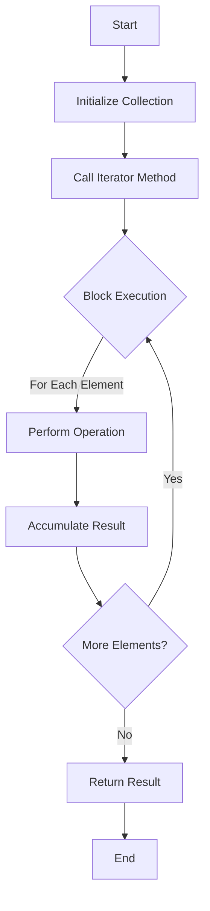

## 3.8 Writing Idiomatic Ruby Code

Writing idiomatic Ruby code is about embracing the language's conventions and patterns to produce code that is not only functional but also elegant and easy to understand. In this section, we will explore the key aspects of idiomatic Ruby, including common idioms, patterns, and best practices that will help you write code that is more readable, expressive, and maintainable.

### Understanding Idiomatic Ruby

Idiomatic Ruby refers to the practice of writing code that aligns with the language's conventions and community standards. This involves using Ruby's unique features and syntactic sugar to create code that is concise and expressive. By writing idiomatic Ruby, you make your code more accessible to other Ruby developers, facilitating collaboration and maintenance.

#### Key Characteristics of Idiomatic Ruby

1. **Readability**: Code should be easy to read and understand.
2. **Expressiveness**: Use Ruby's expressive syntax to convey intent clearly.
3. **Conciseness**: Avoid unnecessary verbosity; use Ruby's features to write succinct code.
4. **Consistency**: Follow established conventions and style guides.
5. **Maintainability**: Write code that is easy to modify and extend.

### Common Ruby Idioms and Patterns

Let's explore some common idioms and patterns that are considered idiomatic in Ruby.

#### Using Symbols

Symbols are a fundamental part of Ruby and are often used in place of strings for identifiers, keys, and labels. They are immutable and unique, making them more memory-efficient than strings.

**Example: Using Symbols as Hash Keys**

```ruby
# Before: Using strings as hash keys
person = { "name" => "Alice", "age" => 30 }

# After: Using symbols as hash keys
person = { name: "Alice", age: 30 }
```

**Explanation**: Symbols are preferred over strings for hash keys because they are immutable and more efficient in terms of memory usage.

#### Blocks and Iterators

Blocks are a powerful feature in Ruby, allowing you to pass chunks of code to methods. They are often used with iterators to perform operations on collections.

**Example: Using Blocks with Iterators**

```ruby
# Before: Using a loop to iterate over an array
numbers = [1, 2, 3, 4, 5]
sum = 0
numbers.each do |number|
  sum += number
end

# After: Using the `inject` method with a block
sum = numbers.inject(0) { |total, number| total + number }
```

**Explanation**: The `inject` method with a block provides a more concise and expressive way to accumulate values from a collection.

#### Succinct Method Calls

Ruby allows for succinct method calls, especially when using blocks or default parameters.

**Example: Using Default Parameters**

```ruby
# Before: Explicitly checking for nil values
def greet(name = nil)
  name ||= "Guest"
  puts "Hello, #{name}!"
end

# After: Using default parameters
def greet(name = "Guest")
  puts "Hello, #{name}!"
end
```

**Explanation**: Using default parameters simplifies the method definition and eliminates the need for additional logic to handle nil values.

#### Emphasizing Readability Over Cleverness

While Ruby allows for clever and complex code, it's important to prioritize readability. Code should be easy to understand for others who may work on it in the future.

**Example: Avoiding Clever Code**

```ruby
# Before: Clever but hard to read
def factorial(n)
  (1..n).reduce(:*)
end

# After: More readable
def factorial(n)
  result = 1
  (1..n).each { |i| result *= i }
  result
end
```

**Explanation**: While the first example is concise, the second example is more explicit and easier to understand.

### Best Practices for Writing Idiomatic Ruby Code

#### Follow Ruby Style Guides

Adhering to style guides, such as the [Ruby Style Guide](https://rubystyle.guide/), ensures consistency and readability across your codebase. These guides provide recommendations on naming conventions, indentation, and other stylistic elements.

#### Use Descriptive Naming

Choose descriptive names for variables, methods, and classes to convey their purpose clearly. Avoid abbreviations and single-letter names unless they are widely understood.

**Example: Descriptive Naming**

```ruby
# Before: Using non-descriptive names
def calc(a, b)
  a + b
end

# After: Using descriptive names
def calculate_sum(number1, number2)
  number1 + number2
end
```

**Explanation**: Descriptive names make the code self-documenting and easier to understand.

#### Leverage Ruby's Enumerable Module

The `Enumerable` module provides a collection of methods for traversing, searching, sorting, and manipulating collections. Using these methods can make your code more concise and expressive.

**Example: Using Enumerable Methods**

```ruby
# Before: Manually filtering an array
numbers = [1, 2, 3, 4, 5]
even_numbers = []
numbers.each do |number|
  even_numbers << number if number.even?
end

# After: Using the `select` method
even_numbers = numbers.select(&:even?)
```

**Explanation**: The `select` method provides a more concise and expressive way to filter collections.

#### Embrace Ruby's Object-Oriented Nature

Ruby is an object-oriented language, and embracing this paradigm can lead to more modular and reusable code. Use classes and modules to encapsulate behavior and data.

**Example: Encapsulating Behavior in a Class**

```ruby
# Before: Procedural approach
def print_greeting(name)
  puts "Hello, #{name}!"
end

print_greeting("Alice")

# After: Object-oriented approach
class Greeter
  def initialize(name)
    @name = name
  end

  def greet
    puts "Hello, #{@name}!"
  end
end

greeter = Greeter.new("Alice")
greeter.greet
```

**Explanation**: Encapsulating behavior in a class makes the code more modular and easier to extend.

### Try It Yourself

Experiment with the code examples provided in this section. Try modifying them to see how changes affect the output. For instance, you can:

- Change the hash keys from symbols to strings and observe the differences.
- Use different Enumerable methods, such as `map` or `reject`, to manipulate collections.
- Refactor procedural code into an object-oriented design.

### Visualizing Idiomatic Ruby

To better understand how idiomatic Ruby code flows, let's visualize the process of using blocks and iterators with a simple flowchart.



**Description**: This flowchart illustrates the process of using an iterator method with a block to perform operations on each element of a collection and accumulate the result.

### References and Further Reading

- [Ruby Style Guide](https://rubystyle.guide/)
- [Ruby Documentation](https://ruby-doc.org/)
- [Effective Ruby: 48 Specific Ways to Write Better Ruby](https://www.oreilly.com/library/view/effective-ruby-48/9780133846973/)

### Knowledge Check

1. What are the benefits of using symbols over strings in Ruby?
2. How can blocks enhance the expressiveness of Ruby code?
3. Why is it important to prioritize readability over cleverness in Ruby code?
4. What are some common methods provided by the Enumerable module?
5. How does encapsulating behavior in a class improve code maintainability?

### Embrace the Journey

Remember, writing idiomatic Ruby code is a journey, not a destination. As you continue to practice and refine your skills, you'll become more adept at leveraging Ruby's unique features to write code that is both elegant and efficient. Keep experimenting, stay curious, and enjoy the process of mastering Ruby!

## Quiz: Writing Idiomatic Ruby Code



### What is the primary benefit of using symbols over strings in Ruby?

- [x] Symbols are immutable and more memory-efficient.
- [ ] Symbols are faster to create than strings.
- [ ] Symbols can be used as method names.
- [ ] Symbols are always unique.

> **Explanation:** Symbols are immutable and more memory-efficient than strings, making them ideal for use as identifiers and keys.

### Which method is used to filter elements from a collection in Ruby?

- [ ] map
- [x] select
- [ ] inject
- [ ] reduce

> **Explanation:** The `select` method is used to filter elements from a collection based on a given condition.

### What is a key characteristic of idiomatic Ruby code?

- [ ] Complexity
- [x] Readability
- [ ] Verbosity
- [ ] Obfuscation

> **Explanation:** Readability is a key characteristic of idiomatic Ruby code, making it easier for others to understand and maintain.

### How can you make a method call more succinct in Ruby?

- [x] Use default parameters.
- [ ] Use global variables.
- [ ] Avoid using blocks.
- [ ] Use long method names.

> **Explanation:** Using default parameters can make method calls more succinct by eliminating the need for additional logic to handle default values.

### What is the purpose of the `inject` method in Ruby?

- [ ] To iterate over a collection
- [x] To accumulate a result from a collection
- [ ] To filter elements from a collection
- [ ] To map elements to a new collection

> **Explanation:** The `inject` method is used to accumulate a result from a collection by applying a block of code to each element.

### Why is it important to follow Ruby style guides?

- [x] To ensure consistency and readability
- [ ] To make code run faster
- [ ] To avoid using blocks
- [ ] To use more symbols

> **Explanation:** Following Ruby style guides ensures consistency and readability across your codebase, making it easier for others to understand and maintain.

### What is an advantage of using blocks in Ruby?

- [x] They allow passing chunks of code to methods.
- [ ] They make code run faster.
- [ ] They eliminate the need for loops.
- [ ] They are required for all method calls.

> **Explanation:** Blocks allow passing chunks of code to methods, enhancing the expressiveness and flexibility of Ruby code.

### How does encapsulating behavior in a class improve code?

- [x] It makes the code more modular and easier to extend.
- [ ] It makes the code run faster.
- [ ] It eliminates the need for variables.
- [ ] It requires fewer lines of code.

> **Explanation:** Encapsulating behavior in a class makes the code more modular and easier to extend, improving maintainability.

### What is the benefit of using descriptive names in code?

- [x] It makes the code self-documenting and easier to understand.
- [ ] It makes the code run faster.
- [ ] It reduces the number of lines of code.
- [ ] It allows for more complex logic.

> **Explanation:** Using descriptive names makes the code self-documenting and easier to understand, facilitating collaboration and maintenance.

### True or False: Writing idiomatic Ruby code is only about using the latest language features.

- [ ] True
- [x] False

> **Explanation:** Writing idiomatic Ruby code is about following conventions and best practices to create readable, expressive, and maintainable code, not just about using the latest language features.


