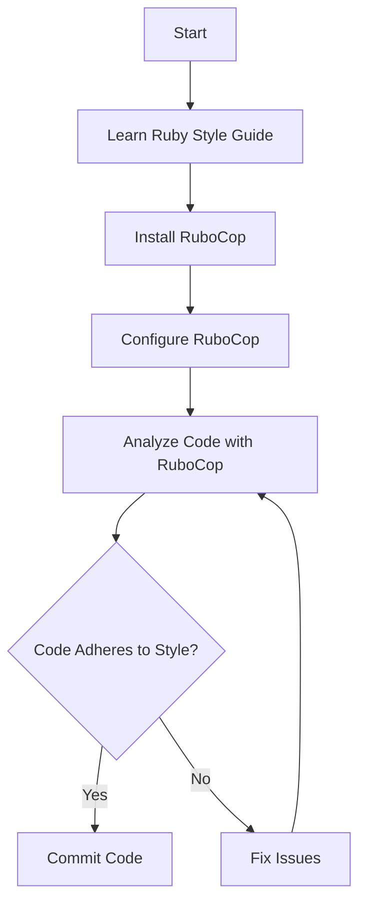

## 3.9 Ruby Style Guides and Standards

In the world of software development, consistency is key. This is especially true in Ruby, where the language's flexibility can lead to a multitude of coding styles. To maintain readability, maintainability, and quality across Ruby codebases, the community has established a set of style guides and standards. In this section, we will explore these guides, discuss key recommendations, and demonstrate how tools like RuboCop can help enforce these styles automatically.

### Introduction to Ruby Style Guides

Ruby style guides are documents that outline conventions and best practices for writing Ruby code. These guides are designed to help developers write code that is not only functional but also clean, readable, and consistent. By adhering to a common set of guidelines, developers can ensure that their code is easily understood by others, facilitating collaboration and reducing the likelihood of errors.

#### The Community Ruby Style Guide

One of the most prominent style guides in the Ruby community is the [Ruby Style Guide](https://rubystyle.guide/). This guide is a comprehensive document that covers a wide range of topics, from naming conventions to code layout and beyond. It is widely adopted by Ruby developers and serves as a de facto standard for writing Ruby code.

### Key Recommendations from the Ruby Style Guide

Let's delve into some of the key recommendations from the Ruby Style Guide. These guidelines are designed to promote consistency and readability in Ruby code.

#### Naming Conventions

Naming conventions are crucial for ensuring that code is easily understandable. The Ruby Style Guide provides several recommendations for naming:

- **Classes and Modules**: Use CamelCase for class and module names. For example, `MyClass` and `MyModule`.
- **Methods and Variables**: Use snake_case for method and variable names. For example, `my_method` and `my_variable`.
- **Constants**: Use ALL_CAPS for constants. For example, `MY_CONSTANT`.

#### Indentation and Whitespace

Proper indentation and whitespace usage are essential for maintaining code readability. The Ruby Style Guide recommends:

- **Indentation**: Use two spaces per indentation level. Avoid using tabs.
- **Line Length**: Limit lines to a maximum of 80 characters.
- **Blank Lines**: Use blank lines to separate logical sections of code.

#### Code Layout

The layout of your code can significantly impact its readability. The Ruby Style Guide suggests:

- **Method Definitions**: Define methods with a single line if they are short. Otherwise, use multiple lines with proper indentation.
- **Blocks**: Use `{}` for single-line blocks and `do...end` for multi-line blocks.

#### Example Code

Here is an example that demonstrates some of these style guidelines:

```ruby
# Class name in CamelCase
class MyClass
  # Constant in ALL_CAPS
  MY_CONSTANT = 10

  # Method name in snake_case
  def my_method
    # Variable name in snake_case
    my_variable = 20

    # Single-line block
    [1, 2, 3].each { |num| puts num }

    # Multi-line block
    [1, 2, 3].each do |num|
      puts num
    end
  end
end
```

### Tools for Enforcing Style: RuboCop

While it's important to understand and follow style guidelines, manually checking code for adherence can be tedious and error-prone. This is where tools like [RuboCop](https://rubocop.org/) come into play.

#### What is RuboCop?

RuboCop is a Ruby static code analyzer and formatter that helps enforce style guidelines. It automatically checks your code against a set of rules and can even fix some issues for you. RuboCop is highly configurable, allowing you to tailor it to your project's specific needs.

#### Using RuboCop

To get started with RuboCop, you need to install it and create a configuration file. Here's how you can do it:

1. **Install RuboCop**: Add RuboCop to your Gemfile and run `bundle install`.

   ```ruby
   gem 'rubocop', require: false
   ```

2. **Create a Configuration File**: Create a `.rubocop.yml` file in your project's root directory. This file allows you to customize RuboCop's behavior.

3. **Run RuboCop**: Use the `rubocop` command to analyze your code.

   ```bash
   bundle exec rubocop
   ```

#### Example RuboCop Configuration

Here is an example `.rubocop.yml` configuration file:

```yaml
# .rubocop.yml
AllCops:
  TargetRubyVersion: 3.0

Layout/LineLength:
  Max: 80

Metrics/MethodLength:
  Max: 10

Naming/VariableName:
  EnforcedStyle: snake_case
```

### Benefits of Following a Consistent Style

Adhering to a consistent style offers numerous benefits, especially in collaborative projects:

- **Improved Readability**: Consistent style makes code easier to read and understand, reducing the cognitive load on developers.
- **Facilitated Collaboration**: When everyone follows the same style, it's easier for team members to work together and review each other's code.
- **Reduced Errors**: Clear and consistent code is less prone to errors, as it minimizes misunderstandings and misinterpretations.
- **Enhanced Maintainability**: Consistent code is easier to maintain and refactor, as developers can quickly grasp the structure and logic.

### Encouraging Adherence to Community Standards

Encouraging adherence to community standards is crucial for fostering a collaborative and productive development environment. Here are some ways to promote adherence:

- **Code Reviews**: Conduct regular code reviews to ensure that code adheres to style guidelines. Provide constructive feedback to help developers improve.
- **Automated Tools**: Use tools like RuboCop to automatically enforce style guidelines and catch issues early.
- **Documentation**: Maintain clear and accessible documentation of your project's style guidelines. Ensure that all team members are familiar with them.
- **Training and Workshops**: Offer training sessions and workshops to help developers understand the importance of style guidelines and how to apply them.

### Visualizing Ruby Style Guide Adoption

To better understand the adoption of Ruby style guides, let's visualize the process using a Mermaid.js flowchart.



**Figure 1**: Flowchart illustrating the process of adopting Ruby style guides and using RuboCop for enforcement.

### Knowledge Check

Before we wrap up, let's pose a few questions to reinforce your understanding:

- Why is it important to follow a consistent style in Ruby code?
- What are some key recommendations from the Ruby Style Guide?
- How can RuboCop help enforce style guidelines automatically?

### Summary

In this section, we've explored the importance of Ruby style guides and standards in promoting consistency and quality across codebases. We've discussed key recommendations from the Ruby Style Guide, demonstrated how tools like RuboCop can enforce these styles, and highlighted the benefits of adhering to a consistent style. By following these guidelines, you can ensure that your Ruby code is clean, readable, and maintainable.

### Embrace the Journey

Remember, adopting a consistent style is just the beginning. As you progress in your Ruby development journey, continue to refine your skills, collaborate with others, and contribute to the community. Keep experimenting, stay curious, and enjoy the process of writing beautiful Ruby code!

### External Links

- [Ruby Style Guide](https://rubystyle.guide/)
- [RuboCop](https://rubocop.org/)

## Quiz: Ruby Style Guides and Standards



### What is the primary purpose of Ruby style guides?

- [x] To promote consistency and readability in code
- [ ] To enforce strict coding rules
- [ ] To make Ruby code run faster
- [ ] To limit the use of certain Ruby features

> **Explanation:** Ruby style guides aim to promote consistency and readability, making it easier for developers to understand and collaborate on code.

### Which naming convention is recommended for Ruby classes and modules?

- [x] CamelCase
- [ ] snake_case
- [ ] ALL_CAPS
- [ ] kebab-case

> **Explanation:** The Ruby Style Guide recommends using CamelCase for class and module names.

### What tool can automatically enforce Ruby style guidelines?

- [x] RuboCop
- [ ] RSpec
- [ ] Bundler
- [ ] Rails

> **Explanation:** RuboCop is a static code analyzer that helps enforce Ruby style guidelines.

### How many spaces per indentation level does the Ruby Style Guide recommend?

- [x] Two spaces
- [ ] Four spaces
- [ ] One tab
- [ ] Three spaces

> **Explanation:** The Ruby Style Guide recommends using two spaces per indentation level for better readability.

### What is the maximum recommended line length in the Ruby Style Guide?

- [x] 80 characters
- [ ] 100 characters
- [ ] 120 characters
- [ ] 60 characters

> **Explanation:** The Ruby Style Guide suggests limiting lines to a maximum of 80 characters to maintain readability.

### Which of the following is a benefit of following a consistent style?

- [x] Improved readability
- [ ] Faster code execution
- [ ] Increased code size
- [ ] More complex code

> **Explanation:** Consistent style improves readability, making it easier for developers to understand and maintain code.

### What is the recommended style for defining multi-line blocks in Ruby?

- [x] do...end
- [ ] {}
- [ ] begin...end
- [ ] if...else

> **Explanation:** The Ruby Style Guide recommends using `do...end` for multi-line blocks.

### What should you do if RuboCop finds style issues in your code?

- [x] Fix the issues and re-run RuboCop
- [ ] Ignore the issues
- [ ] Delete the code
- [ ] Rewrite the entire program

> **Explanation:** If RuboCop finds style issues, you should fix them and re-run RuboCop to ensure compliance.

### Why is it important to conduct code reviews?

- [x] To ensure adherence to style guidelines
- [ ] To increase code complexity
- [ ] To reduce code readability
- [ ] To make code execution slower

> **Explanation:** Code reviews help ensure adherence to style guidelines and improve code quality.

### True or False: RuboCop can automatically fix all style issues in Ruby code.

- [ ] True
- [x] False

> **Explanation:** While RuboCop can automatically fix some style issues, not all issues can be fixed automatically. Some require manual intervention.


