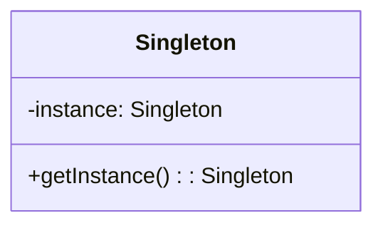
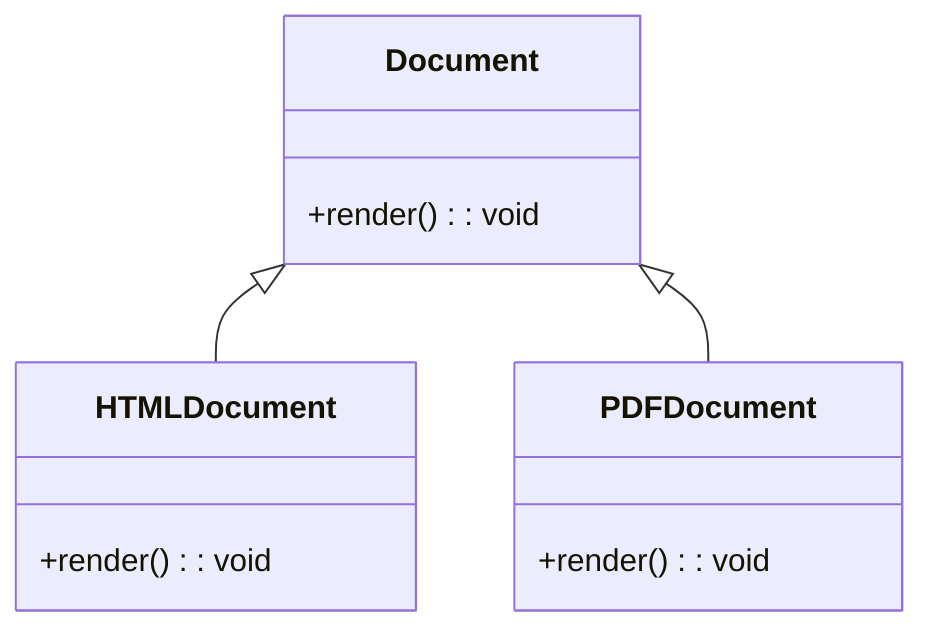

## 4.1 Adapting Creational Patterns for Dynamic Typing

In the world of software design, creational patterns play a crucial role in object creation mechanisms, aiming to create objects in a manner suitable to the situation. Ruby, with its dynamic typing and flexible object model, offers unique opportunities and challenges in implementing these patterns. In this section, we will explore how traditional creational design patterns are adapted in Ruby, considering its dynamic nature.

### Understanding Dynamic Typing in Ruby

Dynamic typing in Ruby means that the type of a variable is determined at runtime, rather than at compile time. This flexibility allows Ruby developers to write more concise and expressive code, but it also requires careful consideration when adapting design patterns traditionally used in statically typed languages like Java or C++.

#### Key Characteristics of Ruby's Dynamic Typing:

- **Type Flexibility**: Variables can hold objects of any type, and their types can change over time.
- **Duck Typing**: Ruby emphasizes what an object can do, rather than what it is. If an object responds to the methods you call, it is considered to be of the correct type.
- **Open Classes**: Ruby allows modification of existing classes, which can be leveraged to adapt patterns dynamically.

### Influence of Dynamic Typing on Creational Patterns

Creational patterns in static languages often involve complex class hierarchies and interfaces to ensure type safety. In Ruby, dynamic typing allows us to simplify these patterns, sometimes even eliminating the need for them altogether. Let's explore how some common creational patterns are adapted in Ruby.

#### Singleton Pattern

**Intent**: Ensure a class has only one instance and provide a global point of access to it.

In Ruby, the Singleton pattern can be implemented using the `Singleton` module, which provides a straightforward way to ensure a class has only one instance.

```ruby
require 'singleton'

class Configuration
  include Singleton

  attr_accessor :setting

  def initialize
    @setting = 'default'
  end
end

# Usage
config = Configuration.instance
config.setting = 'custom'
```

**Ruby's Unique Features**: Ruby's `Singleton` module simplifies the implementation by handling instance creation and access internally. Unlike static languages, Ruby does not require private constructors or static methods.

#### Factory Method Pattern

**Intent**: Define an interface for creating an object, but let subclasses alter the type of objects that will be created.

In Ruby, the Factory Method pattern can be adapted using simple methods or blocks, leveraging Ruby's dynamic nature to create objects.

```ruby
class Document
  def initialize
    @content = ''
  end

  def render
    raise NotImplementedError, 'Subclasses must implement the render method'
  end
end

class HTMLDocument < Document
  def render
    "<html><body>#{@content}</body></html>"
  end
end

class PDFDocument < Document
  def render
    "PDF: #{@content}"
  end
end

def create_document(type)
  case type
  when :html
    HTMLDocument.new
  when :pdf
    PDFDocument.new
  else
    raise "Unknown document type: #{type}"
  end
end

# Usage
doc = create_document(:html)
puts doc.render
```

**Ruby's Unique Features**: The use of symbols and case statements in Ruby allows for a more concise and flexible implementation compared to static languages, where interfaces and abstract classes are typically required.

#### Abstract Factory Pattern

**Intent**: Provide an interface for creating families of related or dependent objects without specifying their concrete classes.

In Ruby, the Abstract Factory pattern can be implemented using modules and mixins, allowing for flexible and reusable code.

```ruby
module GUIFactory
  def create_button
    raise NotImplementedError, 'Subclasses must implement the create_button method'
  end

  def create_checkbox
    raise NotImplementedError, 'Subclasses must implement the create_checkbox method'
  end
end

class MacOSFactory
  include GUIFactory

  def create_button
    MacOSButton.new
  end

  def create_checkbox
    MacOSCheckbox.new
  end
end

class WindowsFactory
  include GUIFactory

  def create_button
    WindowsButton.new
  end

  def create_checkbox
    WindowsCheckbox.new
  end
end

# Usage
factory = MacOSFactory.new
button = factory.create_button
checkbox = factory.create_checkbox
```

**Ruby's Unique Features**: Modules and mixins in Ruby provide a powerful way to share behavior across classes, reducing the need for complex inheritance hierarchies.

#### Builder Pattern

**Intent**: Separate the construction of a complex object from its representation, allowing the same construction process to create different representations.

In Ruby, the Builder pattern can be simplified using blocks and method chaining, making the code more readable and expressive.

```ruby
class House
  attr_accessor :walls, :roof, :windows

  def initialize
    @walls = 0
    @roof = false
    @windows = 0
  end

  def build
    yield(self) if block_given?
    self
  end
end

# Usage
house = House.new.build do |h|
  h.walls = 4
  h.roof = true
  h.windows = 10
end
```

**Ruby's Unique Features**: The use of blocks in Ruby allows for a clean and intuitive way to build objects, eliminating the need for separate builder classes.

#### Prototype Pattern

**Intent**: Specify the kinds of objects to create using a prototypical instance, and create new objects by copying this prototype.

In Ruby, the Prototype pattern can be implemented using the `clone` or `dup` methods, leveraging Ruby's built-in object cloning capabilities.

```ruby
class Prototype
  attr_accessor :name, :value

  def initialize(name, value)
    @name = name
    @value = value
  end
end

# Usage
original = Prototype.new('Original', 100)
copy = original.clone
copy.name = 'Copy'

puts original.name # Output: Original
puts copy.name     # Output: Copy
```

**Ruby's Unique Features**: Ruby's `clone` and `dup` methods provide a straightforward way to implement the Prototype pattern, without the need for complex cloning logic.

### Comparing Creational Patterns in Static Languages vs. Ruby

In static languages, creational patterns often involve complex class hierarchies and interfaces to ensure type safety and flexibility. Ruby's dynamic typing allows for more concise and flexible implementations, often reducing the need for such complexity.

#### Key Differences:

- **Type Safety**: Static languages require explicit type declarations and interfaces, while Ruby relies on duck typing and runtime checks.
- **Flexibility**: Ruby's dynamic nature allows for more flexible and concise implementations, often using blocks, procs, and lambdas.
- **Simplicity**: Ruby's features, such as open classes and modules, simplify pattern implementation, reducing boilerplate code.

### Simplifying or Eliminating Patterns with Ruby's Features

Ruby's dynamic typing and flexible object model can simplify or even eliminate the need for certain creational patterns. Let's explore some examples where patterns are adapted or replaced by idiomatic Ruby code.

#### Lazy Initialization

In Ruby, lazy initialization can be implemented using the `||=` operator, which provides a concise way to initialize variables only when needed.

```ruby
class LazyLoader
  def data
    @data ||= expensive_operation
  end

  private

  def expensive_operation
    # Simulate an expensive operation
    sleep(2)
    'Loaded Data'
  end
end

# Usage
loader = LazyLoader.new
puts loader.data # Output: Loaded Data
```

**Ruby's Unique Features**: The `||=` operator provides a simple and efficient way to implement lazy initialization, without the need for additional classes or methods.

#### Dependency Injection

In Ruby, dependency injection can be achieved using simple constructor arguments or method parameters, leveraging Ruby's flexible object model.

```ruby
class Service
  def initialize(logger)
    @logger = logger
  end

  def perform
    @logger.log('Performing service...')
  end
end

class Logger
  def log(message)
    puts message
  end
end

# Usage
logger = Logger.new
service = Service.new(logger)
service.perform
```

**Ruby's Unique Features**: Ruby's dynamic typing and flexible object model allow for straightforward dependency injection, without the need for complex frameworks or configurations.

### Encouraging Critical Thinking About Pattern Applicability in Ruby

While creational patterns provide valuable solutions to common design problems, it's important to consider their applicability in Ruby. Ruby's dynamic typing and flexible object model offer unique opportunities to simplify or eliminate certain patterns, but they also require careful consideration to ensure code maintainability and readability.

#### Key Considerations:

- **Simplicity vs. Complexity**: Consider whether a pattern adds unnecessary complexity to your code. Ruby's features may provide simpler alternatives.
- **Readability**: Ensure that your code remains readable and maintainable, even when leveraging Ruby's dynamic features.
- **Performance**: Consider the performance implications of using dynamic typing and flexible object models, especially in performance-critical applications.

### Visualizing Creational Patterns in Ruby

To better understand how creational patterns are adapted in Ruby, let's visualize the process using Mermaid.js diagrams.

#### Singleton Pattern Diagram



**Description**: This diagram illustrates the Singleton pattern, where a single instance of a class is created and accessed globally.

#### Factory Method Pattern Diagram



**Description**: This diagram shows the Factory Method pattern, where different document types are created based on the specified type.

### Try It Yourself

To deepen your understanding of adapting creational patterns for dynamic typing in Ruby, try modifying the provided code examples. Experiment with different object types, add new methods, or change the pattern implementation to see how Ruby's dynamic features can be leveraged.

### References and Further Reading

- [Ruby Documentation](https://www.ruby-lang.org/en/documentation/)
- [Design Patterns: Elements of Reusable Object-Oriented Software](https://en.wikipedia.org/wiki/Design_Patterns)
- [Singleton Module in Ruby](https://ruby-doc.org/stdlib-2.7.0/libdoc/singleton/rdoc/Singleton.html)

### Knowledge Check

Before moving on, take a moment to reflect on what you've learned. Consider how Ruby's dynamic typing influences the implementation of creational patterns and think critically about when to use these patterns in your own projects.

## Quiz: Adapting Creational Patterns for Dynamic Typing



### How does Ruby's dynamic typing affect the implementation of creational patterns?

- [x] It allows for more flexible and concise implementations.
- [ ] It requires more complex class hierarchies.
- [ ] It enforces strict type safety.
- [ ] It eliminates the need for all design patterns.

> **Explanation:** Ruby's dynamic typing allows for more flexible and concise implementations, reducing the need for complex class hierarchies and strict type safety.

### Which Ruby feature simplifies the Singleton pattern implementation?

- [x] The `Singleton` module
- [ ] The `Enumerable` module
- [ ] The `Comparable` module
- [ ] The `Math` module

> **Explanation:** The `Singleton` module in Ruby provides a straightforward way to implement the Singleton pattern, handling instance creation and access internally.

### What is a key difference between creational patterns in static languages and Ruby?

- [x] Static languages require explicit type declarations, while Ruby relies on duck typing.
- [ ] Ruby requires more complex class hierarchies.
- [ ] Static languages do not use interfaces.
- [ ] Ruby enforces strict type safety.

> **Explanation:** Static languages require explicit type declarations and interfaces, while Ruby relies on duck typing and runtime checks, allowing for more flexible implementations.

### How can lazy initialization be implemented in Ruby?

- [x] Using the `||=` operator
- [ ] Using the `&&=` operator
- [ ] Using the `+=` operator
- [ ] Using the `-=` operator

> **Explanation:** The `||=` operator in Ruby provides a simple and efficient way to implement lazy initialization, initializing variables only when needed.

### What is a benefit of using blocks in Ruby's Builder pattern?

- [x] They allow for a clean and intuitive way to build objects.
- [ ] They require additional builder classes.
- [ ] They enforce strict type safety.
- [ ] They eliminate the need for method chaining.

> **Explanation:** The use of blocks in Ruby allows for a clean and intuitive way to build objects, eliminating the need for separate builder classes.

### How can dependency injection be achieved in Ruby?

- [x] Using constructor arguments or method parameters
- [ ] Using global variables
- [ ] Using private methods
- [ ] Using class variables

> **Explanation:** Dependency injection in Ruby can be achieved using constructor arguments or method parameters, leveraging Ruby's flexible object model.

### What should be considered when using Ruby's dynamic features in design patterns?

- [x] Simplicity, readability, and performance
- [ ] Complexity, strictness, and rigidity
- [ ] Inheritance, interfaces, and abstract classes
- [ ] Global variables, class variables, and constants

> **Explanation:** When using Ruby's dynamic features in design patterns, consider simplicity, readability, and performance to ensure maintainable and efficient code.

### Which pattern can be implemented using Ruby's `clone` or `dup` methods?

- [x] Prototype Pattern
- [ ] Singleton Pattern
- [ ] Factory Method Pattern
- [ ] Builder Pattern

> **Explanation:** The Prototype pattern can be implemented using Ruby's `clone` or `dup` methods, leveraging Ruby's built-in object cloning capabilities.

### What is a potential pitfall of using dynamic typing in Ruby?

- [x] It can lead to runtime errors if not carefully managed.
- [ ] It enforces strict type safety.
- [ ] It requires complex class hierarchies.
- [ ] It eliminates the need for all design patterns.

> **Explanation:** Dynamic typing can lead to runtime errors if not carefully managed, as type checks are performed at runtime rather than compile time.

### True or False: Ruby's dynamic typing eliminates the need for all creational patterns.

- [ ] True
- [x] False

> **Explanation:** While Ruby's dynamic typing can simplify or eliminate the need for certain creational patterns, it does not eliminate the need for all patterns. Patterns still provide valuable solutions to common design problems.



Remember, this is just the beginning. As you progress, you'll build more complex and interactive applications using Ruby's dynamic features. Keep experimenting, stay curious, and enjoy the journey!
