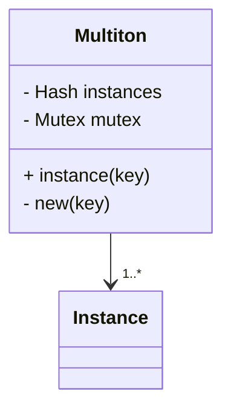

## 4.10 Multiton Pattern

In the realm of software design patterns, the Multiton pattern stands out as a sophisticated extension of the Singleton pattern. While the Singleton pattern ensures that a class has only one instance and provides a global point of access to it, the Multiton pattern takes this concept further by allowing multiple instances, each distinguished by a unique key. This pattern is particularly useful in scenarios where you need to manage a limited number of instances, each representing a unique state or configuration.

### Understanding the Multiton Pattern

#### Definition

The Multiton pattern is a creational design pattern that restricts the instantiation of a class to a predefined set of instances. Each instance is associated with a unique key, and the pattern provides a global point of access to these instances. This is akin to having multiple singletons, each identified by a key.

#### Extending the Singleton Concept

The Singleton pattern is a well-known design pattern that ensures a class has only one instance and provides a global point of access to it. The Multiton pattern extends this concept by allowing multiple instances, each associated with a unique key. This is particularly useful when you need to manage a set of related instances, each representing a different configuration or state.

### Use Cases for the Multiton Pattern

The Multiton pattern is particularly useful in scenarios where you need to manage a limited number of instances, each representing a unique state or configuration. Some common use cases include:

- **Configuration Management**: When you have multiple configurations, each identified by a unique key, the Multiton pattern can help manage these configurations efficiently.
- **Resource Management**: In scenarios where you need to manage a pool of resources, such as database connections or network sockets, the Multiton pattern can help ensure that each resource is uniquely identified and managed.
- **State Management**: When you have multiple states, each identified by a unique key, the Multiton pattern can help manage these states efficiently.

### Implementing the Multiton Pattern in Ruby

Let's explore how to implement the Multiton pattern in Ruby. We'll start with a basic implementation and then enhance it with additional features.

#### Basic Implementation

```ruby
class Multiton
  @instances = {}

  def self.instance(key)
    @instances[key] ||= new(key)
  end

  private_class_method :new

  def initialize(key)
    @key = key
    puts "Instance created for key: #{@key}"
  end
end

# Usage
instance1 = Multiton.instance(:config1)
instance2 = Multiton.instance(:config2)
instance3 = Multiton.instance(:config1)

puts instance1 == instance3 # true
puts instance1 == instance2 # false
```

In this implementation, the `Multiton` class maintains a hash of instances, each identified by a unique key. The `instance` method checks if an instance for the given key already exists; if not, it creates a new instance.

#### Enhancing the Implementation

Let's enhance the implementation by adding thread safety and lazy initialization.

```ruby
require 'thread'

class Multiton
  @instances = {}
  @mutex = Mutex.new

  def self.instance(key)
    @mutex.synchronize do
      @instances[key] ||= new(key)
    end
  end

  private_class_method :new

  def initialize(key)
    @key = key
    puts "Instance created for key: #{@key}"
  end
end

# Usage
instance1 = Multiton.instance(:config1)
instance2 = Multiton.instance(:config2)
instance3 = Multiton.instance(:config1)

puts instance1 == instance3 # true
puts instance1 == instance2 # false
```

In this enhanced implementation, we use a `Mutex` to ensure thread safety when accessing the instances hash. This prevents race conditions when multiple threads attempt to access or create instances simultaneously.

### Visualizing the Multiton Pattern

To better understand the Multiton pattern, let's visualize it using a class diagram.



In this diagram, the `Multiton` class maintains a hash of `Instance` objects, each identified by a unique key. The `instance` method provides a global point of access to these instances.

### Key Participants

- **Multiton Class**: The class that implements the Multiton pattern. It maintains a hash of instances, each identified by a unique key.
- **Instance**: The individual instances managed by the Multiton class. Each instance is associated with a unique key.

### Applicability

The Multiton pattern is applicable in scenarios where you need to manage a limited number of instances, each representing a unique state or configuration. It is particularly useful in configuration management, resource management, and state management.

### Design Considerations

When implementing the Multiton pattern, consider the following design considerations:

- **Thread Safety**: Ensure that your implementation is thread-safe, especially if your application is multi-threaded.
- **Lazy Initialization**: Consider using lazy initialization to create instances only when they are needed.
- **Memory Management**: Be mindful of memory usage, especially if you have a large number of instances.

### Potential Downsides

While the Multiton pattern can be useful, it also has potential downsides:

- **Increased Complexity**: The pattern can introduce additional complexity, especially if you have a large number of instances.
- **Global State**: The pattern relies on global state, which can make testing and debugging more challenging.
- **Alternative Designs**: Consider alternative designs, such as dependency injection or factory patterns, if the Multiton pattern introduces unnecessary complexity.

### Ruby Unique Features

Ruby's dynamic nature and metaprogramming capabilities make it particularly well-suited for implementing the Multiton pattern. Features such as `Hash` for managing instances and `Mutex` for ensuring thread safety are particularly useful.

### Differences and Similarities

The Multiton pattern is often compared to the Singleton pattern. While both patterns provide a global point of access to instances, the Multiton pattern allows for multiple instances, each identified by a unique key. This makes it more flexible than the Singleton pattern, which restricts a class to a single instance.

### Try It Yourself

Now that we've explored the Multiton pattern, try modifying the code examples to experiment with different keys and instance configurations. Consider adding additional features, such as instance expiration or custom initialization logic.

### References and Links

- [Ruby Documentation](https://ruby-doc.org/)
- [Design Patterns: Elements of Reusable Object-Oriented Software](https://en.wikipedia.org/wiki/Design_Patterns)
- [Singleton Pattern](https://en.wikipedia.org/wiki/Singleton_pattern)

### Knowledge Check

- What is the primary purpose of the Multiton pattern?
- How does the Multiton pattern extend the Singleton concept?
- What are some common use cases for the Multiton pattern?
- How can you ensure thread safety in a Multiton implementation?
- What are some potential downsides of using the Multiton pattern?

### Embrace the Journey

Remember, mastering design patterns is a journey. As you explore the Multiton pattern, consider how it can be applied to your own projects. Stay curious, keep experimenting, and enjoy the process of learning and growing as a developer.

## Quiz: Multiton Pattern



### What is the primary purpose of the Multiton pattern?

- [x] To manage a limited number of instances, each identified by a unique key
- [ ] To ensure a class has only one instance
- [ ] To provide a global point of access to a single instance
- [ ] To manage a pool of resources

> **Explanation:** The Multiton pattern is designed to manage a limited number of instances, each identified by a unique key, extending the Singleton concept.

### How does the Multiton pattern extend the Singleton concept?

- [x] By allowing multiple instances, each identified by a unique key
- [ ] By ensuring a class has only one instance
- [ ] By providing a global point of access to a single instance
- [ ] By managing a pool of resources

> **Explanation:** The Multiton pattern extends the Singleton concept by allowing multiple instances, each identified by a unique key.

### What are some common use cases for the Multiton pattern?

- [x] Configuration management
- [x] Resource management
- [ ] Managing a single instance
- [ ] Providing a global point of access to a single instance

> **Explanation:** The Multiton pattern is commonly used for configuration management and resource management, where multiple instances are needed.

### How can you ensure thread safety in a Multiton implementation?

- [x] By using a Mutex to synchronize access to the instances hash
- [ ] By creating a new instance for each request
- [ ] By using a global variable
- [ ] By avoiding the use of threads

> **Explanation:** Thread safety can be ensured by using a Mutex to synchronize access to the instances hash, preventing race conditions.

### What are some potential downsides of using the Multiton pattern?

- [x] Increased complexity
- [x] Global state
- [ ] Ensuring a class has only one instance
- [ ] Providing a global point of access to a single instance

> **Explanation:** The Multiton pattern can introduce increased complexity and relies on global state, which can make testing and debugging more challenging.

### What is a key feature of Ruby that aids in implementing the Multiton pattern?

- [x] Dynamic nature and metaprogramming capabilities
- [ ] Static typing
- [ ] Lack of support for hashes
- [ ] Absence of thread safety mechanisms

> **Explanation:** Ruby's dynamic nature and metaprogramming capabilities, along with features like Hash and Mutex, aid in implementing the Multiton pattern.

### What is a common alternative to the Multiton pattern?

- [x] Dependency injection
- [ ] Singleton pattern
- [ ] Observer pattern
- [ ] Factory pattern

> **Explanation:** Dependency injection is a common alternative to the Multiton pattern, especially when the pattern introduces unnecessary complexity.

### What is a key difference between the Singleton and Multiton patterns?

- [x] The Multiton pattern allows multiple instances, each identified by a unique key
- [ ] The Singleton pattern allows multiple instances
- [ ] The Multiton pattern provides a global point of access to a single instance
- [ ] The Singleton pattern manages a pool of resources

> **Explanation:** The key difference is that the Multiton pattern allows multiple instances, each identified by a unique key, while the Singleton pattern restricts a class to a single instance.

### What is a potential use case for the Multiton pattern in resource management?

- [x] Managing a pool of database connections
- [ ] Ensuring a class has only one instance
- [ ] Providing a global point of access to a single instance
- [ ] Managing a single configuration

> **Explanation:** In resource management, the Multiton pattern can be used to manage a pool of database connections, each identified by a unique key.

### True or False: The Multiton pattern is only applicable in single-threaded applications.

- [ ] True
- [x] False

> **Explanation:** The Multiton pattern can be used in multi-threaded applications, but it requires thread safety mechanisms like Mutex to prevent race conditions.


