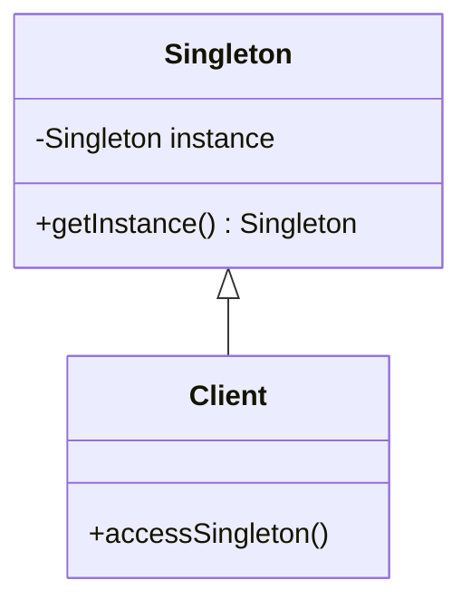

## 4.2 Singleton Pattern

### Introduction

In the realm of software design patterns, the Singleton pattern stands out as a creational pattern that ensures a class has only one instance while providing a global point of access to it. This pattern is particularly useful when exactly one object is needed to coordinate actions across the system. In this section, we will delve deep into the Singleton pattern, exploring its intent, implementation in Ruby, and the scenarios where it is most applicable.

### Intent of the Singleton Pattern

The primary intent of the Singleton pattern is to:

- **Ensure a class has only one instance**: This is crucial in scenarios where having multiple instances of a class would lead to inconsistent states or resource conflicts.
- **Provide a global point of access**: This allows different parts of an application to access the single instance without needing to pass it around explicitly.

### When to Use the Singleton Pattern

The Singleton pattern is best suited for situations where:

- **Resource Management**: You need to control access to a shared resource, such as a database connection or a configuration object.
- **Global State**: You want to maintain a global state across the application, such as a logging service or a cache.
- **Coordination**: A single instance is required to coordinate actions across different parts of the system.

However, it's important to use the Singleton pattern judiciously, as it can introduce global state into an application, which can make testing and debugging more challenging.

### Implementing Singleton in Ruby

Ruby provides a built-in `Singleton` module that simplifies the implementation of the Singleton pattern. Let's explore how to use this module to create a Singleton class.

#### Step-by-Step Implementation

1. **Include the Singleton Module**: The first step is to include the `Singleton` module in your class. This module provides the necessary methods to ensure only one instance of the class is created.

2. **Access the Singleton Instance**: Use the `instance` method provided by the `Singleton` module to access the single instance of the class.

3. **Prevent Instantiation**: The `Singleton` module automatically makes the `new` method private, preventing direct instantiation of the class.

Here is a simple example of implementing a Singleton class in Ruby:

```ruby
require 'singleton'

class Logger
  include Singleton

  def log(message)
    puts "Log: #{message}"
  end
end

# Accessing the singleton instance
logger1 = Logger.instance
logger2 = Logger.instance

logger1.log("This is a log message.")

# Verifying that both variables point to the same instance
puts logger1.equal?(logger2) # Output: true
```

In this example, the `Logger` class includes the `Singleton` module, ensuring that only one instance of `Logger` is created. The `log` method provides a simple way to log messages, and the `instance` method is used to access the single instance of the class.

### Key Participants

- **Singleton Class**: The class that includes the `Singleton` module and provides a global point of access to its instance.
- **Client Code**: The code that accesses the singleton instance using the `instance` method.

### Applicability

The Singleton pattern is applicable in scenarios where:

- A single instance of a class is required to coordinate actions across the system.
- Global access to a shared resource is needed.
- You want to control access to a resource, such as a configuration object or a logging service.

### Design Considerations

While the Singleton pattern is useful, it is important to consider the following:

- **Global State**: Introducing global state can make testing and debugging more challenging.
- **Thread Safety**: Ensure that the Singleton implementation is thread-safe, especially in multi-threaded applications.
- **Alternatives**: Consider using dependency injection or other design patterns if the Singleton pattern introduces unnecessary complexity.

### Ruby Unique Features

Ruby's flexible module system and dynamic nature make it easy to implement the Singleton pattern using the `Singleton` module. However, Ruby also allows for alternative approaches, such as using class variables or class instance variables to achieve similar functionality.

### Critique of the Singleton Pattern

The Singleton pattern has its critics, primarily due to its introduction of global state and potential for misuse. Some developers argue that it can lead to tightly coupled code and make testing more difficult. However, when used appropriately, the Singleton pattern can be a powerful tool for managing shared resources and coordinating actions across an application.

### Alternatives to the Singleton Pattern

In some cases, alternative approaches may be more suitable than the Singleton pattern:

- **Dependency Injection**: This pattern allows you to pass dependencies explicitly, reducing the need for global state.
- **Module Methods**: Use module methods to provide global access to functionality without maintaining state.
- **Class Variables**: Use class variables to maintain state across instances without enforcing a single instance.

### Try It Yourself

To gain a deeper understanding of the Singleton pattern, try modifying the example code to add additional methods or features. Experiment with creating multiple instances and observe how the `Singleton` module prevents this. Consider implementing thread safety if your application is multi-threaded.

### Visualizing the Singleton Pattern

To better understand the Singleton pattern, let's visualize the relationship between the Singleton class and its clients using a class diagram.



In this diagram, the `Singleton` class provides a `getInstance` method to access its single instance, and the `Client` class interacts with the `Singleton` instance.

### Knowledge Check

Before we conclude, let's reinforce our understanding of the Singleton pattern with a few questions:

- What is the primary intent of the Singleton pattern?
- When should you use the Singleton pattern?
- How does Ruby's `Singleton` module simplify the implementation of the Singleton pattern?
- What are some potential drawbacks of using the Singleton pattern?

### Summary

The Singleton pattern is a powerful creational design pattern that ensures a class has only one instance and provides a global point of access to it. By using Ruby's `Singleton` module, we can easily implement this pattern and manage shared resources effectively. However, it's important to use the Singleton pattern judiciously, considering its potential drawbacks and alternatives.

Remember, mastering design patterns like the Singleton pattern is just the beginning of your journey to becoming a skilled Ruby developer. Keep experimenting, stay curious, and enjoy the process of learning and building scalable, maintainable applications.

## Quiz: Singleton Pattern



### What is the primary intent of the Singleton pattern?

- [x] To ensure a class has only one instance and provide a global point of access to it.
- [ ] To allow multiple instances of a class to be created.
- [ ] To encapsulate a group of individual factories.
- [ ] To separate the construction of a complex object from its representation.

> **Explanation:** The Singleton pattern ensures a class has only one instance and provides a global point of access to it.

### Which Ruby module is used to implement the Singleton pattern?

- [x] Singleton
- [ ] Enumerable
- [ ] Comparable
- [ ] Observer

> **Explanation:** Ruby provides a built-in `Singleton` module to implement the Singleton pattern.

### What method is used to access the singleton instance in Ruby?

- [x] instance
- [ ] new
- [ ] create
- [ ] getInstance

> **Explanation:** The `instance` method is used to access the singleton instance in Ruby.

### What is a potential drawback of using the Singleton pattern?

- [x] It introduces global state, which can make testing and debugging more challenging.
- [ ] It allows multiple instances of a class to be created.
- [ ] It requires complex configuration.
- [ ] It is not supported in Ruby.

> **Explanation:** The Singleton pattern introduces global state, which can make testing and debugging more challenging.

### How does the Singleton module prevent direct instantiation of a class?

- [x] By making the `new` method private.
- [ ] By overriding the `initialize` method.
- [ ] By using a class variable.
- [ ] By using a class method.

> **Explanation:** The Singleton module makes the `new` method private, preventing direct instantiation of the class.

### What is an alternative to the Singleton pattern for managing shared resources?

- [x] Dependency Injection
- [ ] Factory Method
- [ ] Abstract Factory
- [ ] Builder Pattern

> **Explanation:** Dependency Injection is an alternative to the Singleton pattern for managing shared resources.

### What is a key participant in the Singleton pattern?

- [x] Singleton Class
- [ ] Factory Class
- [ ] Observer Class
- [ ] Adapter Class

> **Explanation:** The Singleton Class is a key participant in the Singleton pattern.

### What is a common use case for the Singleton pattern?

- [x] Managing a logging service
- [ ] Creating multiple instances of a class
- [ ] Encapsulating a group of individual factories
- [ ] Separating the construction of a complex object from its representation

> **Explanation:** A common use case for the Singleton pattern is managing a logging service.

### True or False: The Singleton pattern is only applicable in Ruby.

- [ ] True
- [x] False

> **Explanation:** The Singleton pattern is a general design pattern applicable in many programming languages, not just Ruby.

### What is the main benefit of using the Singleton pattern?

- [x] It ensures a single instance of a class and provides a global point of access.
- [ ] It allows for multiple instances of a class.
- [ ] It simplifies the creation of complex objects.
- [ ] It provides a way to encapsulate a group of individual factories.

> **Explanation:** The main benefit of the Singleton pattern is that it ensures a single instance of a class and provides a global point of access.




