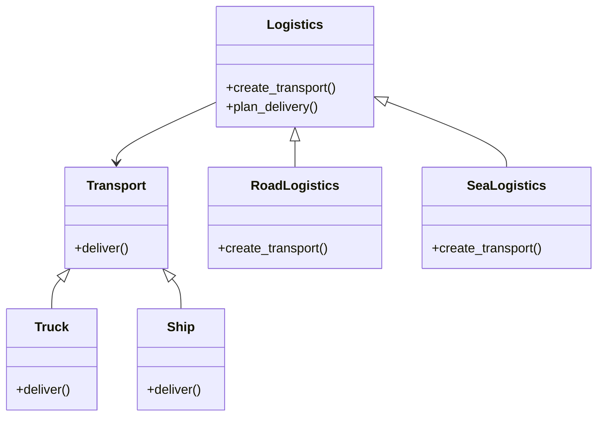

## 4.3 Factory Method Pattern

### Introduction

The Factory Method Pattern is a creational design pattern that provides an interface for creating objects in a superclass but allows subclasses to alter the type of objects that will be created. This pattern is particularly useful when the exact type of object that needs to be created is determined by the subclass. It promotes flexibility and adheres to the Open/Closed Principle, which states that software entities should be open for extension but closed for modification.

### Problem Addressed by the Factory Method Pattern

In traditional object-oriented programming, the creation of objects is often hardcoded within the application. This can lead to a lack of flexibility and difficulty in maintaining the code, especially when new types of objects need to be introduced. The Factory Method Pattern addresses this problem by decoupling the object creation process from the specific classes that implement the objects. This allows for greater flexibility and scalability in the application.

### Key Participants

- **Creator**: Declares the factory method, which returns an object of type `Product`. The `Creator` may also define a default implementation of the factory method that returns a default `Product` object.
- **ConcreteCreator**: Overrides the factory method to return an instance of a `ConcreteProduct`.
- **Product**: Defines the interface of objects the factory method creates.
- **ConcreteProduct**: Implements the `Product` interface.

### Applicability

Use the Factory Method Pattern when:
- A class cannot anticipate the class of objects it must create.
- A class wants its subclasses to specify the objects it creates.
- Classes delegate responsibility to one of several helper subclasses, and you want to localize the knowledge of which helper subclass is the delegate.

### Ruby Implementation of the Factory Method Pattern

Let's explore how the Factory Method Pattern can be implemented in Ruby. We'll create a simple example involving a logistics company that can transport goods by different means: truck and ship.

```ruby
# Define the Product interface
class Transport
  def deliver
    raise NotImplementedError, 'You must implement the deliver method'
  end
end

# ConcreteProduct: Truck
class Truck < Transport
  def deliver
    puts 'Delivering by land in a box'
  end
end

# ConcreteProduct: Ship
class Ship < Transport
  def deliver
    puts 'Delivering by sea in a container'
  end
end

# Creator
class Logistics
  def create_transport
    raise NotImplementedError, 'You must implement the create_transport method'
  end

  def plan_delivery
    transport = create_transport
    transport.deliver
  end
end

# ConcreteCreator: RoadLogistics
class RoadLogistics < Logistics
  def create_transport
    Truck.new
  end
end

# ConcreteCreator: SeaLogistics
class SeaLogistics < Logistics
  def create_transport
    Ship.new
  end
end

# Client code
road_logistics = RoadLogistics.new
road_logistics.plan_delivery

sea_logistics = SeaLogistics.new
sea_logistics.plan_delivery
```

### Explanation of the Code

- **Transport**: This is the `Product` interface that declares the `deliver` method.
- **Truck** and **Ship**: These are `ConcreteProduct` classes that implement the `Transport` interface.
- **Logistics**: This is the `Creator` class that declares the factory method `create_transport`.
- **RoadLogistics** and **SeaLogistics**: These are `ConcreteCreator` classes that override the `create_transport` method to return an instance of `Truck` and `Ship`, respectively.

### How Ruby's Dynamic Features Affect the Pattern's Implementation

Ruby's dynamic nature allows for a more flexible implementation of the Factory Method Pattern. For instance, Ruby's ability to define methods at runtime and its use of duck typing can simplify the pattern's implementation. In Ruby, we can leverage modules and mixins to create a more modular and reusable codebase.

### Benefits of the Factory Method Pattern

- **Enhanced Flexibility**: By decoupling the object creation process from the specific classes, the Factory Method Pattern allows for greater flexibility in the application.
- **Adherence to the Open/Closed Principle**: The pattern allows for new types of objects to be introduced without modifying existing code, adhering to the Open/Closed Principle.
- **Reusability**: The pattern promotes code reuse by allowing the same factory method to be used to create different types of objects.

### Design Considerations

- **When to Use**: Use the Factory Method Pattern when you need to decouple the object creation process from the specific classes that implement the objects.
- **Pitfalls**: Overuse of the Factory Method Pattern can lead to a proliferation of classes and increased complexity in the codebase.

### Differences and Similarities with Other Patterns

The Factory Method Pattern is often confused with the Abstract Factory Pattern. While both patterns deal with object creation, the Factory Method Pattern focuses on creating a single product, whereas the Abstract Factory Pattern deals with creating families of related or dependent products.

### Try It Yourself

Experiment with the code by adding a new type of transport, such as `Airplane`, and creating a new `ConcreteCreator` class, `AirLogistics`, to handle air transport.

### Visualizing the Factory Method Pattern



### Summary

The Factory Method Pattern is a powerful tool in the Ruby developer's toolkit, providing flexibility and scalability in object creation. By decoupling the object creation process from the specific classes that implement the objects, the pattern promotes adherence to the Open/Closed Principle and enhances the maintainability of the codebase.

## Quiz: Factory Method Pattern



### What is the primary purpose of the Factory Method Pattern?

- [x] To define an interface for creating an object, but allow subclasses to alter the type of objects that will be created.
- [ ] To create a single instance of a class.
- [ ] To provide a way to access the elements of an aggregate object sequentially.
- [ ] To define a family of algorithms.

> **Explanation:** The Factory Method Pattern defines an interface for creating an object but lets subclasses alter the type of objects that will be created.

### Which principle does the Factory Method Pattern adhere to?

- [x] Open/Closed Principle
- [ ] Single Responsibility Principle
- [ ] Liskov Substitution Principle
- [ ] Interface Segregation Principle

> **Explanation:** The Factory Method Pattern adheres to the Open/Closed Principle by allowing new types of objects to be introduced without modifying existing code.

### In the Factory Method Pattern, what is the role of the `ConcreteCreator`?

- [x] To override the factory method to return an instance of a `ConcreteProduct`.
- [ ] To define the interface of objects the factory method creates.
- [ ] To declare the factory method, which returns an object of type `Product`.
- [ ] To implement the `Product` interface.

> **Explanation:** The `ConcreteCreator` overrides the factory method to return an instance of a `ConcreteProduct`.

### How does Ruby's dynamic nature affect the implementation of the Factory Method Pattern?

- [x] It allows for more flexible implementation using modules and mixins.
- [ ] It restricts the use of the pattern due to static typing.
- [ ] It requires the use of interfaces for all products.
- [ ] It mandates the use of abstract classes.

> **Explanation:** Ruby's dynamic nature allows for more flexible implementation of the Factory Method Pattern using modules and mixins.

### What is a potential pitfall of overusing the Factory Method Pattern?

- [x] Proliferation of classes and increased complexity.
- [ ] Lack of flexibility in object creation.
- [ ] Difficulty in maintaining the codebase.
- [ ] Violation of the Single Responsibility Principle.

> **Explanation:** Overuse of the Factory Method Pattern can lead to a proliferation of classes and increased complexity in the codebase.

### Which of the following is a `ConcreteProduct` in the provided Ruby example?

- [x] Truck
- [ ] Transport
- [ ] Logistics
- [ ] RoadLogistics

> **Explanation:** `Truck` is a `ConcreteProduct` that implements the `Transport` interface.

### What method does the `Creator` class declare in the Factory Method Pattern?

- [x] create_transport
- [ ] deliver
- [ ] plan_delivery
- [ ] new

> **Explanation:** The `Creator` class declares the `create_transport` method, which returns an object of type `Product`.

### Which pattern is often confused with the Factory Method Pattern?

- [x] Abstract Factory Pattern
- [ ] Singleton Pattern
- [ ] Observer Pattern
- [ ] Strategy Pattern

> **Explanation:** The Factory Method Pattern is often confused with the Abstract Factory Pattern, which deals with creating families of related or dependent products.

### True or False: The Factory Method Pattern can only be used in object-oriented programming languages.

- [x] True
- [ ] False

> **Explanation:** The Factory Method Pattern is primarily used in object-oriented programming languages to provide flexibility in object creation.

### What is the role of the `Product` interface in the Factory Method Pattern?

- [x] To define the interface of objects the factory method creates.
- [ ] To override the factory method to return an instance of a `ConcreteProduct`.
- [ ] To declare the factory method, which returns an object of type `Product`.
- [ ] To implement the `Product` interface.

> **Explanation:** The `Product` interface defines the interface of objects the factory method creates.



Remember, this is just the beginning. As you progress, you'll build more complex and interactive applications. Keep experimenting, stay curious, and enjoy the journey!
