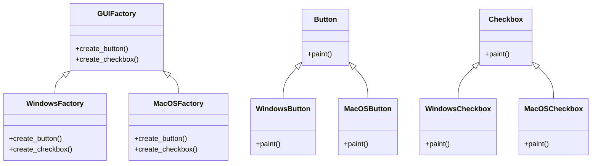

## 4.4 Abstract Factory Pattern

### Introduction

The Abstract Factory Pattern is a creational design pattern that provides an interface for creating families of related or dependent objects without specifying their concrete classes. This pattern is particularly useful when a system needs to be independent of how its objects are created, composed, and represented. By encapsulating a group of individual factories with a common goal, the Abstract Factory Pattern promotes consistency among products and enhances the modularity and scalability of applications.

### Intent

The primary intent of the Abstract Factory Pattern is to:

- Provide an interface for creating families of related or dependent objects.
- Ensure that the system is independent of how its objects are created.
- Allow for the interchangeability of product families without altering the client code.

### Key Participants

1. **Abstract Factory**: Declares an interface for operations that create abstract product objects.
2. **Concrete Factory**: Implements the operations to create concrete product objects.
3. **Abstract Product**: Declares an interface for a type of product object.
4. **Concrete Product**: Defines a product object to be created by the corresponding concrete factory and implements the abstract product interface.
5. **Client**: Uses only interfaces declared by Abstract Factory and Abstract Product classes.

### Applicability

The Abstract Factory Pattern is applicable when:

- A system should be independent of how its products are created, composed, and represented.
- A system should be configured with one of multiple families of products.
- A family of related product objects is designed to be used together, and you need to enforce this constraint.
- You want to provide a library of products, and you want to reveal just their interfaces, not their implementations.

### Sample Code Snippet

Let's consider a scenario where we need to create a family of UI components for different operating systems. We will create buttons and checkboxes for Windows and MacOS.

```ruby
# Abstract Factory
class GUIFactory
  def create_button
    raise NotImplementedError, "#{self.class} has not implemented method '#{__method__}'"
  end

  def create_checkbox
    raise NotImplementedError, "#{self.class} has not implemented method '#{__method__}'"
  end
end

# Concrete Factory for Windows
class WindowsFactory < GUIFactory
  def create_button
    WindowsButton.new
  end

  def create_checkbox
    WindowsCheckbox.new
  end
end

# Concrete Factory for MacOS
class MacOSFactory < GUIFactory
  def create_button
    MacOSButton.new
  end

  def create_checkbox
    MacOSCheckbox.new
  end
end

# Abstract Product for Button
class Button
  def paint
    raise NotImplementedError, "#{self.class} has not implemented method '#{__method__}'"
  end
end

# Concrete Product for Windows Button
class WindowsButton < Button
  def paint
    puts 'Rendering a button in Windows style.'
  end
end

# Concrete Product for MacOS Button
class MacOSButton < Button
  def paint
    puts 'Rendering a button in MacOS style.'
  end
end

# Abstract Product for Checkbox
class Checkbox
  def paint
    raise NotImplementedError, "#{self.class} has not implemented method '#{__method__}'"
  end
end

# Concrete Product for Windows Checkbox
class WindowsCheckbox < Checkbox
  def paint
    puts 'Rendering a checkbox in Windows style.'
  end
end

# Concrete Product for MacOS Checkbox
class MacOSCheckbox < Checkbox
  def paint
    puts 'Rendering a checkbox in MacOS style.'
  end
end

# Client code
def client_code(factory)
  button = factory.create_button
  checkbox = factory.create_checkbox

  button.paint
  checkbox.paint
end

# Usage
puts 'Client: Testing client code with the Windows factory type:'
client_code(WindowsFactory.new)

puts "\nClient: Testing the same client code with the MacOS factory type:"
client_code(MacOSFactory.new)
```

### Design Considerations

- **Modularity**: The Abstract Factory Pattern promotes modularity by allowing the creation of families of related objects without specifying their concrete classes.
- **Scalability**: It enhances scalability by making it easy to introduce new product families without altering existing code.
- **Complexity**: The pattern can increase the complexity of the codebase due to the introduction of multiple interfaces and classes.

### Ruby Unique Features

Ruby's dynamic nature allows for flexible and concise implementations of the Abstract Factory Pattern. Here are some Ruby-specific features that enhance the pattern:

- **Duck Typing**: Ruby's duck typing allows for more flexible interfaces, reducing the need for strict type checks.
- **Modules and Mixins**: Ruby modules can be used to share behavior among different classes, which can be useful in implementing shared functionality across product families.
- **Metaprogramming**: Ruby's metaprogramming capabilities can be leveraged to dynamically define methods and classes, making the pattern more adaptable.

### Differences and Similarities

The Abstract Factory Pattern is often confused with the Factory Method Pattern. While both are creational patterns, they serve different purposes:

- **Abstract Factory**: Focuses on creating families of related objects without specifying their concrete classes.
- **Factory Method**: Focuses on defining an interface for creating an object, but allows subclasses to alter the type of objects that will be created.

### Handling Object Creation in Ruby

In Ruby, object creation can be handled dynamically using various techniques:

- **Dynamic Method Definitions**: Use Ruby's `define_method` to dynamically create methods.
- **Procs and Lambdas**: Use procs and lambdas to encapsulate object creation logic.
- **Blocks**: Pass blocks to methods to define custom creation logic.

### Benefits of the Abstract Factory Pattern

- **Consistency**: Ensures that a family of related objects is used together, maintaining consistency across the application.
- **Flexibility**: Allows for easy switching between different product families without altering client code.
- **Scalability**: Facilitates the addition of new product families with minimal changes to existing code.

### Visualizing the Abstract Factory Pattern



### Try It Yourself

Experiment with the code by adding a new product family, such as Linux, and implement the corresponding factories and products. This exercise will help reinforce your understanding of the Abstract Factory Pattern and its implementation in Ruby.

### Knowledge Check

- What is the primary intent of the Abstract Factory Pattern?
- How does the Abstract Factory Pattern promote modularity and scalability?
- What are some Ruby-specific features that enhance the implementation of the Abstract Factory Pattern?
- How does the Abstract Factory Pattern differ from the Factory Method Pattern?

### Embrace the Journey

Remember, mastering design patterns is a journey. As you progress, you'll find new ways to apply these patterns to solve complex problems. Keep experimenting, stay curious, and enjoy the journey!

## Quiz: Abstract Factory Pattern



### What is the primary intent of the Abstract Factory Pattern?

- [x] To provide an interface for creating families of related or dependent objects without specifying their concrete classes.
- [ ] To define a single method for creating objects.
- [ ] To enforce a strict hierarchy of classes.
- [ ] To simplify the creation of singleton objects.

> **Explanation:** The Abstract Factory Pattern's main intent is to provide an interface for creating families of related or dependent objects without specifying their concrete classes.

### Which of the following is a key participant in the Abstract Factory Pattern?

- [x] Abstract Factory
- [ ] Singleton
- [ ] Adapter
- [ ] Observer

> **Explanation:** The Abstract Factory is a key participant in the Abstract Factory Pattern, responsible for declaring an interface for creating abstract product objects.

### How does the Abstract Factory Pattern promote consistency?

- [x] By ensuring that a family of related objects is used together.
- [ ] By enforcing strict type checks.
- [ ] By reducing the number of classes.
- [ ] By using global variables.

> **Explanation:** The Abstract Factory Pattern promotes consistency by ensuring that a family of related objects is used together, maintaining uniformity across the application.

### What is a benefit of using the Abstract Factory Pattern?

- [x] Increased modularity and scalability.
- [ ] Simplified code structure.
- [ ] Reduced number of classes.
- [ ] Elimination of interfaces.

> **Explanation:** The Abstract Factory Pattern increases modularity and scalability by allowing the creation of families of related objects without specifying their concrete classes.

### In Ruby, which feature can be used to share behavior among different classes?

- [x] Modules and Mixins
- [ ] Global Variables
- [ ] Static Methods
- [ ] Inheritance

> **Explanation:** Ruby's modules and mixins can be used to share behavior among different classes, which is useful in implementing shared functionality across product families.

### What is a common misconception about the Abstract Factory Pattern?

- [x] It is often confused with the Factory Method Pattern.
- [ ] It is used to create singleton objects.
- [ ] It simplifies the creation of global variables.
- [ ] It eliminates the need for interfaces.

> **Explanation:** A common misconception is that the Abstract Factory Pattern is the same as the Factory Method Pattern, but they serve different purposes.

### How can object creation be handled dynamically in Ruby?

- [x] Using dynamic method definitions, procs, and lambdas.
- [ ] Using global variables.
- [ ] Using static methods.
- [ ] Using inheritance.

> **Explanation:** In Ruby, object creation can be handled dynamically using dynamic method definitions, procs, and lambdas.

### What is the role of the Client in the Abstract Factory Pattern?

- [x] To use only interfaces declared by Abstract Factory and Abstract Product classes.
- [ ] To implement concrete product objects.
- [ ] To define the abstract product interface.
- [ ] To create singleton objects.

> **Explanation:** The Client in the Abstract Factory Pattern uses only interfaces declared by Abstract Factory and Abstract Product classes.

### Which of the following is NOT a key participant in the Abstract Factory Pattern?

- [x] Singleton
- [ ] Concrete Factory
- [ ] Abstract Product
- [ ] Concrete Product

> **Explanation:** The Singleton is not a key participant in the Abstract Factory Pattern. The key participants include Concrete Factory, Abstract Product, and Concrete Product.

### True or False: The Abstract Factory Pattern allows for easy switching between different product families without altering client code.

- [x] True
- [ ] False

> **Explanation:** True. The Abstract Factory Pattern allows for easy switching between different product families without altering client code, enhancing flexibility.


