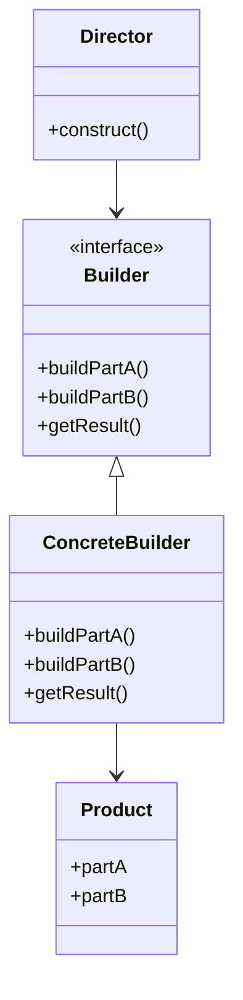

## 4.5 Builder Pattern

In the world of software development, creating complex objects can often become cumbersome and error-prone. The Builder pattern offers a robust solution to this problem by separating the construction of a complex object from its representation. This allows developers to use the same construction process to create different representations, enhancing flexibility and maintainability.

### Understanding the Builder Pattern

**Definition**: The Builder pattern is a creational design pattern that provides a way to construct a complex object step by step. Unlike other creational patterns, the Builder pattern does not require products to have a common interface. This pattern is particularly useful when the object creation process involves multiple steps or when the object needs to be created in different configurations.

**Intent**: The primary intent of the Builder pattern is to separate the construction of a complex object from its representation, allowing the same construction process to create different representations.

**Key Participants**:
- **Builder**: An interface that defines the steps to build the product.
- **ConcreteBuilder**: A class that implements the Builder interface and constructs the product.
- **Director**: A class that constructs the object using the Builder interface.
- **Product**: The complex object that is being built.

### Applicability

The Builder pattern is applicable in scenarios where:
- The construction process of an object is complex and involves multiple steps.
- Different representations of the object are required.
- The construction process needs to be independent of the parts that make up the object.

### Visualizing the Builder Pattern

Below is a class diagram illustrating the Builder pattern:



### Implementing the Builder Pattern in Ruby

Let's dive into a practical example to understand how the Builder pattern can be implemented in Ruby. We'll create a `House` object that can be constructed in various configurations.

#### Step 1: Define the Product

First, we define the `House` class, which represents the complex object we want to build.

```ruby
class House
  attr_accessor :walls, :doors, :windows, :roof

  def initialize
    @walls = 0
    @doors = 0
    @windows = 0
    @roof = false
  end

  def details
    "House with #{@walls} walls, #{@doors} doors, #{@windows} windows, and a #{roof ? 'roof' : 'no roof'}."
  end
end
```

#### Step 2: Create the Builder Interface

Next, we define the `HouseBuilder` interface, which outlines the steps required to build a house.

```ruby
class HouseBuilder
  def build_walls; end
  def build_doors; end
  def build_windows; end
  def build_roof; end
  def get_result; end
end
```

#### Step 3: Implement the Concrete Builder

We then create a `ConcreteHouseBuilder` class that implements the `HouseBuilder` interface.

```ruby
class ConcreteHouseBuilder < HouseBuilder
  def initialize
    @house = House.new
  end

  def build_walls
    @house.walls = 4
  end

  def build_doors
    @house.doors = 1
  end

  def build_windows
    @house.windows = 4
  end

  def build_roof
    @house.roof = true
  end

  def get_result
    @house
  end
end
```

#### Step 4: Create the Director

The `Director` class uses the builder to construct the object.

```ruby
class Director
  def initialize(builder)
    @builder = builder
  end

  def construct
    @builder.build_walls
    @builder.build_doors
    @builder.build_windows
    @builder.build_roof
  end
end
```

#### Step 5: Putting It All Together

Finally, we use the `Director` and `ConcreteHouseBuilder` to construct a `House`.

```ruby
builder = ConcreteHouseBuilder.new
director = Director.new(builder)
director.construct
house = builder.get_result
puts house.details
# Output: House with 4 walls, 1 doors, 4 windows, and a roof.
```

### Ruby's Unique Features: Keyword Arguments and Hashes

Ruby's flexibility allows us to achieve similar results to the Builder pattern using keyword arguments or hashes. This can simplify the creation of objects without the need for a separate builder class.

#### Using Keyword Arguments

```ruby
class House
  def initialize(walls: 0, doors: 0, windows: 0, roof: false)
    @walls = walls
    @doors = doors
    @windows = windows
    @roof = roof
  end

  def details
    "House with #{@walls} walls, #{@doors} doors, #{@windows} windows, and a #{roof ? 'roof' : 'no roof'}."
  end
end

house = House.new(walls: 4, doors: 1, windows: 4, roof: true)
puts house.details
# Output: House with 4 walls, 1 doors, 4 windows, and a roof.
```

#### Using Hashes

```ruby
class House
  def initialize(attributes = {})
    @walls = attributes[:walls] || 0
    @doors = attributes[:doors] || 0
    @windows = attributes[:windows] || 0
    @roof = attributes[:roof] || false
  end

  def details
    "House with #{@walls} walls, #{@doors} doors, #{@windows} windows, and a #{roof ? 'roof' : 'no roof'}."
  end
end

house = House.new(walls: 4, doors: 1, windows: 4, roof: true)
puts house.details
# Output: House with 4 walls, 1 doors, 4 windows, and a roof.
```

### Design Considerations

When deciding whether to use the Builder pattern, consider the following:
- **Complexity**: Use the Builder pattern when the construction process is complex and involves multiple steps.
- **Flexibility**: If you need to create different representations of an object, the Builder pattern can provide the necessary flexibility.
- **Readability**: The Builder pattern can improve code readability by clearly separating the construction process from the representation.

### Differences and Similarities with Other Patterns

The Builder pattern is often confused with the Factory Method pattern. While both patterns deal with object creation, the Builder pattern focuses on constructing a complex object step by step, whereas the Factory Method pattern is concerned with creating objects without specifying the exact class of the object that will be created.

### Try It Yourself

Experiment with the Builder pattern by modifying the `House` class to include additional features, such as a garage or a garden. Implement these changes in the `ConcreteHouseBuilder` and observe how the pattern adapts to accommodate new requirements.

### Knowledge Check

- What is the primary intent of the Builder pattern?
- How does the Builder pattern differ from the Factory Method pattern?
- In what scenarios is the Builder pattern most useful?
- How can Ruby's keyword arguments serve a similar purpose to the Builder pattern?

### Embrace the Journey

Remember, mastering design patterns is a journey. As you continue to explore and implement the Builder pattern, you'll gain a deeper understanding of how to create scalable and maintainable applications. Keep experimenting, stay curious, and enjoy the journey!

## Quiz: Builder Pattern



### What is the primary intent of the Builder pattern?

- [x] To separate the construction of a complex object from its representation
- [ ] To create a single instance of a class
- [ ] To define an interface for creating an object
- [ ] To provide a way to access elements of an aggregate object

> **Explanation:** The Builder pattern's primary intent is to separate the construction of a complex object from its representation, allowing the same construction process to create different representations.

### Which of the following is a key participant in the Builder pattern?

- [x] Builder
- [ ] Singleton
- [ ] Adapter
- [ ] Observer

> **Explanation:** The Builder pattern involves key participants such as Builder, ConcreteBuilder, Director, and Product.

### How does the Builder pattern differ from the Factory Method pattern?

- [x] The Builder pattern constructs a complex object step by step, while the Factory Method pattern creates objects without specifying the exact class.
- [ ] The Builder pattern creates a single instance of a class, while the Factory Method pattern creates multiple instances.
- [ ] The Builder pattern defines an interface for creating an object, while the Factory Method pattern does not.
- [ ] The Builder pattern is used for accessing elements of an aggregate object, while the Factory Method pattern is not.

> **Explanation:** The Builder pattern focuses on constructing a complex object step by step, whereas the Factory Method pattern is concerned with creating objects without specifying the exact class.

### In what scenarios is the Builder pattern most useful?

- [x] When the construction process of an object is complex and involves multiple steps
- [ ] When a single instance of a class is needed
- [ ] When an object needs to be accessed in a specific order
- [ ] When an object needs to be created without specifying its class

> **Explanation:** The Builder pattern is most useful when the construction process of an object is complex and involves multiple steps, or when different representations of the object are required.

### How can Ruby's keyword arguments serve a similar purpose to the Builder pattern?

- [x] By allowing the creation of objects with flexible configurations without a separate builder class
- [ ] By creating a single instance of a class
- [ ] By defining an interface for creating an object
- [ ] By providing a way to access elements of an aggregate object

> **Explanation:** Ruby's keyword arguments allow for the creation of objects with flexible configurations, similar to the Builder pattern, without the need for a separate builder class.

### What is a potential drawback of using the Builder pattern?

- [x] It can introduce additional complexity by requiring multiple classes and interfaces.
- [ ] It limits the flexibility of object creation.
- [ ] It does not support creating different representations of an object.
- [ ] It is only applicable to simple objects.

> **Explanation:** The Builder pattern can introduce additional complexity by requiring multiple classes and interfaces, which may not be necessary for simpler objects.

### Which Ruby feature can simplify object creation similar to the Builder pattern?

- [x] Keyword arguments
- [ ] Singleton methods
- [ ] Modules
- [ ] Blocks

> **Explanation:** Ruby's keyword arguments can simplify object creation by allowing flexible configurations, similar to the Builder pattern.

### What is the role of the Director in the Builder pattern?

- [x] To construct the object using the Builder interface
- [ ] To define the steps to build the product
- [ ] To implement the Builder interface
- [ ] To represent the complex object being built

> **Explanation:** The Director's role in the Builder pattern is to construct the object using the Builder interface.

### True or False: The Builder pattern is only applicable to creating graphical user interfaces.

- [ ] True
- [x] False

> **Explanation:** False. The Builder pattern is applicable to any scenario where complex object construction is needed, not just graphical user interfaces.

### Which of the following is NOT a benefit of the Builder pattern?

- [ ] It separates the construction process from the representation.
- [ ] It allows for different representations of the object.
- [x] It reduces the number of classes needed.
- [ ] It improves code readability.

> **Explanation:** The Builder pattern does not necessarily reduce the number of classes needed; in fact, it may introduce additional classes for builders and directors.


