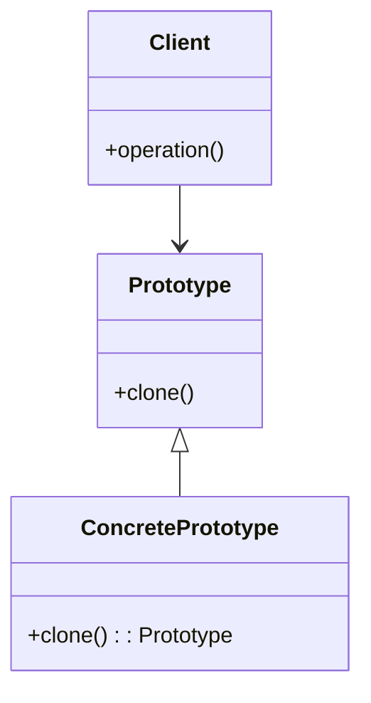

## 4.6 Prototype Pattern

In the realm of software design patterns, the Prototype Pattern stands out as a powerful creational pattern that facilitates the creation of new objects by cloning existing ones. This approach can be particularly advantageous in scenarios where object creation is costly or complex. In this section, we will delve into the Prototype Pattern, exploring its intent, implementation in Ruby, and the nuances of cloning objects.

### Intent of the Prototype Pattern

The Prototype Pattern is designed to create new objects by copying an existing object, known as the prototype. This pattern is particularly useful when the cost of creating a new instance of an object is more expensive than copying an existing one. The intent is to:

- **Reduce the cost of object creation**: By cloning existing objects, we can avoid the overhead associated with initializing new objects from scratch.
- **Simplify object creation**: When objects have numerous configurations or require complex setup, cloning a pre-configured prototype can simplify the process.
- **Promote flexibility**: The pattern allows for dynamic creation of objects at runtime, providing flexibility in object management.

### How Cloning Works in Ruby

Ruby provides two primary methods for cloning objects: `clone` and `dup`. Both methods create a shallow copy of the object, but they have subtle differences that are important to understand.

#### Using `clone`

The `clone` method creates a shallow copy of an object, including its singleton methods and frozen state. This means that any modifications to the clone will not affect the original object, and vice versa.

```ruby
class Prototype
  attr_accessor :name, :attributes

  def initialize(name, attributes = {})
    @name = name
    @attributes = attributes
  end

  def display
    puts "Prototype: #{@name}, Attributes: #{@attributes}"
  end
end

original = Prototype.new("Original", { color: "red", size: "large" })
clone = original.clone

clone.display
# Output: Prototype: Original, Attributes: {:color=>"red", :size=>"large"}
```

#### Using `dup`

The `dup` method also creates a shallow copy of an object but does not copy the singleton methods or the frozen state. This can be useful when you want a clean copy without any additional behaviors attached to the original object.

```ruby
dup_clone = original.dup
dup_clone.display
# Output: Prototype: Original, Attributes: {:color=>"red", :size=>"large"}
```

### Deep vs. Shallow Copies

Understanding the difference between deep and shallow copies is crucial when working with the Prototype Pattern.

- **Shallow Copy**: A shallow copy duplicates the object's top-level structure but not the objects it references. This means that changes to nested objects will affect both the original and the clone.

- **Deep Copy**: A deep copy duplicates the object and all objects it references, creating a completely independent copy. Ruby does not provide a built-in method for deep copying, but it can be achieved using serialization techniques.

#### Example of Deep Copy

To create a deep copy, you can use Ruby's `Marshal` module to serialize and deserialize the object:

```ruby
deep_clone = Marshal.load(Marshal.dump(original))
deep_clone.display
# Output: Prototype: Original, Attributes: {:color=>"red", :size=>"large"}
```

### Scenarios Where the Prototype Pattern is Beneficial

The Prototype Pattern is particularly useful in the following scenarios:

- **Performance Optimization**: When object creation is resource-intensive, cloning can significantly reduce the overhead.
- **Complex Object Configuration**: For objects that require complex setup or numerous configurations, using a prototype can simplify the creation process.
- **Dynamic Object Creation**: In applications where objects need to be created dynamically at runtime, the Prototype Pattern provides a flexible solution.

### Key Participants

In the Prototype Pattern, the key participants include:

- **Prototype**: The interface or abstract class that defines the method for cloning itself.
- **Concrete Prototype**: The class that implements the cloning method to create a new instance.
- **Client**: The entity that requests a new object by cloning a prototype.

### Applicability

The Prototype Pattern is applicable in situations where:

- The system should be independent of how its products are created, composed, and represented.
- Classes to be instantiated are specified at runtime.
- Avoiding the creation of subclasses is desired.
- Instances of a class can have one of only a few different combinations of state.

### Sample Code Snippet

Let's implement a simple example of the Prototype Pattern in Ruby:

```ruby
class Shape
  attr_accessor :type, :dimensions

  def initialize(type, dimensions)
    @type = type
    @dimensions = dimensions
  end

  def clone
    self.class.new(@type, @dimensions.clone)
  end

  def display
    puts "Shape: #{@type}, Dimensions: #{@dimensions}"
  end
end

# Create a prototype
circle = Shape.new("Circle", { radius: 5 })

# Clone the prototype
circle_clone = circle.clone
circle_clone.display
# Output: Shape: Circle, Dimensions: {:radius=>5}

# Modify the clone
circle_clone.dimensions[:radius] = 10
circle_clone.display
# Output: Shape: Circle, Dimensions: {:radius=>10}

# Original remains unchanged
circle.display
# Output: Shape: Circle, Dimensions: {:radius=>5}
```

### Design Considerations

When using the Prototype Pattern, consider the following:

- **Cloning Complexity**: Ensure that the cloning process is efficient and does not introduce unnecessary complexity.
- **State Management**: Be mindful of the state of cloned objects, especially when dealing with mutable objects.
- **Memory Usage**: Cloning can increase memory usage, so it's important to manage resources effectively.

### Ruby Unique Features

Ruby's dynamic nature and object-oriented design make it well-suited for implementing the Prototype Pattern. The language's built-in methods for cloning (`clone` and `dup`) provide a straightforward way to create object copies. Additionally, Ruby's flexibility allows for easy customization of the cloning process.

### Differences and Similarities

The Prototype Pattern is often compared to other creational patterns like Factory Method and Abstract Factory. While all these patterns deal with object creation, the Prototype Pattern is unique in its use of cloning rather than instantiation. This can lead to performance benefits in certain scenarios.

### Try It Yourself

To deepen your understanding of the Prototype Pattern, try modifying the code examples provided. Experiment with different object configurations and observe how changes to clones affect the original objects. Consider implementing a deep copy mechanism for more complex objects.

### Visualizing the Prototype Pattern

Below is a class diagram representing the Prototype Pattern:



This diagram illustrates the relationship between the Prototype, ConcretePrototype, and Client classes.

### Knowledge Check

- What is the primary intent of the Prototype Pattern?
- How does the `clone` method differ from the `dup` method in Ruby?
- What are the implications of using shallow copies?
- In what scenarios is the Prototype Pattern particularly beneficial?

### Embrace the Journey

Remember, mastering design patterns is a journey. As you explore the Prototype Pattern, consider how it can be applied to your projects. Experiment with different implementations and continue to build your understanding of Ruby's powerful capabilities.

## Quiz: Prototype Pattern



### What is the primary intent of the Prototype Pattern?

- [x] To create new objects by cloning existing ones
- [ ] To define an interface for creating objects
- [ ] To separate the construction of a complex object from its representation
- [ ] To provide a way to access the elements of an aggregate object sequentially

> **Explanation:** The Prototype Pattern's primary intent is to create new objects by cloning existing ones, reducing the cost and complexity of object creation.

### How does the `clone` method differ from the `dup` method in Ruby?

- [x] `clone` copies singleton methods and frozen state, while `dup` does not
- [ ] `dup` copies singleton methods and frozen state, while `clone` does not
- [ ] Both methods perform deep copies
- [ ] Both methods perform shallow copies without copying singleton methods

> **Explanation:** The `clone` method copies singleton methods and the frozen state of an object, whereas `dup` does not.

### What is a shallow copy?

- [x] A copy that duplicates the object's top-level structure but not the objects it references
- [ ] A copy that duplicates the object and all objects it references
- [ ] A copy that includes singleton methods
- [ ] A copy that does not include any methods

> **Explanation:** A shallow copy duplicates the object's top-level structure but not the objects it references, meaning changes to nested objects affect both the original and the clone.

### In what scenarios is the Prototype Pattern particularly beneficial?

- [x] When object creation is resource-intensive
- [x] When objects require complex setup
- [ ] When objects are simple and require no configuration
- [ ] When objects need to be created at compile time

> **Explanation:** The Prototype Pattern is beneficial when object creation is resource-intensive or when objects require complex setup, as it simplifies and optimizes the creation process.

### What is a deep copy?

- [x] A copy that duplicates the object and all objects it references
- [ ] A copy that duplicates only the object's top-level structure
- [ ] A copy that includes singleton methods
- [ ] A copy that does not include any methods

> **Explanation:** A deep copy duplicates the object and all objects it references, creating a completely independent copy.

### Which Ruby method can be used to achieve a deep copy?

- [x] `Marshal.load(Marshal.dump(object))`
- [ ] `object.clone`
- [ ] `object.dup`
- [ ] `object.copy`

> **Explanation:** The `Marshal` module can be used to achieve a deep copy by serializing and deserializing the object.

### What is the role of the Client in the Prototype Pattern?

- [x] To request a new object by cloning a prototype
- [ ] To define the interface for cloning
- [ ] To implement the cloning method
- [ ] To manage the lifecycle of prototypes

> **Explanation:** The Client in the Prototype Pattern requests a new object by cloning a prototype.

### Which of the following is a key participant in the Prototype Pattern?

- [x] Prototype
- [x] Concrete Prototype
- [ ] Factory
- [ ] Builder

> **Explanation:** The key participants in the Prototype Pattern are the Prototype and Concrete Prototype.

### What is the main advantage of using the Prototype Pattern?

- [x] It reduces the cost and complexity of object creation
- [ ] It provides a way to access the elements of an aggregate object sequentially
- [ ] It separates the construction of a complex object from its representation
- [ ] It defines an interface for creating objects

> **Explanation:** The main advantage of the Prototype Pattern is that it reduces the cost and complexity of object creation by cloning existing objects.

### True or False: The Prototype Pattern is often compared to the Factory Method Pattern.

- [x] True
- [ ] False

> **Explanation:** True. The Prototype Pattern is often compared to the Factory Method Pattern, as both deal with object creation, but they use different approaches.



Remember, this is just the beginning. As you progress, you'll build more complex and interactive applications. Keep experimenting, stay curious, and enjoy the journey!

---
