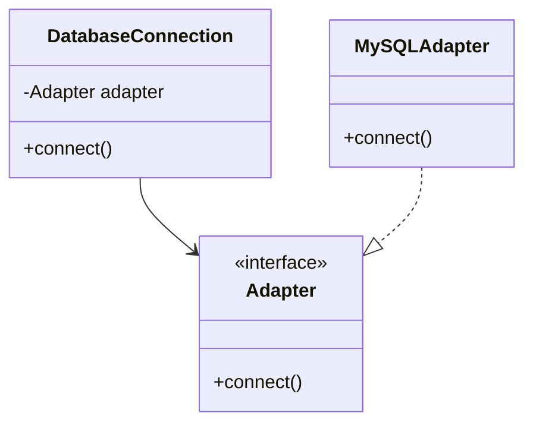

## 4.7 Dependency Injection in Ruby

### Introduction to Dependency Injection

Dependency Injection (DI) is a design pattern used to achieve Inversion of Control (IoC) between classes and their dependencies. By decoupling the creation of an object from its usage, DI promotes loose coupling, enhances testability, and improves the maintainability of applications. In Ruby, a dynamic and object-oriented language, DI can be implemented in various ways to leverage its flexibility and expressiveness.

### Benefits of Dependency Injection

1. **Loose Coupling**: By injecting dependencies, classes are not tightly bound to specific implementations, allowing for greater flexibility and easier refactoring.
2. **Enhanced Testability**: DI facilitates the use of mocks and stubs in testing, enabling isolated unit tests and reducing dependencies on external systems.
3. **Improved Maintainability**: With DI, changes to dependencies do not require modifications to the dependent classes, simplifying maintenance and updates.
4. **Increased Flexibility**: DI allows for easy swapping of implementations, enabling different configurations for different environments (e.g., development, testing, production).

### Techniques for Dependency Injection in Ruby

#### Constructor Injection

Constructor Injection involves passing dependencies to a class through its constructor. This technique ensures that a class is always initialized with its required dependencies, promoting immutability and consistency.

```ruby
class DatabaseConnection
  def initialize(adapter)
    @adapter = adapter
  end

  def connect
    @adapter.connect
  end
end

class MySQLAdapter
  def connect
    puts "Connecting to MySQL database..."
  end
end

# Injecting the dependency
mysql_adapter = MySQLAdapter.new
db_connection = DatabaseConnection.new(mysql_adapter)
db_connection.connect
```

In this example, `DatabaseConnection` is dependent on an adapter, which is injected through the constructor. This allows for easy substitution of different adapter implementations.

#### Setter Injection

Setter Injection involves providing a method to set dependencies after the object is constructed. This technique offers flexibility in changing dependencies at runtime.

```ruby
class Logger
  attr_writer :output

  def log(message)
    @output.write(message)
  end
end

class ConsoleOutput
  def write(message)
    puts message
  end
end

# Injecting the dependency
logger = Logger.new
console_output = ConsoleOutput.new
logger.output = console_output
logger.log("Hello, World!")
```

Here, the `Logger` class uses a setter method to inject the `ConsoleOutput` dependency, allowing for dynamic changes to the logging output.

#### Interface Injection

Interface Injection is less common in Ruby due to its dynamic nature but can be implemented by defining a method that accepts a dependency. This technique is useful when a class needs to interact with multiple dependencies.

```ruby
module Notifier
  def notify(message)
    raise NotImplementedError, "You must implement the notify method"
  end
end

class EmailNotifier
  include Notifier

  def notify(message)
    puts "Sending email: #{message}"
  end
end

class NotificationService
  def initialize
    @notifiers = []
  end

  def add_notifier(notifier)
    @notifiers << notifier
  end

  def send_notifications(message)
    @notifiers.each { |notifier| notifier.notify(message) }
  end
end

# Injecting dependencies
email_notifier = EmailNotifier.new
notification_service = NotificationService.new
notification_service.add_notifier(email_notifier)
notification_service.send_notifications("New message received!")
```

In this example, `NotificationService` uses interface injection to manage multiple notifiers, allowing for flexible addition and removal of notification mechanisms.

### Enhancing Testability with Dependency Injection

Dependency Injection significantly enhances testability by allowing the use of mocks and stubs. This enables developers to isolate the unit under test and simulate various scenarios without relying on external systems.

```ruby
require 'minitest/autorun'

class MockAdapter
  def connect
    "Mock connection established"
  end
end

class TestDatabaseConnection < Minitest::Test
  def test_connect
    mock_adapter = MockAdapter.new
    db_connection = DatabaseConnection.new(mock_adapter)
    assert_equal "Mock connection established", db_connection.connect
  end
end
```

In this test, a `MockAdapter` is used to simulate the behavior of a real adapter, allowing the `DatabaseConnection` class to be tested in isolation.

### Dependency Injection Frameworks and Gems in Ruby

While Ruby's dynamic nature allows for manual DI implementation, several frameworks and gems can simplify the process:

- **Dry-Container**: Part of the dry-rb ecosystem, this gem provides a simple and flexible way to manage dependencies using containers.
- **Injectable**: A lightweight gem that offers a simple DSL for defining dependencies and injecting them into classes.
- **Inversion of Control (IoC) Containers**: Libraries like `dry-container` and `rom-rb` provide IoC containers to manage dependencies and configurations.

### Visualizing Dependency Injection

To better understand how Dependency Injection works, let's visualize the process using a class diagram:



This diagram illustrates the relationship between `DatabaseConnection`, `Adapter`, and `MySQLAdapter`. The `DatabaseConnection` class depends on an `Adapter` interface, which is implemented by `MySQLAdapter`.

### Design Considerations

When implementing Dependency Injection in Ruby, consider the following:

- **Simplicity vs. Complexity**: While DI can enhance flexibility, it can also introduce complexity. Use DI judiciously and avoid over-engineering.
- **Performance**: DI can impact performance due to the additional abstraction layers. Optimize where necessary, especially in performance-critical applications.
- **Configuration Management**: Use configuration files or environment variables to manage dependencies, especially in different environments.

### Ruby Unique Features

Ruby's dynamic nature and metaprogramming capabilities provide unique opportunities for implementing DI. Use Ruby's flexibility to create elegant and concise DI solutions without the need for complex frameworks.

### Differences and Similarities

Dependency Injection is often confused with Service Locator, another pattern for managing dependencies. While both aim to decouple dependencies, DI explicitly injects dependencies, whereas Service Locator retrieves them from a centralized registry.

### Try It Yourself

Experiment with the provided examples by modifying the injected dependencies. Try creating new adapter implementations or changing the logging output to a file. Observe how DI allows for seamless integration and testing of different components.

### Conclusion

Dependency Injection is a powerful design pattern that promotes loose coupling, enhances testability, and improves maintainability. By leveraging Ruby's dynamic features, developers can implement DI in a flexible and efficient manner. Whether using manual techniques or leveraging DI frameworks, the key is to balance simplicity and flexibility to build scalable and maintainable applications.

## Quiz: Dependency Injection in Ruby



### What is the primary benefit of Dependency Injection?

- [x] Loose coupling between classes and their dependencies
- [ ] Faster execution of code
- [ ] Reduced memory usage
- [ ] Increased code complexity

> **Explanation:** Dependency Injection promotes loose coupling by decoupling the creation of an object from its usage, allowing for greater flexibility and easier refactoring.

### Which technique involves passing dependencies through a class's constructor?

- [x] Constructor Injection
- [ ] Setter Injection
- [ ] Interface Injection
- [ ] Service Locator

> **Explanation:** Constructor Injection involves passing dependencies to a class through its constructor, ensuring that a class is always initialized with its required dependencies.

### How does Dependency Injection enhance testability?

- [x] By allowing the use of mocks and stubs
- [ ] By increasing code execution speed
- [ ] By reducing the number of classes
- [ ] By eliminating the need for tests

> **Explanation:** Dependency Injection enhances testability by allowing the use of mocks and stubs, enabling isolated unit tests and reducing dependencies on external systems.

### Which Ruby gem is part of the dry-rb ecosystem for managing dependencies?

- [x] Dry-Container
- [ ] Injectable
- [ ] Rails
- [ ] Sinatra

> **Explanation:** Dry-Container is part of the dry-rb ecosystem and provides a simple and flexible way to manage dependencies using containers.

### What is a potential downside of using Dependency Injection?

- [x] Increased complexity
- [ ] Reduced code readability
- [ ] Slower code execution
- [ ] Decreased testability

> **Explanation:** While DI can enhance flexibility, it can also introduce complexity, so it should be used judiciously to avoid over-engineering.

### Which of the following is NOT a technique for Dependency Injection?

- [x] Service Locator
- [ ] Constructor Injection
- [ ] Setter Injection
- [ ] Interface Injection

> **Explanation:** Service Locator is not a technique for Dependency Injection; it is a separate pattern for managing dependencies.

### What is the role of an interface in Interface Injection?

- [x] To define a contract for dependencies
- [ ] To increase code execution speed
- [ ] To reduce memory usage
- [ ] To eliminate the need for tests

> **Explanation:** In Interface Injection, an interface defines a contract for dependencies, allowing for flexible addition and removal of implementations.

### Which technique allows for changing dependencies at runtime?

- [x] Setter Injection
- [ ] Constructor Injection
- [ ] Interface Injection
- [ ] Service Locator

> **Explanation:** Setter Injection involves providing a method to set dependencies after the object is constructed, allowing for dynamic changes at runtime.

### What is the relationship between Dependency Injection and Inversion of Control?

- [x] DI is a form of IoC
- [ ] DI is unrelated to IoC
- [ ] DI is the opposite of IoC
- [ ] DI replaces IoC

> **Explanation:** Dependency Injection is a form of Inversion of Control, where the control of creating and managing dependencies is inverted from the class to an external entity.

### True or False: Dependency Injection can impact performance due to additional abstraction layers.

- [x] True
- [ ] False

> **Explanation:** DI can impact performance due to the additional abstraction layers introduced, so optimization may be necessary in performance-critical applications.



Remember, mastering Dependency Injection in Ruby is a journey. As you continue to explore and experiment, you'll discover new ways to build scalable and maintainable applications. Keep learning, stay curious, and enjoy the process!
