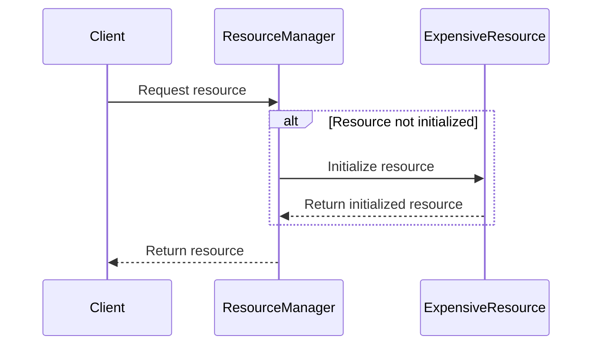

## 4.8 Lazy Initialization

In the realm of software design patterns, Lazy Initialization stands out as a powerful technique for optimizing resource usage and improving application performance. By deferring the creation or computation of an object until it is actually needed, Lazy Initialization can significantly reduce the overhead associated with resource-intensive operations. This section delves into the concept of Lazy Initialization, its implementation in Ruby, and the scenarios where it can be most beneficial.

### What is Lazy Initialization?

Lazy Initialization is a design pattern that delays the creation of an object, the calculation of a value, or some other expensive process until the first time it is needed. This approach can be particularly useful in situations where the cost of creating an object is high, and the object may not be used immediately or at all.

#### Intent

The primary intent of Lazy Initialization is to improve the efficiency of a program by avoiding unnecessary computations and memory allocations. By deferring these operations, applications can start faster and consume fewer resources, which is especially important in environments with limited memory or processing power.

### When to Use Lazy Initialization

Lazy Initialization is most beneficial in scenarios where:

- **Resource-Intensive Operations**: The initialization of an object or computation is costly in terms of time or memory.
- **Conditional Usage**: The object or computation may not be needed in every execution path.
- **Improved Startup Time**: Delaying initialization can lead to faster application startup times.

However, it's important to weigh the benefits against the potential complexity introduced by Lazy Initialization, especially in concurrent environments.

### Implementing Lazy Initialization in Ruby

Ruby provides several ways to implement Lazy Initialization, with the `||=` operator being one of the most common and idiomatic approaches. Let's explore how to implement Lazy Initialization in Ruby with practical examples.

#### Using the `||=` Operator

The `||=` operator is a shorthand for conditional assignment in Ruby. It assigns a value to a variable only if that variable is currently `nil` or `false`. This makes it an ideal tool for implementing Lazy Initialization.

```ruby
class ExpensiveResource
  def initialize
    puts "ExpensiveResource initialized"
    # Simulate a costly operation
    @data = (1..1000000).to_a.shuffle
  end

  def data
    @data
  end
end

class ResourceManager
  def initialize
    @resource = nil
  end

  def resource
    @resource ||= ExpensiveResource.new
  end
end

manager = ResourceManager.new
puts "Resource not yet initialized"
puts manager.resource.data.first # Triggers initialization
```

In this example, the `ExpensiveResource` object is only created when the `resource` method is called for the first time. The `||=` operator ensures that subsequent calls to `resource` return the already initialized object, avoiding redundant initializations.

#### Lazy Initialization with Custom Logic

Sometimes, you may need more control over the initialization process. In such cases, you can implement Lazy Initialization using custom logic.

```ruby
class CustomLazyLoader
  def initialize
    @resource = nil
    @initialized = false
  end

  def resource
    unless @initialized
      @resource = ExpensiveResource.new
      @initialized = true
    end
    @resource
  end
end

loader = CustomLazyLoader.new
puts "Resource not yet initialized"
puts loader.resource.data.first # Triggers initialization
```

This approach allows you to include additional logic during the initialization process, such as logging or error handling.

### Performance and Resource Usage Benefits

Lazy Initialization can lead to significant performance improvements, especially in applications with complex initialization logic or large data structures. By deferring these operations, you can reduce memory usage and improve application responsiveness.

#### Example: Improving Performance with Lazy Initialization

Consider an application that processes large datasets. By using Lazy Initialization, you can load data only when it's needed, reducing the application's memory footprint and improving its overall performance.

```ruby
class DataProcessor
  def initialize
    @large_dataset = nil
  end

  def large_dataset
    @large_dataset ||= load_large_dataset
  end

  private

  def load_large_dataset
    puts "Loading large dataset..."
    # Simulate loading a large dataset
    (1..1000000).to_a
  end
end

processor = DataProcessor.new
puts "Dataset not yet loaded"
puts processor.large_dataset.first # Triggers loading
```

### Thread Safety Considerations

In a concurrent environment, Lazy Initialization can introduce thread safety issues if not handled properly. When multiple threads attempt to initialize the same resource simultaneously, it can lead to race conditions and inconsistent states.

#### Ensuring Thread Safety

To ensure thread safety, you can use synchronization mechanisms such as mutexes to control access to the resource during initialization.

```ruby
require 'thread'

class ThreadSafeResourceManager
  def initialize
    @resource = nil
    @mutex = Mutex.new
  end

  def resource
    @mutex.synchronize do
      @resource ||= ExpensiveResource.new
    end
  end
end

manager = ThreadSafeResourceManager.new
threads = 10.times.map do
  Thread.new do
    puts manager.resource.data.first
  end
end

threads.each(&:join)
```

In this example, a `Mutex` is used to synchronize access to the `resource` method, ensuring that only one thread can initialize the `ExpensiveResource` at a time.

### Trade-offs and Considerations

While Lazy Initialization can offer significant benefits, it's important to consider the trade-offs:

- **Complexity**: Introducing Lazy Initialization can increase the complexity of your code, making it harder to maintain and debug.
- **Delayed Errors**: Errors during initialization may be delayed until the resource is accessed, making them harder to detect and diagnose.
- **Thread Safety**: In concurrent environments, additional mechanisms are needed to ensure thread safety, which can further complicate the implementation.

### Try It Yourself

To better understand Lazy Initialization, try modifying the examples provided:

- **Experiment with Different Data Structures**: Implement Lazy Initialization for different data structures, such as hashes or arrays, and observe the impact on performance.
- **Simulate Concurrent Access**: Modify the thread-safe example to simulate concurrent access and observe how the mutex ensures safe initialization.
- **Add Logging**: Introduce logging to track when resources are initialized and accessed, providing insights into the benefits of Lazy Initialization.

### Visualizing Lazy Initialization

To further illustrate the concept of Lazy Initialization, let's use a Mermaid.js diagram to visualize the process.



**Diagram Description**: This sequence diagram illustrates the Lazy Initialization process. When the client requests a resource, the `ResourceManager` checks if the resource is initialized. If not, it initializes the `ExpensiveResource` and returns it to the client.

### Key Takeaways

- **Lazy Initialization** is a powerful technique for optimizing resource usage and improving performance by deferring object creation until necessary.
- **Ruby's `||=` operator** provides a simple and idiomatic way to implement Lazy Initialization.
- **Thread safety** is a critical consideration in concurrent environments, requiring synchronization mechanisms like mutexes.
- **Evaluate trade-offs** between the benefits of Lazy Initialization and the complexity it introduces.

### References and Further Reading

- [Ruby Documentation](https://ruby-doc.org/core-2.7.0/doc/syntax/control_expressions_rdoc.html#label-Conditional+Assignment)
- [Concurrency in Ruby](https://ruby-doc.org/core-2.7.0/Thread.html)
- [Design Patterns: Elements of Reusable Object-Oriented Software](https://en.wikipedia.org/wiki/Design_Patterns)

Remember, Lazy Initialization is just one of many design patterns that can help you build scalable and maintainable applications. As you continue your journey, keep exploring and experimenting with different patterns to find the best solutions for your projects.

## Quiz: Lazy Initialization



### What is the primary intent of Lazy Initialization?

- [x] To improve efficiency by deferring object creation until necessary
- [ ] To immediately initialize all objects at startup
- [ ] To simplify code by removing conditional logic
- [ ] To ensure all objects are thread-safe

> **Explanation:** Lazy Initialization aims to improve efficiency by delaying object creation until it is actually needed, reducing unnecessary computations and memory usage.

### Which Ruby operator is commonly used for Lazy Initialization?

- [ ] `+=`
- [x] `||=`
- [ ] `&&=`
- [ ] `==`

> **Explanation:** The `||=` operator is used for conditional assignment, making it ideal for Lazy Initialization by assigning a value only if the variable is `nil` or `false`.

### What is a potential downside of Lazy Initialization?

- [ ] Improved performance
- [x] Increased complexity
- [ ] Reduced memory usage
- [ ] Faster startup time

> **Explanation:** While Lazy Initialization can improve performance and reduce memory usage, it can also increase code complexity, making it harder to maintain and debug.

### How can thread safety be ensured in Lazy Initialization?

- [ ] By using global variables
- [ ] By avoiding conditional logic
- [x] By using synchronization mechanisms like mutexes
- [ ] By initializing all objects at startup

> **Explanation:** In concurrent environments, synchronization mechanisms like mutexes are used to ensure thread safety during Lazy Initialization.

### What is a benefit of Lazy Initialization?

- [ ] Delayed error detection
- [ ] Increased memory usage
- [x] Improved application responsiveness
- [ ] Immediate resource allocation

> **Explanation:** Lazy Initialization can improve application responsiveness by deferring resource-intensive operations until they are needed.

### Which of the following is a trade-off of using Lazy Initialization?

- [x] Delayed errors
- [ ] Immediate initialization
- [ ] Simplified code
- [ ] Reduced complexity

> **Explanation:** Errors during initialization may be delayed until the resource is accessed, making them harder to detect and diagnose.

### In which scenario is Lazy Initialization most beneficial?

- [ ] When all resources are needed immediately
- [x] When initialization is resource-intensive and conditional
- [ ] When thread safety is not a concern
- [ ] When code complexity is a priority

> **Explanation:** Lazy Initialization is most beneficial when initialization is resource-intensive and the resource may not be needed in every execution path.

### What does the `||=` operator do in Ruby?

- [ ] Assigns a value unconditionally
- [x] Assigns a value only if the variable is `nil` or `false`
- [ ] Compares two values for equality
- [ ] Performs a logical AND operation

> **Explanation:** The `||=` operator assigns a value to a variable only if that variable is currently `nil` or `false`, making it useful for Lazy Initialization.

### How does Lazy Initialization affect application startup time?

- [ ] It increases startup time
- [x] It can reduce startup time
- [ ] It has no effect on startup time
- [ ] It always delays startup time

> **Explanation:** By deferring resource-intensive operations, Lazy Initialization can reduce application startup time, allowing the application to start faster.

### True or False: Lazy Initialization can lead to race conditions in concurrent environments if not handled properly.

- [x] True
- [ ] False

> **Explanation:** In concurrent environments, Lazy Initialization can lead to race conditions if multiple threads attempt to initialize the same resource simultaneously without proper synchronization.


