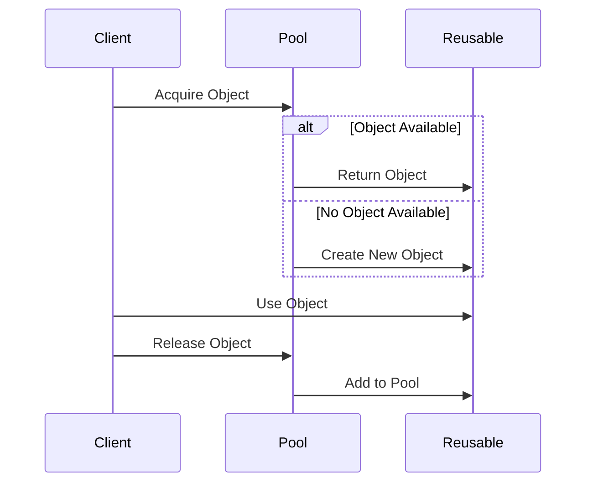

## 4.9 Object Pool Pattern

In the realm of software design patterns, the Object Pool Pattern stands out as a powerful tool for optimizing resource management and enhancing application performance. This pattern is particularly useful in scenarios where the cost of initializing a class instance is high, and the number of instances in use at any given time is relatively low. By reusing objects instead of creating new ones, the Object Pool Pattern can significantly reduce the overhead associated with object creation and garbage collection.

### **Intent**

The primary intent of the Object Pool Pattern is to manage a set of initialized objects that are ready to be used, thereby improving performance by reusing objects instead of creating new ones. This pattern is especially beneficial in environments where object instantiation is expensive, such as database connections, thread pools, or large data structures.

### **Key Participants**

1. **Pool**: Manages the pool of reusable objects. It handles the allocation and deallocation of objects.
2. **Reusable**: The objects that are managed by the pool. These objects are typically expensive to create or manage.
3. **Client**: The entity that uses the objects from the pool.

### **Applicability**

The Object Pool Pattern is applicable in the following scenarios:

- When object creation is costly in terms of time or resources.
- When you need to manage a large number of objects that are used intermittently.
- When you want to limit the number of instances of a class.
- When you need to manage resources such as database connections, network connections, or thread pools.

### **Sample Code Snippet**

Let's dive into a Ruby implementation of the Object Pool Pattern. We'll create a simple object pool for managing database connections.

```ruby
# Define a simple DatabaseConnection class
class DatabaseConnection
  def initialize
    @connected = true
    puts "Database connection established."
  end

  def query(sql)
    puts "Executing query: #{sql}"
  end

  def close
    @connected = false
    puts "Database connection closed."
  end
end

# Define the ObjectPool class
class ObjectPool
  def initialize(size)
    @available = []
    @in_use = []
    @size = size
    @mutex = Mutex.new
  end

  def acquire
    @mutex.synchronize do
      if @available.empty? && @in_use.size < @size
        connection = DatabaseConnection.new
        @in_use << connection
        connection
      elsif !@available.empty?
        connection = @available.pop
        @in_use << connection
        connection
      else
        nil
      end
    end
  end

  def release(connection)
    @mutex.synchronize do
      @in_use.delete(connection)
      @available << connection
    end
  end
end

# Usage example
pool = ObjectPool.new(2)

# Acquire a connection from the pool
conn1 = pool.acquire
conn1.query("SELECT * FROM users")

# Release the connection back to the pool
pool.release(conn1)

# Acquire another connection
conn2 = pool.acquire
conn2.query("SELECT * FROM orders")

# Release the connection
pool.release(conn2)
```

### **Design Considerations**

When implementing the Object Pool Pattern, consider the following:

- **Synchronization**: Ensure thread safety when accessing the pool, especially in a multi-threaded environment. Use mutexes or other synchronization mechanisms to prevent race conditions.
- **Lifecycle Management**: Properly manage the lifecycle of pooled objects. Ensure that objects are reset to a clean state before being reused.
- **Resource Limits**: Set appropriate limits on the number of objects in the pool to prevent resource exhaustion.
- **Error Handling**: Implement robust error handling to manage situations where objects become invalid or unusable.

### **Ruby Unique Features**

Ruby's dynamic nature and built-in support for threading make it well-suited for implementing the Object Pool Pattern. The use of `Mutex` for synchronization and Ruby's garbage collector for managing object lifecycles are particularly advantageous.

### **Differences and Similarities**

The Object Pool Pattern is often confused with the Singleton Pattern. While both patterns manage object instances, the Singleton Pattern restricts a class to a single instance, whereas the Object Pool Pattern manages a pool of reusable instances.

### **Synchronization and Concurrency Issues**

In a multi-threaded environment, synchronization is crucial to ensure that multiple threads do not simultaneously modify the pool's state. In our Ruby example, we use a `Mutex` to synchronize access to the pool. This prevents race conditions and ensures that only one thread can acquire or release a connection at a time.

### **Managing the Lifecycle of Pooled Objects**

Proper lifecycle management is essential to ensure that pooled objects remain in a valid state. Before releasing an object back to the pool, reset it to a clean state to avoid unintended side effects. In our example, you might want to reset the database connection's state or close it if it's no longer valid.

### **Try It Yourself**

Experiment with the provided code example by modifying the pool size or adding additional methods to the `DatabaseConnection` class. Try simulating a scenario where multiple threads acquire and release connections concurrently to observe how the pool manages synchronization.

### **Visualizing the Object Pool Pattern**

To better understand the Object Pool Pattern, let's visualize the flow of acquiring and releasing objects using a Mermaid.js sequence diagram.



This diagram illustrates the process of acquiring an object from the pool, using it, and then releasing it back to the pool for future use.

### **References and Links**

- [Ruby Mutex Documentation](https://ruby-doc.org/core-2.7.0/Mutex.html)
- [Object Pool Pattern on Wikipedia](https://en.wikipedia.org/wiki/Object_pool_pattern)
- [Design Patterns: Elements of Reusable Object-Oriented Software](https://www.amazon.com/Design-Patterns-Elements-Reusable-Object-Oriented/dp/0201633612)

### **Knowledge Check**

- What are the key benefits of using the Object Pool Pattern?
- How does synchronization play a role in managing an object pool?
- What are some potential pitfalls when implementing an object pool?

### **Embrace the Journey**

Remember, mastering design patterns like the Object Pool Pattern is a journey. As you continue to explore and implement these patterns, you'll gain deeper insights into building scalable and maintainable applications. Keep experimenting, stay curious, and enjoy the journey!

## Quiz: Object Pool Pattern



### What is the primary intent of the Object Pool Pattern?

- [x] To manage a set of initialized objects ready to be used, improving performance by reusing objects.
- [ ] To ensure only one instance of a class exists.
- [ ] To provide a way to create families of related objects.
- [ ] To define an interface for creating an object, but let subclasses alter the type of objects that will be created.

> **Explanation:** The Object Pool Pattern focuses on managing and reusing a set of initialized objects to improve performance.

### In which scenario is the Object Pool Pattern most beneficial?

- [x] When object creation is costly in terms of time or resources.
- [ ] When you need to ensure a single instance of a class.
- [ ] When you want to define a family of related objects.
- [ ] When you need to separate the construction of a complex object from its representation.

> **Explanation:** The Object Pool Pattern is advantageous when object creation is expensive and objects are used intermittently.

### What is a key consideration when implementing an object pool?

- [x] Synchronization to ensure thread safety.
- [ ] Ensuring only one instance of the pool exists.
- [ ] Defining a family of related objects.
- [ ] Separating the construction of an object from its representation.

> **Explanation:** Synchronization is crucial to prevent race conditions and ensure thread safety when accessing the pool.

### How does the Object Pool Pattern differ from the Singleton Pattern?

- [x] The Object Pool Pattern manages a pool of reusable instances, while the Singleton Pattern restricts a class to a single instance.
- [ ] Both patterns restrict a class to a single instance.
- [ ] The Singleton Pattern manages a pool of reusable instances, while the Object Pool Pattern restricts a class to a single instance.
- [ ] Both patterns manage a pool of reusable instances.

> **Explanation:** The Object Pool Pattern manages multiple reusable instances, whereas the Singleton Pattern ensures only one instance exists.

### What is the role of the `Mutex` in the Ruby implementation of the Object Pool Pattern?

- [x] To synchronize access to the pool and prevent race conditions.
- [ ] To ensure only one instance of the pool exists.
- [ ] To define a family of related objects.
- [ ] To separate the construction of an object from its representation.

> **Explanation:** The `Mutex` is used to synchronize access to the pool, ensuring thread safety.

### What should be done before releasing an object back to the pool?

- [x] Reset it to a clean state to avoid unintended side effects.
- [ ] Ensure it is the only instance of its class.
- [ ] Define a family of related objects.
- [ ] Separate its construction from its representation.

> **Explanation:** Resetting the object ensures it is in a valid state for future use.

### What is a potential pitfall when implementing an object pool?

- [x] Resource exhaustion if the pool size is not properly managed.
- [ ] Ensuring only one instance of the pool exists.
- [ ] Defining a family of related objects.
- [ ] Separating the construction of an object from its representation.

> **Explanation:** Without proper management, the pool can exhaust resources, leading to performance issues.

### How can you experiment with the provided Ruby code example?

- [x] Modify the pool size or add additional methods to the `DatabaseConnection` class.
- [ ] Ensure only one instance of the pool exists.
- [ ] Define a family of related objects.
- [ ] Separate the construction of an object from its representation.

> **Explanation:** Experimenting with the pool size or adding methods helps understand the pattern's behavior.

### What is the benefit of using the Object Pool Pattern in a multi-threaded environment?

- [x] It reduces the overhead of object creation and ensures efficient resource management.
- [ ] It ensures only one instance of a class exists.
- [ ] It defines a family of related objects.
- [ ] It separates the construction of an object from its representation.

> **Explanation:** The Object Pool Pattern optimizes resource management and reduces object creation overhead in multi-threaded environments.

### True or False: The Object Pool Pattern is only useful for managing database connections.

- [ ] True
- [x] False

> **Explanation:** The Object Pool Pattern is versatile and can be used for various resources, not just database connections.


