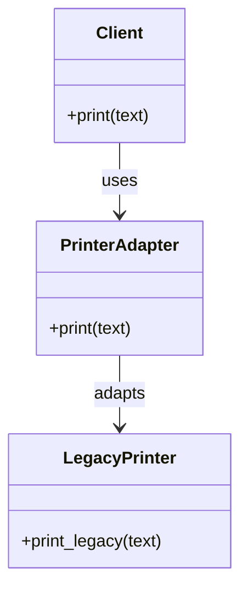

## 5.1 Adapter Pattern

### Introduction

In the world of software development, we often encounter situations where we need to integrate components with incompatible interfaces. The Adapter Pattern, a structural design pattern, provides a solution by allowing objects with incompatible interfaces to collaborate. It acts as a bridge, converting the interface of one class into another expected by clients. This pattern is particularly useful in scenarios where you want to reuse existing code without modifying it.

### Intent

The primary intent of the Adapter Pattern is to allow classes with incompatible interfaces to work together. By creating an adapter, you can convert the interface of a class into another interface that a client expects. This pattern promotes flexibility and reuse by enabling the integration of disparate systems.

### Problem Statement

Imagine you are developing a Ruby application that needs to integrate with a third-party library. The library provides a set of classes with interfaces that do not match the ones used in your application. Modifying the existing code to accommodate the library's interfaces can be time-consuming and error-prone. The Adapter Pattern offers a clean solution by allowing you to create an adapter that translates the library's interface into one that your application can understand.

### Key Participants

1. **Target Interface**: The interface that the client expects.
2. **Client**: The class that interacts with the target interface.
3. **Adaptee**: The class with an incompatible interface that needs to be adapted.
4. **Adapter**: The class that bridges the gap between the target interface and the adaptee.

### Applicability

Use the Adapter Pattern when:

- You want to use an existing class, and its interface does not match the one you need.
- You need to create a reusable class that cooperates with unrelated or unforeseen classes.
- You want to integrate a third-party library into your application without modifying its source code.

### Class Adapter in Ruby

In Ruby, a class adapter can be implemented using inheritance. The adapter class inherits from the adaptee and implements the target interface. Here's an example:

```ruby
# Adaptee class with an incompatible interface
class LegacyPrinter
  def print_legacy(text)
    puts "Printing in legacy format: #{text}"
  end
end

# Target interface
module Printer
  def print(text)
    raise NotImplementedError, "#{self.class} has not implemented method '#{__method__}'"
  end
end

# Adapter class
class PrinterAdapter < LegacyPrinter
  include Printer

  def print(text)
    print_legacy(text)
  end
end

# Client code
def client_code(printer)
  printer.print("Hello, World!")
end

adapter = PrinterAdapter.new
client_code(adapter)
```

In this example, `LegacyPrinter` is the adaptee with an incompatible interface. The `PrinterAdapter` class inherits from `LegacyPrinter` and implements the `Printer` module, adapting the `print_legacy` method to the `print` method expected by the client.

### Object Adapter in Ruby

An object adapter uses composition instead of inheritance. The adapter holds an instance of the adaptee and delegates calls to it. Here's how you can implement an object adapter:

```ruby
# Adaptee class with an incompatible interface
class LegacyPrinter
  def print_legacy(text)
    puts "Printing in legacy format: #{text}"
  end
end

# Target interface
module Printer
  def print(text)
    raise NotImplementedError, "#{self.class} has not implemented method '#{__method__}'"
  end
end

# Adapter class
class PrinterAdapter
  include Printer

  def initialize(legacy_printer)
    @legacy_printer = legacy_printer
  end

  def print(text)
    @legacy_printer.print_legacy(text)
  end
end

# Client code
def client_code(printer)
  printer.print("Hello, World!")
end

legacy_printer = LegacyPrinter.new
adapter = PrinterAdapter.new(legacy_printer)
client_code(adapter)
```

In this example, the `PrinterAdapter` class holds an instance of `LegacyPrinter` and delegates the `print` method to `print_legacy`.

### Using Modules and Mixins

Ruby's modules and mixins provide a powerful way to implement adapters. By including a module in a class, you can dynamically add behavior to the class. Here's an example:

```ruby
# Adaptee class with an incompatible interface
class LegacyPrinter
  def print_legacy(text)
    puts "Printing in legacy format: #{text}"
  end
end

# Adapter module
module PrinterAdapter
  def print(text)
    print_legacy(text)
  end
end

# Extend the adaptee with the adapter module
legacy_printer = LegacyPrinter.new
legacy_printer.extend(PrinterAdapter)

# Client code
def client_code(printer)
  printer.print("Hello, World!")
end

client_code(legacy_printer)
```

In this example, the `PrinterAdapter` module is mixed into an instance of `LegacyPrinter`, allowing it to respond to the `print` method.

### Benefits of the Adapter Pattern

- **Increased Flexibility**: The Adapter Pattern allows you to integrate components with incompatible interfaces without modifying their source code.
- **Code Reuse**: By adapting existing classes, you can reuse them in new contexts.
- **Decoupling**: The pattern decouples the client from the adaptee, promoting a more modular design.

### Design Considerations

- **Performance Overhead**: Adapters can introduce a slight performance overhead due to the additional layer of abstraction.
- **Complexity**: Overusing adapters can lead to increased complexity in the codebase.
- **Compatibility**: Ensure that the adapter correctly translates between the target interface and the adaptee.

### Ruby Unique Features

Ruby's dynamic nature and support for modules and mixins make it particularly well-suited for implementing adapters. The ability to extend objects at runtime provides a flexible way to adapt interfaces without modifying existing code.

### Differences and Similarities

The Adapter Pattern is often confused with the Decorator Pattern. While both patterns involve wrapping an object, the Adapter Pattern focuses on interface compatibility, whereas the Decorator Pattern adds new behavior to an object.

### Visualizing the Adapter Pattern



This diagram illustrates the relationship between the client, adapter, and adaptee. The client interacts with the adapter, which in turn adapts the interface of the adaptee.

### Try It Yourself

Experiment with the provided code examples by modifying the `LegacyPrinter` class to include additional methods. Create new adapters to translate these methods into the target interface. This exercise will help you understand how the Adapter Pattern can be applied in different scenarios.

### Knowledge Check

- What is the primary purpose of the Adapter Pattern?
- How does a class adapter differ from an object adapter?
- What are the benefits of using modules and mixins in Ruby for implementing adapters?
- How does the Adapter Pattern promote code reuse and flexibility?

### Embrace the Journey

Remember, mastering design patterns is a journey. As you continue to explore and apply the Adapter Pattern in your projects, you'll gain a deeper understanding of how to create scalable and maintainable applications. Keep experimenting, stay curious, and enjoy the process!

## Quiz: Adapter Pattern



### What is the primary purpose of the Adapter Pattern?

- [x] To allow classes with incompatible interfaces to work together
- [ ] To add new behavior to an object
- [ ] To create a new interface for a class
- [ ] To improve the performance of a class

> **Explanation:** The Adapter Pattern is used to allow classes with incompatible interfaces to work together by converting the interface of one class into another expected by clients.

### How does a class adapter differ from an object adapter?

- [x] A class adapter uses inheritance, while an object adapter uses composition
- [ ] A class adapter uses composition, while an object adapter uses inheritance
- [ ] A class adapter is more flexible than an object adapter
- [ ] A class adapter is less efficient than an object adapter

> **Explanation:** A class adapter uses inheritance to adapt the interface, while an object adapter uses composition to hold an instance of the adaptee and delegate calls.

### What are the benefits of using modules and mixins in Ruby for implementing adapters?

- [x] They allow dynamic addition of behavior to objects
- [x] They promote code reuse
- [ ] They improve the performance of the application
- [ ] They simplify the codebase

> **Explanation:** Modules and mixins in Ruby allow dynamic addition of behavior to objects, promoting code reuse without modifying existing code.

### How does the Adapter Pattern promote code reuse and flexibility?

- [x] By allowing existing classes to be used in new contexts without modification
- [ ] By simplifying the codebase
- [ ] By improving the performance of the application
- [ ] By reducing the number of classes in the codebase

> **Explanation:** The Adapter Pattern promotes code reuse and flexibility by allowing existing classes to be used in new contexts without modification, enabling integration with different systems.

### Which of the following is a key participant in the Adapter Pattern?

- [x] Target Interface
- [x] Client
- [ ] Decorator
- [ ] Singleton

> **Explanation:** The key participants in the Adapter Pattern include the Target Interface, Client, Adaptee, and Adapter.

### What is a potential drawback of using the Adapter Pattern?

- [x] It can introduce performance overhead
- [ ] It simplifies the codebase
- [ ] It reduces the number of classes
- [ ] It eliminates the need for interfaces

> **Explanation:** The Adapter Pattern can introduce performance overhead due to the additional layer of abstraction.

### In Ruby, how can you dynamically add behavior to an object?

- [x] By using modules and mixins
- [ ] By using inheritance
- [ ] By using class variables
- [ ] By using global variables

> **Explanation:** In Ruby, you can dynamically add behavior to an object by using modules and mixins, which allow you to extend objects at runtime.

### What is the difference between the Adapter Pattern and the Decorator Pattern?

- [x] The Adapter Pattern focuses on interface compatibility, while the Decorator Pattern adds new behavior
- [ ] The Adapter Pattern adds new behavior, while the Decorator Pattern focuses on interface compatibility
- [ ] Both patterns focus on interface compatibility
- [ ] Both patterns add new behavior to an object

> **Explanation:** The Adapter Pattern focuses on interface compatibility, allowing objects with incompatible interfaces to work together, while the Decorator Pattern adds new behavior to an object.

### Can the Adapter Pattern be used to integrate third-party libraries into an application?

- [x] True
- [ ] False

> **Explanation:** True. The Adapter Pattern can be used to integrate third-party libraries into an application by adapting their interfaces to match the ones expected by the application.

### What is a common use case for the Adapter Pattern?

- [x] Integrating components with incompatible interfaces
- [ ] Adding new features to an existing class
- [ ] Improving the performance of a class
- [ ] Reducing the complexity of a codebase

> **Explanation:** A common use case for the Adapter Pattern is integrating components with incompatible interfaces, allowing them to work together seamlessly.


