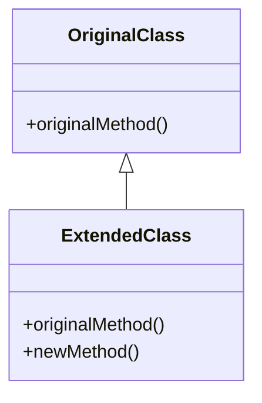

## 5.10 Extending Classes at Runtime

In the world of Ruby, one of the most powerful and flexible features is the ability to extend classes at runtime. This capability allows developers to modify existing classes, including those from the Ruby standard library, to add new methods or alter existing behavior. While this flexibility can be incredibly useful, it also comes with potential risks and challenges. In this section, we'll explore the concept of open classes, demonstrate how to dynamically modify classes, discuss practical use cases, and provide best practices to ensure your code remains robust and maintainable.

### Understanding Open Classes

Ruby's open classes are a fundamental aspect of its dynamic nature. Unlike many other programming languages where classes are closed after their initial definition, Ruby allows classes to be reopened and modified at any point in the program. This means you can add new methods, change existing ones, or even remove methods from a class after it has been defined.

#### What Are Open Classes?

Open classes in Ruby refer to the ability to modify a class definition after it has been initially declared. This feature is part of Ruby's dynamic and flexible nature, allowing developers to tailor classes to their specific needs without altering the original source code.

```ruby
class String
  def shout
    self.upcase + "!"
  end
end

puts "hello".shout  # Outputs: HELLO!
```

In the example above, we reopen the `String` class to add a new method `shout`, which converts a string to uppercase and appends an exclamation mark.

### Dynamic Class Modification

Dynamic class modification involves altering the behavior of classes at runtime. This can be done by adding new methods, overriding existing ones, or even removing methods. Ruby provides several mechanisms to achieve this, including class reopening, singleton methods, and the `method_missing` technique.

#### Adding Methods to Existing Classes

One of the simplest ways to extend a class is by adding new methods. This is often done to enhance the functionality of standard library classes or third-party libraries.

```ruby
class Array
  def second
    self[1]
  end
end

arr = [1, 2, 3]
puts arr.second  # Outputs: 2
```

Here, we add a `second` method to the `Array` class, allowing us to easily access the second element of an array.

#### Overriding Methods

Overriding methods in an existing class allows you to change the behavior of those methods. This can be useful when you need to modify the behavior of a method from a library without altering the library's source code.

```ruby
class Fixnum
  alias_method :old_plus, :+

  def +(other)
    self.old_plus(other).old_plus(1)
  end
end

puts 1 + 1  # Outputs: 3
```

In this example, we override the `+` method in the `Fixnum` class to increment the result by 1. We use `alias_method` to keep a reference to the original `+` method.

#### Using `method_missing`

The `method_missing` method is a powerful tool for handling calls to methods that do not exist. By defining `method_missing`, you can intercept these calls and provide custom behavior.

```ruby
class DynamicMethods
  def method_missing(name, *args)
    puts "You tried to call #{name} with arguments: #{args.join(', ')}"
  end
end

obj = DynamicMethods.new
obj.any_method(1, 2, 3)  # Outputs: You tried to call any_method with arguments: 1, 2, 3
```

### Use Cases for Extending Classes

Extending classes at runtime can be beneficial in various scenarios. Here are some common use cases:

#### Enhancing Standard Library Classes

Ruby's standard library is extensive, but there may be times when you need additional functionality. By extending these classes, you can add the methods you need without waiting for updates to the library.

#### Adapting Third-Party Libraries

When using third-party libraries, you might encounter situations where the library's classes lack certain features. Instead of modifying the library's source code, you can extend its classes to add the necessary functionality.

#### Implementing Domain-Specific Languages (DSLs)

Ruby's flexibility makes it an excellent choice for creating DSLs. By extending classes, you can create intuitive and expressive interfaces tailored to specific domains.

### Risks and Challenges

While extending classes at runtime offers great flexibility, it also introduces potential risks:

#### Unintended Side Effects

Modifying a class can have unintended consequences, especially if other parts of the program rely on the original behavior. This can lead to bugs that are difficult to trace.

#### Compatibility Issues

Extending classes can cause compatibility issues with future updates to the Ruby language or libraries. If a new version introduces changes to a class you've modified, your extensions may break.

#### Performance Overhead

Dynamic modifications can introduce performance overhead, particularly if `method_missing` is used extensively. It's essential to balance flexibility with performance considerations.

### Best Practices for Extending Classes

To mitigate the risks associated with extending classes, consider the following best practices:

#### Use Refinements

Refinements provide a way to extend classes in a more controlled manner. They allow you to scope modifications to specific parts of your code, reducing the risk of unintended side effects.

```ruby
module StringExtensions
  refine String do
    def shout
      self.upcase + "!"
    end
  end
end

using StringExtensions

puts "hello".shout  # Outputs: HELLO!
```

In this example, the `shout` method is only available within the scope of the `using` statement, preventing it from affecting other parts of the program.

#### Be Cautious with Modifications

Before modifying a class, consider whether the change is necessary and if there are alternative approaches. Always document your changes to ensure other developers understand the modifications.

#### Test Extensively

Ensure that your modifications are thoroughly tested. This includes testing the modified behavior and verifying that existing functionality remains intact.

### Try It Yourself

To gain a deeper understanding of extending classes at runtime, try modifying some of the examples provided. Experiment with adding new methods, overriding existing ones, and using `method_missing`. Consider the potential impacts of your changes and how you might mitigate any risks.

### Visualizing Class Extension

To better understand the concept of extending classes at runtime, let's visualize the process using a class diagram.



In this diagram, `ExtendedClass` inherits from `OriginalClass`, adding a `newMethod` while retaining the `originalMethod`. This visual representation helps illustrate how class extension works in practice.

### References and Further Reading

- [Ruby Documentation on Classes](https://ruby-doc.org/core-3.0.0/Class.html)
- [Metaprogramming Ruby: Program Like the Ruby Pros](https://pragprog.com/titles/ppmetr/metaprogramming-ruby/)
- [Ruby's Refinements](https://ruby-doc.org/core-3.0.0/doc/syntax/refinements_rdoc.html)

### Knowledge Check

Before moving on, take a moment to reflect on what you've learned. Consider the following questions:

- What are the benefits and risks of extending classes at runtime?
- How can refinements help mitigate the risks associated with class modifications?
- In what scenarios might you choose to extend a class rather than create a new one?

### Embrace the Journey

Remember, extending classes at runtime is a powerful tool in your Ruby toolkit. As you continue to explore Ruby's dynamic capabilities, keep experimenting, stay curious, and enjoy the journey. With practice, you'll become adept at using these techniques to build scalable and maintainable applications.

## Quiz: Extending Classes at Runtime



### What is an open class in Ruby?

- [x] A class that can be modified after its initial definition
- [ ] A class that is closed for modification
- [ ] A class that cannot be instantiated
- [ ] A class that only exists at runtime

> **Explanation:** Open classes in Ruby allow for modification after their initial definition, enabling dynamic behavior.

### How can you add a method to an existing class in Ruby?

- [x] By reopening the class and defining the method
- [ ] By creating a subclass
- [ ] By using a module
- [ ] By using a lambda

> **Explanation:** Reopening a class allows you to add methods directly to it.

### What is a potential risk of extending classes at runtime?

- [x] Unintended side effects
- [ ] Improved performance
- [ ] Increased security
- [ ] Reduced code complexity

> **Explanation:** Modifying classes can lead to unintended side effects, affecting other parts of the program.

### What is the purpose of the `method_missing` method?

- [x] To handle calls to undefined methods
- [ ] To define a new class
- [ ] To create a new instance of a class
- [ ] To remove a method from a class

> **Explanation:** `method_missing` is used to intercept calls to methods that do not exist.

### How can refinements help when extending classes?

- [x] By scoping modifications to specific parts of the code
- [ ] By making classes immutable
- [ ] By improving performance
- [ ] By preventing method overriding

> **Explanation:** Refinements allow modifications to be scoped, reducing the risk of unintended side effects.

### What is a best practice when modifying classes?

- [x] Test extensively
- [ ] Avoid documentation
- [ ] Use global variables
- [ ] Ignore performance considerations

> **Explanation:** Extensive testing ensures that modifications do not introduce bugs or break existing functionality.

### Why might you choose to extend a class rather than create a new one?

- [x] To add functionality without altering the original source code
- [ ] To increase code duplication
- [ ] To reduce code readability
- [ ] To make the code less maintainable

> **Explanation:** Extending a class allows you to add functionality without changing the original code.

### What is a potential downside of using `method_missing` extensively?

- [x] Performance overhead
- [ ] Improved readability
- [ ] Increased security
- [ ] Simplified debugging

> **Explanation:** Extensive use of `method_missing` can lead to performance overhead due to dynamic method resolution.

### What is the alias_method used for in Ruby?

- [x] To keep a reference to the original method when overriding
- [ ] To create a new class
- [ ] To define a singleton method
- [ ] To remove a method from a class

> **Explanation:** `alias_method` allows you to keep a reference to the original method, which is useful when overriding methods.

### True or False: Refinements are a way to permanently modify a class.

- [ ] True
- [x] False

> **Explanation:** Refinements provide a way to temporarily modify a class within a specific scope.


