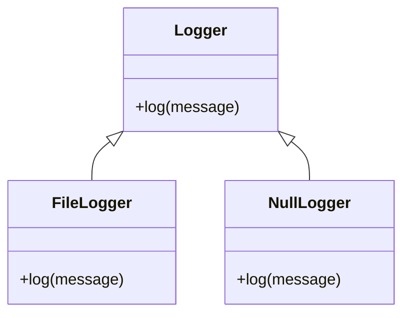

## 5.11 Null Object Pattern

### Introduction

In the world of software development, handling the absence of an object is a common challenge. Traditionally, developers use `nil` to represent the absence of a value in Ruby. However, this often leads to numerous `nil` checks scattered throughout the codebase, increasing complexity and the potential for errors. The Null Object Pattern offers a solution by providing a default object with neutral behavior to represent the absence of a real object. This pattern simplifies code, reduces the need for conditional checks, and enhances maintainability.

### Intent of the Null Object Pattern

The Null Object Pattern aims to encapsulate the absence of an object by providing a default object that adheres to the expected interface but performs no operation or returns a neutral value. This approach allows developers to treat the absence of an object as a regular object, eliminating the need for `nil` checks and simplifying the code.

### Key Participants

1. **Abstract Object**: Defines the interface or abstract class that both real and null objects will implement.
2. **Real Object**: Implements the interface with actual behavior.
3. **Null Object**: Implements the interface with neutral behavior, performing no operation or returning default values.

### Applicability

Use the Null Object Pattern when:

- You have a class hierarchy where some objects may not be present.
- You want to eliminate `nil` checks and simplify code logic.
- You need to provide a default behavior for absent objects.
- You aim to reduce the complexity of conditional statements.

### Ruby Implementation of the Null Object Pattern

Let's explore how to implement the Null Object Pattern in Ruby with a practical example.

#### Example: Logging System

Consider a logging system where we want to log messages to a file. However, in some cases, logging might be disabled, and we don't want to perform any logging operations. Instead of checking for `nil` or a flag to determine if logging is enabled, we can use the Null Object Pattern.

```ruby
# Define the Logger interface
class Logger
  def log(message)
    raise NotImplementedError, 'Subclasses must implement the log method'
  end
end

# Real Logger that writes to a file
class FileLogger < Logger
  def initialize(file_path)
    @file = File.open(file_path, 'a')
  end

  def log(message)
    @file.puts(message)
    @file.flush
  end
end

# Null Logger that does nothing
class NullLogger < Logger
  def log(message)
    # Do nothing
  end
end

# Usage
def perform_task(logger)
  logger.log('Task started')
  # Perform some operations
  logger.log('Task completed')
end

# Example usage
file_logger = FileLogger.new('log.txt')
null_logger = NullLogger.new

perform_task(file_logger) # Logs messages to the file
perform_task(null_logger) # Does nothing
```

### Benefits of the Null Object Pattern

1. **Simplifies Code**: By eliminating `nil` checks, the code becomes cleaner and easier to read.
2. **Reduces Conditional Complexity**: The pattern reduces the number of conditional statements, making the codebase more maintainable.
3. **Encapsulates Null Behavior**: The null behavior is encapsulated within the Null Object, adhering to the Open/Closed Principle.
4. **Improves Code Safety**: Reduces the risk of `NoMethodError` due to calling methods on `nil`.

### Limitations and Considerations

While the Null Object Pattern offers numerous benefits, it may not be suitable in all scenarios:

- **Overhead**: Introducing a Null Object class may add unnecessary complexity if the absence of an object is rare.
- **Semantic Clarity**: In some cases, using `nil` might be more semantically clear to indicate the absence of an object.
- **Memory Usage**: Creating additional objects may increase memory usage, although this is typically negligible.

### Ruby Unique Features

Ruby's dynamic nature and duck typing make it particularly well-suited for the Null Object Pattern. The ability to define methods dynamically and the absence of strict type checking allow for seamless integration of Null Objects into existing codebases.

### Differences and Similarities with Other Patterns

The Null Object Pattern is often compared to the Strategy Pattern, as both involve encapsulating behavior. However, the Null Object Pattern specifically addresses the absence of an object, while the Strategy Pattern focuses on interchangeable behaviors.

### Try It Yourself

Experiment with the provided code example by modifying the `perform_task` method to include additional operations. Observe how the Null Object Pattern simplifies the logic by eliminating the need for `nil` checks.

### Visualizing the Null Object Pattern

Below is a class diagram illustrating the Null Object Pattern:



**Diagram Description**: This class diagram represents the relationship between the `Logger` interface, `FileLogger`, and `NullLogger`. Both `FileLogger` and `NullLogger` implement the `Logger` interface, allowing them to be used interchangeably.

### Knowledge Check

- What is the primary intent of the Null Object Pattern?
- How does the Null Object Pattern help reduce conditional complexity?
- In what scenarios might the Null Object Pattern not be suitable?

### Summary

The Null Object Pattern is a powerful tool for simplifying code and eliminating `nil` checks in Ruby applications. By providing a default object with neutral behavior, developers can reduce conditional complexity and enhance code maintainability. While the pattern offers numerous benefits, it's essential to consider its applicability and potential limitations in specific scenarios.

### Embrace the Journey

Remember, mastering design patterns like the Null Object Pattern is just the beginning. As you continue to explore Ruby and its rich ecosystem, you'll discover new ways to write clean, efficient, and scalable code. Keep experimenting, stay curious, and enjoy the journey!

## Quiz: Null Object Pattern



### What is the primary intent of the Null Object Pattern?

- [x] To provide a default object with neutral behavior to represent the absence of a real object.
- [ ] To create a hierarchy of objects with varying behaviors.
- [ ] To encapsulate complex conditional logic.
- [ ] To enhance performance by reducing object creation.

> **Explanation:** The Null Object Pattern provides a default object with neutral behavior, eliminating the need for `nil` checks.

### How does the Null Object Pattern help reduce conditional complexity?

- [x] By eliminating the need for `nil` checks.
- [ ] By introducing additional conditional statements.
- [ ] By using polymorphism to handle different behaviors.
- [ ] By creating a single object to handle all cases.

> **Explanation:** The Null Object Pattern reduces conditional complexity by providing a default object, eliminating the need for `nil` checks.

### In what scenarios might the Null Object Pattern not be suitable?

- [x] When the absence of an object is rare.
- [ ] When there are multiple objects with similar behaviors.
- [ ] When performance is a critical concern.
- [ ] When the codebase is small and simple.

> **Explanation:** The Null Object Pattern may add unnecessary complexity if the absence of an object is rare.

### What is a key benefit of using the Null Object Pattern?

- [x] It simplifies code by reducing the need for `nil` checks.
- [ ] It increases the number of objects in the system.
- [ ] It enhances performance by reducing memory usage.
- [ ] It provides a way to handle exceptions more effectively.

> **Explanation:** The Null Object Pattern simplifies code by reducing the need for `nil` checks.

### Which of the following is a limitation of the Null Object Pattern?

- [x] It may add unnecessary complexity if the absence of an object is rare.
- [ ] It requires strict type checking.
- [ ] It cannot be used in dynamic languages like Ruby.
- [ ] It increases the risk of `NoMethodError`.

> **Explanation:** The Null Object Pattern may add unnecessary complexity if the absence of an object is rare.

### What is a key difference between the Null Object Pattern and the Strategy Pattern?

- [x] The Null Object Pattern addresses the absence of an object, while the Strategy Pattern focuses on interchangeable behaviors.
- [ ] The Null Object Pattern is used for performance optimization, while the Strategy Pattern is not.
- [ ] The Null Object Pattern requires strict type checking, while the Strategy Pattern does not.
- [ ] The Null Object Pattern is only applicable in static languages, while the Strategy Pattern is not.

> **Explanation:** The Null Object Pattern addresses the absence of an object, while the Strategy Pattern focuses on interchangeable behaviors.

### How does Ruby's dynamic nature benefit the Null Object Pattern?

- [x] It allows for seamless integration of Null Objects into existing codebases.
- [ ] It requires additional type checking.
- [ ] It limits the use of Null Objects to specific scenarios.
- [ ] It increases the complexity of implementing Null Objects.

> **Explanation:** Ruby's dynamic nature allows for seamless integration of Null Objects into existing codebases.

### What is a common use case for the Null Object Pattern?

- [x] Logging systems where logging might be disabled.
- [ ] Performance optimization in high-load applications.
- [ ] Handling exceptions in concurrent code.
- [ ] Implementing complex algorithms.

> **Explanation:** A common use case for the Null Object Pattern is logging systems where logging might be disabled.

### What is the role of the Null Object in the pattern?

- [x] To implement the interface with neutral behavior.
- [ ] To encapsulate complex logic.
- [ ] To enhance performance by reducing object creation.
- [ ] To provide a way to handle exceptions.

> **Explanation:** The Null Object implements the interface with neutral behavior, performing no operation or returning default values.

### True or False: The Null Object Pattern can help improve code safety by reducing the risk of `NoMethodError`.

- [x] True
- [ ] False

> **Explanation:** The Null Object Pattern can help improve code safety by reducing the risk of `NoMethodError` due to calling methods on `nil`.


