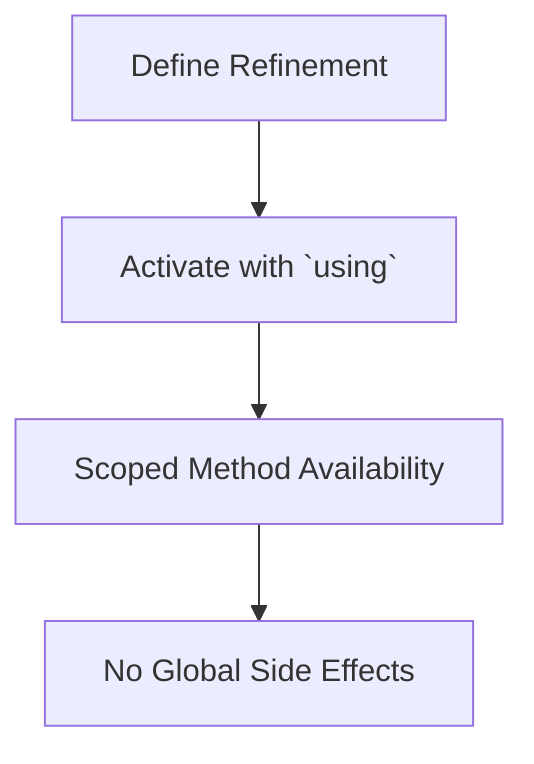

## 5.12 Extension Methods using Refinements

In the world of Ruby programming, the ability to extend existing classes with new methods is both a powerful and potentially dangerous feature. Traditionally, Ruby developers have used techniques like monkey patching to add or modify methods in existing classes. However, this approach can lead to unintended side effects, especially when changes affect global behavior. Enter **refinements**—a feature introduced in Ruby 2.0 that allows developers to extend classes in a controlled and scoped manner. In this section, we'll explore how to use refinements to create extension methods safely and effectively.

### Understanding Refinements

Refinements provide a way to modify classes without affecting their global state. They allow you to define methods that are only visible within a specific scope, thus limiting the impact of changes. This is particularly useful when you want to extend core classes or third-party libraries without risking conflicts or unexpected behavior in other parts of your application.

#### Key Concepts of Refinements

- **Scoped Modifications**: Refinements are only active within the scope of the module or class where they are used.
- **No Global Side Effects**: Unlike monkey patching, refinements do not alter the global behavior of a class.
- **Explicit Activation**: Refinements must be explicitly activated using the `using` keyword.

### Defining and Activating Refinements

To use refinements, you need to define them within a module and then activate them in the desired scope. Let's walk through the process step-by-step.

#### Step 1: Define a Refinement

Refinements are defined within a module using the `refine` method. Here's an example of how to add a new method to the `String` class:

```ruby
module StringExtensions
  refine String do
    def shout
      self.upcase + "!"
    end
  end
end
```

In this example, we define a refinement that adds a `shout` method to the `String` class, which converts the string to uppercase and appends an exclamation mark.

#### Step 2: Activate the Refinement

To use the refinement, you need to activate it in the desired scope using the `using` keyword:

```ruby
using StringExtensions

puts "hello".shout  # Outputs: HELLO!
```

The `using` keyword activates the `StringExtensions` refinement, allowing the `shout` method to be used within the current scope.

### Benefits of Using Refinements

Refinements offer several advantages over traditional monkey patching:

- **Safety**: By limiting the scope of changes, refinements reduce the risk of unintended side effects.
- **Maintainability**: Code that uses refinements is easier to understand and maintain, as the changes are localized.
- **Compatibility**: Refinements allow you to extend third-party libraries without modifying their source code.

### Practical Examples of Refinements

Let's explore some practical examples of using refinements to extend existing classes safely.

#### Example 1: Extending Core Classes

Suppose you want to add a method to the `Array` class that returns the second element. Using refinements, you can do this without affecting the global behavior of `Array`:

```ruby
module ArrayExtensions
  refine Array do
    def second
      self[1]
    end
  end
end

using ArrayExtensions

arr = [1, 2, 3]
puts arr.second  # Outputs: 2
```

In this example, the `second` method is only available within the scope where `ArrayExtensions` is activated.

#### Example 2: Enhancing Third-Party Libraries

Imagine you're using a third-party library that provides a `User` class, and you want to add a `full_name` method. Refinements allow you to do this without modifying the library's source code:

```ruby
module UserExtensions
  refine User do
    def full_name
      "#{first_name} #{last_name}"
    end
  end
end

using UserExtensions

user = User.new(first_name: "John", last_name: "Doe")
puts user.full_name  # Outputs: John Doe
```

This approach keeps your changes isolated and avoids potential conflicts with future updates to the library.

### Considerations When Using Refinements

While refinements offer many benefits, there are some considerations to keep in mind:

- **Performance**: Activating refinements can have a slight performance overhead, so use them judiciously.
- **Visibility**: Refinements are not visible in all contexts, such as within `eval` or `instance_eval`.
- **Compatibility**: Not all Ruby versions support refinements, so ensure compatibility with your target environment.

### Visualizing Refinements

To better understand how refinements work, let's visualize the process using a Mermaid.js diagram:



This diagram illustrates the flow of defining a refinement, activating it, and achieving scoped method availability without global side effects.

### Try It Yourself: Experiment with Refinements

To deepen your understanding of refinements, try modifying the examples above. For instance, add more methods to the `String` or `Array` classes, or create refinements for other core classes. Experiment with activating refinements in different scopes and observe how it affects method availability.

### External Resources

For more information on refinements, check out the [Ruby Refinements Documentation](https://ruby-doc.org/core-3.0.0/doc/syntax/refinements_rdoc.html).

### Summary

Refinements provide a powerful tool for extending classes in Ruby without the risks associated with monkey patching. By limiting changes to a specific scope, refinements enhance code safety, maintainability, and compatibility. As you continue to develop Ruby applications, consider using refinements to implement extension methods in a controlled and scoped manner.

## Quiz: Extension Methods using Refinements



### What is the primary benefit of using refinements over monkey patching?

- [x] They limit the scope of changes to avoid global side effects.
- [ ] They improve the performance of the application.
- [ ] They allow changes to be made without any code modifications.
- [ ] They automatically document the changes made.

> **Explanation:** Refinements limit the scope of changes, preventing global side effects and making the code safer and more maintainable.

### How do you activate a refinement in Ruby?

- [ ] By including the module.
- [x] By using the `using` keyword.
- [ ] By requiring the file.
- [ ] By calling the `activate` method.

> **Explanation:** The `using` keyword is used to activate a refinement in a specific scope.

### Which of the following is a limitation of refinements?

- [ ] They cannot be used with core classes.
- [ ] They are not supported in Ruby 2.0.
- [x] They are not visible in all contexts, such as within `eval`.
- [ ] They cannot be used in conjunction with modules.

> **Explanation:** Refinements are not visible in all contexts, such as within `eval` or `instance_eval`.

### What is the purpose of the `refine` method in a module?

- [ ] To define a new class.
- [x] To define a refinement for a class.
- [ ] To activate a refinement.
- [ ] To remove a refinement.

> **Explanation:** The `refine` method is used within a module to define a refinement for a class.

### Can refinements be used to extend third-party libraries safely?

- [x] Yes, they allow extensions without modifying the library's source code.
- [ ] No, they can only be used with core classes.
- [ ] Yes, but they require modifying the library's source code.
- [ ] No, they are not suitable for third-party libraries.

> **Explanation:** Refinements can be used to extend third-party libraries safely without modifying their source code.

### What keyword is used to define a refinement in a module?

- [ ] `extend`
- [ ] `include`
- [x] `refine`
- [ ] `module`

> **Explanation:** The `refine` keyword is used to define a refinement within a module.

### What is a potential downside of using refinements?

- [x] They can introduce a slight performance overhead.
- [ ] They make code harder to read.
- [ ] They are not compatible with any Ruby version.
- [ ] They require global changes to the codebase.

> **Explanation:** Activating refinements can have a slight performance overhead, so they should be used judiciously.

### Which Ruby version introduced refinements?

- [ ] Ruby 1.9
- [x] Ruby 2.0
- [ ] Ruby 2.5
- [ ] Ruby 3.0

> **Explanation:** Refinements were introduced in Ruby 2.0.

### How do refinements improve code maintainability?

- [ ] By automatically generating documentation.
- [x] By localizing changes and reducing global side effects.
- [ ] By increasing the performance of the code.
- [ ] By enforcing strict typing.

> **Explanation:** Refinements localize changes, reducing global side effects and improving code maintainability.

### True or False: Refinements can be used to modify the behavior of a class globally.

- [ ] True
- [x] False

> **Explanation:** False. Refinements are scoped and do not modify the behavior of a class globally.



Remember, this is just the beginning. As you progress, you'll build more complex and interactive Ruby applications. Keep experimenting, stay curious, and enjoy the journey!
