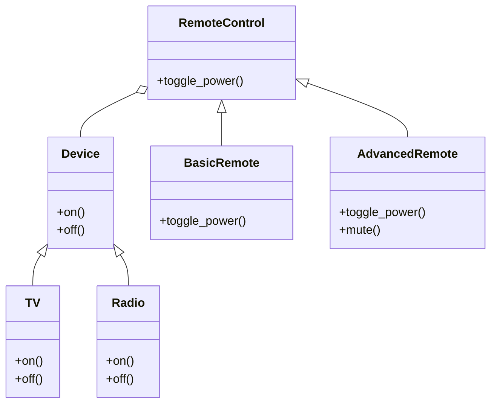

## 5.2 Bridge Pattern

In the realm of software design, the Bridge Pattern stands out as a powerful structural pattern that decouples an abstraction from its implementation, allowing the two to vary independently. This pattern is particularly useful in managing complexity and promoting flexibility in codebases, especially when dealing with multiple layers of abstraction and implementation.

### Understanding the Bridge Pattern

#### Definition

The Bridge Pattern is a structural design pattern that separates the abstraction from its implementation, enabling them to evolve independently. This separation is achieved by creating two separate class hierarchies: one for the abstraction and another for the implementation. The abstraction contains a reference to an implementation object, which it delegates the actual work to.

#### Key Components

1. **Abstraction**: Defines the abstraction's interface and maintains a reference to an object of type Implementor.
2. **Refined Abstraction**: Extends the interface defined by Abstraction.
3. **Implementor**: Defines the interface for implementation classes. This interface doesn't need to match the Abstraction's interface. In fact, the two interfaces can be quite different.
4. **Concrete Implementor**: Implements the Implementor interface and defines its concrete implementation.

### How the Bridge Pattern Manages Complexity

The Bridge Pattern is particularly effective in scenarios where you need to extend a class in multiple orthogonal dimensions. By decoupling the abstraction from the implementation, you can change or extend either independently without affecting the other. This leads to a more manageable and scalable codebase.

### Ruby Example: Abstraction and Implementation Layers

Let's illustrate the Bridge Pattern with a Ruby example. Consider a scenario where we have different types of remote controls (abstractions) for various devices (implementations).

```ruby
# Implementor
class Device
  def on
    raise NotImplementedError, 'You must implement the on method'
  end

  def off
    raise NotImplementedError, 'You must implement the off method'
  end
end

# Concrete Implementor
class TV < Device
  def on
    puts "TV is now ON"
  end

  def off
    puts "TV is now OFF"
  end
end

# Concrete Implementor
class Radio < Device
  def on
    puts "Radio is now ON"
  end

  def off
    puts "Radio is now OFF"
  end
end

# Abstraction
class RemoteControl
  def initialize(device)
    @device = device
  end

  def toggle_power
    raise NotImplementedError, 'You must implement the toggle_power method'
  end
end

# Refined Abstraction
class BasicRemote < RemoteControl
  def toggle_power
    puts "Toggling power with Basic Remote"
    @device.on
    @device.off
  end
end

# Refined Abstraction
class AdvancedRemote < RemoteControl
  def toggle_power
    puts "Toggling power with Advanced Remote"
    @device.on
    @device.off
  end

  def mute
    puts "Muting the device"
  end
end

# Usage
tv = TV.new
radio = Radio.new

basic_remote = BasicRemote.new(tv)
advanced_remote = AdvancedRemote.new(radio)

basic_remote.toggle_power
advanced_remote.toggle_power
advanced_remote.mute
```

### Diagram: Bridge Pattern Structure



### When to Use the Bridge Pattern

The Bridge Pattern is particularly useful in the following scenarios:

- **When you want to avoid a permanent binding between an abstraction and its implementation**: This is useful when both the abstraction and its implementation need to be selected or switched at runtime.
- **When both the abstractions and their implementations should be extensible by subclassing**: The Bridge Pattern allows you to combine different abstractions and implementations and extend them independently.
- **When changes in the implementation of an abstraction should have no impact on clients**: This pattern ensures that changes in the implementation do not affect the abstraction's clients.

### Bridge Pattern vs. Inheritance

While inheritance is a powerful tool for extending functionality, it can lead to a rigid and tightly coupled design. The Bridge Pattern offers a more flexible alternative by allowing you to separate the abstraction from its implementation. This separation enables you to change or extend either independently, leading to a more maintainable and scalable codebase.

### Real-World Scenarios

The Bridge Pattern is beneficial in various real-world scenarios, such as:

- **Graphic Libraries**: Where you might have different rendering engines (implementations) and different shapes (abstractions) that need to be rendered.
- **UI Components**: Where you might have different themes (implementations) and different UI components (abstractions) that need to be styled.
- **Database Drivers**: Where you might have different database engines (implementations) and different data access objects (abstractions) that need to interact with the database.

### Ruby Unique Features

Ruby's dynamic nature and support for duck typing make it particularly well-suited for implementing the Bridge Pattern. The ability to define interfaces using modules and the flexibility to change object behavior at runtime provide a powerful foundation for decoupling abstraction from implementation.

### Differences and Similarities with Other Patterns

The Bridge Pattern is often confused with the Adapter Pattern. While both patterns involve two separate class hierarchies, the Bridge Pattern is used to separate abstraction from implementation, whereas the Adapter Pattern is used to make two incompatible interfaces work together.

### Try It Yourself

Experiment with the provided code example by adding new types of devices or remote controls. Try implementing additional features, such as volume control or channel switching, to see how the Bridge Pattern facilitates these extensions.

### Summary

The Bridge Pattern is a powerful tool for managing complexity and promoting flexibility in your codebase. By decoupling abstraction from implementation, it allows you to extend both independently, leading to a more scalable and maintainable design.

## Quiz: Bridge Pattern



### What is the primary purpose of the Bridge Pattern?

- [x] To decouple an abstraction from its implementation
- [ ] To adapt one interface to another
- [ ] To provide a simplified interface to a complex system
- [ ] To ensure a class has only one instance

> **Explanation:** The Bridge Pattern is designed to decouple an abstraction from its implementation, allowing the two to vary independently.

### Which of the following is a key component of the Bridge Pattern?

- [x] Abstraction
- [x] Implementor
- [ ] Adapter
- [ ] Singleton

> **Explanation:** The Bridge Pattern involves an Abstraction and an Implementor, which are separate class hierarchies.

### In the Bridge Pattern, what does the Abstraction contain?

- [x] A reference to an Implementor object
- [ ] A method to adapt interfaces
- [ ] A single instance of a class
- [ ] A simplified interface

> **Explanation:** The Abstraction in the Bridge Pattern contains a reference to an Implementor object, which it delegates work to.

### When should you consider using the Bridge Pattern?

- [x] When you want to avoid a permanent binding between an abstraction and its implementation
- [ ] When you need to adapt one interface to another
- [ ] When you need to ensure a class has only one instance
- [ ] When you want to provide a simplified interface to a complex system

> **Explanation:** The Bridge Pattern is useful when you want to avoid a permanent binding between an abstraction and its implementation.

### How does the Bridge Pattern differ from the Adapter Pattern?

- [x] The Bridge Pattern separates abstraction from implementation, while the Adapter Pattern makes two interfaces compatible.
- [ ] The Bridge Pattern makes two interfaces compatible, while the Adapter Pattern separates abstraction from implementation.
- [ ] Both patterns serve the same purpose.
- [ ] The Bridge Pattern is used for creating a single instance of a class.

> **Explanation:** The Bridge Pattern separates abstraction from implementation, while the Adapter Pattern is used to make two incompatible interfaces work together.

### What is a Refined Abstraction in the Bridge Pattern?

- [x] An extension of the Abstraction that adds more functionality
- [ ] A simplified interface to a complex system
- [ ] A single instance of a class
- [ ] An interface that adapts another interface

> **Explanation:** A Refined Abstraction is an extension of the Abstraction that adds more functionality.

### Which Ruby feature makes it particularly well-suited for the Bridge Pattern?

- [x] Duck typing
- [ ] Static typing
- [ ] Single inheritance
- [ ] Lack of metaprogramming

> **Explanation:** Ruby's duck typing and dynamic nature make it well-suited for implementing the Bridge Pattern.

### What is the role of the Concrete Implementor in the Bridge Pattern?

- [x] To implement the Implementor interface and define its concrete implementation
- [ ] To adapt one interface to another
- [ ] To ensure a class has only one instance
- [ ] To provide a simplified interface to a complex system

> **Explanation:** The Concrete Implementor implements the Implementor interface and defines its concrete implementation.

### True or False: The Bridge Pattern allows you to change or extend the abstraction and implementation independently.

- [x] True
- [ ] False

> **Explanation:** The Bridge Pattern decouples abstraction from implementation, allowing them to be changed or extended independently.

### Which of the following is a real-world scenario where the Bridge Pattern is beneficial?

- [x] Graphic Libraries
- [ ] Singleton Pattern
- [ ] Factory Method Pattern
- [ ] Adapter Pattern

> **Explanation:** The Bridge Pattern is beneficial in scenarios like Graphic Libraries, where different rendering engines and shapes need to be managed independently.



Remember, this is just the beginning. As you progress, you'll build more complex and interactive applications using the Bridge Pattern. Keep experimenting, stay curious, and enjoy the journey!
