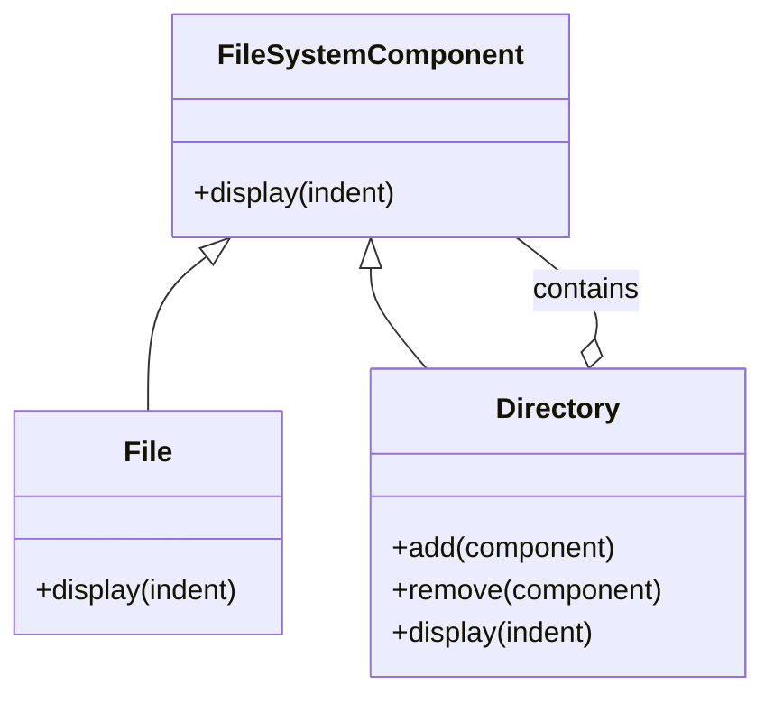

## 5.3 Composite Pattern

### Introduction

The Composite Pattern is a structural design pattern that allows you to compose objects into tree-like structures to represent part-whole hierarchies. This pattern enables clients to treat individual objects and compositions of objects uniformly. In Ruby, the Composite Pattern is particularly useful for managing complex structures such as file systems, organizational charts, or UI components, where you need to handle both individual elements and groups of elements in a consistent manner.

### Intent

The primary intent of the Composite Pattern is to allow clients to work with individual objects and compositions of objects uniformly. This is achieved by defining a common interface for both simple and complex elements, enabling recursive composition. The pattern simplifies client code by allowing it to treat leaf and composite nodes in the same way.

### Key Participants

1. **Component**: This is the base interface for all objects in the composition. It declares common operations for both simple and complex objects.

2. **Leaf**: Represents the end objects of a composition. A leaf has no children and implements the Component interface.

3. **Composite**: This is a complex object that can have children. It implements the Component interface and defines behaviors for children management.

### Applicability

Use the Composite Pattern when:

- You need to represent part-whole hierarchies of objects.
- You want clients to be able to ignore the difference between compositions of objects and individual objects.
- You need to simplify client code by treating individual and composite objects uniformly.

### Ruby Example: File System

Let's explore a Ruby implementation of the Composite Pattern using a file system as an example. In this example, we'll create a structure where both files and directories can be treated uniformly.

```ruby
# Component Interface
class FileSystemComponent
  def display(indent = 0)
    raise NotImplementedError, 'This method should be overridden in subclasses'
  end
end

# Leaf
class File < FileSystemComponent
  def initialize(name)
    @name = name
  end

  def display(indent = 0)
    puts "#{' ' * indent}File: #{@name}"
  end
end

# Composite
class Directory < FileSystemComponent
  def initialize(name)
    @name = name
    @children = []
  end

  def add(component)
    @children << component
  end

  def remove(component)
    @children.delete(component)
  end

  def display(indent = 0)
    puts "#{' ' * indent}Directory: #{@name}"
    @children.each { |child| child.display(indent + 2) }
  end
end

# Client Code
root = Directory.new('root')
home = Directory.new('home')
user = Directory.new('user')
file1 = File.new('file1.txt')
file2 = File.new('file2.txt')

user.add(file1)
home.add(user)
root.add(home)
root.add(file2)

root.display
```

### Explanation

In the above example, we have a `FileSystemComponent` interface that defines a `display` method. The `File` class represents a leaf node, while the `Directory` class represents a composite node that can contain other `FileSystemComponent` objects. The client code creates a tree structure of directories and files and displays it using the `display` method.

### Visualizing the Composite Pattern

To better understand the structure of the Composite Pattern, let's visualize it using a class diagram.



### Simplifying Client Code

The Composite Pattern simplifies client code by allowing it to treat individual objects and compositions uniformly. In the file system example, the client code can call the `display` method on both `File` and `Directory` objects without worrying about their specific types. This uniformity makes the code more flexible and easier to maintain.

### Challenges in Implementing the Composite Pattern in Ruby

While the Composite Pattern is powerful, it can introduce complexity in managing the hierarchy of objects. Some challenges include:

- **Managing Child Components**: Ensuring that child components are managed correctly, especially when adding or removing them from a composite.
- **Performance Considerations**: Traversing large hierarchies can be performance-intensive, so it's essential to consider optimization strategies.
- **Complexity in Implementation**: Implementing the pattern can be complex, especially when dealing with deep hierarchies or when additional operations are needed on the components.

### Ruby Unique Features

Ruby's dynamic nature and flexible syntax make it an excellent language for implementing the Composite Pattern. Ruby's ability to define methods dynamically and its support for modules and mixins can be leveraged to create flexible and reusable component interfaces.

### Differences and Similarities with Other Patterns

The Composite Pattern is often compared with the Decorator Pattern. While both patterns involve recursive composition, the Composite Pattern focuses on part-whole hierarchies, whereas the Decorator Pattern focuses on adding responsibilities to objects.

### Try It Yourself

Experiment with the file system example by:

- Adding more files and directories to the hierarchy.
- Implementing additional methods in the `FileSystemComponent` interface, such as `size` or `search`.
- Creating a new type of component, such as a `Shortcut`, that behaves differently from files and directories.

### Conclusion

The Composite Pattern is a powerful tool for managing complex hierarchical structures in Ruby. By allowing clients to treat individual and composite objects uniformly, it simplifies code and enhances maintainability. While there are challenges in implementing the pattern, Ruby's dynamic features make it an ideal language for leveraging the Composite Pattern's benefits.

## Quiz: Composite Pattern



### What is the primary intent of the Composite Pattern?

- [x] To allow clients to treat individual objects and compositions of objects uniformly.
- [ ] To add responsibilities to objects dynamically.
- [ ] To provide a way to create objects without specifying their concrete classes.
- [ ] To define a family of algorithms and make them interchangeable.

> **Explanation:** The Composite Pattern's primary intent is to allow clients to treat individual objects and compositions of objects uniformly, enabling recursive composition.

### Which of the following is a key participant in the Composite Pattern?

- [x] Component
- [ ] Observer
- [x] Composite
- [ ] Singleton

> **Explanation:** The key participants in the Composite Pattern are Component, Leaf, and Composite.

### In the Composite Pattern, what role does the Leaf play?

- [x] Represents the end objects of a composition.
- [ ] Manages child components.
- [ ] Defines the interface for all objects in the composition.
- [ ] Adds responsibilities to objects.

> **Explanation:** The Leaf represents the end objects of a composition and implements the Component interface.

### How does the Composite Pattern simplify client code?

- [x] By allowing clients to treat individual and composite objects uniformly.
- [ ] By providing a way to create objects without specifying their concrete classes.
- [ ] By adding responsibilities to objects dynamically.
- [ ] By defining a family of algorithms and making them interchangeable.

> **Explanation:** The Composite Pattern simplifies client code by allowing clients to treat individual and composite objects uniformly.

### What is a challenge in implementing the Composite Pattern in Ruby?

- [x] Managing child components correctly.
- [ ] Defining a family of algorithms.
- [ ] Adding responsibilities to objects dynamically.
- [ ] Creating objects without specifying their concrete classes.

> **Explanation:** A challenge in implementing the Composite Pattern is managing child components correctly, especially when adding or removing them from a composite.

### Which pattern is often compared with the Composite Pattern?

- [x] Decorator Pattern
- [ ] Singleton Pattern
- [ ] Factory Method Pattern
- [ ] Observer Pattern

> **Explanation:** The Composite Pattern is often compared with the Decorator Pattern, as both involve recursive composition.

### What is a unique feature of Ruby that aids in implementing the Composite Pattern?

- [x] Dynamic method definition
- [ ] Static typing
- [ ] Lack of support for modules
- [ ] Limited support for mixins

> **Explanation:** Ruby's dynamic method definition and support for modules and mixins aid in implementing the Composite Pattern.

### What is the role of the Composite in the Composite Pattern?

- [x] Manages child components and implements the Component interface.
- [ ] Represents the end objects of a composition.
- [ ] Defines the interface for all objects in the composition.
- [ ] Adds responsibilities to objects.

> **Explanation:** The Composite manages child components and implements the Component interface.

### How can you experiment with the file system example provided?

- [x] By adding more files and directories to the hierarchy.
- [x] By implementing additional methods in the FileSystemComponent interface.
- [ ] By removing all files from the hierarchy.
- [ ] By converting all directories to files.

> **Explanation:** You can experiment by adding more files and directories and implementing additional methods in the FileSystemComponent interface.

### True or False: The Composite Pattern is only useful for file systems.

- [ ] True
- [x] False

> **Explanation:** False. The Composite Pattern is useful for any hierarchical structure, such as organizational charts or UI components, not just file systems.



Remember, this is just the beginning. As you progress, you'll build more complex and interactive applications using the Composite Pattern. Keep experimenting, stay curious, and enjoy the journey!

---
