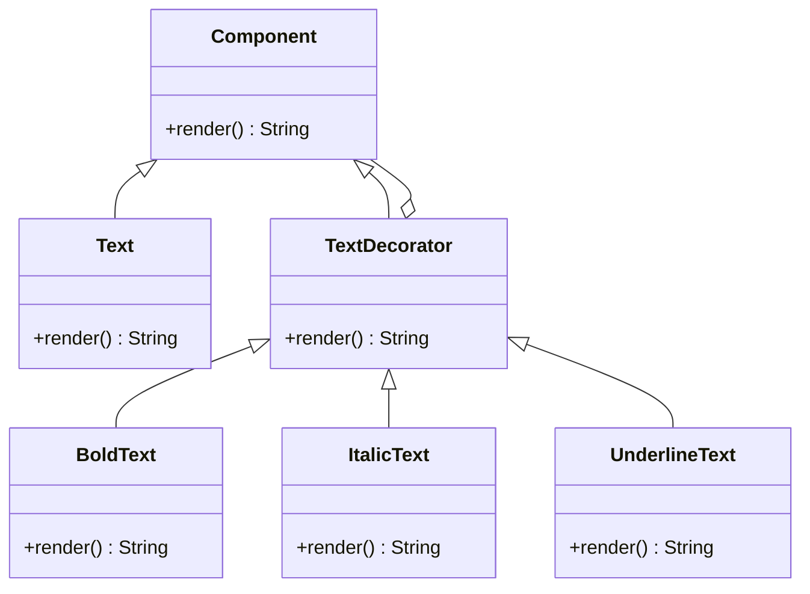

## 5.4 Decorator Pattern

The Decorator Pattern is a structural design pattern that allows behavior to be added to individual objects, either statically or dynamically, without affecting the behavior of other objects from the same class. This pattern provides a flexible alternative to subclassing for extending functionality.

### Intent

The primary intent of the Decorator Pattern is to attach additional responsibilities to an object dynamically. It offers a more flexible way to extend an object's capabilities compared to static inheritance, allowing for the combination of behaviors at runtime.

### Key Participants

1. **Component**: Defines the interface for objects that can have responsibilities added to them dynamically.
2. **ConcreteComponent**: The class to which additional responsibilities can be attached.
3. **Decorator**: Maintains a reference to a Component object and defines an interface that conforms to the Component's interface.
4. **ConcreteDecorator**: Adds responsibilities to the component.

### Applicability

Use the Decorator Pattern when:

- You want to add responsibilities to individual objects dynamically and transparently, without affecting other objects.
- You need to extend the functionality of classes in a way that is flexible and reusable.
- You want to avoid an explosion of subclasses to support every combination of features.

### Sample Code Snippet

Let's explore a practical example of the Decorator Pattern in Ruby. We'll create a simple text editor that can apply various formatting options to text.

```ruby
# Component
class Text
  def initialize(content)
    @content = content
  end

  def render
    @content
  end
end

# Decorator
class TextDecorator
  def initialize(text)
    @text = text
  end

  def render
    @text.render
  end
end

# Concrete Decorators
class BoldText < TextDecorator
  def render
    "<b>#{super}</b>"
  end
end

class ItalicText < TextDecorator
  def render
    "<i>#{super}</i>"
  end
end

class UnderlineText < TextDecorator
  def render
    "<u>#{super}</u>"
  end
end

# Usage
plain_text = Text.new("Hello, World!")
bold_text = BoldText.new(plain_text)
italic_bold_text = ItalicText.new(bold_text)

puts plain_text.render # Output: Hello, World!
puts bold_text.render # Output: <b>Hello, World!</b>
puts italic_bold_text.render # Output: <i><b>Hello, World!</b></i>
```

### Design Considerations

- **Single Responsibility Principle**: Each decorator class has a single responsibility, which is to add a specific behavior to the component.
- **Open/Closed Principle**: The Decorator Pattern allows you to extend the behavior of objects without modifying existing code.
- **Delegation**: Decorators delegate the work to the component they wrap, allowing for flexible behavior extension.

### Ruby Unique Features

Ruby's dynamic nature and its support for modules and mixins make it particularly well-suited for implementing the Decorator Pattern. Ruby's ability to reopen classes and its flexible method dispatching allow decorators to be applied seamlessly.

### Differences and Similarities

The Decorator Pattern is often confused with the Proxy Pattern. While both involve wrapping an object, the Decorator Pattern focuses on adding new behavior, whereas the Proxy Pattern controls access to the object.

### Visualizing the Decorator Pattern

To better understand the Decorator Pattern, let's visualize the relationship between components and decorators using a class diagram.



### Try It Yourself

Experiment with the code by creating additional decorators, such as `StrikethroughText` or `HighlightText`. Try combining multiple decorators to see how they interact.

### Advantages of the Decorator Pattern

- **Flexibility**: Decorators can be combined in various ways to achieve different behaviors.
- **Reusability**: Individual decorators can be reused across different components.
- **Transparency**: Decorators can be added or removed dynamically at runtime.

### Knowledge Check

- How does the Decorator Pattern adhere to the Single Responsibility Principle?
- What are the benefits of using decorators over subclassing?
- How can you implement a new decorator in the provided example?

### Embrace the Journey

Remember, the Decorator Pattern is just one of many tools in your design pattern toolkit. As you continue to explore and implement different patterns, you'll gain a deeper understanding of how to build scalable and maintainable applications. Keep experimenting, stay curious, and enjoy the journey!

## Quiz: Decorator Pattern



### What is the primary intent of the Decorator Pattern?

- [x] To attach additional responsibilities to an object dynamically.
- [ ] To create a new class hierarchy.
- [ ] To simplify object creation.
- [ ] To enforce strict type checking.

> **Explanation:** The Decorator Pattern is designed to add responsibilities to objects dynamically, providing a flexible alternative to subclassing.

### Which principle does the Decorator Pattern adhere to?

- [x] Single Responsibility Principle
- [ ] Liskov Substitution Principle
- [ ] Interface Segregation Principle
- [ ] Dependency Inversion Principle

> **Explanation:** The Decorator Pattern adheres to the Single Responsibility Principle by ensuring each decorator class has a single responsibility.

### In Ruby, what feature makes the Decorator Pattern implementation seamless?

- [x] Dynamic method dispatching
- [ ] Static typing
- [ ] Strict inheritance
- [ ] Compile-time checks

> **Explanation:** Ruby's dynamic method dispatching allows decorators to be applied seamlessly, enhancing flexibility.

### What is a key difference between the Decorator and Proxy Patterns?

- [x] Decorators add behavior, while Proxies control access.
- [ ] Decorators control access, while Proxies add behavior.
- [ ] Both patterns serve the same purpose.
- [ ] Neither pattern involves object wrapping.

> **Explanation:** The Decorator Pattern focuses on adding behavior, whereas the Proxy Pattern controls access to the object.

### How can decorators be combined in Ruby?

- [x] By wrapping one decorator around another
- [ ] By subclassing multiple decorators
- [ ] By using mixins
- [ ] By using static methods

> **Explanation:** Decorators can be combined by wrapping one decorator around another, allowing for flexible behavior extension.

### What is a potential advantage of using decorators over subclassing?

- [x] Increased flexibility in combining behaviors
- [ ] Simplified class hierarchy
- [ ] Reduced runtime complexity
- [ ] Enhanced compile-time checks

> **Explanation:** Decorators offer increased flexibility in combining behaviors without altering the class hierarchy.

### Which of the following is a ConcreteDecorator in the provided example?

- [x] BoldText
- [ ] Text
- [ ] TextDecorator
- [ ] Component

> **Explanation:** `BoldText` is a ConcreteDecorator that adds bold formatting to the text.

### What method is commonly overridden in a decorator?

- [x] The method that needs additional behavior
- [ ] The constructor method
- [ ] The destructor method
- [ ] The static method

> **Explanation:** Decorators typically override the method that needs additional behavior to extend its functionality.

### True or False: Decorators can only be applied at compile-time.

- [ ] True
- [x] False

> **Explanation:** Decorators can be applied dynamically at runtime, offering flexibility in behavior extension.

### Which of the following is NOT a benefit of the Decorator Pattern?

- [ ] Flexibility
- [ ] Reusability
- [ ] Transparency
- [x] Complexity reduction

> **Explanation:** While the Decorator Pattern offers flexibility, reusability, and transparency, it can increase complexity due to the additional layers of decorators.


