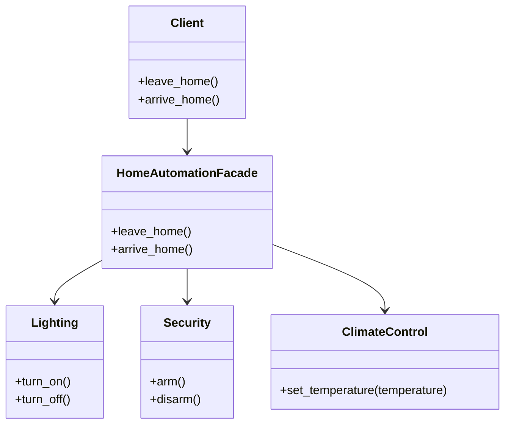

## 5.5 Facade Pattern

In the realm of software design, complexity is often an inevitable challenge. As systems grow, they tend to become intricate, with numerous components interacting in various ways. The Facade Pattern emerges as a beacon of simplicity amidst this complexity, offering a streamlined interface to a multifaceted subsystem. This pattern is particularly beneficial in Ruby, where dynamic typing and expressive syntax can be leveraged to create elegant solutions.

### Understanding the Facade Pattern

**Definition**: The Facade Pattern is a structural design pattern that provides a simplified interface to a complex subsystem. It acts as a front-facing interface masking more complex underlying or structural code.

**Intent**: The primary intent of the Facade Pattern is to reduce complexity for the client by providing a single, unified interface to a set of interfaces in a subsystem. This makes the subsystem easier to use and understand.

### How the Facade Pattern Reduces Complexity

The Facade Pattern reduces complexity by:

- **Hiding the intricate details** of the subsystem from the client.
- **Providing a single point of interaction** for the client, which simplifies the usage of the subsystem.
- **Decoupling the client from the subsystem**, allowing for more flexible and maintainable code.

### Key Participants

- **Facade**: The class that provides a simplified interface to the complex subsystem.
- **Subsystem Classes**: The classes that implement the subsystem's functionality. The Facade delegates client requests to these classes.

### Applicability

Consider using the Facade Pattern when:

- You need to provide a simple interface to a complex subsystem.
- You want to decouple the client from the subsystem, making the system easier to maintain and extend.
- You are working with a legacy system where the complexity needs to be managed.

### Ruby Example: Simplifying System Interaction

Let's consider a scenario where we have a complex system for managing a home automation system. This system includes various subsystems like lighting, security, and climate control. Without a Facade, interacting with these subsystems can be cumbersome.

#### Subsystem Classes

```ruby
# Lighting subsystem
class Lighting
  def turn_on
    puts "Lights are on."
  end

  def turn_off
    puts "Lights are off."
  end
end

# Security subsystem
class Security
  def arm
    puts "Security system armed."
  end

  def disarm
    puts "Security system disarmed."
  end
end

# Climate control subsystem
class ClimateControl
  def set_temperature(temperature)
    puts "Temperature set to #{temperature} degrees."
  end
end
```

#### Facade Class

```ruby
# Facade class
class HomeAutomationFacade
  def initialize
    @lighting = Lighting.new
    @security = Security.new
    @climate_control = ClimateControl.new
  end

  def leave_home
    @lighting.turn_off
    @security.arm
    @climate_control.set_temperature(18)
    puts "Home is set for leaving."
  end

  def arrive_home
    @lighting.turn_on
    @security.disarm
    @climate_control.set_temperature(22)
    puts "Welcome home!"
  end
end
```

#### Client Code

```ruby
# Client code
home_automation = HomeAutomationFacade.new
home_automation.leave_home
home_automation.arrive_home
```

### Benefits of the Facade Pattern

- **Improved Readability**: The Facade Pattern makes the code more readable by providing a clear and concise interface to the subsystem.
- **Easier Maintenance**: Changes to the subsystem can be made without affecting the client code, as long as the Facade interface remains unchanged.
- **Reduced Complexity**: By hiding the complexity of the subsystem, the Facade Pattern makes the system easier to use and understand.

### Design Considerations

- **When to Use**: Use the Facade Pattern when you need to simplify interactions with a complex subsystem or when you want to decouple the client from the subsystem.
- **Pitfalls**: Overusing the Facade Pattern can lead to a monolithic design where the Facade becomes a bottleneck. Ensure that the Facade does not become too complex itself.

### Ruby Unique Features

Ruby's dynamic nature and expressive syntax make it an excellent choice for implementing the Facade Pattern. Ruby's ability to define methods dynamically and its support for metaprogramming can be leveraged to create flexible and powerful Facades.

### Differences and Similarities

The Facade Pattern is often confused with the Adapter Pattern. While both patterns provide a simplified interface, the Adapter Pattern is used to make two incompatible interfaces compatible, whereas the Facade Pattern is used to simplify a complex subsystem.

### Try It Yourself

Experiment with the provided code example by adding new subsystems, such as a music system or a window control system, and extend the `HomeAutomationFacade` to manage these new subsystems. This will help you understand how the Facade Pattern can be used to manage complexity in a growing system.

### Visualizing the Facade Pattern

Below is a diagram illustrating the interaction between the client, the Facade, and the subsystem classes.



### Summary

The Facade Pattern is a powerful tool in a Ruby developer's arsenal, providing a means to manage complexity and improve code readability and maintainability. By offering a simplified interface to a complex subsystem, the Facade Pattern helps developers build scalable and maintainable applications.

Remember, this is just the beginning. As you progress, you'll build more complex systems and encounter new challenges. Keep experimenting, stay curious, and enjoy the journey!

## Quiz: Facade Pattern



### What is the primary intent of the Facade Pattern?

- [x] To provide a simplified interface to a complex subsystem
- [ ] To convert the interface of a class into another interface clients expect
- [ ] To define a family of algorithms and make them interchangeable
- [ ] To ensure a class has only one instance

> **Explanation:** The Facade Pattern aims to provide a simplified interface to a complex subsystem, making it easier to use.

### Which of the following is a benefit of using the Facade Pattern?

- [x] Improved readability
- [x] Easier maintenance
- [ ] Increased complexity
- [ ] Reduced performance

> **Explanation:** The Facade Pattern improves readability and makes maintenance easier by hiding the complexity of the subsystem.

### In the provided Ruby example, what is the role of the `HomeAutomationFacade` class?

- [x] It acts as a simplified interface to the lighting, security, and climate control subsystems.
- [ ] It directly implements the functionality of the subsystems.
- [ ] It replaces the functionality of the subsystems.
- [ ] It complicates the interaction with the subsystems.

> **Explanation:** The `HomeAutomationFacade` class provides a simplified interface to interact with the lighting, security, and climate control subsystems.

### When should you consider using the Facade Pattern?

- [x] When you need to simplify interactions with a complex subsystem
- [ ] When you need to make two incompatible interfaces compatible
- [ ] When you want to ensure a class has only one instance
- [ ] When you need to define a family of algorithms

> **Explanation:** The Facade Pattern is ideal for simplifying interactions with a complex subsystem.

### What is a potential pitfall of overusing the Facade Pattern?

- [x] The Facade can become a bottleneck if it becomes too complex.
- [ ] The Facade can make the subsystem more complex.
- [ ] The Facade can reduce the flexibility of the subsystem.
- [ ] The Facade can increase the coupling between the client and the subsystem.

> **Explanation:** Overusing the Facade Pattern can lead to a monolithic design where the Facade itself becomes too complex.

### How does the Facade Pattern improve code maintainability?

- [x] By decoupling the client from the subsystem
- [ ] By making the subsystem more complex
- [ ] By increasing the number of classes
- [ ] By reducing the flexibility of the subsystem

> **Explanation:** The Facade Pattern improves maintainability by decoupling the client from the subsystem, allowing changes to be made without affecting the client code.

### What is the difference between the Facade Pattern and the Adapter Pattern?

- [x] The Facade Pattern simplifies a complex subsystem, while the Adapter Pattern makes two incompatible interfaces compatible.
- [ ] The Facade Pattern makes two incompatible interfaces compatible, while the Adapter Pattern simplifies a complex subsystem.
- [ ] Both patterns serve the same purpose.
- [ ] The Facade Pattern is used for creating single instances, while the Adapter Pattern is not.

> **Explanation:** The Facade Pattern simplifies a complex subsystem, whereas the Adapter Pattern is used to make two incompatible interfaces compatible.

### Which Ruby feature can be leveraged to create flexible Facades?

- [x] Dynamic method definition
- [ ] Static typing
- [ ] Multiple inheritance
- [ ] Manual memory management

> **Explanation:** Ruby's dynamic method definition and metaprogramming capabilities can be leveraged to create flexible and powerful Facades.

### True or False: The Facade Pattern can be used to manage complexity in a legacy system.

- [x] True
- [ ] False

> **Explanation:** The Facade Pattern is particularly useful in managing complexity in legacy systems by providing a simplified interface to existing subsystems.

### What should you do to experiment with the provided Ruby example?

- [x] Add new subsystems and extend the `HomeAutomationFacade` to manage them.
- [ ] Remove existing subsystems to simplify the code.
- [ ] Change the Facade to directly implement subsystem functionality.
- [ ] Ignore the Facade and interact directly with the subsystems.

> **Explanation:** Experimenting by adding new subsystems and extending the Facade helps understand how the pattern manages complexity in a growing system.


