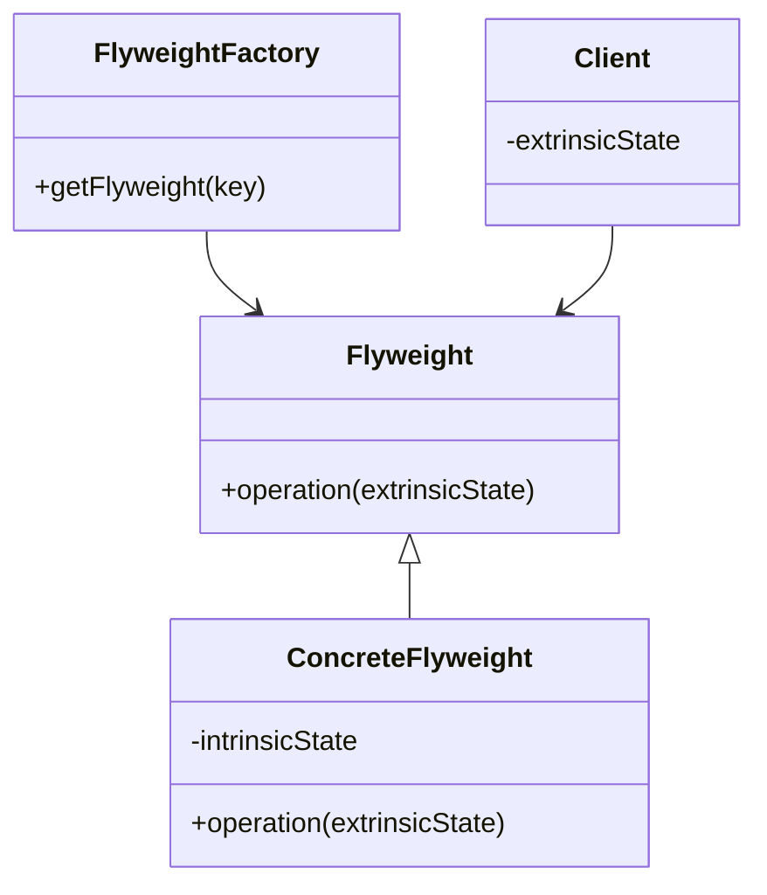

## 5.6 Flyweight Pattern

In the realm of software design, the Flyweight Pattern stands out as a powerful tool for optimizing memory usage in applications that require a large number of similar objects. By sharing common parts of the state among these objects, the Flyweight Pattern helps reduce memory consumption and improve performance. In this section, we'll delve into the Flyweight Pattern, its purpose, and how it can be effectively implemented in Ruby.

### Understanding the Flyweight Pattern

The Flyweight Pattern is a structural design pattern that allows for the efficient handling of a large number of fine-grained objects by sharing common parts of their state. This pattern is particularly useful in scenarios where memory usage is a concern, such as rendering large texts, managing UI elements, or handling large datasets.

#### Intent

The primary intent of the Flyweight Pattern is to minimize memory usage by sharing as much data as possible with similar objects. This is achieved by separating the state of an object into two categories: intrinsic and extrinsic.

#### Intrinsic vs. Extrinsic State

- **Intrinsic State**: This is the state that is shared among all instances of the Flyweight. It is immutable and stored in the Flyweight object itself. For example, in a text editor, the font style and size could be considered intrinsic state if they are shared across multiple characters.

- **Extrinsic State**: This is the state that varies between different instances of the Flyweight. It is not stored in the Flyweight object but is passed to it when needed. Continuing with the text editor example, the position of each character on the screen would be extrinsic state.

### Key Participants

1. **Flyweight**: Declares an interface through which flyweights can receive and act on extrinsic state.
2. **ConcreteFlyweight**: Implements the Flyweight interface and adds storage for intrinsic state.
3. **FlyweightFactory**: Creates and manages flyweight objects, ensuring that flyweights are shared properly.
4. **Client**: Maintains references to flyweights and computes or stores extrinsic state.

### Applicability

The Flyweight Pattern is applicable when:

- An application uses a large number of objects.
- Storage costs are high due to the sheer quantity of objects.
- Most object state can be made extrinsic.
- Many groups of objects may be replaced by relatively few shared objects once extrinsic state is removed.

### Implementing the Flyweight Pattern in Ruby

Let's explore how to implement the Flyweight Pattern in Ruby with a practical example. We'll create a simple text editor that uses the Flyweight Pattern to manage characters efficiently.

#### Step 1: Define the Flyweight Interface

First, we'll define a `Character` class that represents the Flyweight interface. This class will have methods to set and get intrinsic and extrinsic state.

```ruby
# Character class representing the Flyweight interface
class Character
  attr_reader :symbol

  def initialize(symbol)
    @symbol = symbol
  end

  def display(position)
    puts "Character: #{@symbol} at position #{position}"
  end
end
```

#### Step 2: Implement the Flyweight Factory

Next, we'll implement a `CharacterFactory` class that manages the creation and sharing of `Character` objects.

```ruby
# CharacterFactory class to manage flyweight objects
class CharacterFactory
  def initialize
    @characters = {}
  end

  def get_character(symbol)
    @characters[symbol] ||= Character.new(symbol)
  end
end
```

#### Step 3: Use the Flyweight Pattern in the Client

Finally, we'll create a `TextEditor` class that uses the `CharacterFactory` to manage characters efficiently.

```ruby
# TextEditor class using the Flyweight Pattern
class TextEditor
  def initialize
    @factory = CharacterFactory.new
    @characters = []
  end

  def add_character(symbol, position)
    character = @factory.get_character(symbol)
    @characters << { character: character, position: position }
  end

  def display
    @characters.each do |entry|
      entry[:character].display(entry[:position])
    end
  end
end

# Example usage
editor = TextEditor.new
editor.add_character('H', 0)
editor.add_character('e', 1)
editor.add_character('l', 2)
editor.add_character('l', 3)
editor.add_character('o', 4)
editor.display
```

### Design Considerations

When implementing the Flyweight Pattern, consider the following:

- **Thread Safety**: Ensure that shared state is immutable or properly synchronized to avoid concurrency issues.
- **Performance Trade-offs**: While the Flyweight Pattern reduces memory usage, it may increase the complexity of the code and introduce performance overhead due to the need to manage extrinsic state.
- **Complexity**: The pattern can add complexity to the codebase, so it should be used judiciously.

### Ruby Unique Features

Ruby's dynamic nature and metaprogramming capabilities make it particularly well-suited for implementing the Flyweight Pattern. Ruby's `Hash` class can be used effectively to manage shared state, and its flexible object model allows for easy separation of intrinsic and extrinsic state.

### Differences and Similarities

The Flyweight Pattern is often confused with the Singleton Pattern, as both involve sharing instances. However, the Flyweight Pattern focuses on sharing parts of the state among many objects, while the Singleton Pattern ensures a single instance of a class.

### Visualizing the Flyweight Pattern

To better understand the Flyweight Pattern, let's visualize its structure using a class diagram.



### Try It Yourself

To get hands-on experience with the Flyweight Pattern, try modifying the `TextEditor` example:

- Add more characters and positions to see how the Flyweight Pattern manages memory.
- Experiment with different intrinsic and extrinsic states.
- Implement a similar pattern for managing UI elements, such as buttons or icons.

### Challenges and Best Practices

Implementing the Flyweight Pattern can present challenges, particularly in ensuring thread safety and managing extrinsic state. Here are some best practices to consider:

- **Immutable Intrinsic State**: Ensure that intrinsic state is immutable to avoid concurrency issues.
- **Efficient Extrinsic State Management**: Use efficient data structures to manage extrinsic state and minimize performance overhead.
- **Testing and Profiling**: Test and profile your application to ensure that the Flyweight Pattern is providing the desired memory savings.

### Conclusion

The Flyweight Pattern is a powerful tool for optimizing memory usage in Ruby applications. By sharing common parts of the state among objects, it allows for efficient management of large numbers of similar objects. While it can introduce complexity, careful implementation and adherence to best practices can yield significant performance benefits.

## Quiz: Flyweight Pattern



### What is the primary intent of the Flyweight Pattern?

- [x] To minimize memory usage by sharing data among similar objects
- [ ] To ensure a single instance of a class
- [ ] To provide a way to create objects without specifying their concrete classes
- [ ] To define a family of algorithms

> **Explanation:** The Flyweight Pattern is designed to minimize memory usage by sharing as much data as possible with similar objects.

### What are the two types of state in the Flyweight Pattern?

- [x] Intrinsic and Extrinsic
- [ ] Static and Dynamic
- [ ] Public and Private
- [ ] Local and Global

> **Explanation:** The Flyweight Pattern separates state into intrinsic (shared) and extrinsic (unique) parts.

### In the Flyweight Pattern, where is the intrinsic state stored?

- [x] In the Flyweight object itself
- [ ] In the client
- [ ] In a separate database
- [ ] In the extrinsic state

> **Explanation:** The intrinsic state is stored in the Flyweight object itself and is shared among instances.

### What is a potential challenge when implementing the Flyweight Pattern?

- [x] Ensuring thread safety
- [ ] Creating too many objects
- [ ] Managing a single instance
- [ ] Defining multiple interfaces

> **Explanation:** Ensuring thread safety is a challenge because shared state must be immutable or properly synchronized.

### Which of the following is NOT a participant in the Flyweight Pattern?

- [ ] Flyweight
- [ ] ConcreteFlyweight
- [ ] FlyweightFactory
- [x] Singleton

> **Explanation:** The Singleton is not a participant in the Flyweight Pattern.

### How does the Flyweight Pattern affect performance?

- [x] It reduces memory usage but may increase complexity
- [ ] It increases memory usage and reduces complexity
- [ ] It has no impact on performance
- [ ] It only affects CPU usage

> **Explanation:** The Flyweight Pattern reduces memory usage but can increase code complexity.

### What is a common use case for the Flyweight Pattern?

- [x] Rendering large texts
- [ ] Managing a single database connection
- [ ] Implementing a user authentication system
- [ ] Creating a logging framework

> **Explanation:** Rendering large texts is a common use case where the Flyweight Pattern can optimize memory usage.

### How can Ruby's dynamic nature aid in implementing the Flyweight Pattern?

- [x] By allowing easy separation of intrinsic and extrinsic state
- [ ] By enforcing strict type checking
- [ ] By providing built-in concurrency support
- [ ] By automatically managing memory

> **Explanation:** Ruby's dynamic nature allows for flexible separation of intrinsic and extrinsic state.

### What is the role of the FlyweightFactory?

- [x] To create and manage flyweight objects
- [ ] To store extrinsic state
- [ ] To define the Flyweight interface
- [ ] To ensure thread safety

> **Explanation:** The FlyweightFactory creates and manages flyweight objects, ensuring they are shared properly.

### True or False: The Flyweight Pattern is often confused with the Singleton Pattern.

- [x] True
- [ ] False

> **Explanation:** The Flyweight Pattern is often confused with the Singleton Pattern, but they serve different purposes.



Remember, mastering the Flyweight Pattern is just one step in your journey to becoming a proficient Ruby developer. Keep experimenting, stay curious, and enjoy the process of learning and applying design patterns to build scalable and maintainable applications!

---
