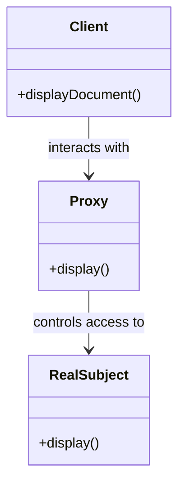

## 5.7 Proxy Pattern

In the world of software design, the Proxy Pattern stands out as a powerful structural pattern that provides a surrogate or placeholder for another object to control access to it. This pattern is particularly useful in scenarios where direct access to an object is either not feasible or not desirable. By understanding and implementing the Proxy Pattern in Ruby, developers can enhance their applications with features like lazy loading, access control, and logging, while also managing complexity and potential overhead.

### What is the Proxy Pattern?

The Proxy Pattern involves creating a proxy object that acts as an intermediary between a client and a target object. The proxy object controls access to the target object, allowing for additional functionality such as access control, lazy initialization, or logging. This pattern is especially useful when the target object is resource-intensive to create or when access to the object needs to be controlled or monitored.

#### Intent

The primary intent of the Proxy Pattern is to provide a surrogate or placeholder for another object to control access to it. This can include:

- **Lazy Loading**: Deferring the creation and initialization of an expensive object until it is actually needed.
- **Access Control**: Restricting access to certain methods or data based on user permissions or other criteria.
- **Logging and Monitoring**: Keeping track of method calls and interactions with the target object for debugging or auditing purposes.
- **Remote Proxy**: Representing an object that resides in a different address space, such as on a different server or network.

### Types of Proxies

There are several types of proxies, each serving a different purpose:

1. **Virtual Proxy**: Controls access to a resource that is expensive to create. It defers the creation of the resource until it is needed.

2. **Remote Proxy**: Represents an object that exists in a different address space. It is commonly used in distributed systems to interact with remote services.

3. **Protection Proxy**: Controls access to the methods of an object based on access rights. It is useful for implementing security features.

4. **Smart Proxy**: Provides additional functionality, such as reference counting or logging, when accessing an object.

### Key Participants

- **Proxy**: The intermediary object that controls access to the real subject.
- **Real Subject**: The actual object that the proxy represents and controls access to.
- **Client**: The entity that interacts with the proxy instead of directly with the real subject.

### Applicability

The Proxy Pattern is applicable in scenarios where:

- You need to control access to an object.
- You want to add additional functionality to an object without modifying its code.
- You need to manage the lifecycle of a resource-intensive object.
- You are working with remote objects in a distributed system.

### Sample Code Snippet

Let's explore a simple example of a Virtual Proxy in Ruby. We'll create a `Document` class that represents a large document, and a `DocumentProxy` class that acts as a proxy to control access to the document.

```ruby
# The Real Subject
class Document
  def initialize(filename)
    @filename = filename
    load_document
  end

  def display
    puts "Displaying document: #{@filename}"
  end

  private

  def load_document
    puts "Loading document: #{@filename}"
    # Simulate a time-consuming operation
    sleep(2)
  end
end

# The Proxy
class DocumentProxy
  def initialize(filename)
    @filename = filename
    @document = nil
  end

  def display
    load_document if @document.nil?
    @document.display
  end

  private

  def load_document
    @document = Document.new(@filename)
  end
end

# Client code
proxy = DocumentProxy.new("large_document.pdf")
puts "Document proxy created."
proxy.display
```

In this example, the `DocumentProxy` class defers the loading of the `Document` until the `display` method is called. This is an example of lazy loading, where the resource-intensive operation of loading the document is postponed until it is actually needed.

### Design Considerations

When implementing the Proxy Pattern, consider the following:

- **Added Complexity**: Introducing a proxy adds an additional layer of abstraction, which can increase the complexity of the codebase.
- **Performance Overhead**: While proxies can improve performance by deferring resource-intensive operations, they can also introduce overhead due to the additional method calls and logic.
- **Security**: Protection proxies can enhance security by controlling access to sensitive methods or data, but they must be carefully implemented to avoid vulnerabilities.

### Ruby Unique Features

Ruby's dynamic nature and metaprogramming capabilities make it particularly well-suited for implementing proxies. Ruby's ability to define methods dynamically and handle method_missing allows for flexible and powerful proxy implementations.

#### Using `method_missing` for Dynamic Proxies

Ruby's `method_missing` feature can be used to create dynamic proxies that forward method calls to the real subject. Here's an example:

```ruby
class DynamicProxy
  def initialize(real_subject)
    @real_subject = real_subject
  end

  def method_missing(method_name, *args, &block)
    puts "Forwarding #{method_name} to real subject"
    @real_subject.send(method_name, *args, &block)
  end
end

# Real subject
class Calculator
  def add(a, b)
    a + b
  end

  def subtract(a, b)
    a - b
  end
end

# Client code
calculator = Calculator.new
proxy = DynamicProxy.new(calculator)
puts proxy.add(5, 3)  # Outputs: Forwarding add to real subject
                      #          8
puts proxy.subtract(10, 4)  # Outputs: Forwarding subtract to real subject
                            #          6
```

In this example, the `DynamicProxy` class uses `method_missing` to forward method calls to the `Calculator` object. This allows the proxy to handle any method call dynamically, without needing to explicitly define each method.

### Differences and Similarities

The Proxy Pattern is often confused with other structural patterns like the Decorator and Adapter patterns. Here's how they differ:

- **Proxy vs. Decorator**: While both patterns involve wrapping an object, the Proxy Pattern is primarily concerned with controlling access, whereas the Decorator Pattern focuses on adding new behavior or responsibilities.

- **Proxy vs. Adapter**: The Adapter Pattern is used to make two incompatible interfaces compatible, while the Proxy Pattern is used to control access to an object.

### Benefits of the Proxy Pattern

- **Lazy Loading**: Proxies can defer the creation of resource-intensive objects until they are needed, improving performance and resource utilization.
- **Access Control**: Proxies can restrict access to certain methods or data, enhancing security and encapsulation.
- **Logging and Monitoring**: Proxies can log method calls and interactions with the real subject, aiding in debugging and auditing.
- **Remote Access**: Proxies can represent remote objects, allowing for seamless interaction with distributed systems.

### Try It Yourself

Experiment with the provided code examples by modifying them to suit different scenarios. For instance, try implementing a Protection Proxy that restricts access to certain methods based on user roles. You can also explore creating a Remote Proxy that interacts with a remote service.

### Visualizing the Proxy Pattern



This diagram illustrates the relationship between the client, proxy, and real subject. The client interacts with the proxy, which in turn controls access to the real subject.

### Knowledge Check

- What are the different types of proxies, and what are their use cases?
- How does the Proxy Pattern differ from the Decorator and Adapter patterns?
- What are the benefits of using the Proxy Pattern in Ruby applications?

### Embrace the Journey

Remember, mastering design patterns like the Proxy Pattern is a journey. As you progress, you'll gain a deeper understanding of how to build scalable and maintainable applications. Keep experimenting, stay curious, and enjoy the journey!

## Quiz: Proxy Pattern



### What is the primary intent of the Proxy Pattern?

- [x] To provide a surrogate or placeholder for another object to control access to it.
- [ ] To add new behavior to an object without modifying its structure.
- [ ] To convert the interface of a class into another interface clients expect.
- [ ] To define a family of algorithms and make them interchangeable.

> **Explanation:** The Proxy Pattern provides a surrogate or placeholder for another object to control access to it, which is its primary intent.

### Which type of proxy is used to defer the creation of a resource-intensive object until it is needed?

- [x] Virtual Proxy
- [ ] Remote Proxy
- [ ] Protection Proxy
- [ ] Smart Proxy

> **Explanation:** A Virtual Proxy is used to defer the creation and initialization of a resource-intensive object until it is actually needed.

### How does the Proxy Pattern differ from the Decorator Pattern?

- [x] The Proxy Pattern controls access, while the Decorator Pattern adds behavior.
- [ ] The Proxy Pattern adds behavior, while the Decorator Pattern controls access.
- [ ] Both patterns control access to an object.
- [ ] Both patterns add new behavior to an object.

> **Explanation:** The Proxy Pattern is primarily concerned with controlling access to an object, whereas the Decorator Pattern focuses on adding new behavior or responsibilities.

### What Ruby feature allows for dynamic method forwarding in proxies?

- [x] method_missing
- [ ] attr_accessor
- [ ] include
- [ ] require

> **Explanation:** Ruby's `method_missing` feature allows for dynamic method forwarding in proxies, enabling flexible and powerful proxy implementations.

### Which type of proxy represents an object that exists in a different address space?

- [ ] Virtual Proxy
- [x] Remote Proxy
- [ ] Protection Proxy
- [ ] Smart Proxy

> **Explanation:** A Remote Proxy represents an object that exists in a different address space, commonly used in distributed systems.

### What is a potential drawback of using the Proxy Pattern?

- [x] Added complexity and potential overhead.
- [ ] Inability to control access to objects.
- [ ] Lack of support for lazy loading.
- [ ] Difficulty in implementing logging and monitoring.

> **Explanation:** Introducing a proxy adds an additional layer of abstraction, which can increase the complexity of the codebase and introduce performance overhead.

### Which of the following is NOT a benefit of using the Proxy Pattern?

- [ ] Lazy Loading
- [ ] Access Control
- [ ] Logging and Monitoring
- [x] Direct modification of the real subject's code

> **Explanation:** The Proxy Pattern does not involve direct modification of the real subject's code; it provides a surrogate to control access and add functionality.

### In the provided Ruby example, what does the `DocumentProxy` class do?

- [x] It defers the loading of the `Document` until the `display` method is called.
- [ ] It immediately loads the `Document` upon creation.
- [ ] It prevents the `Document` from being displayed.
- [ ] It modifies the content of the `Document`.

> **Explanation:** The `DocumentProxy` class defers the loading of the `Document` until the `display` method is called, demonstrating lazy loading.

### What is the role of the `Client` in the Proxy Pattern?

- [x] The entity that interacts with the proxy instead of directly with the real subject.
- [ ] The object that controls access to the real subject.
- [ ] The actual object that the proxy represents.
- [ ] The class that provides additional functionality to the real subject.

> **Explanation:** The `Client` is the entity that interacts with the proxy instead of directly with the real subject, allowing the proxy to control access.

### True or False: The Proxy Pattern can be used to implement security features through access control.

- [x] True
- [ ] False

> **Explanation:** True. The Proxy Pattern can be used to implement security features by controlling access to certain methods or data based on access rights.


