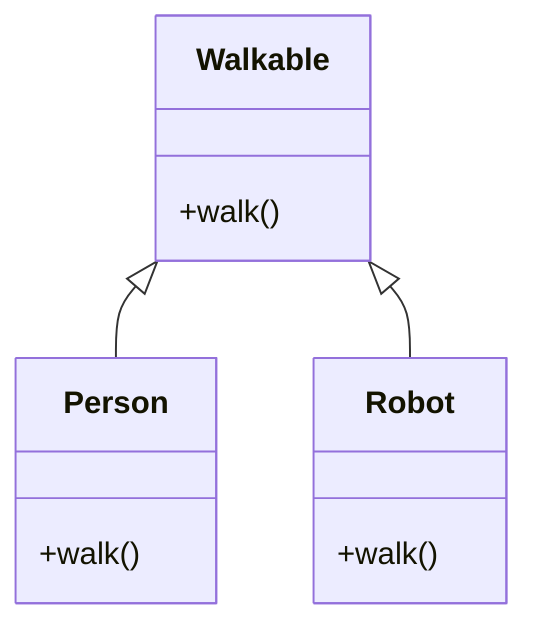

## 5.8 Module Pattern and Mixins

In the world of Ruby programming, modules and mixins stand out as powerful tools for promoting code reuse and flexible composition of behaviors. They serve as structural patterns that allow developers to encapsulate behavior and share it across different classes without the constraints of traditional inheritance hierarchies. In this section, we will delve into the concepts of modules and mixins, explore their advantages, and provide best practices for designing and using them effectively.

### Understanding Modules in Ruby

Modules in Ruby are a way to group together methods, classes, and constants. They are similar to classes, but they cannot be instantiated or subclassed. Instead, modules are used to encapsulate behavior and share it across different classes. This makes them an ideal tool for implementing mixins, which allow you to add functionality to classes without using inheritance.

#### Key Characteristics of Modules

- **Encapsulation**: Modules encapsulate methods and constants, providing a namespace to avoid name clashes.
- **Mixins**: Modules can be mixed into classes using the `include` or `extend` keywords, adding their methods to the class.
- **No Instantiation**: Unlike classes, modules cannot be instantiated.
- **No Subclassing**: Modules cannot be subclassed, which means they are not part of the class hierarchy.

### Mixing in Modules to Classes

Mixins are a way to add functionality to classes by including modules. When a module is included in a class, its methods become available as instance methods of the class. This allows for flexible composition of behaviors and promotes code reuse.

#### Example: Mixing in a Module

Let's consider a simple example where we have a module `Walkable` that provides walking behavior:

```ruby
module Walkable
  def walk
    puts "I'm walking!"
  end
end

class Person
  include Walkable
end

class Robot
  include Walkable
end

person = Person.new
person.walk # Output: I'm walking!

robot = Robot.new
robot.walk # Output: I'm walking!
```

In this example, both `Person` and `Robot` classes include the `Walkable` module, allowing instances of these classes to use the `walk` method. This demonstrates how modules can be used to share behavior across different classes.

### Advantages of Using Mixins Over Inheritance

Mixins offer several advantages over traditional inheritance hierarchies:

- **Code Reuse**: Mixins allow you to reuse code across different classes without duplicating it.
- **Flexible Composition**: You can mix in multiple modules into a class, providing a flexible way to compose behaviors.
- **Avoiding Inheritance Hierarchies**: Mixins help avoid deep inheritance hierarchies, which can lead to complex and hard-to-maintain code.
- **Decoupling**: By using mixins, you can decouple behavior from the class hierarchy, making your code more modular and easier to maintain.

### Best Practices for Designing and Using Mixins

To effectively use mixins in your Ruby applications, consider the following best practices:

1. **Keep Modules Focused**: Design modules to encapsulate a single responsibility or behavior. This makes them easier to understand and reuse.

2. **Use Descriptive Names**: Give your modules descriptive names that clearly indicate their purpose. This helps other developers understand what the module does at a glance.

3. **Avoid State in Modules**: Modules should generally not maintain state. If a module needs to maintain state, consider whether it should be a class instead.

4. **Limit the Number of Mixins**: While mixins are powerful, avoid mixing in too many modules into a single class. This can lead to a "mixins soup" where it's difficult to track where methods are coming from.

5. **Document Module Usage**: Clearly document how and when to use your modules. This helps other developers understand the intended use cases and avoid misuse.

6. **Leverage `super`**: When overriding methods in a module, use `super` to call the original method. This ensures that all parts of the method chain are executed.

### Ruby Unique Features: Modules and Mixins

Ruby's dynamic nature and support for modules and mixins make it uniquely suited for flexible code composition. The ability to include modules at runtime and the use of `super` to chain method calls are powerful features that enhance the flexibility of Ruby applications.

### Differences and Similarities with Other Patterns

Mixins are often compared to other design patterns like the Decorator pattern. While both allow for adding behavior to objects, mixins do so at the class level, while decorators do so at the object level. Understanding these differences can help you choose the right pattern for your needs.

### Try It Yourself: Experimenting with Mixins

To deepen your understanding of mixins, try modifying the code examples provided. For instance, create a new module with additional behavior and mix it into the `Person` and `Robot` classes. Observe how the new behavior is seamlessly integrated into the existing classes.

### Visualizing Module Pattern and Mixins

To better understand how modules and mixins work, let's visualize the relationship between classes and modules using a class diagram.



In this diagram, the `Walkable` module is mixed into both the `Person` and `Robot` classes, providing them with the `walk` method.

### Knowledge Check

- What are the key characteristics of modules in Ruby?
- How do mixins promote code reuse and flexible composition of behaviors?
- What are the advantages of using mixins over traditional inheritance hierarchies?
- What are some best practices for designing and using mixins in Ruby?

### Embrace the Journey

Remember, mastering modules and mixins is just the beginning. As you continue to explore Ruby's rich set of features, you'll discover even more ways to write clean, efficient, and maintainable code. Keep experimenting, stay curious, and enjoy the journey!

## Quiz: Module Pattern and Mixins



### What is a key characteristic of Ruby modules?

- [x] They cannot be instantiated.
- [ ] They can be subclassed.
- [ ] They maintain state.
- [ ] They are part of the class hierarchy.

> **Explanation:** Ruby modules cannot be instantiated or subclassed, making them distinct from classes.

### How do mixins promote code reuse?

- [x] By allowing modules to be included in multiple classes.
- [ ] By creating deep inheritance hierarchies.
- [ ] By duplicating code across classes.
- [ ] By maintaining state within modules.

> **Explanation:** Mixins allow modules to be included in multiple classes, promoting code reuse without duplication.

### What is an advantage of using mixins over inheritance?

- [x] Flexible composition of behaviors.
- [ ] Deep inheritance hierarchies.
- [ ] Maintaining state in modules.
- [ ] Complex and hard-to-maintain code.

> **Explanation:** Mixins provide flexible composition of behaviors, avoiding the complexity of deep inheritance hierarchies.

### What should be avoided when designing modules?

- [x] Maintaining state within modules.
- [ ] Encapsulating a single responsibility.
- [ ] Using descriptive names.
- [ ] Documenting module usage.

> **Explanation:** Modules should generally not maintain state; they should encapsulate behavior and be stateless.

### How can you ensure all parts of a method chain are executed in a module?

- [x] Use `super` when overriding methods.
- [ ] Avoid using `super`.
- [ ] Maintain state in the module.
- [ ] Use deep inheritance hierarchies.

> **Explanation:** Using `super` when overriding methods ensures that all parts of the method chain are executed.

### What is a potential pitfall of using too many mixins?

- [x] Creating a "mixins soup" that is hard to track.
- [ ] Promoting code reuse.
- [ ] Flexible composition of behaviors.
- [ ] Avoiding deep inheritance hierarchies.

> **Explanation:** Using too many mixins can lead to a "mixins soup," making it difficult to track where methods are coming from.

### What is a best practice for naming modules?

- [x] Use descriptive names that indicate their purpose.
- [ ] Use generic names.
- [ ] Avoid naming modules.
- [ ] Use names that are difficult to understand.

> **Explanation:** Descriptive names help other developers understand the module's purpose at a glance.

### How can you experiment with mixins?

- [x] Create a new module and mix it into existing classes.
- [ ] Avoid modifying existing code.
- [ ] Use deep inheritance hierarchies.
- [ ] Maintain state in the module.

> **Explanation:** Creating a new module and mixing it into existing classes allows you to experiment with mixins.

### What is a similarity between mixins and the Decorator pattern?

- [x] Both allow for adding behavior to objects.
- [ ] Both operate at the object level.
- [ ] Both require deep inheritance hierarchies.
- [ ] Both maintain state within modules.

> **Explanation:** Both mixins and the Decorator pattern allow for adding behavior to objects, but they operate at different levels.

### True or False: Modules can be instantiated in Ruby.

- [ ] True
- [x] False

> **Explanation:** Modules cannot be instantiated in Ruby; they are used for encapsulating behavior and sharing it across classes.


