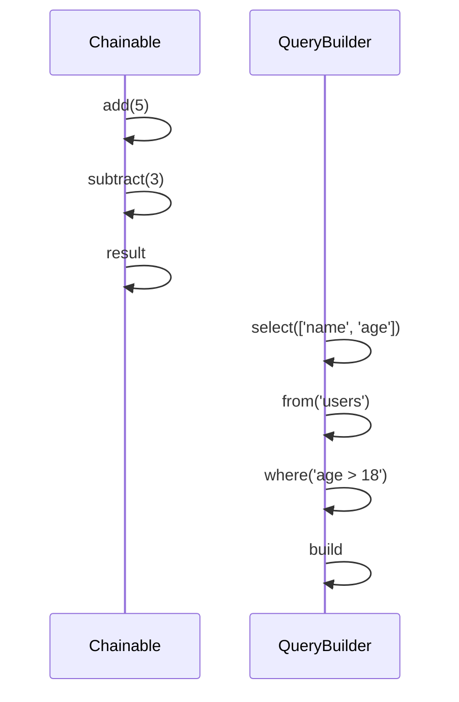

## 5.9 Method Chaining and Fluent Interfaces

In the world of Ruby programming, method chaining and fluent interfaces are powerful techniques that enhance code readability and expressiveness. These concepts allow developers to write code that is not only concise but also intuitive, resembling natural language. In this section, we will explore the intricacies of method chaining and fluent interfaces, providing you with the knowledge to implement these patterns in your Ruby applications.

### Understanding Method Chaining

Method chaining is a technique where multiple methods are called on the same object sequentially in a single statement. This is achieved by having each method return the object itself (`self`), allowing the next method to be called on the same object. This approach results in a clean and readable syntax that can significantly improve the maintainability of your code.

#### How Method Chaining Works

To implement method chaining, you need to ensure that each method in the chain returns the object itself. This is typically done by returning `self` at the end of each method. Let's look at a simple example to illustrate this concept:

```ruby
class Chainable
  def initialize(value)
    @value = value
  end

  def add(number)
    @value += number
    self
  end

  def subtract(number)
    @value -= number
    self
  end

  def result
    @value
  end
end

chain = Chainable.new(10)
result = chain.add(5).subtract(3).result
puts result # Output: 12
```

In this example, the `Chainable` class has methods `add` and `subtract`, both of which return `self`. This allows us to chain method calls together, resulting in a more readable and concise expression.

### Creating Fluent Interfaces

A fluent interface is a design pattern that relies on method chaining to create a domain-specific language (DSL) within your code. Fluent interfaces are particularly useful for building APIs that are easy to read and use, as they allow developers to write code that closely resembles natural language.

#### Building a Fluent Interface in Ruby

To create a fluent interface, you need to design your methods to support chaining and ensure that they convey a clear and expressive intent. Let's consider an example of a simple query builder:

```ruby
class QueryBuilder
  def initialize
    @query = ""
  end

  def select(fields)
    @query += "SELECT #{fields.join(', ')} "
    self
  end

  def from(table)
    @query += "FROM #{table} "
    self
  end

  def where(condition)
    @query += "WHERE #{condition} "
    self
  end

  def build
    @query.strip
  end
end

query = QueryBuilder.new
sql = query.select(['name', 'age']).from('users').where('age > 18').build
puts sql # Output: SELECT name, age FROM users WHERE age > 18
```

In this example, the `QueryBuilder` class provides a fluent interface for constructing SQL queries. Each method returns `self`, allowing the methods to be chained together in a natural and expressive manner.

### Benefits of Method Chaining and Fluent Interfaces

Method chaining and fluent interfaces offer several advantages, particularly in terms of code readability and maintainability:

- **Improved Readability**: Chained method calls resemble natural language, making the code easier to read and understand.
- **Conciseness**: Method chaining reduces the need for intermediate variables and repetitive code, resulting in more concise expressions.
- **Expressive APIs**: Fluent interfaces enable the creation of APIs that are intuitive and easy to use, enhancing the developer experience.
- **DSL Creation**: Fluent interfaces can be used to create domain-specific languages within your application, providing a tailored syntax for specific tasks.

### Real-World Examples

One of the most well-known examples of method chaining and fluent interfaces in Ruby is ActiveRecord, the ORM (Object-Relational Mapping) library used in Ruby on Rails. ActiveRecord allows developers to build database queries using a fluent interface, making it easy to construct complex queries in a readable and maintainable way.

#### ActiveRecord Query Building

Here's an example of how ActiveRecord uses method chaining to build queries:

```ruby
# Assuming a User model with fields :name and :age
users = User.where('age > ?', 18).order(:name).limit(10)
```

In this example, the `where`, `order`, and `limit` methods are chained together to construct a query that retrieves users older than 18, ordered by name, and limited to 10 results. This fluent interface makes the query easy to read and understand.

### Considerations and Best Practices

While method chaining and fluent interfaces offer many benefits, there are some considerations to keep in mind:

- **Method Side Effects**: Ensure that methods in a chain do not have unintended side effects, as this can lead to unexpected behavior.
- **Clarity**: While chaining can improve readability, overly complex chains can become difficult to understand. Aim for a balance between conciseness and clarity.
- **Error Handling**: Consider how errors are handled within a chain. Ensure that exceptions are managed appropriately to prevent the chain from breaking unexpectedly.

### Try It Yourself

To deepen your understanding of method chaining and fluent interfaces, try modifying the examples provided in this section. Experiment with adding new methods to the `Chainable` and `QueryBuilder` classes, and observe how the chaining behavior changes. This hands-on approach will help reinforce the concepts and give you the confidence to apply them in your own projects.

### Visualizing Method Chaining

To better understand how method chaining works, let's visualize the flow of method calls using a sequence diagram:



This diagram illustrates the sequence of method calls in the `Chainable` and `QueryBuilder` examples, highlighting how each method returns the object itself, allowing the next method to be called.

### Key Takeaways

- **Method chaining** allows multiple method calls on the same object in a single statement by returning `self`.
- **Fluent interfaces** create expressive APIs that resemble natural language, improving code readability and maintainability.
- **ActiveRecord** is a real-world example of method chaining in Ruby, providing a fluent interface for building database queries.
- **Considerations** include managing method side effects, ensuring clarity, and handling errors appropriately.

Remember, method chaining and fluent interfaces are powerful tools in your Ruby programming toolkit. As you continue to explore these concepts, you'll discover new ways to enhance the readability and expressiveness of your code. Keep experimenting, stay curious, and enjoy the journey!

## Quiz: Method Chaining and Fluent Interfaces



### What is the primary purpose of method chaining in Ruby?

- [x] To allow multiple method calls in a single statement
- [ ] To improve performance
- [ ] To enforce strict typing
- [ ] To reduce memory usage

> **Explanation:** Method chaining allows multiple method calls on the same object in a single statement, enhancing code readability and conciseness.

### How do you implement method chaining in Ruby?

- [x] By returning `self` from each method
- [ ] By using global variables
- [ ] By using class variables
- [ ] By using instance variables

> **Explanation:** Method chaining is implemented by returning `self` from each method, allowing the next method to be called on the same object.

### What is a fluent interface?

- [x] A design pattern that uses method chaining to create expressive APIs
- [ ] A type of user interface
- [ ] A database management system
- [ ] A network protocol

> **Explanation:** A fluent interface is a design pattern that relies on method chaining to create APIs that are easy to read and use.

### Which Ruby library is known for using method chaining?

- [x] ActiveRecord
- [ ] RSpec
- [ ] Nokogiri
- [ ] Sinatra

> **Explanation:** ActiveRecord, the ORM library in Ruby on Rails, is known for using method chaining to build database queries.

### What should you consider when using method chaining?

- [x] Method side effects
- [x] Clarity of the chain
- [ ] Network latency
- [ ] File system access

> **Explanation:** When using method chaining, consider method side effects and the clarity of the chain to ensure maintainability and readability.

### What is the benefit of a fluent interface?

- [x] Improved code readability
- [ ] Faster execution
- [ ] Reduced memory usage
- [ ] Increased security

> **Explanation:** Fluent interfaces improve code readability by allowing method calls to resemble natural language.

### How can you handle errors in a method chain?

- [x] By managing exceptions appropriately
- [ ] By ignoring them
- [ ] By using global error handlers
- [ ] By using class variables

> **Explanation:** Errors in a method chain should be managed appropriately to prevent the chain from breaking unexpectedly.

### What is a potential downside of method chaining?

- [x] Overly complex chains can be difficult to understand
- [ ] It always reduces performance
- [ ] It increases memory usage
- [ ] It enforces strict typing

> **Explanation:** Overly complex method chains can become difficult to understand, so it's important to balance conciseness with clarity.

### True or False: Method chaining can only be used in Ruby.

- [ ] True
- [x] False

> **Explanation:** Method chaining is a technique that can be used in many programming languages, not just Ruby.

### What is a common use case for fluent interfaces?

- [x] Creating domain-specific languages (DSLs)
- [ ] Managing memory
- [ ] Handling network requests
- [ ] Performing file I/O

> **Explanation:** Fluent interfaces are commonly used to create domain-specific languages (DSLs) within an application.


