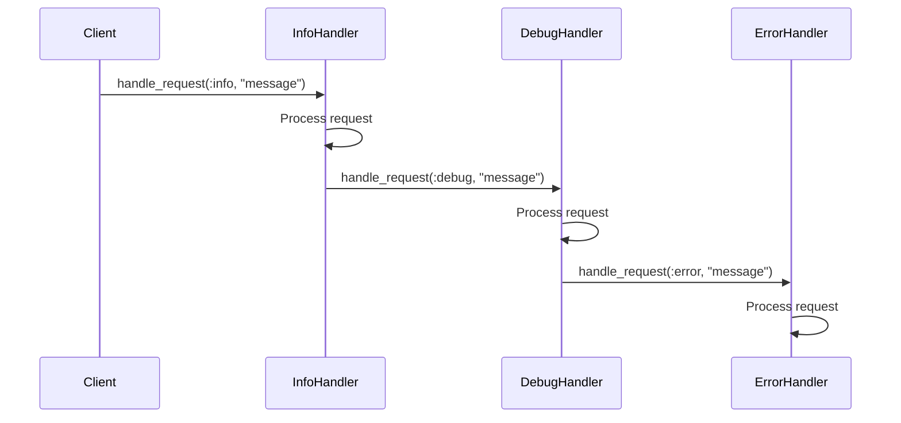

## 6.1 Chain of Responsibility Pattern

The Chain of Responsibility pattern is a behavioral design pattern that allows a request to be passed along a chain of handlers. Each handler in the chain has the opportunity to process the request or pass it to the next handler. This pattern is particularly useful in scenarios where multiple handlers can process a request, but the specific handler is determined at runtime.

### Intent

The primary intent of the Chain of Responsibility pattern is to decouple the sender of a request from its receivers. By allowing multiple objects to handle the request, the pattern provides flexibility in request processing and enhances the maintainability of the codebase.

### Problem Addressed

In many applications, requests need to be processed by different components or services. Hardcoding the logic to determine which component should handle a request can lead to tightly coupled and inflexible code. The Chain of Responsibility pattern addresses this problem by allowing requests to be passed through a chain of handlers, each of which can choose to handle the request or pass it along.

### Key Participants

- **Handler**: Defines an interface for handling requests and optionally forwarding them to the next handler.
- **ConcreteHandler**: Implements the handler interface and processes requests it is responsible for.
- **Client**: Initiates the request and passes it to the first handler in the chain.

### Applicability

Use the Chain of Responsibility pattern when:

- You have multiple objects that can handle a request, and the handler is determined at runtime.
- You want to decouple the sender of a request from its receivers.
- You want to add or change handlers dynamically without affecting the client code.

### Implementing the Pattern in Ruby

Ruby's dynamic features make it an excellent language for implementing the Chain of Responsibility pattern. Let's explore how to implement this pattern in Ruby with a practical example.

#### Example Scenario

Consider a logging system where different log levels (e.g., INFO, DEBUG, ERROR) need to be processed by different handlers. We will implement a chain of log handlers that can process log messages based on their severity.

```ruby
# Define the base Handler class
class LogHandler
  attr_accessor :next_handler

  def initialize
    @next_handler = nil
  end

  def handle_request(log_level, message)
    if @next_handler
      @next_handler.handle_request(log_level, message)
    end
  end
end

# Define a ConcreteHandler for INFO level logs
class InfoLogHandler < LogHandler
  def handle_request(log_level, message)
    if log_level == :info
      puts "INFO: #{message}"
    else
      super
    end
  end
end

# Define a ConcreteHandler for DEBUG level logs
class DebugLogHandler < LogHandler
  def handle_request(log_level, message)
    if log_level == :debug
      puts "DEBUG: #{message}"
    else
      super
    end
  end
end

# Define a ConcreteHandler for ERROR level logs
class ErrorLogHandler < LogHandler
  def handle_request(log_level, message)
    if log_level == :error
      puts "ERROR: #{message}"
    else
      super
    end
  end
end

# Client code
info_handler = InfoLogHandler.new
debug_handler = DebugLogHandler.new
error_handler = ErrorLogHandler.new

# Set up the chain of responsibility
info_handler.next_handler = debug_handler
debug_handler.next_handler = error_handler

# Test the chain with different log levels
info_handler.handle_request(:info, "This is an info message.")
info_handler.handle_request(:debug, "This is a debug message.")
info_handler.handle_request(:error, "This is an error message.")
```

### Explanation of the Code

- **Handler Class**: The `LogHandler` class defines the interface for handling requests and maintains a reference to the next handler in the chain.
- **Concrete Handlers**: The `InfoLogHandler`, `DebugLogHandler`, and `ErrorLogHandler` classes extend `LogHandler` and implement the logic for handling specific log levels.
- **Chain Setup**: The client code sets up the chain by linking handlers together. The `info_handler` is the first handler in the chain, followed by `debug_handler` and `error_handler`.
- **Request Handling**: The `handle_request` method is called on the first handler. If the handler can process the request, it does so; otherwise, it passes the request to the next handler in the chain.

### Variations of the Pattern

The Chain of Responsibility pattern can be implemented using different data structures, such as arrays or linked lists, to manage the handlers. In Ruby, arrays can be used to store handlers, allowing for easy addition and removal of handlers.

#### Using Arrays for Handlers

```ruby
class ArrayLogHandler
  def initialize
    @handlers = []
  end

  def add_handler(handler)
    @handlers << handler
  end

  def handle_request(log_level, message)
    @handlers.each do |handler|
      handler.handle_request(log_level, message)
    end
  end
end

# Client code
array_handler = ArrayLogHandler.new
array_handler.add_handler(InfoLogHandler.new)
array_handler.add_handler(DebugLogHandler.new)
array_handler.add_handler(ErrorLogHandler.new)

# Test the chain with different log levels
array_handler.handle_request(:info, "This is an info message.")
array_handler.handle_request(:debug, "This is a debug message.")
array_handler.handle_request(:error, "This is an error message.")
```

### Benefits of the Chain of Responsibility Pattern

- **Decoupling**: The pattern decouples the sender of a request from its receivers, allowing for more flexible and maintainable code.
- **Flexibility**: Handlers can be added, removed, or changed without affecting the client code.
- **Responsibility Sharing**: Multiple handlers can process a request, sharing the responsibility for request handling.

### Design Considerations

- **Order of Handlers**: The order in which handlers are linked can affect the behavior of the chain. Ensure handlers are ordered correctly to achieve the desired processing logic.
- **Termination**: Ensure that the chain has a termination condition to prevent infinite loops. This can be achieved by having a default handler that always processes the request.

### Ruby Unique Features

Ruby's dynamic nature allows for flexible implementation of the Chain of Responsibility pattern. Features such as duck typing and open classes make it easy to extend and modify handlers at runtime.

### Differences and Similarities

The Chain of Responsibility pattern is often confused with the Decorator pattern. While both patterns involve chaining objects, the Chain of Responsibility pattern focuses on passing requests through a chain, whereas the Decorator pattern focuses on adding behavior to objects.

### Visualizing the Chain of Responsibility Pattern

To better understand the flow of requests through the chain, let's visualize the pattern using a sequence diagram.



### Try It Yourself

Experiment with the code examples by adding new log levels or modifying the order of handlers in the chain. Try implementing a chain for a different scenario, such as handling different types of user input or processing different types of requests in a web application.

### Knowledge Check

- What is the primary intent of the Chain of Responsibility pattern?
- How does the Chain of Responsibility pattern enhance flexibility in request handling?
- What are the key participants in the Chain of Responsibility pattern?
- How can arrays be used to implement the Chain of Responsibility pattern in Ruby?
- What are the benefits of using the Chain of Responsibility pattern?

### Embrace the Journey

Remember, mastering design patterns is a journey. As you continue to explore and implement different patterns, you'll gain a deeper understanding of how to build scalable and maintainable applications. Keep experimenting, stay curious, and enjoy the journey!

## Quiz: Chain of Responsibility Pattern



### What is the primary intent of the Chain of Responsibility pattern?

- [x] To decouple the sender of a request from its receivers
- [ ] To couple the sender and receiver tightly
- [ ] To ensure only one handler processes a request
- [ ] To prioritize requests based on urgency

> **Explanation:** The Chain of Responsibility pattern aims to decouple the sender of a request from its receivers, allowing multiple objects to handle the request.

### Which of the following is a key participant in the Chain of Responsibility pattern?

- [x] Handler
- [ ] Singleton
- [ ] Observer
- [ ] Factory

> **Explanation:** The Handler is a key participant in the Chain of Responsibility pattern, defining the interface for handling requests.

### How does the Chain of Responsibility pattern enhance flexibility?

- [x] By allowing multiple handlers to process a request
- [ ] By hardcoding the request handling logic
- [ ] By ensuring only one handler can process a request
- [ ] By coupling the sender and receiver

> **Explanation:** The pattern enhances flexibility by allowing multiple handlers to process a request, providing more options for request handling.

### What is a benefit of using the Chain of Responsibility pattern?

- [x] Decoupling of sender and receivers
- [ ] Tightly coupling sender and receivers
- [ ] Ensuring only one handler processes a request
- [ ] Hardcoding request handling logic

> **Explanation:** The pattern decouples the sender and receivers, making the code more flexible and maintainable.

### How can arrays be used in the Chain of Responsibility pattern?

- [x] To store handlers and iterate over them
- [ ] To hardcode the request handling logic
- [ ] To ensure only one handler processes a request
- [ ] To couple the sender and receiver

> **Explanation:** Arrays can be used to store handlers and iterate over them, allowing for flexible management of the handler chain.

### What is a potential pitfall of the Chain of Responsibility pattern?

- [x] Infinite loops if not terminated properly
- [ ] Ensuring only one handler processes a request
- [ ] Hardcoding request handling logic
- [ ] Tightly coupling sender and receivers

> **Explanation:** Without proper termination, the chain can lead to infinite loops, making it crucial to have a termination condition.

### What is a common misconception about the Chain of Responsibility pattern?

- [x] It is often confused with the Decorator pattern
- [ ] It is the same as the Singleton pattern
- [ ] It ensures only one handler processes a request
- [ ] It tightly couples sender and receivers

> **Explanation:** The Chain of Responsibility pattern is often confused with the Decorator pattern, but they have different intents.

### Which Ruby feature enhances the implementation of the Chain of Responsibility pattern?

- [x] Dynamic typing
- [ ] Static typing
- [ ] Hardcoded logic
- [ ] Tightly coupled classes

> **Explanation:** Ruby's dynamic typing allows for flexible implementation of the pattern, enabling runtime modifications.

### What is the role of the Client in the Chain of Responsibility pattern?

- [x] To initiate the request and pass it to the first handler
- [ ] To process the request directly
- [ ] To ensure only one handler processes a request
- [ ] To tightly couple sender and receivers

> **Explanation:** The Client initiates the request and passes it to the first handler in the chain.

### True or False: The Chain of Responsibility pattern ensures only one handler processes a request.

- [ ] True
- [x] False

> **Explanation:** The pattern allows multiple handlers to process a request, providing flexibility in request handling.




